---
{
title: "RxJS - Creation Operators",
published: "2021-09-15T06:30:11Z",
tags: ["javascript", "typescript", "rxjs"],
description: "Welcome back guys, today I'll start to show you the Creation operators in RxJS.  The Creation...",
originalLink: "https://dev.to/this-is-learning/rxjs-creation-operators-6bh",
coverImage: "cover-image.png",
socialImage: "social-image.png",
collection: "RxJS - Getting Started",
order: 5
}
---

Welcome back guys,
today I'll start to show you the Creation operators in RxJS.

The Creation Operators are used to create new observables. They are divided into Creation Operators and Join Creation Operators.
The main difference between them consists in the fact that the Join Creation Operators create observable from other observables instead the Creation Operators create observables from objects which differ from observable.

# [Creation Operators](https://rxjs.dev/guide/operators#creation-operators-2)

- **[of](https://rxjs.dev/api/index/function/of)**

> The Of operator is used to convert an argument to an observable.

```ts
import { of } from "rxjs";

of([1, 2, 3], 4, 5, 6).subscribe({
  next: res => console.log("[of]", res),
  complete: () => console.log("[of] complete"),
});
```

```console
[of] [ 1, 2, 3 ]
[of] 4
[of] 5
[of] 6
[of] complete
```

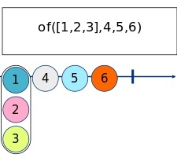
As you can see, this operator takes a list of arguments and converts them to values of the observable.

- **[from](https://rxjs.dev/api/index/function/from)**

> This operator creates an Observable from an Array, an array-like object, a Promise, an iterable object, or an Observable-like object.

**from array**

```ts
from([1, 2, 3]).subscribe(res => console.log("[from]", res));
```

```console
[from] 1
[from] 2
[from] 3
```

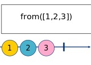
In this case we converted an array to an observable.
The from operator converts all the items in the array to values of the observable. It's common to use this operator when we need to convert the items of an array to the values to react our system.

**from promise**

```ts
from(
  new Promise(res => setTimeout(() => res("Hello from promise"), 3000))
).subscribe(res => console.log(new Date().toLocaleTimeString(), `[from]`, res));
```

```console
13:47:52 [from] Hello from promise
```

In this case we converted a promise to an observable. It is common to convert a promise to an observable, or because we have multiple subscribers which need to react to this promise or because we need to use these promise inside of a pipe chain.

**from iterator**

```ts
const wait = async (time: number) => new Promise(res => setTimeout(res, time));
async function* hello() {
  yield "Hello";
  await wait(1000);
  yield "from";
  await wait(1000);
  yield "iterator";
}
from(hello()).subscribe({
  next: res => console.log(new Date().toLocaleTimeString(), `[from]`, res),
  complete: () =>
    console.log(new Date().toLocaleTimeString(), `[from] complete`),
});
```

```console
13:48:42 [from] Hello
13:48:43 [from] from
13:48:44 [from] iterator
13:48:44 [from] complete
```

Here instead, the from operator converts an iterator to an observable. This is common when we need to react to every item of the iterator or when we need to use the generator inside of a pipe chain.

- **[fromEvent](https://rxjs.dev/api/index/function/fromEvent)**

> The fromEvent operator is usage to emit an observable in base of an event

Some examples: when a user clicks to a document element in HTML/JS or when a system emits an [event](https://nodejs.org/api/events.html) in node.js eco system.
Here a practise example

```ts
import * as events from "events";
import { fromEvent } from "rxjs";

console.log(new Date().toLocaleTimeString(), "[fromEvent] start");

const em = new events.EventEmitter();
fromEvent(em, "custom-event").subscribe({
  next: res => console.log(new Date().toLocaleTimeString(), "[fromEvent]", res),
  complete: () =>
    console.log(new Date().toLocaleTimeString(), "[fromEvent] complete"),
});

setTimeout(() => {
  em.emit("custom-event", "Hello from event emitter");
}, 3000);
```

```console
14:05:06 [fromEvent] start
14:05:09 [fromEvent] Hello from event emitter
```

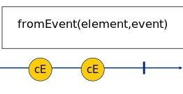

- **[EMPTY](https://rxjs.dev/api/index/const/EMPTY)**

> Creates an Observable that emits no items to the Observer and immediately emits a complete notification.

```ts
import { EMPTY } from "rxjs";

EMPTY.subscribe({
  next: res => console.log("[EMPTY]", res),
  complete: () => console.log("[EMPTY] complete"),
});
```

```console
[EMPTY] complete
```

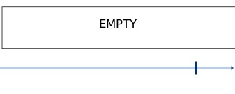
This operator is used for scheduling the emission of the complete notification.

- **[timer](https://rxjs.dev/api/index/function/timer)**

> Creates an observable that will wait for a specified time period, or exact date, before emitting the number 0.

```ts
import { timer } from "rxjs";

console.log(new Date().toLocaleTimeString(), "[timer] start");
timer(1000).subscribe({
  next: res => console.log(new Date().toLocaleTimeString(), "[timer]", res),
  complete: () =>
    console.log(new Date().toLocaleTimeString(), "[timer] complete"),
});
```

```console
14:14:34 [timer] start
14:14:35 [timer] 0
14:14:35 [timer] complete
```

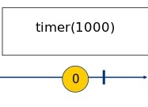
This operator is similar to the setTimeout function in JS. It creates an observable and emits only a value after a time indicated as argument.

- **[interval](https://rxjs.dev/api/index/function/interval)**

> Creates an Observable that emits sequential numbers every specified interval of time, on a specified SchedulerLike.

```ts
import { interval } from "rxjs";

console.log(new Date().toLocaleTimeString(), "[interval] start");
interval(1000).subscribe({
  next: res => console.log(new Date().toLocaleTimeString(), "[interval]", res),
  complete: () =>
    console.log(new Date().toLocaleTimeString(), "[interval] complete"),
});
```

```console
14:15:10 [interval] start
14:15:11 [interval] 0
14:15:12 [interval] 1
14:15:13 [interval] 2
14:15:14 [interval] 3
14:15:15 [interval] 4
...
...
...
```

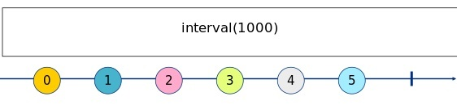
This operator is similar to the setInterval function in JS. It creates an observable and emits a sequential number every specific time indicated as argument.
*N.B. it start from ZERO and not from ONE*

**timer as special interval**
Sometimes you need to create an interval with a specific period but you need to start it with a period different from the interval period. In these cases it is common to use the timer operator that accepts a period as second argument.
So you can indicate the time before emitting the first value as first argument and the period of the interval as second argument.

```ts
timer(1000, 1000).subscribe({
  next: res =>
    console.log(new Date().toLocaleTimeString(), "[timer as interval]", res),
  complete: () =>
    console.log(
      new Date().toLocaleTimeString(),
      "[timer as interval] complete"
    ),
});
```

```console
14:25:56 [timer as interval] start
14:26:00 [timer as interval] 0
14:26:01 [timer as interval] 1
14:26:02 [timer as interval] 2
...
...
```

# [Join Creation Operators](https://rxjs.dev/guide/operators#join-creation-operators)

Before starting, I clarify that all the examples use these three observable as inputs.

```ts
import { from, Observable } from "rxjs";

async function* hello() {
  const wait = async (time: number) =>
    new Promise(res => setTimeout(res, time));
  yield "Hello";
  await wait(1000);
  yield "from";
  await wait(500);
  yield "iterator";
}

export const iterator$ = from(hello());
export const arrayFrom$ = from(["Hello", "from", "array"]);
export const arrayOfWithDelay$ = new Observable<number>(subscriber => {
  let counter = 10;
  const id = setInterval(() => {
    if (counter > 0) {
      subscriber.next(counter--);
    } else {
      clearInterval(id);
      subscriber.complete();
    }
  }, 500);
});
```

- **[combineLatest](https://rxjs.dev/api/index/function/combineLatest)**

> Combines multiple Observables to create an Observable whose values are calculated from the latest values of each of its input Observables.

```ts
import { combineLatest } from "rxjs";
import { arrayFrom$, arrayOfWithDelay$, iterator$ } from "../sources";

console.log(new Date().toLocaleTimeString(), `[combineLatest] start`);

combineLatest([iterator$, arrayFrom$, arrayOfWithDelay$]).subscribe({
  next: res =>
    console.log(new Date().toLocaleTimeString(), `[combineLatest]`, res),
  complete: () =>
    console.log(new Date().toLocaleTimeString(), `[combineLatest] complete`),
});
```

```console
12:38:22 [combineLatest] start
12:38:22 [combineLatest] [ 'Hello', 'array', 10 ]
12:38:23 [combineLatest] [ 'from', 'array', 10 ]
12:38:23 [combineLatest] [ 'from', 'array', 9 ]
12:38:23 [combineLatest] [ 'iterator', 'array', 9 ]
12:38:23 [combineLatest] [ 'iterator', 'array', 8 ]
12:38:24 [combineLatest] [ 'iterator', 'array', 7 ]
12:38:24 [combineLatest] [ 'iterator', 'array', 6 ]
12:38:25 [combineLatest] [ 'iterator', 'array', 5 ]
12:38:25 [combineLatest] [ 'iterator', 'array', 4 ]
12:38:26 [combineLatest] [ 'iterator', 'array', 3 ]
12:38:26 [combineLatest] [ 'iterator', 'array', 2 ]
12:38:27 [combineLatest] [ 'iterator', 'array', 1 ]
12:38:27 [combineLatest] complete
```

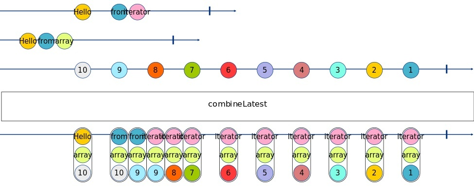
In this example, you can see how this operator emits an array of value every time an observable emits one value.
It's important to remember that the operator emits the first value when all the dependence observables emit the first value.
As you can see, the result of the combineLatest operator is an array where items respect the order of the observables in the declaration.

- **[forkJoin](https://rxjs.dev/api/index/function/forkJoin)**

> Accepts an Array of ObservableInput or a dictionary Object of ObservableInput and returns an Observable that emits either an array of values in the exact same order as the passed array, or a dictionary of values in the same shape as the passed dictionary.

```ts
import { forkJoin } from "rxjs";
import { arrayFrom$, arrayOfWithDelay$, iterator$ } from "../sources";

console.log(new Date().toLocaleTimeString(), `[forkJoin] start`);

forkJoin([iterator$, arrayFrom$, arrayOfWithDelay$]).subscribe({
  next: res => console.log(new Date().toLocaleTimeString(), `[forkJoin]`, res),
  complete: () =>
    console.log(new Date().toLocaleTimeString(), `[forkJoin] complete`),
});
```

```console
14:38:58 [forkJoin] start
14:39:04 [forkJoin] [ 'iterator', 'array', 1 ]
14:39:04 [forkJoin] complete
```

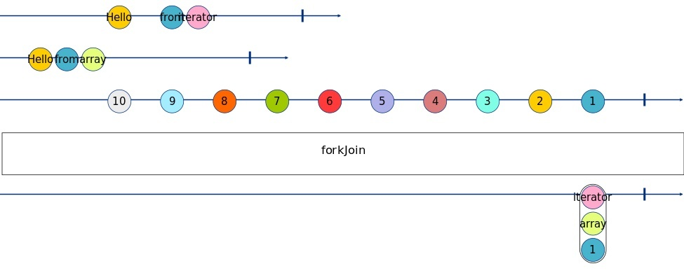
forkJoin is similar to the combineLatest operator, the difference is that the forkJoin operator emits only one value when all the observables are completed. In simple words, the forkJoin operator emits only the last value of the combineLatest operator.

- **[concat](https://rxjs.dev/api/index/function/concat)**

> Creates an output Observable which sequentially emits all values from the first given Observable and then moves on to the next.

```ts
import { concat } from "rxjs";
import { arrayFrom$, arrayOfWithDelay$, iterator$ } from "../sources";

console.log(new Date().toLocaleTimeString(), `[concat] start`);

concat(iterator$, arrayFrom$, arrayOfWithDelay$).subscribe({
  next: res => console.log(new Date().toLocaleTimeString(), `[concat]`, res),
  complete: () =>
    console.log(new Date().toLocaleTimeString(), `[concat] complete`),
});
```

```console
14:44:23 [concat] start
14:44:23 [concat] Hello
14:44:24 [concat] from
14:44:24 [concat] iterator
14:44:24 [concat] Hello
14:44:24 [concat] from
14:44:24 [concat] array
14:44:25 [concat] 10
14:44:25 [concat] 9
14:44:26 [concat] 8
14:44:26 [concat] 7
14:44:27 [concat] 6
14:44:27 [concat] 5
14:44:28 [concat] 4
14:44:28 [concat] 3
14:44:29 [concat] 2
14:44:29 [concat] 1
14:44:30 [concat] complete
```

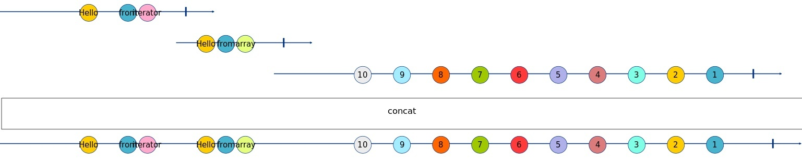
As you can see, this operator emits all the values of the observables in sequences.
Concat unlike of combineLatest does not run all observables in concurrency, but it runs the observables in sequence, it starts from the first and doesn't go to the next until the current is not completed.

- **[merge](https://rxjs.dev/api/index/function/merge)**

> Creates an output Observable which concurrently emits all values from every given input Observable.

```ts
import { merge } from "rxjs";
import { arrayFrom$, arrayOfWithDelay$, iterator$ } from "../sources";

console.log(new Date().toLocaleTimeString(), `[merge] start`);

merge(iterator$, arrayFrom$, arrayOfWithDelay$).subscribe({
  next: res => console.log(new Date().toLocaleTimeString(), `[merge]`, res),
  complete: () =>
    console.log(new Date().toLocaleTimeString(), `[merge] complete`),
});
```

```console
14:58:48 [merge] start
14:58:48 [merge] Hello
14:58:48 [merge] from
14:58:48 [merge] array
14:58:48 [merge] Hello
14:58:48 [merge] 10
14:58:49 [merge] from
14:58:49 [merge] 9
14:58:49 [merge] iterator
14:58:49 [merge] 8
14:58:50 [merge] 7
14:58:50 [merge] 6
14:58:51 [merge] 5
14:58:51 [merge] 4
14:58:52 [merge] 3
14:58:52 [merge] 2
14:58:53 [merge] 1
14:58:53 [merge] complete
```

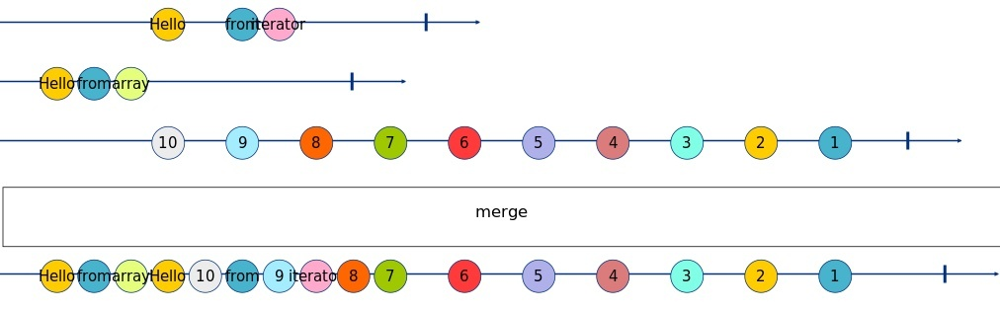
The merge operator is similar to the concat operator unlike that the merge operator runs all observables in concurrency mode, so, in this case, all the observables start together and every time an observable emits a value the merge operator emits this last value.

- **[race](https://rxjs.dev/api/index/function/race)**

> Returns an observable that mirrors the first source observable to emit an item.

```ts
import { race } from "rxjs";
import { arrayFrom$, arrayOfWithDelay$, iterator$ } from "../sources";

console.log(new Date().toLocaleTimeString(), `[race] start`);

race([iterator$, arrayFrom$, arrayOfWithDelay$]).subscribe({
  next: res => console.log(new Date().toLocaleTimeString(), `[race]`, res),
  complete: () =>
    console.log(new Date().toLocaleTimeString(), `[race] complete`),
});
```

```console
15:09:03 [race] start
15:09:03 [race] Hello
15:09:03 [race] from
15:09:03 [race] array
15:09:03 [race] complete
```

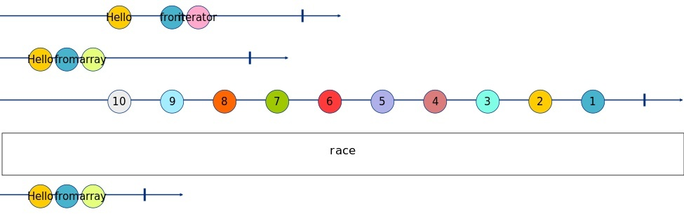
This operator is particular, it emits the first observable that emits the first value. In other words, it takes the faster observable and ignores the others.

- **[zip](https://rxjs.dev/api/index/function/zip)**

> Combines multiple Observables to create an Observable whose values are calculated from the values, in order, of each of its input Observables.

```ts
import { zip } from "rxjs";
import { arrayFrom$, arrayOfWithDelay$, iterator$ } from "../sources";

console.log(new Date().toLocaleTimeString(), `[zip] start`);

zip([iterator$, arrayFrom$, arrayOfWithDelay$]).subscribe({
  next: res => console.log(new Date().toLocaleTimeString(), `[zip]`, res),
  complete: () =>
    console.log(new Date().toLocaleTimeString(), `[zip] complete`),
});
```

```console
15:09:27 [zip] start
15:09:27 [zip] [ 'Hello', 'Hello', 10 ]
15:09:28 [zip] [ 'from', 'from', 9 ]
15:09:28 [zip] [ 'iterator', 'array', 8 ]
15:09:28 [zip] complete
```

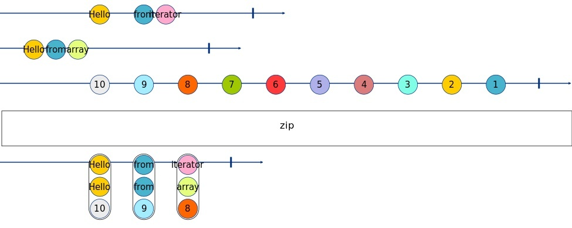
This operator may seem strange, but it can use to combine in order the values of difference observables.
In this example we have 3 observables:

- iterator$: `['Hello', 'from', 'iterator', '!']`
- arrayFrom$: `['Hello', 'from', 'array', '!']`
- arrayOfWithDelay$: `[10, 9, 8, 7, 6, 5, 4, 3, 2, 1]`

With the zip operator we combine the values in order of them index:

- `['Hello', 'Hello', 10]`
- `['from', 'from', 9]`
- `['iterator', 'array', 8]`

As you can see, the operator stops emitting values at the index of the first completed observable.

That's it for today.
You can find the code of these examples at this [link](https://github.com/Puppo/rxjs-getting-started/tree/05-creation-operators)

See you soon Guys!
