---
{
title: "RxJS - Filtering Operators",
published: "2021-09-17T06:00:17Z",
tags: ["javascript", "typescript", "rxjs"],
description: "Welcome back Guys,  Today we'll start with the Filtering Operators. As you can imagine these...",
originalLink: "https://dev.to/this-is-learning/rxjs-filtering-operators-pe1",
coverImage: "cover-image.png",
socialImage: "social-image.png",
collection: "RxJS - Getting Started",
order: 6
}
---

Welcome back Guys,

Today we'll start with the Filtering Operators. As you can imagine these operators are used to filter our sources.
Well, let's get started.

- **[auditTime](https://rxjs.dev/api/operators/auditTime)**

> Ignores source values for duration milliseconds, then emits the most recent value from the source Observable, then repeats this process.

```ts
import { Observable } from "rxjs";
import { auditTime } from "rxjs/operators";

const input$ = new Observable<number>(subscriber => {
  let count = 0;
  const id = setInterval(() => {
    if (count < 10) {
      subscriber.next(++count);
    } else {
      clearInterval(id);
      subscriber.complete();
    }
  }, 1000);
});

const result = input$.pipe(auditTime(2000));

result.subscribe({
  next: x =>
    console.log(
      `${new Date().toLocaleTimeString()} - [auditTime result]: ${x}`
    ),
});
```

```console
11:15:25 - [auditTime result]: 2
11:15:27 - [auditTime result]: 4
11:15:29 - [auditTime result]: 6
11:15:31 - [auditTime result]: 8
11:15:33 - [auditTime result]: 10
```

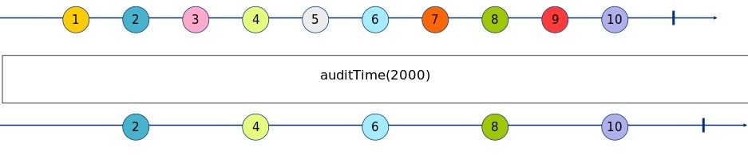
This operator is particular: for the indicated time it ignores the emitted values, and when the time is passed, it emits the last value emitted from the source. It can be used when we have a source that emits a lot of values but we need to get only the value in a specific interval, for example, we have a temperature sensor that emits the temperature every second but we need to take the value every minute, using auditTime we can get the last value of every minute.

- **[debounceTime](https://rxjs.dev/api/operators/debounceTime)**

> Emits a notification from the source Observable only after a particular time span has passed without another source emission.

```ts
import { Observable } from "rxjs";
import { debounceTime, tap } from "rxjs/operators";

const timesInSecond = [1, 0.5, 3, 1.5, 3, 1];

const input$ = new Observable<number>(subscriber => {
  let count = 0;
  (function next() {
    const seconds = timesInSecond[count++];
    setTimeout(() => {
      subscriber.next(seconds);

      if (count > 5) {
        subscriber.complete();
        return;
      }

      next();
    }, seconds * 1000);
  })();
});

const result = input$.pipe(
  tap(x =>
    console.log(
      `${new Date().toLocaleTimeString()} - [before debounceTime]: ${x}`
    )
  ),
  debounceTime(2000)
);
result.subscribe({
  next: x =>
    console.log(
      `${new Date().toLocaleTimeString()} - [debounceTime result]: ${x}`
    ),
});
```

```console
09:44:29 - [before debounceTime]: 1
09:44:29 - [before debounceTime]: 0.5
09:44:31 - [debounceTime result]: 0.5
09:44:32 - [before debounceTime]: 3
09:44:34 - [before debounceTime]: 1.5
09:44:36 - [debounceTime result]: 1.5
09:44:37 - [before debounceTime]: 3
09:44:38 - [before debounceTime]: 1
09:44:38 - [debounceTime result]: 1
```

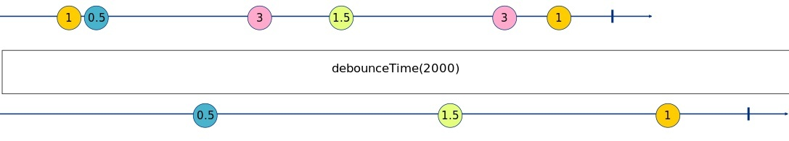
After receiving a value, this operator waits for the indicated time before emitting the value. If during this time a new value is emitted, the operator ignores the previous value and waits again, otherwise, if nothing happens it emits the value.
For example, this operator is used to manage the autocomplete text boxes that search items from an API; with this operator, we can prevent calling the API on every click on the keyboard but we can wait until the user finish writing some letters before executing the search.

- **[throttleTime](https://rxjs.dev/api/operators/throttleTime)**

> Emits a value from the source Observable, then ignores subsequent source values for duration milliseconds, then repeats this process.

```ts
import { Observable } from "rxjs";
import { tap, throttleTime } from "rxjs/operators";

const timesInSecond = [1, 0.5, 3, 1.5, 3, 1];

const input$ = new Observable<number>(subscriber => {
  let count = 0;
  (function next() {
    const seconds = timesInSecond[count++];
    setTimeout(() => {
      subscriber.next(seconds);

      if (count > 5) {
        subscriber.complete();
        return;
      }

      next();
    }, seconds * 1000);
  })();
});


const result = input$.pipe(
  tap(x =>
    console.log(
      `${new Date().toLocaleTimeString()} - [before throttleTime]: ${x}`
    )
  ),
  throttleTime(2000)
);
result.subscribe({
  next: x =>
    console.log(
      `${new Date().toLocaleTimeString()} - [throttleTime result]: ${x}`
    ),
});
```

```console
10:41:46 - [before throttleTime]: 1
10:41:46 - [throttleTime result]: 1
10:41:46 - [before throttleTime]: 0.5
10:41:49 - [before throttleTime]: 3
10:41:49 - [throttleTime result]: 3
10:41:51 - [before throttleTime]: 1.5
10:41:54 - [before throttleTime]: 3
10:41:54 - [throttleTime result]: 3
10:41:55 - [before throttleTime]: 1
```

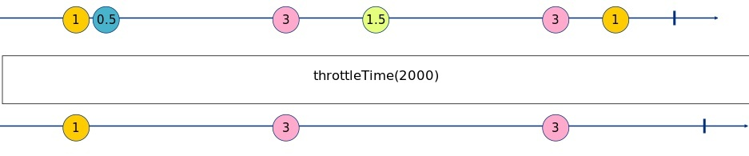
After receiving a value, this operator emits it and then waits for the indicated time. If during that time the source emits other values this operator ignores them, it repeats this process for life.
This operator is commonly used to prevent multiple clicks in some buttons or to prevent many executions of an action in a small period.

- **[distinct](https://rxjs.dev/api/operators/distinct)**

> Returns an Observable that emits all items emitted by the source Observable that are distinct by comparison from previous items.

```ts
import { Observable } from "rxjs";
import { distinct } from "rxjs/operators";

const input$ = new Observable<number | string>(subscriber => {
  let count = 0;
  const array = [1, 1, "1", 2, 2, 3, 3];
  const id = setInterval(() => {
    if (count < array.length) {
      subscriber.next(array[count++]);
    } else {
      clearInterval(id);
      subscriber.complete();
    }
  }, 1000);
});

input$.pipe(distinct()).subscribe({
  next: x =>
    console.log(`${new Date().toLocaleTimeString()} - [distinct]: ${x}`),
});
```

```console
12:22:58 - [distinct]: 1
12:23:00 - [distinct]: 1
12:23:01 - [distinct]: 2
12:23:03 - [distinct]: 3
```


This operator emits the value only if the value is different from the last value emitted. It's important to remember that the distinct operator checks the equality using the strict equal operator (===). It's also possible, if your source emits an object, to indicate the property used to check the equality `distinct(p => p.id)`.

- **[distinctUntilChanged](https://rxjs.dev/api/operators/distinctUntilChanged)**

```ts
import { Observable } from "rxjs";
import { distinctUntilChanged } from "rxjs/operators";

type State = { id: number; value: string };

const createValue = (id: number): State => ({ id, value: String(id) });
const array = [
  createValue(1),
  createValue(1),
  createValue(1),
  createValue(2),
  createValue(2),
  createValue(2),
  createValue(3),
  createValue(3),
  createValue(3),
  createValue(4),
  createValue(4),
  createValue(4),
];

const input$ = new Observable<State>(subscriber => {
  let count = 0;
  const id = setInterval(() => {
    if (count < array.length) {
      subscriber.next(array[count++]);
    } else {
      clearInterval(id);
      subscriber.complete();
    }
  }, 1000);
});

input$
  .pipe(distinctUntilChanged((prev, curr) => prev.id === curr.id))
  .subscribe({
    next: x =>
      console.log(
        `${new Date().toLocaleTimeString()} - [distinctUntilChanged]`,
        x
      ),
  });
```

```console
11:45:39 - [distinctUntilChanged] { id: 1, value: '1' }
11:45:42 - [distinctUntilChanged] { id: 2, value: '2' }
11:45:45 - [distinctUntilChanged] { id: 3, value: '3' }
11:45:48 - [distinctUntilChanged] { id: 4, value: '4' }
```

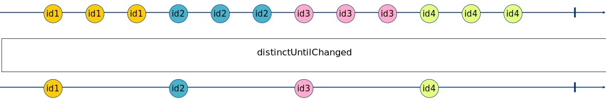
This operator is similar to the distinct operator but you can indicate a function that accepts the previous and the current item as arguments and indicates the algorithm to determinate if the two items are equals.

- **[distinctUntilKeyChanged](https://rxjs.dev/api/operators/distinctUntilKeyChanged)**

> Returns an Observable that emits all items emitted by the source Observable that are distinct by comparison from the previous item, using a property accessed by using the key provided to check if the two items are distinct.

```ts
import { Observable } from "rxjs";
import { distinctUntilKeyChanged } from "rxjs/operators";

type State = { id: number; value: string };

const createValue = (id: number): State => ({ id, value: String(id) });
const array = [
  createValue(1),
  createValue(1),
  createValue(1),
  createValue(2),
  createValue(2),
  createValue(2),
  createValue(3),
  createValue(3),
  createValue(3),
  createValue(4),
  createValue(4),
  createValue(4),
];

const input$ = new Observable<State>(subscriber => {
  let count = 0;
  const id = setInterval(() => {
    if (count < array.length) {
      subscriber.next(array[count++]);
    } else {
      clearInterval(id);
      subscriber.complete();
    }
  }, 1000);
});

input$.pipe(distinctUntilKeyChanged("id")).subscribe({
  next: x =>
    console.log(
      `${new Date().toLocaleTimeString()} - [distinctUntilKeyChanged]`,
      x
    ),
});
```

```console
11:46:12 - [distinctUntilKeyChanged] { id: 1, value: '1' }
11:46:15 - [distinctUntilKeyChanged] { id: 2, value: '2' }
11:46:18 - [distinctUntilKeyChanged] { id: 3, value: '3' }
11:46:21 - [distinctUntilKeyChanged] { id: 4, value: '4' }
```

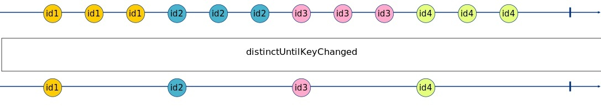
This operator is similar to the distinct operator but you can indicate the name of the property used to compare the equality.

- **[filter](https://rxjs.dev/api/operators/filter)**

> Filter items emitted by the source Observable by only emitting those that satisfy a specified predicate.

```ts
import { Observable } from "rxjs";
import { filter } from "rxjs/operators";

const input$ = new Observable<number>(subscriber => {
  let count = 0;
  const id = setInterval(() => {
    if (count < 10) {
      subscriber.next(++count);
    } else {
      clearInterval(id);
      subscriber.complete();
    }
  }, 1000);
});

input$.pipe(filter(x => x % 2 === 0)).subscribe({
  next: x => console.log(`${new Date().toLocaleTimeString()} - [filter]: ${x}`),
});
```

```console
11:46:43 - [filter]: 2
11:46:45 - [filter]: 4
11:46:47 - [filter]: 6
11:46:49 - [filter]: 8
11:46:51 - [filter]: 10
```

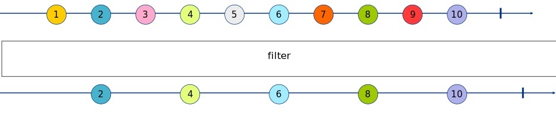
As you can imagine, this operator accepts a function that has an argument (the current item) and returns a boolean that indicates if the value can be emitted or must be ignored.

- **[first](https://rxjs.dev/api/operators/first)**

> Emits only the first value (or the first value that meets some condition) emitted by the source Observable.

```ts
import { Observable } from "rxjs";
import { first } from "rxjs/operators";

const input$ = new Observable<number>(subscriber => {
  let count = 0;
  const id = setInterval(() => {
    if (count < 10) {
      subscriber.next(++count);
    } else {
      clearInterval(id);
      subscriber.complete();
    }
  }, 1000);
});

console.log(`${new Date().toLocaleTimeString()} - [first] start`)
input$.pipe(first()).subscribe({
  next: x => console.log(`${new Date().toLocaleTimeString()} - [first]: ${x}`),
  complete: () => console.log(`${new Date().toLocaleTimeString()} - [first] complete`),
});
```

```console
09:47:15 - [first] start
09:47:16 - [first]: 1
09:47:16 - [first] complete
```

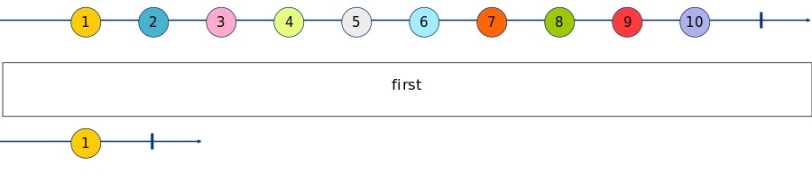
This operator takes the first value and ignores the others.
It's important to remember that when the first operator emits the value it completes the subscription too.

- **[last](https://rxjs.dev/api/operators/last)**

> Returns an Observable that emits only the last item emitted by the source Observable. It optionally takes a predicate function as a parameter, in which case, rather than emitting the last item from the source Observable, the resulting Observable will emit the last item from the source Observable that satisfies the predicate.

```ts
import { Observable } from "rxjs";
import { last } from "rxjs/operators";

const input$ = new Observable<number>(subscriber => {
  let count = 0;
  const id = setInterval(() => {
    if (count < 10) {
      subscriber.next(++count);
    } else {
      clearInterval(id);
      subscriber.complete();
    }
  }, 1000);
});

console.log(`${new Date().toLocaleTimeString()} - [last] start`)
input$.pipe(last()).subscribe({
  next: x => console.log(`${new Date().toLocaleTimeString()} - [last]: ${x}`),
  complete: () => console.log(`${new Date().toLocaleTimeString()} - [last] complete`),
});
```

```console
09:48:14 - [last] start
09:48:25 - [last]: 10
09:48:25 - [last] complete
```

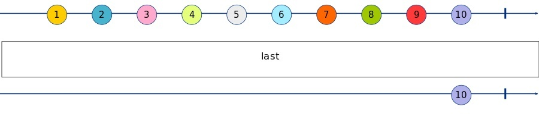
This operator takes the last value and ignores the others.

- **[skip](https://rxjs.dev/api/operators/skip)**

> Returns an Observable that skips the first count items emitted by the source Observable.

```ts
import { Observable } from "rxjs";
import { skip } from "rxjs/operators";

const input$ = new Observable<number>(subscriber => {
  let count = 0;
  const id = setInterval(() => {
    if(count < 5) subscriber.next(count++);
    else {
      clearInterval(id);
      subscriber.complete();
    } 
  }, 1000);
  return () => {
    clearInterval(id);
    subscriber.complete();
  };
});

input$.pipe(skip(2)).subscribe({
  next: x => console.log(`${new Date().toLocaleTimeString()} - [skip]: ${x}`),
  complete: () =>
    console.log(`${new Date().toLocaleTimeString()} - [skip]: complete`),
});
```

```console
10:33:41 - [skip]: 2
10:33:42 - [skip]: 3
10:33:43 - [skip]: 4
10:33:44 - [skip]: complete
```

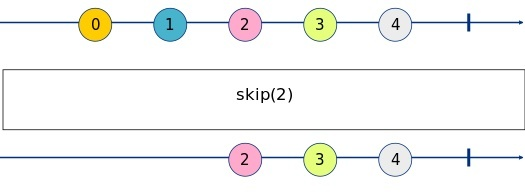
As you can see, this operator skips the first x items we indicate, if we write `skip(1)` the operator skips the first value, if we write `skip(2)` the operator skips the first two values and so on.

- **[skipLast](https://rxjs.dev/api/operators/skipLast)**

> Skip a specified number of values before the completion of an observable.

```ts
import { Observable } from "rxjs";
import { skipLast } from "rxjs/operators";

const input$ = new Observable<number>(subscriber => {
  let count = 0;
  const id = setInterval(() => {
    if (count < 5) subscriber.next(count++);
    else {
      clearInterval(id);
      subscriber.complete();
    }
  }, 1000);
});

console.log(`${new Date().toLocaleTimeString()} - [skipLast]: start`)

input$.pipe(skipLast(3)).subscribe({
  next: x => console.log(`${new Date().toLocaleTimeString()} - [skipLast]: ${x}`),
  complete: () =>
    console.log(`${new Date().toLocaleTimeString()} - [skipLast]: complete`),
});
```

```console
10:33:58 - [skipLast]: start
10:34:02 - [skipLast]: 0
10:34:03 - [skipLast]: 1
10:34:04 - [skipLast]: complete
```

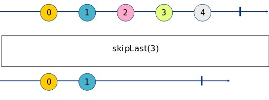
This operator skips the last x items we indicate, if we write `skipLast(1)` the operator skips the last value, if we write `skipLast(2)` the operator skips the last two values and so on.

- **[skipUntil](https://rxjs.dev/api/operators/skipUntil)**

> Returns an Observable that skips items emitted by the source Observable until a second Observable emits an item.

```ts
import { Observable } from "rxjs";
import { skipUntil } from "rxjs/operators";

const input$ = new Observable<number>(subscriber => {
  let count = 0;
  const id = setInterval(() => {
    if (count < 5) subscriber.next(count++)
    else {
      clearInterval(id);
      subscriber.complete();
    }
  }, 1000);
});

const untilInput$ = new Observable<void>(subscriber => {
  setTimeout(() => {
    console.log(
      `${new Date().toLocaleTimeString()} - untilInput$ emit`
    );
    subscriber.next();
    subscriber.complete();
  }, 5000);
});

input$.pipe(skipUntil(untilInput$)).subscribe({
  next: x =>
    console.log(`${new Date().toLocaleTimeString()} - [skipUntil]: ${x}`),
  complete: () =>
    console.log(`${new Date().toLocaleTimeString()} - [skipUntil]: complete`),
});
```

```console
10:34:37 - untilInput$ emit
10:34:37 - [skipUntil]: 4
10:34:38 - [skipUntil]: complete
```

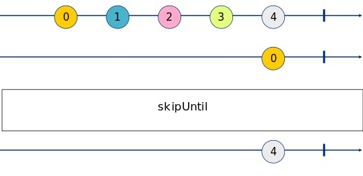
This operator skips all the values until another observable doesn't emit a value.

- **[skipWhile](https://rxjs.dev/api/operators/skipWhile)**

> Returns an Observable that skips all items emitted by the source Observable as long as a specified condition holds true, but emits all further source items as soon as the condition becomes false.

```ts
import { Observable } from "rxjs";
import { skipWhile } from "rxjs/operators";

const input$ = new Observable<number>(subscriber => {
  let count = 0;
  const id = setInterval(() => {
    if (count < 5) subscriber.next(count++);
    else {
      subscriber.next(count++);
      subscriber.complete();
    }
  }, 1000);
  return () => {
    clearInterval(id);
  };
});

input$.pipe(skipWhile(val => val < 3)).subscribe({
  next: x =>
    console.log(`${new Date().toLocaleTimeString()} - [skipWhile]: ${x}`),
  complete: () =>
    console.log(`${new Date().toLocaleTimeString()} - [skipWhile]: complete`),
});
```

```console
10:36:34 - [skipWhile]: 3
10:36:35 - [skipWhile]: 4
10:36:36 - [skipWhile]: 5
10:36:36 - [skipWhile]: complete
```


This operator skips all the values ​​until the predicate isn't true, after the first true result, the skipWhile operator doesn't eval anymore the predicate and emits all the values.

- **[take](https://rxjs.dev/api/operators/take)**

> Emits only the first count values emitted by the source Observable.

```ts
import { Observable } from "rxjs";
import { take } from "rxjs/operators";

const input$ = new Observable<number>(subscriber => {
  let count = 0;
  const id = setInterval(() => {
    subscriber.next(count++);
  }, 1000);
  return () => {
    clearInterval(id);
    subscriber.complete();
  };
});

input$.pipe(take(2)).subscribe({
  next: x => console.log(`${new Date().toLocaleTimeString()} - [take]: ${x}`),
  complete: () =>
    console.log(`${new Date().toLocaleTimeString()} - [take]: complete`),
});
```

```console
10:39:39 - [take]: 0
10:39:40 - [take]: 1
10:39:40 - [take]: complete
```

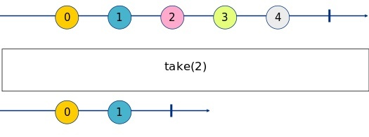
The take operator is the opposite of the skip operator, if the skip ignores x values, the take operator emits x values.
So if you write `take(1)` you get only the first value, if you write `take(2)` you get only the first two values.
It's important to remember that when the operator emits the last value completes the subscription too.

- **[takeLast](https://rxjs.dev/api/operators/takeLast)**

> Waits for the source to complete, then emits the last N values from the source, as specified by the count argument.

```ts
import { Observable } from "rxjs";
import { takeLast } from "rxjs/operators";

const input$ = new Observable<number>(subscriber => {
  let count = 0;
  const id = setInterval(() => {
    if (count < 5) subscriber.next(count++);
    else {
      clearInterval(id);
      subscriber.complete();
    }
  }, 1000);
});

console.log(`${new Date().toLocaleTimeString()} - [takeLast]: start`)

input$.pipe(takeLast(3)).subscribe({
  next: x => console.log(`${new Date().toLocaleTimeString()} - [takeLast]: ${x}`),
  complete: () =>
    console.log(`${new Date().toLocaleTimeString()} - [takeLast]: complete`),
});
```

```console
10:40:08 - [takeLast]: start
10:40:14 - [takeLast]: 2
10:40:14 - [takeLast]: 3
10:40:14 - [takeLast]: 4
10:40:14 - [takeLast]: complete
```

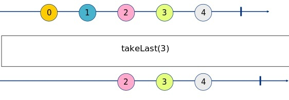
This operator takes the last x items we indicate, if we write takeLast(1) the operator takes the last value, if we write takeLast(3) the operator takes the last three values, and so on.

- **[takeUntil](https://rxjs.dev/api/operators/takeUntil)**

> Emits the values emitted by the source Observable until a notifier Observable emits a value.

```ts
import { Observable } from "rxjs";
import { takeUntil } from "rxjs/operators";

const input$ = new Observable<number>(subscriber => {
  let count = 0;
  const id = setInterval(() => {
    if (count < 5) subscriber.next(++count);
    else {
      clearInterval(id);
      subscriber.complete();
    }
  }, 1000);
});

const untilInput$ = new Observable<void>(subscriber => {
  setTimeout(() => {
    console.log(
      `${new Date().toLocaleTimeString()} - untilInput$ emit`
    );
    subscriber.next();
    subscriber.complete();
  }, 2500);
});

input$.pipe(takeUntil(untilInput$)).subscribe({
  next: x =>
    console.log(`${new Date().toLocaleTimeString()} - [takeUntil]: ${x}`),
  complete: () =>
    console.log(`${new Date().toLocaleTimeString()} - [takeUntil]: complete`),
});
```

```console
10:40:38 - [takeUntil]: 1
10:40:39 - [takeUntil]: 2
10:40:42 - untilInput$ emit
10:40:42 - [takeUntil]: complete
```

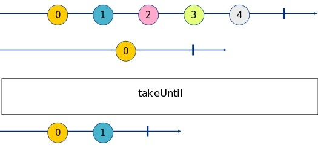
This operator takes all the values until another observable doesn't emit a value, after that it complete the subscription.

- **[takeWhile](https://rxjs.dev/api/operators/takeWhile)**

> Emits values emitted by the source Observable so long as each value satisfies the given predicate, and then completes as soon as this predicate is not satisfied.

```ts
import { Observable } from "rxjs";
import { takeWhile } from "rxjs/operators";

const input$ = new Observable<number>(subscriber => {
  let count = 0;
  const id = setInterval(() => {
    subscriber.next(count++);
  }, 1000);
  return () => {
    clearInterval(id);
    subscriber.complete();
  };
});

input$.pipe(takeWhile(val => val < 3)).subscribe({
  next: x =>
    console.log(`${new Date().toLocaleTimeString()} - [takeWhile]: ${x}`),
  complete: () =>
    console.log(`${new Date().toLocaleTimeString()} - [takeWhile]: complete`),
});
```

```console
10:41:10 - [takeWhile]: 0
10:41:11 - [takeWhile]: 1
10:41:12 - [takeWhile]: 2
10:41:13 - [takeWhile]: complete
```

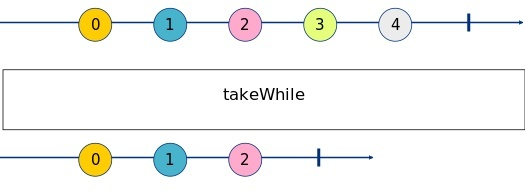
This operator emits all the values ​​until the predicate is true, after that the takeWhile operator completes the subscription.

Ok Guys, I think that today it's enough for the Filter Operators.
You can find all the code of this article [here](https://github.com/Puppo/rxjs-getting-started/tree/06-filtering-operators).

See you in the next article.
Bye Bye!
