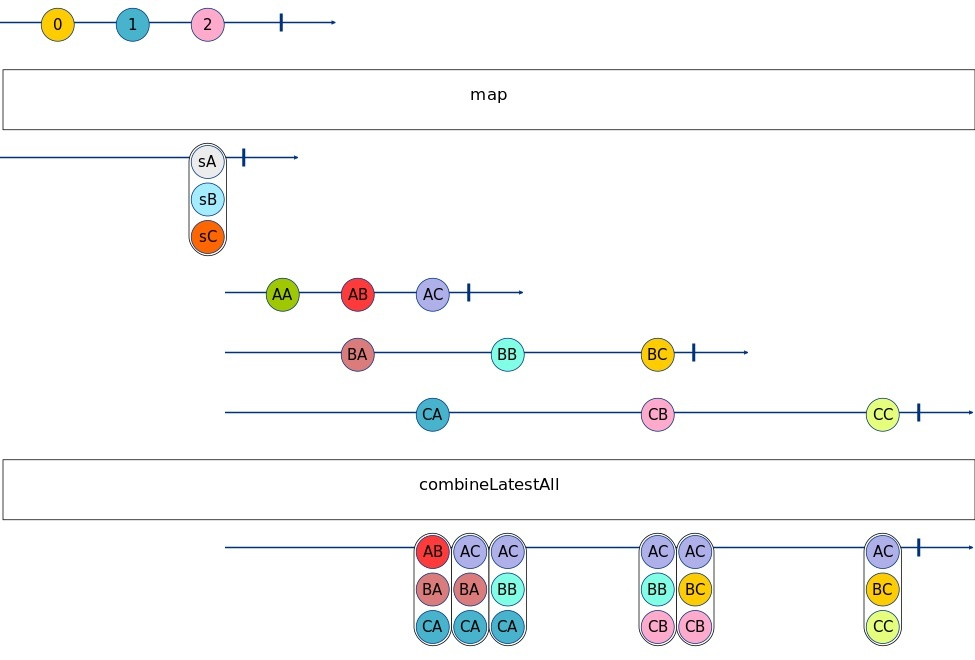
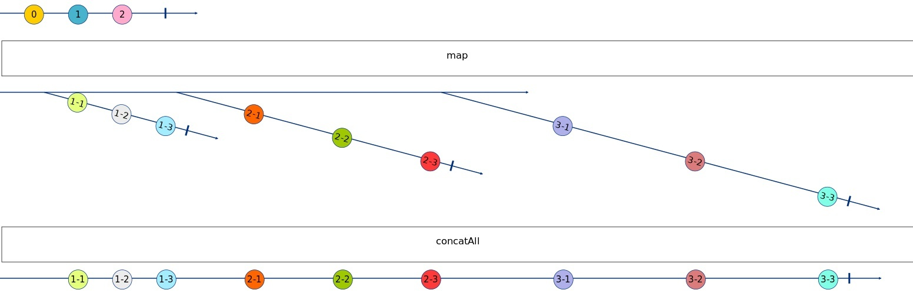
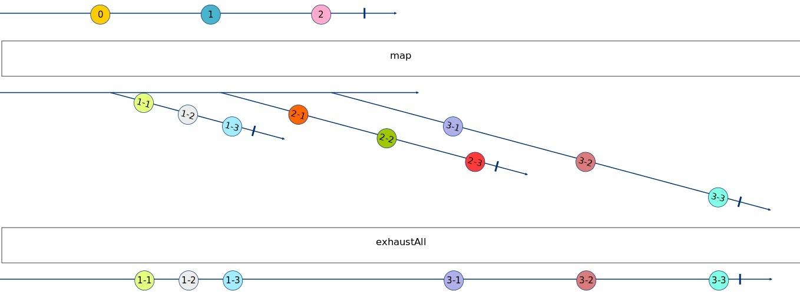
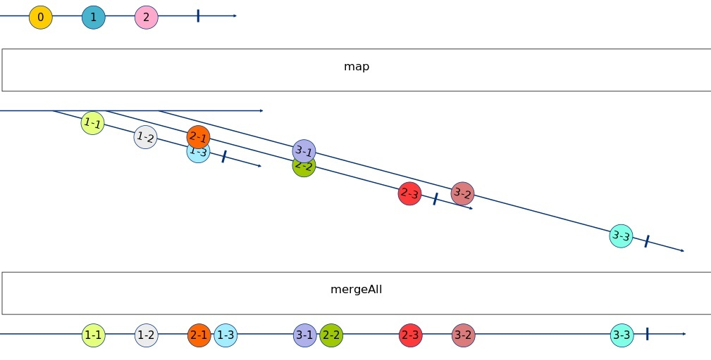
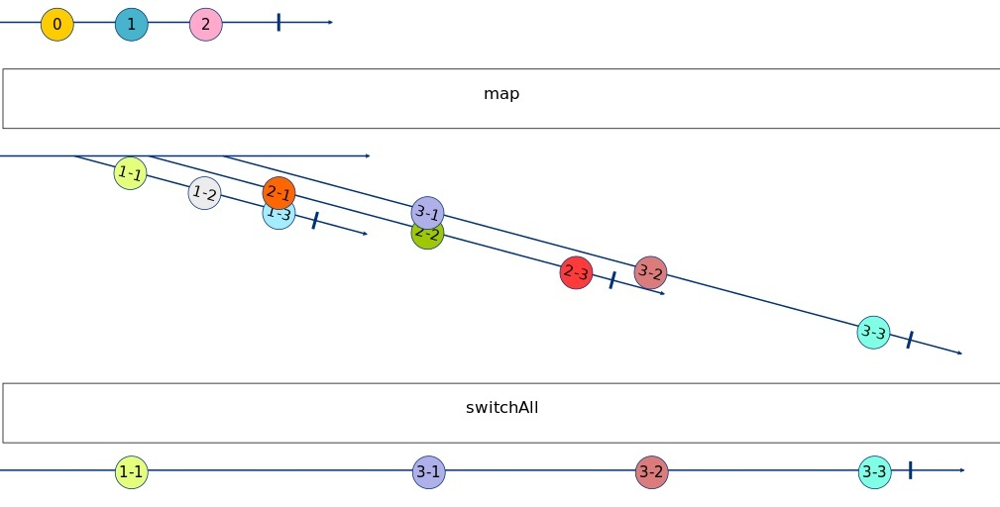

---
{
title: "RxJS - Join Operators",
published: "2021-09-22T06:07:48Z",
tags: ["javascript", "typescript", "rxjs"],
description: "Hi Guys and Welcome Back, Today I'll speak about the Join Operators. Some of these operators are...",
originalLink: "https://dev.to/this-is-learning/rxjs-join-operators-2lam",
coverImage: "cover-image.png",
socialImage: "social-image.png",
collection: "13743",
order: 1
}
---

Hi Guys and Welcome Back,
Today I'll speak about the Join Operators. Some of these operators are similar to other operators shown in the [Creation Operators](https://dev.to/this-is-learning/rxjs-creation-operators-6bh) but they are used in different contexts, ok let's start!

- **[combineLatestAll](https://rxjs.dev/api/operators/combineLatestAll)**

> Flattens an Observable-of-Observables by applying combineLatest when the Observable-of-Observables completes.

```ts
import { interval, timer } from 'rxjs';
import { combineLatestAll, map, take } from 'rxjs/operators';

const A_CHAR_CODE = 65
const createSource = (index: number) =>
    interval((index + 1) * 1000).pipe(
        take(3),
        map(value => `${String.fromCharCode(A_CHAR_CODE + index)}${String.fromCharCode(A_CHAR_CODE + value)}`)
    )

console.log(`${new Date().toLocaleTimeString()}: combineLatestAll start`)
const source$ = timer(0, 1000).pipe(
    take(3)
);
source$.pipe(
    map(createSource),
    combineLatestAll()
).subscribe({
    next: val => console.log(`${new Date().toLocaleTimeString()}: combineLatestAll`, val)
});
```

```console
16:22:07: combineLatestAll start
16:22:12: combineLatestAll [ 'AB', 'BA', 'CA' ]
16:22:12: combineLatestAll [ 'AC', 'BA', 'CA' ]
16:22:13: combineLatestAll [ 'AC', 'BB', 'CA' ]
16:22:15: combineLatestAll [ 'AC', 'BB', 'CB' ]
16:22:15: combineLatestAll [ 'AC', 'BC', 'CB' ]
16:22:18: combineLatestAll [ 'AC', 'BC', 'CC' ]
```


As you can see, this operator is the brother of the combineLatest operator discussed in a previous article [RxJS - Creation Operators](https://dev.to/this-is-learning/rxjs-creation-operators-6bh).
Its job is to convert an Observable of Observables to an array of values, where each item of this array is a value of an observable.
When we use this operator we need to remember that the first value emitted by the operator is when all the observables have emitted at least one value.
This operator is used when in the pipe chain we have an operator that emits a list of observables; using this operator we can flat the values in a single array including all the values emitted by these observables.

- **[concatAll](https://rxjs.dev/api/operators/concatAll)**

> Converts a higher-order Observable into a first-order Observable by concatenating the inner Observables in order.

```ts
import { interval, timer } from 'rxjs';
import { concatAll, map, take } from 'rxjs/operators';

const createSource = (index: number) => interval(index * 1000).pipe(
        take(3),
        map(value => `${index}-${value + 1}`)
    )

console.log(`${new Date().toLocaleTimeString()}: concatAll start`)
const source$ = timer(0, 1000).pipe(
    take(3)
);
source$.pipe(
    map(v => createSource(v + 1)),
    concatAll()
).subscribe({
    next: val => console.log(`${new Date().toLocaleTimeString()}: concatAll`, val)
});
```

```console
15:38:29: concatAll start
15:38:30: concatAll 1-1
15:38:31: concatAll 1-2
15:38:32: concatAll 1-3
15:38:34: concatAll 2-1
15:38:36: concatAll 2-2
15:38:38: concatAll 2-3
15:38:41: concatAll 3-1
15:38:44: concatAll 3-2
15:38:47: concatAll 3-3
```


The concatAll operator concatenates an Observable of Observables and emits all the observables in sequence.
It's important to remember that when we use this operator, the observables are running one after the other, so the operator executes the first observable until it isn't completed, then it passes to the second observable, and so on.
This operator is used when we have in a pipe chain an operator that returns a list of observables and we need to execute them in sequence.

- **[exhaustAll](https://rxjs.dev/api/operators/exhaustAll)**

> Converts a higher-order Observable into a first-order Observable by dropping inner Observables while the previous inner Observable has not yet completed.

```ts
import { interval, timer } from 'rxjs';
import { exhaustAll, map, take } from 'rxjs/operators';

const createSource = (index: number) => interval(index * 1000).pipe(
        take(3),
        map(value => `${index}-${value + 1}`)
    )

console.log(`${new Date().toLocaleTimeString()}: exhaustAll start`)
const source$ = timer(0, 2500).pipe(
    take(3)
);
source$.pipe(
    map(v => createSource(v + 1)),
    exhaustAll()
).subscribe({
    next: val => console.log(`${new Date().toLocaleTimeString()}: exhaustAll`, val)
});
```

```console
16:27:05: exhaustAll start
16:27:07: exhaustAll 1-1
16:27:08: exhaustAll 1-2
16:27:09: exhaustAll 1-3
16:27:14: exhaustAll 3-1
16:27:17: exhaustAll 3-2
16:27:20: exhaustAll 3-3
```



- **[mergeAll](https://rxjs.dev/api/operators/mergeAll)**

> Converts a higher-order Observable into a first-order Observable which concurrently delivers all values that are emitted on the inner Observables.

```ts
import { interval, timer } from 'rxjs';
import { map, mergeAll, take } from 'rxjs/operators';

const createSource = (index: number) => interval(index * 1000).pipe(
        take(3),
        map(value => `${index}-${value + 1}`),
    )

console.log(`${new Date().toLocaleTimeString()}: mergeAll start`)
const source$ = timer(0, 1000).pipe(
    take(3),
);
source$.pipe(
    map(v => createSource(v + 1)),
    mergeAll()
).subscribe({
    next: val => console.log(`${new Date().toLocaleTimeString()}: mergeAll`, val)
});
```

```console
15:41:46: mergeAll start
15:41:47: mergeAll 1-1
15:41:48: mergeAll 1-2
15:41:49: mergeAll 2-1
15:41:49: mergeAll 1-3
15:41:51: mergeAll 3-1
15:41:51: mergeAll 2-2
15:41:53: mergeAll 2-3
15:41:54: mergeAll 3-2
15:41:57: mergeAll 3-3
```



- **[switchAll](https://rxjs.dev/api/operators/switchAll)**

> Converts a higher-order Observable into a first-order Observable producing values only from the most recent observable sequence

```ts
import { interval, timer } from 'rxjs';
import { map, switchAll, take } from 'rxjs/operators';

const createSource = (index: number) => interval(index * 1000).pipe(
        take(3),
        map(value => `${index}-${value + 1}`)
    )

console.log(`${new Date().toLocaleTimeString()}: switchAll start`)
const source$ = timer(0, 1000).pipe(
    take(3)
);
source$.pipe(
    map(v => createSource(v + 1)),
    switchAll()
).subscribe({
    next: val => console.log(`${new Date().toLocaleTimeString()}: switchAll`, val)
});
```

```console
15:42:48: switchAll start
15:42:49: switchAll 1-1
15:42:53: switchAll 3-1
15:42:56: switchAll 3-2
15:42:59: switchAll 3-3
```



- **[startWith](https://rxjs.dev/api/operators/startWith)**

> Returns an observable that, at the moment of subscription, will synchronously emit all values provided to this operator, then subscribe to the source and mirror all of its emissions to subscribers.

```ts
import { of } from 'rxjs';
import { startWith } from 'rxjs/operators';

const source1$ = of(1, 2, 3).pipe(
    startWith(1000)
)

source1$.subscribe({
    next: val => console.log(`${new Date().toLocaleTimeString()}: startWith`, val)
});
```

```console
15:43:47: startWith 1000
15:43:47: startWith 1
15:43:47: startWith 2
15:43:47: startWith 3
```

- **[withLatestFrom](https://rxjs.dev/api/operators/withLatestFrom)**

> Combines the source Observable with other Observables to create an Observable whose values are calculated from the latest values of each, only when the source emits.

```ts

import { interval } from 'rxjs';
import { take, withLatestFrom } from 'rxjs/operators';

const source1$ = interval(1000).pipe(
    take(5)
)
const source2$ = interval(2500).pipe(
    take(5)
)

console.log(`${new Date().toLocaleTimeString()}: withLatestFrom start`)
source1$.pipe(
    withLatestFrom(source2$)
).subscribe({
    next: val => console.log(`${new Date().toLocaleTimeString()}: withLatestFrom`, val)
});
```

```console
15:44:11: withLatestFrom start
15:44:14: withLatestFrom [ 2, 0 ]
15:44:15: withLatestFrom [ 3, 0 ]
15:44:16: withLatestFrom [ 4, 1 ]
```

Ok guys, that's all for today!
You can find the code of this article [here](https://github.com/Puppo/rxjs-getting-started/tree/08-join-operators)

See you soon!
