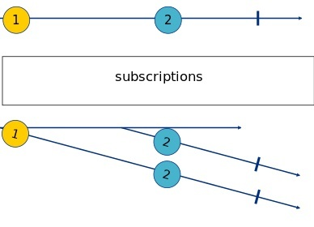
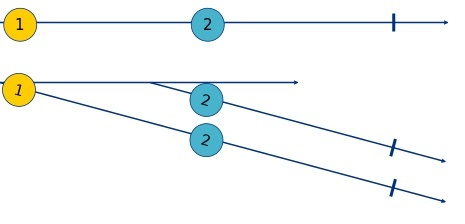
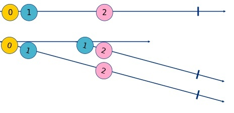
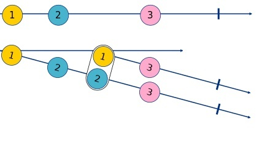
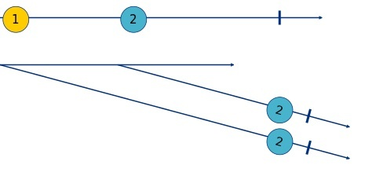

---
{
title: "RxJS - Subjects",
published: "2021-10-06T06:00:57Z",
tags: ["javascript", "typescript", "rxjs"],
description: "What's a Subject Luca? And why today do you want to speak about subjects? Is there a mistake in the...",
originalLink: "https://dev.to/this-is-learning/rxjs-subjects-4m12",
coverImage: "cover-image.png",
socialImage: "social-image.png",
collection: "13743",
order: 1
}
---

What's a Subject Luca? And why today do you want to speak about subjects? Is there a mistake in the publishing? Or are you simply drunk?


No guys, don't worry, It's the topic of the day :)
I think that after this long trip in the RxJS world and after Observables, Observers, Subscriptions, and a number of Operators that I don't even remember, it's time to show you the Subjects, a powerful type of Observable, but not only.
Let's start from the definition:

> A Subject is like an Observable, but can multicast to many Observers. Subjects are like EventEmitters: they maintain a registry of many listeners.


Ok, I'm joking :)
But let's continue with two notes present in the official documentation.

- **Every Subject is an Observable**
  Given a Subject, you can subscribe to it, providing an Observer, which will start receiving values normally. From the perspective of the Observer, it cannot tell whether the Observable execution is coming from a plain unicast Observable or a Subject.
- **Every Subject is an Observer**
  It is an object with the methods next(v), error(e), and complete(). To feed a new value to the Subject, just call next(theValue), and it will be multicasted to the Observers registered to listen to the Subject.

Ok, but what does it means?
It means that you can create a Subject, subscribe to it with infinitive observers, multicast the values with great performance, emit new values using a simple method called `next`, emit errors using a method called `error` and complete your subject with a simple method called `complete`.
The icing on that cake is that all these things can be done with a clean code and they are not enclosed into the body of a function as on the Observable constructor.

But let me show you an example.

```ts
import { Subject } from 'rxjs';
 
const subject = new Subject<number>();
 
subject.subscribe({
  next: (v) => console.log(new Date().toLocaleTimeString(), `observerA: ${v}`),
  complete: () => console.log(new Date().toLocaleTimeString(), 'observerA: complete')
});
 
subject.next(1);

setTimeout(() => {
  subject.subscribe({
  next: (v) => console.log(new Date().toLocaleTimeString(), `observerB: ${v}`),
  complete: () => console.log(new Date().toLocaleTimeString(), 'observerB: complete')
});
}, 2000);

setTimeout(() => {
  subject.next(2);
}, 3000);

setTimeout(() => {
  subject.complete();
}, 4000);
```

```console
18:52:23 observerA: 1
18:52:26 observerA: 2
18:52:26 observerB: 2
18:52:27 observerA: complete
18:52:27 observerB: complete
```



As you can see, with a Subject we can emit new values, subscribe to its changes, and complete the subject.
I recommend you to try this special observable because it can be powerful in many cases.

The RxJS library does not stop its power here. It exposes us four different types of subjects: Subject, BehaviorSubject, ReplaySubject and AsyncSubject.
These four types have 4 different behaviour that can help us to resolve different cases. Let me show you these differences.

- **[subject](https://rxjs.dev/guide/subject#subject)**

> A Subject is like an Observable, but can multicast to many Observers. Subjects are like EventEmitters: they maintain a registry of many listeners.

```ts
import { Subject } from 'rxjs';
 
const subject = new Subject<number>();
 
subject.subscribe({
  next: (v) => console.log(new Date().toLocaleTimeString(), `observerA: ${v}`),
  complete: () => console.log(new Date().toLocaleTimeString(), 'observerA: complete')
});
 
subject.next(1);

setTimeout(() => {
    subject.subscribe({
        next: (v) => console.log(new Date().toLocaleTimeString(), `observerB: ${v}`),
        complete: () => console.log(new Date().toLocaleTimeString(), 'observerB: complete')
    });
}, 1000);

setTimeout(() => {
  subject.next(2);
}, 3000);

setTimeout(() => {
  subject.complete();
}, 4000);
```

```console
19:14:41 observerA: 1
19:14:44 observerA: 2
19:14:44 observerB: 2
19:14:45 observerA: complete
19:14:45 observerB: complete
```



This subject can be used when we need to emit values and notify some of these.
This subject doesn't have an initial value and if an observer subscribes to this type of subject it receives only the values emitted after its subscription.

*N.B. In some cases, we don't need to send a value when we call the next method of the subject, but we just need to call the method to notify some of these. In these cases, we can use the [Void Subject](https://rxjs.dev/guide/subject#void-subject), a special subject that does not need a value.*

- **[behaviorsubject](https://rxjs.dev/guide/subject#behaviorsubject)**

> BehaviorSubjects are useful for representing "values over time". For instance, an event stream of birthdays is a Subject, but the stream of a person's age would be a BehaviorSubject.

```ts
import { BehaviorSubject } from 'rxjs';
 
const subject = new BehaviorSubject<number>(0);
 
subject.subscribe({
  next: (v) => console.log(new Date().toLocaleTimeString(), `observerA: ${v}`),
  complete: () => console.log(new Date().toLocaleTimeString(), 'observerA: complete')
});
 
subject.next(1);

setTimeout(() => {
    subject.subscribe({
        next: (v) => console.log(new Date().toLocaleTimeString(), `observerB: ${v}`),
        complete: () => console.log(new Date().toLocaleTimeString(), 'observerB: complete')
    });
}, 1000);

setTimeout(() => {
  subject.next(2);
}, 3000);

setTimeout(() => {
  subject.complete();
}, 4000);
```

```console
19:15:57 observerA: 0
19:15:57 observerA: 1
19:15:58 observerB: 1
19:16:00 observerA: 2
19:16:00 observerB: 2
19:16:01 observerA: complete
19:16:01 observerB: complete
```


The BehaviorSubject is a subject that requires an initial value. When an observer subscribes to a BehaviorSubject it immediately receives the last emitted value and then it waits for the future values.

- **[replaysubject](https://rxjs.dev/guide/subject#replaysubject)**

> A ReplaySubject records multiple values from the Observable execution and replays them to new subscribers.

```ts
import { ReplaySubject } from 'rxjs';
 
const subject = new ReplaySubject<number>();
 
subject.subscribe({
  next: (v) => console.log(new Date().toLocaleTimeString(), `observerA: ${v}`),
  complete: () => console.log(new Date().toLocaleTimeString(), 'observerA: complete')
});
 
subject.next(1);

setTimeout(() => {
  subject.next(2);
}, 1000);

setTimeout(() => {
    subject.subscribe({
        next: (v) => console.log(new Date().toLocaleTimeString(), `observerB: ${v}`),
        complete: () => console.log(new Date().toLocaleTimeString(), 'observerB: complete')
    });
}, 2000);

setTimeout(() => {
  subject.next(3);
}, 3000);

setTimeout(() => {
  subject.complete();
}, 4000);
```

```console
19:17:37 observerA: 1
19:17:38 observerA: 2
19:17:39 observerB: 1
19:17:39 observerB: 2
19:17:40 observerA: 3
19:17:40 observerB: 3
19:17:41 observerA: complete
19:17:41 observerB: complete
```


The ReplaySubject is a subject that doesn't require an initial value but when an observer subscribes to it, it receives immediately all the values already emitted and after that, it waits for the future values.

- **[asyncsubject](https://rxjs.dev/guide/subject#asyncsubject)**

> The AsyncSubject is a variant where only the last value of the Observable execution is sent to its observers, and only when the execution completes.

```ts
import { AsyncSubject } from 'rxjs';
 
const subject = new AsyncSubject<number>();
 
subject.subscribe({
  next: (v) => console.log(new Date().toLocaleTimeString(), `observerA: ${v}`),
  complete: () => console.log(new Date().toLocaleTimeString(), 'observerA: complete')
});
 
subject.next(1);

setTimeout(() => {
    subject.subscribe({
        next: (v) => console.log(new Date().toLocaleTimeString(), `observerB: ${v}`),
        complete: () => console.log(new Date().toLocaleTimeString(), 'observerB: complete')
    });
}, 1000);

setTimeout(() => {
  subject.next(2);
}, 3000);

setTimeout(() => {
  subject.complete();
}, 4000);
```

```console
19:19:01 observerA: 2
19:19:01 observerB: 2
19:19:01 observerA: complete
19:19:01 observerB: complete
```


The AsyncSubject is a subject that does not emit values ​​until it is completed, at the time of its completion it emits the last value executed.

These are the differences between these subjects, it's important to remember these differences because if you choose the wrong subject you could do unexpected mistakes.

Before ending the article let me show you a best practice to expose our subject to the consumers. If you need to hide to your consumers that your Observable is a Subject, you need to expose the subject using its "asObservable" method. This method returns the subject as an Observable, so the consumer can't call the "next" and "complete" methods.

Ok guys, that's all for today, I recommend you to play with these subject to understand better their power and characteristics.

See you soon
Bye Bye
