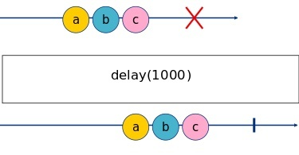
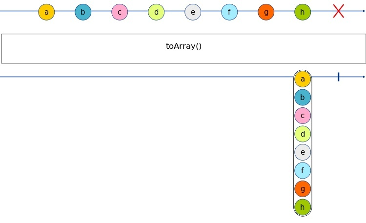

---
{
title: "RxJS - Utility Operators",
published: "2021-09-24T05:59:52Z",
tags: ["javascript", "typescript", "rxjs"],
description: "Welcome back Guys, Today I'll show you some utility operators. Let's start :)   tap    Used to...",
originalLink: "https://dev.to/this-is-learning/rxjs-utility-operators-904",
coverImage: "cover-image.png",
socialImage: "social-image.png",
collection: "13743",
order: 1
}
---

Welcome back Guys,
Today I'll show you some utility operators.
Let's start :)

- **[tap](https://rxjs.dev/api/operators/tap)**

> Used to perform side-effects for notifications from the source observable

```ts
import { of } from 'rxjs'
import { tap } from 'rxjs/operators'


of('a', 'b', 'c')
  .pipe(
      tap({
          next: x => console.log(`tap: ${x}`),
          complete: () => console.log('tap: complete'),
          error: err => console.log(`tap: error: ${err}`)
      })
  )
  .subscribe()
```

```console
tap: a
tap: b
tap: c
tap: complete
```

This operator helps us to get some info about the observable during its execution. This operator is equal to the subscriber and it uses three methods to get info: next, complete, and error.
What could happen in these three methods? Exactly what you want :) You can run a side-effect or log the values. Usually I prefer logging info in this operator and not run side effects because at times side effects are difficult to test.

- **[delay](https://rxjs.dev/api/operators/delay)**

> Delays the emission of items from the source Observable by a given timeout or until a given Date.

```ts
import { of } from 'rxjs'
import { delay, tap } from 'rxjs/operators'


of('a', 'b', 'c')
  .pipe(
      tap(x => console.log(`${new Date().toLocaleTimeString()} tap before delay: ${x}`)),
      delay(1000),
      tap(x => console.log(`${new Date().toLocaleTimeString()} tap after delay: ${x}`)),
  )
  .subscribe()
```

```console
17:08:26 tap before delay: a
17:08:26 tap before delay: b
17:08:26 tap before delay: c
17:08:27 tap after delay: a
17:08:27 tap after delay: b
17:08:27 tap after delay: c
```


This operator is used to wait some specific time before emitting the value.

- **[timestamp](https://rxjs.dev/api/operators/timestamp)**

> Attaches a timestamp to each item emitted by an observable indicating when it was emitted

```ts
import { of } from 'rxjs'
import { timestamp } from 'rxjs/operators'

of('a', 'b', 'c')
  .pipe(
      timestamp()
  )
  .subscribe(console.log)
```

```console
{ value: 'a', timestamp: 1629385746523 }
{ value: 'b', timestamp: 1629385746528 }
{ value: 'c', timestamp: 1629385746528 }
```

This operator is used to attach a timestamp to each emitted item. The timestamp indicates the time when the value was emitted.
This operator can be helpful during debugging or if we need to have info about the time emission of the value.

- **[timeout](https://rxjs.dev/api/operators/timeout)**

> Errors if Observable does not emit a value in given time span.

```ts
import { Observable, throwError } from 'rxjs';
import { timeout } from 'rxjs/operators';

const source$ = new Observable<number>(subscriber => {
    let id: NodeJS.Timeout | undefined
    (function next(count = 0) {
        if (count > 10) {
            subscriber.complete();
            return;
        }
        id = setTimeout(() => {
            subscriber.next(count)
            next(count + 1)
        }, Math.random() > 0.9 ? 2000 : 1000);
    })()

    return () => {
        if (id) {
            clearTimeout(id);
        }
    }

})

source$
  .pipe(
      timeout({ each: 1500, with: info => throwError(() => new Error(`Timeout ${1500}ms: info: ${JSON.stringify(info)}`)) }),
  )
  .subscribe({
      next: console.log,
      error: error => {
          console.error(`Something Wrong!`)
          console.error(error.message)
      }
  })
```

```console
0
1
2
3
4
5
6
7
8
Something Wrong!
Timeout 1500ms: info: {"meta":null,"lastValue":null,"seen":9}
```

This operator checks the time of the execution of the observable, if the value is not emitted within the timeout time the operator throws an error.

- **[toArray](https://rxjs.dev/api/operators/toArray)**

> Collects all source emissions and emits them as an array when the source completes.

```ts
import { of } from 'rxjs'
import { toArray } from 'rxjs/operators'


of('a', 'b', 'c', 'd', 'e', 'f', 'g', 'h')
  .pipe(
      toArray()
  )
  .subscribe(console.log)
```

```console
[
  'a', 'b', 'c',
  'd', 'e', 'f',
  'g', 'h'
]
```


This operator converts a sequence of values in one array, where all the array's items are the emitted values in sequence.

Ok Guys, from the Utilities Operators is all.
[Here](https://github.com/Puppo/rxjs-getting-started/tree/09-utility-operators) you can find all the code of this article.

See you soon,
Bye Bye!
