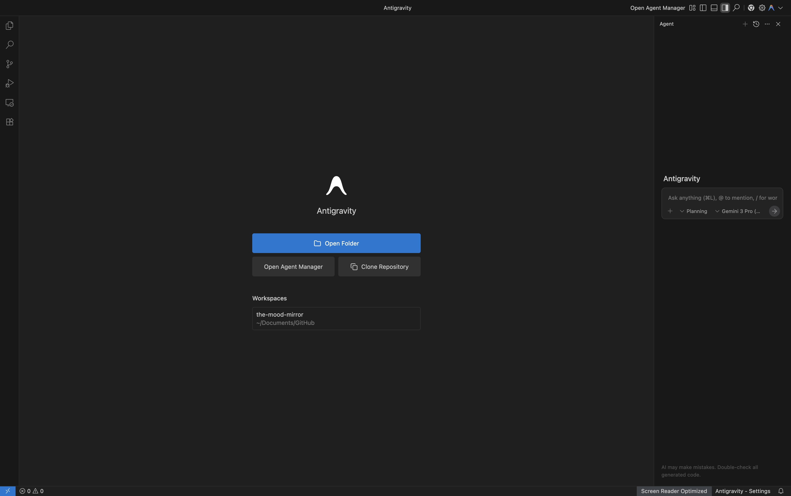
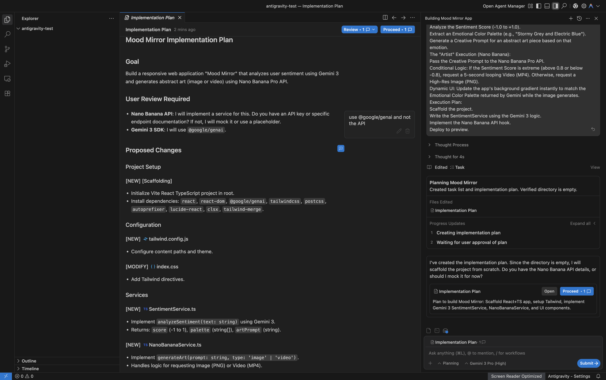

---
{
title: "The Mood Mirror App - My Antigravity first experience",
published: "2025-12-04T06:03:00Z",
edited: "2025-12-04T06:03:00Z",
tags: ["ai", "gemini", "vibecoding", "antigravity"],
description: "Just a week ago, Google launched Antigravity, and why not give it a try and share my experience? And...",
originalLink: "https://blog.delpuppo.net/the-mood-mirror-app",
coverImage: "cover-image.png",
socialImage: "social-image.png"
}
---

Just a week ago, Google launched [Antigravity](https://antigravity.google/), and why not give it a try and share my experience? And here I am for this.

In this article, I'll talk about my first experience with Antigravity and how I built a small web app called **The Mood Mirror**. This app emulates an artist who can convert your mood into abstract images or videos.

Spoiler: this app uses [Gemini 3](https://deepmind.google/models/gemini/), [Nano Banana Pro](https://gemini.google/overview/image-generation/) and [Veo](https://gemini.google/overview/video-generation/), but I'll talk about them in a future article.

## Antigravity Intro

Let's start with a small presentation about Antigravity.

Google Antigravity is an Agentic IDE. It is a fork of VSCode with a dedicated agent section that features models such as Gemini, Claude, and GPT.

This last part is what makes Antigravity different from VSCode or Cursor; this section is built and maintained by Google. Yes, the experiences are common, but how this Agent section is integrated into the IDE is what differentiates it from the others, and this is where all the IDE teams are working to improve their users' DX.

For more info about Google Antigravity, you can check its website [here](https://antigravity.google/).

## "The Mood Mirror" Setup

To test the tool's full power, I decided to build the application almost entirely in "Vibe Coding". To that end, I began by setting up the project and wrote a prompt outlining my intention and what I hoped to achieve.

In this picture, you can see what Antigravity looks like, and as you can imagine, in the chat, you can prompt our intention.

For my application, I entered this prompt.

**Role:** You are a Senior Software Engineer Agent.

**Project:** Build a responsive web application called **"Mood Mirror"**.

**Stack:** React, Tailwind CSS, and the Gemini 3 SDK.

**Core Functionality:**

1. **Input:** Create a clean, minimalist text area where the user enters how they feel (e.g., "I am anxious about my deadline").

2. **The "Director" Logic (Gemini 3):** When the user submits, send the text to Gemini 3.

- Analyse the **Sentiment Score** (0 to +1.0).

- Extract an **Emotional Colour Palette** (e.g., "Stormy Grey and Electric Blue").

- Generate a **Creative Prompt** for an abstract art piece based on that emotion.

3. **The "Artist" Execution (Nano Banana):**

- Pass the *Creative Prompt* to the Nano Banana Pro API.

- **Conditional Logic:** If the Sentiment Score is extreme (above 0.8 or below -0.8), request a **5-second looping Video (MP4)**. Otherwise, request a **High-Res Image (PNG)**.

4. **Dynamic UI:** Update the app's background gradient instantly to match the *Emotional Colour Palette* returned by Gemini while the image generates.

**Execution Plan:**

- Scaffold the project.

- Write the SentimentService using the Gemini 3 logic.

- Implement the Nano Banana API hook.

- Deploy to preview.

The result of this prompt was a plan of action for Antigravity to implement my request. I got this result because I selected "planning" in the bottom-left drop-down. If you decide to go with the fast option, Antigravity doesn't show the plan and immediately develops it.

Btw, I chose the planning options so that I can check and comment on this plan directly in the IDE.

In the image above, you can see an example of the plan I received. As you can see, you can either accept it or review it, and then ask Antigravity to check your comments and review the plan.

The prompt and its plan are the result of this [commit](https://github.com/Puppo/the-mood-mirror/commit/e5a2784b77c93014a9cb36ecd70c94a2ef8e4a13).

**What went wrong? 😑**

The setup has gone smoothly and pretty well, but I ran into an issue: Antigravity generated a JavaScript application rather than a TypeScript one. Not a big deal. Later, I asked it to review the project in JavaScript and TypeScript, and it converted it without any issues. [Here](https://github.com/Puppo/the-mood-mirror/commit/66ba677e104cca6c1c09de4d339e1e6e9cae4c77) you can see the result.\
And lastly, it generated two files, one for the Sentiment discovery and the other for the image generation, but it created a sort of mock service without.\
I didn’t iterate again to fix them, but I’ve worked on them later.

## Commit linting into the project

The second test I did was about setting up a development tool to verify the commit messages. I like to use commitlint and conventional commits for my project, so my second test was adding the setup for these tools.\
I opened a new chat, and I entered this prompt.

*I want to add commitlint and conventional-commit to this project. Can you set it up?*

I was concerned that the prompt wasn’t particular, but I did it to see what Antigravity produces and how good the results are.

I ran that prompt in “fast” mode, and the first result was pretty good. It installs and sets up `@commitlint/cli` and `@commitlint/config-conventional` and after that, it added `husky` to validate the commit message in the pre-commit hook. I’m not a `husky` fan, I prefer `lefthook`. So after this first iteration, I asked Antigravity to replace `husky` with `lefthook`. The result I got worked, but it wasn’t the best solution ever. I decided not to reiterate this time, to leave it in the repo and also show what an Agentic IDE can generate when we don’t check its results and trust it too much.

In this second iteration, Antigravity added lefthook without any problem, but it didn’t remove all the `husky` references. In fact, if you check the [commit](https://github.com/Puppo/the-mood-mirror/commit/1ca9fed538fa1ee15f3e8dd07ac149e01ee68bf3), you can see the `_husky` folder with two files, with no sense script for this repo, and in the `package.json`, it forgot to remove the `prepare` script.

As you can see, our code review when using these tools is crucial to avoid trash or unnecessary code.

## The Gemini 3.0 integration

The next test was the Gemini integration to build the Sentiment analysis service.\
As I did in the previous tests, I started from a new chat.\
The prompt in this case was a bit more articulated. I asked to generate a service that accepts a text and, through Gemini, returns a structured result with these fields:

- *moodScore*: a value between 0 and 1 to determine the mood score

- *promptType*: This is the value that determines if the mirror will show an image or a video

- *promptText*: This is the text to pass later to generate the video or the image

This result must later be used to generate an image or a video using NanoBanana Pro or Veo 3.

This iteration has been a bit convoluted. The first version used the old npm package `@google/generative-ai` and not the new one `@google/genai`. So I kept reiterating to get the code updated to the new version of the SDK. Another issue I had was that Antigravity created a single file to handle both images and videos. So, for that, I reiterated the need to split the logic for image and video generation into two separate files, and I also fixed the video generation to use the video model instead of the image model.

After that, I got a working application that met my first requirements, and you can see a demo in the video below. *\[and* [*here*](https://github.com/Puppo/the-mood-mirror/commit/9dc0d5f74ee505ecf3f04f7baa53248eeea0e331#diff-053150b640a7ce75eff69d1a22cae7f0f94ad64ce9a855db544dda0929316519) *you can check the commit]*

<iframe src="https://www.youtube.com/watch?v=098qvXvpVZQ"></iframe>

## Conclusion

It’s time to wrap up this first experience with Antigravity.

Overall, the experience with the tool was good. This is its first version, and only a few weeks after its release, Antigravity showed great DX and a good understanding of what I want to achieve.

Yes, it is not perfect, and in some cases, the plan described at the beginning hasn’t been satisfied. But this also happens with IDEs that have been in place for months.

As with the other Agentic IDEs, including Antigravity, developer checks are key to boosting implementation velocity while maintaining codebase quality.

The planning mode is fantastic in my opinion, because taking a look at the plan and reviewing or confirming it before starting the implementation can reduce the time wasted on reiterating the Agent result; as we saw, it’s still not perfect yet, but I’m pretty sure it will be tuned and improved in the future.

If I had to rate this first experience, I'd give it **7/10** because the flow was excellent, but I expected more precise results.

Okay, that’s all. I hope you enjoyed this article. Let me know in the comments your experience with Antigravity or other Agentic IDEs.

Bye Bye 👋
