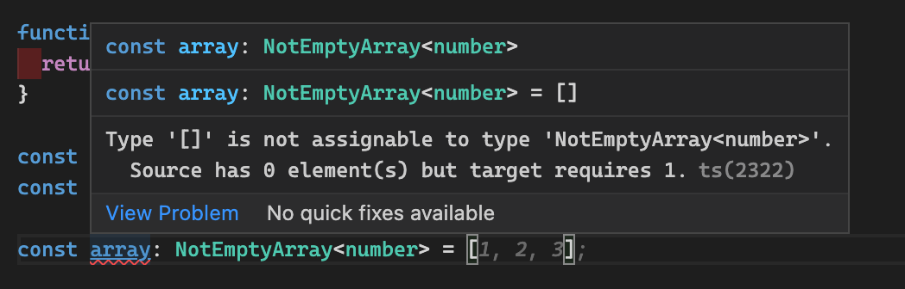

---
{
title: "Typescript - (ReadOnly)NotEmptyArray",
published: "2022-02-14T06:40:37Z",
tags: ["typescript", "javascript", "webdev", "help"],
description: "Arrays are already well described in typescript, but sometimes we need to be more strict with our...",
originalLink: "https://dev.to/this-is-learning/typescript-readonlynotemptyarray-2id7",
coverImg: "cover-image.png",
socialImg: "social-image.png"
}
---

Arrays are already well described in typescript, but sometimes we need to be more strict with our types. For instance, we need to have a not empty array.
This type doesn't exist in the typescript definitions, but we can create it in this way.

```ts
type NotEmptyArray<T> = [T, ...T[]];
```

This type inherits all the characteristics of the array type and it adds another rule to it. This array must have at least one item.
It can be used thus

```ts
const array: NotEmptyArray<number> = [1];
```

If you try to use it without any elements, typescript gives you an error, and it says us that a NotEmptyArray must have at least one element.



But this type could create some problems. If you use the arrays' methods that remove elements, you could have errors, because the arrays could become empty. To avoid this issue, we can work with read-only arrays that can be defined thus.

```ts
type ReadOnlyNotEmptyArray<T> = Readonly<NotEmptyArray<T>>;
```

This type prevents all the arrays' mutations so we can work with arrays with confidence.

The last point that I want to let you is how to convert an Array to a NotEmptyArray. To do that we need to create a [type guard](https://dev.to/this-is-learning/typescript-tips-tricks-type-guard-50e5) function. This function can be done in this way.

```ts
function isNotEmptyArray<T>(as: T[]): as is NotEmptyArray<T> {
  return as.length > 0;
}
```

Therefore you can check if an array has at least an element and if it respects this rule it's a NotEmptyArray.

*I created a [GitHub Gist](https://gist.github.com/Puppo/bc5287d32dbfeeba9f14862654cece9d) with this code if you need it.*

<iframe src="https://gist.github.com/Puppo/bc5287d32dbfeeba9f14862654cece9d"></iframe>

That's all, I hope it can be helpful in your daily work.

Bye Bye Guys 👋
