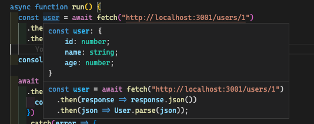
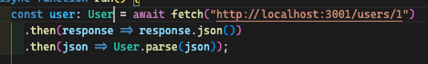
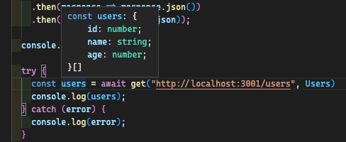

---
{
title: "Validate your data with Zod",
published: "2022-10-31T10:00:44Z",
edited: "2023-01-26T11:42:48Z",
tags: [],
description: "Preface   Many developers don't know very well which is the line between Javascript and...",
originalLink: "https://blog.delpuppo.net/validate-your-data-with-zod",
coverImg: "cover-image.png",
socialImg: "social-image.png"
}
---

## Preface

Many developers don't know very well which is the line between Javascript and Typescript. Probably, many of them waste much time understanding that if they write an interface like that:

```ts
interface User {
  id: number;
  username: string;
  age: number;
}
```

Typescript doesn't guarantee that the `age` field is really a number. And probably if they have an API that returns a list of users and they have to calculate the average ages of these users, the result will not appear as expected, if the API returns the age as `string`. This is because Typescript disappears after the build process and the type system goes away. This is one of the biggest problems that I face every day in the project where I work, especially in the frontend applications, many developers don't have the perception of this matter. Let me explain better it. First of all, I love Typescript and I work with it every day, but I also know what are its limitations. So, guaranteeing the type system at runtime is not its job, and we have to find a solution, but which is the solution? The solution is Javascript! Javascript doesn't disappear at runtime, and fortunately, it exists also at build time, therefore Javascript is our Volta key for our solution.

Lets start from here: what are the most vulnerable layers in our applications when Typescript disappears? The most vulnerable layers are those that receive data from outside of the application, the ports of our applications in a nutshell. These layers must protect our application from mistakes, and they are our safety to validate and check if the data received are exactly like we aspected. To do that we have to introduce something that converts our typescript definitions to functions that can validate our data so that we are sure that the data format is what we expect.

This check can be done with different libraries like: [io-ts](https://github.com/gcanti/io-ts), [typebox](https://github.com/sinclairzx81/typebox), or [zod](https://www.npmjs.com/package/zod). These libraries allow you to create objects that represent your typescript definitions. Then, these objects can be used at runtime to validate the received data, in addition, you can also convert this object to a Typescript definition to have all the benefits of using typescript. These objects can be called `schema validations` because they are responsible for the data validation.

But stop wasting time and let's go deep into how [zod](https://www.npmjs.com/package/zod) works.

## Zod

To use Zod, you simply have to install it using npm, yarn, pnpm. After that you have to create your first Zod type, as an example, we'll use the same type seen before, so, the User type can look like that:

```ts
import { z } from "zod";

export const User = z.object({
  id: z.number(),
  name: z.string(),
  age: z.number(),
});
```

As you can notice, we have to import Zod, and using it we can create our `validation schema`. This new object contains the rules to validate our data at runtime. But the Zod's magic doesn't stop here. With Zod, we can also extract the relative typescript definition in this way

```ts
export type User = z.infer<typeof User>;
```

Now let's go ahead and let's see how we can use this object to validate our data. We have an API that returns a user at the endpoint `/users/1` and the response can be

```ts
{
  "id": 1,
  "name": "Chance",
  "age": 80
}
```

In this case, we can use the `fetch` API to call our endpoint and the result could be something like that

```ts
const user = await fetch("http://localhost:3001/users/1")
    .then(response => response.json())
    .then(json => User.parse(json));
```

if you look at this code probably you won't notice anything strange but if you take a look at this screen



you can see how typescript is able to detect the user's type, and this is possible thanks to Zod. And to leave you another proof, if I add the type to the user variable, typescript doesn't give errors because the type is the same.



Zod exposes to us two different ways to validate our objects:

- parse, parseAsync
- safeParse, safeParseAsync The firsts are [assert function](https://blog.delpuppo.net/typescript-tips-tricks-assert-function), therefore if the validation fails the method throws an exception. Instead, the seconds return a [type guard](https://blog.delpuppo.net/typescript-tips-tricks-type-guard) composed like this

```ts
type SafeParseReturnType<Input, Output> = {
  success: true;
  data: Output;
} | {
  success: false;
  error: ZodError<Input>;
}
```

In this case, we have to check the `success` field to understand if the validation is successful or failed. And if the result is positive we have a property `data` that contains the object with the right type, otherwise, we have a property called error that contains an object with all the validation errors.

At this point, let's go a little bit deepen. Now we can create a little HTTP module that helps us to be confident of the result get by the API. To do that, we can wrap the fetch API, and using the power of the generic type we can create a method like that:

```ts
import { z, ZodType } from "zod";

export function get<Schema extends ZodType>(
  url: string,
  schema: Schema
): Promise<z.infer<Schema>> {
  return fetch(url)
    .then(response => response.json())
    .then(json => schema.parse(json));
}
```

and it can be used like this



As you can see, now using the get method we can do an HTTP get and check if the result is as expected. This is very important in our applications because by doing that we protect our application from strange mistakes and we are confident that our codebase after this layer receives the data exactly as we expected at build time. It goes without saying that if there is a bug after this layer, this is a problem of our code base and not a bug due to incongruous data.

Now using this pattern we can keep alive our typescript definitions at runtime too and we can prevent mistakes relative to incongruous data. Using this pattern moreover, we can consider all the assumptions done during the development mode correct at runtime too, where typescript disappears.

I know this layer can be considered too much sometimes, but I think every important application must have it. I want to leave you with this simple consideration, a time ago, a backend developer said to me: "Don't trust the Frontend" but now, as a Frontend developer I say to you "Don't trust the Backend either".

*The code of that article can be found [here](https://github.com/Puppo/zod-getting-started)*
