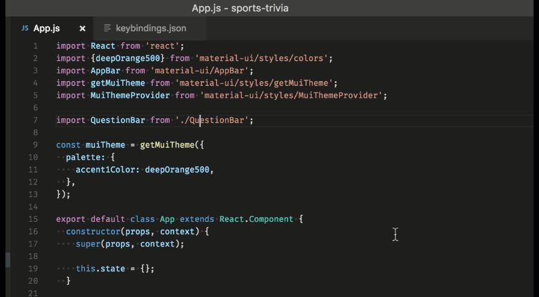
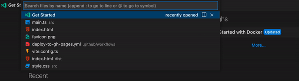

---
{
title: "Visual Studio Code - Tips & Tricks - Command Palette and its friends",
published: "2022-02-21T06:27:16Z",
tags: ["vscode", "productivity", "programming", "webdev"],
description: "Visual Studio Code is one of the best code editors in this moment. Its Palette has many features but...",
originalLink: "https://https://dev.to/playfulprogramming/visual-studio-code-tips-tricks-command-palette-and-its-friends-2bhi",
coverImg: "cover-image.png",
socialImg: "social-image.png",
collection: "VsCode - Tips & Tricks",
order: 1
}
---

Visual Studio Code is one of the best code editors in this moment.
Its Palette has many features but probably not all devs know them.
Let’s look at the most important, to improve your productivity and use less the mouse.

## Command Palette

The Command Palette is the bar that shows up when you use the short-cut `⇧+⌘+P` (on window `Ctrl+Shift+P`).

This Palette enables you to run commands. Which commands? That depends. VsCode already has many commands out-off the box, like: save file, format file, git commands and many others. But Vscode doesn't end its power here. It allows you to create new ones, and see them in this list of possibile commands. More extensions use this feature to expose their commands and enable their features.
The commands typically are grouped by topic, for instance, all the commands that work with the terminal have the prefix Terminal, those that work with git have the prefix Git and so on. This "rule" is a common best practice to improve the search of the commands.

It's important to remember that this Palette is working with the command if its first character is `>`. This char indicates you that the palette is in command mode.

It goes without saying that for some commands this flow can be a bit boring, but don't worry, the VsCode team took care about that too, they allow us to create short-cuts that run your commands. But we'll see that in another post.

## Search Files and Symbols

If you use the short-cut `⌘+P` (on window `Ctrl+P`) the Palette that appears has a different goal. In this case, it's ready to work with the files, or better, it's ready to search your files or to search inside of them.

By default when this palette appears it is ready to work with the current opened file, but you can also work with other files.
Let's start with the commands to work in the current file.

- Go to Line and Column
  Using the character `:` VsCode is ready to go to a line of the file, for example if you type :39 and you press ENTER, VsCode puts the cursor and focuses at the begin of the line 39.
  If you know the column of the line, you can indicate it too by adding another `:` and VsCode sets the focus to the column in the chosen line. For instance `:39:3` corresponds to the line 39 at the column 3.

- Search Symbols
  Using the character `@` VsCode is ready to search methods, properties, classes, interfaces inside of the current file.
  As you can see, when you type the character `@` VsCode tries to help you and it suggests you all the symbols in the file.
  That helps you to search the symbols and prevent infinitive searches using the scroll.

Now let's move on and see how to search files.

- Search Files
  The easy pease way to search a file in VsCode is using the short-cut `⌘+P` (on window `Ctrl+P`), type its name and press `ENTER` when you find it. This search works on the entire project.

But sometimes it can be necessary to search only inside of a folder.
To make this, you need to start the search with the name of the folder flow by the char `/` and after that the name of the file.

But this method enables the search only in the first level of this folder and excludes all the subfolders.
Thus the VsCode team took care about that too and by using the char `*` you can create a power condition to search your files.
This char can be used either lonely or combined with another `*`. If you use the combination, it indicates that you want search both in that folder and in its subfolders. Instead if it is used alone you indicate that the search is only inside of the folder.
Let's look at some examples to better understand this.

1. /src/\*\*/File.ts
   In this case you want to search all the files called `File.ts` inside of the folder `src` and in its subfolders (`***`).

2. /src/\*\*\*/components/Button.ts
   In this case you want to search all the files `Button.ts` inside of the folder `src` that it's placed inside of a subfolder called  `components`.

3. /src/\*\*\**/*.ts
   In this case you want to search all the files with extension `.ts` inside of the folder `src` and in all its subfolder.

As you can see, combining the char `*` in different ways you can create a power search term.

I hope these notions could improve you daily work with VsCode.

That's all Guys.

Bye Bye 👋
