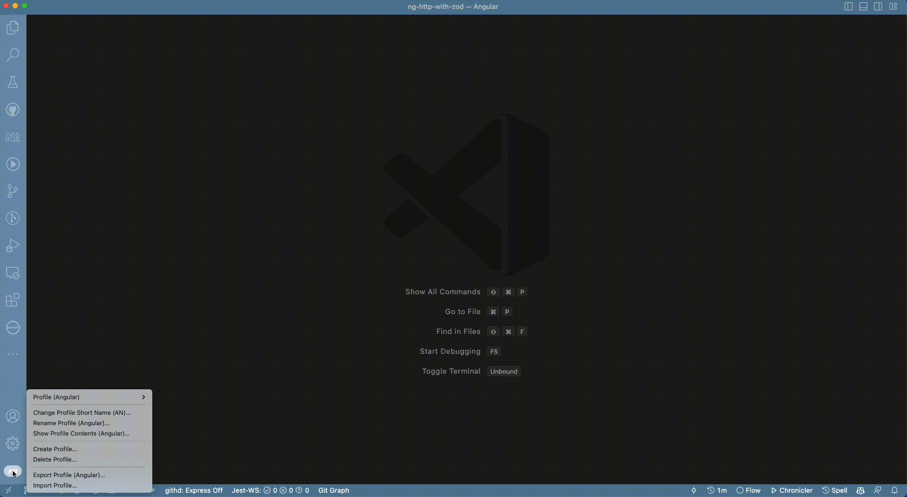
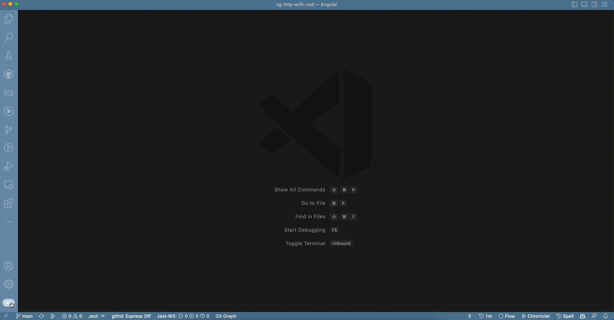

---
{
title: "Visual Studio Code - Tips & Tricks - Profile",
published: "2023-01-10T09:00:42Z",
tags: ["vscode", "code"],
description: "Intro   During my daily work, sometimes I have to switch between different projects: backend...",
originalLink: "https://blog.delpuppo.net/visual-studio-code-tips-tricks-profile",
coverImage: "cover-image.png",
socialImage: "social-image.png",
collection: "16773",
order: 1
}
---

## Intro

During my daily work, sometimes I have to switch between different projects: backend frontend, nodejs, react, angular etc. etc.

I used to think that configuring VsCode in the best way for each project was impossible. In addition, Im a bit drug of extensions in my VsCode, which often causes performance decreases because some unused extensions (not required for the current project) use a lot of RAM or CPU. To go around this problem, typically, I used to disable these extensions but with the cons that I have to reenable them when I need to work with them. It was a bit frustrating, but some days ago, I came across a fantastic feature of VsCode. This feature is called Profile. Currently, the feature is present only in the [Insider](https://code.visualstudio.com/insiders/), but I hope it will become available to all early.

## What is Profile?

Profile allows you to create different setups in base on your needs. Using a profile, you can have different setups based on the current language, include or exclude extensions, change shortcuts, etc. etc.

## How can you set up your profile?

To work with profiles, you have to make your focus on the bottom-left of your editor. There is an icon where you can handle your profile. The default profile is called, as you can imagine, Default. If you have never heard about Profile before now, it goes without saying that you have the Default profile selected. But now, its time to learn how it works.

Its not rocket science, but its very helpful, in my opinion.

### Create a new Profile

You must click the Profile section and select Create New Profile to create a new one. Now you can choose between two options: an empty configuration or starting from another profile. Now the decision is in your hands. Add, remove, and change your configuration as you want in base on your needs. For instance, I created different setups based on the context: AWS, Azure, Node, Angular, and React. You can find your best solution to improve your productivity.

### Delete Profile

Delete profile is easy peasy; click on the Profile section and select "Delete Profile", then you have to choose the Profile that you want to delete (one or many) and click the Ok button. Now the game is done, the profile will be removed.

## Conclusion

In my opinion, this feature is essential. I created my setups, and now VsCode works quickly and without performance problems. I hope it will be the same for you too.\
Creating different Profiles allows me to create my best experience during my daily routine with VsCode and reduce the possibility of wasting time with performance problems created by extension that are useless at that moment.

I hope this content could be helpful for you too. Let me know in the comment if you already know it or if you will be surprised like me when I discovered it.


