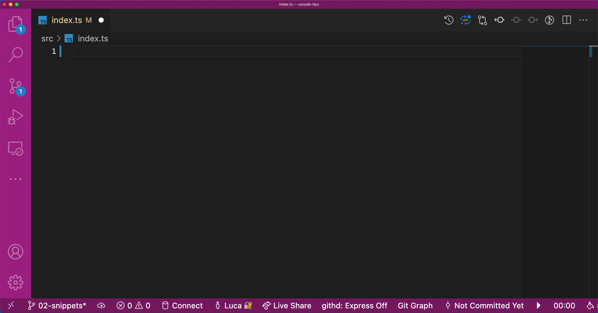
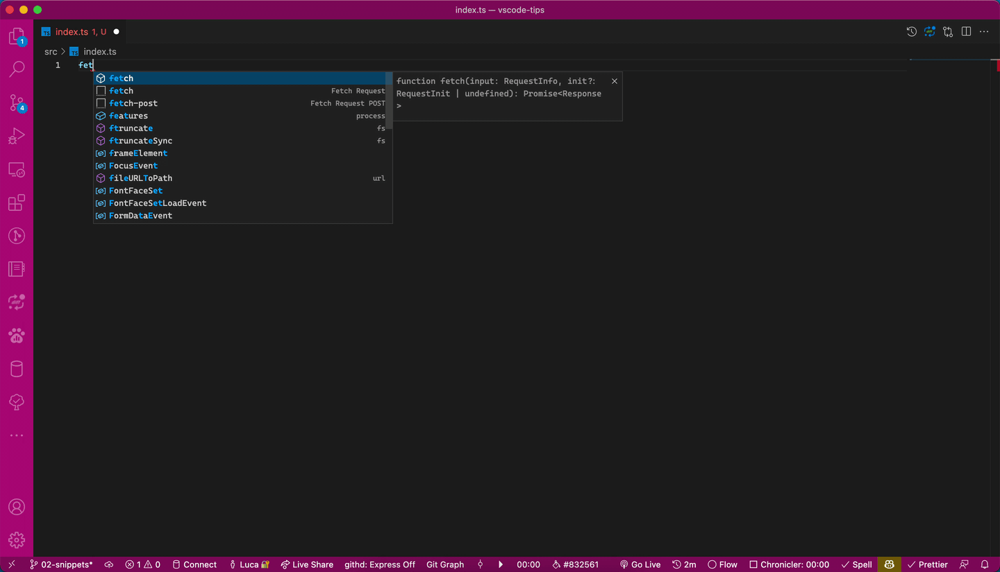
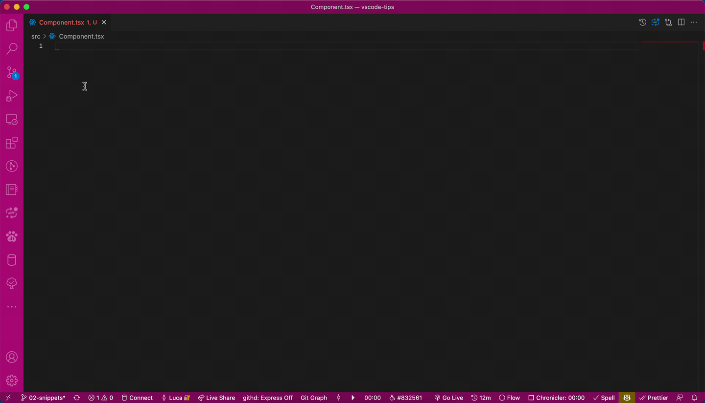

---
{
title: "Visual Studio Code - Tips & Tricks - Snippets",
published: "2022-03-21T07:53:21Z",
tags: ["vscode", "productivity", "programming", "webdev"],
description: "If you used to adopt Visual Studio in the past probably you already know something about...",
originalLink: "https://dev.to/this-is-learning/visual-studio-code-tips-tricks-snippets-5041",
coverImage: "cover-image.png",
socialImage: "social-image.png",
collection: "VsCode - Tips & Tricks",
order: 2
}
---

If you used to adopt Visual Studio in the past probably you already know something about Snippets.
This feature exists out-of-the-box in VsCode too.
If you open a javascript file or a typescript file and you type `log` and after you press TAB you get this result.



In VsCode there are many others snippets already implemented out-of-the-box but the VsCode's team doesn't stop here.
VsCode enables you to create your own snippets, or import them from the extensions. But that's not all, you can create your own snippets available in all your projects, or create snippets for a specific project and accessible by all the team of that project.
After all these words, let's see how the snippets work and how you can create your own snippets.
First of all, to create a new snippet you have to open the [Command Palette](https://dev.to/this-is-learning/visual-studio-code-tips-tricks-command-palette-and-its-friends-2bhi), type "Configure User snippets" and press ENTER. After that VsCode suggests you some options, two of these are:

- New Global snippets file...
- New Snippets file for '`name of your project`'...

Chose your preference and press ENTER again, type the name of your snippet, and press ENTER for the last time. Voila, your first snippet configuration becomes reality.

As you see, you can choose between two types of configuration: Global snippet and Project snippets.
It goes without saying that the first one creates a snippet file accessible only by you, the second one instead is accessible by all the project team if you commit the file in the repository.
Based on the choice, VsCode creates the snippet file in two different folders.
The global snippets are saved in this path `Code/User/snippets/{snippet-name}.code-snippets` and the `Code` folder is different in base of your platform:

- Windows `%APPDATA%\Code\User\`
- macOS `$HOME/Library/Application\ Support/Code/User/`
- Linux `$HOME/.config/Code/User/`

*you can find more about that configuration [here](https://code.visualstudio.com/docs/getstarted/settings#_settings-file-locations)*

Instead, the project snippets are saved inside of the `.vscode` folder in the project's root and the snippet file has this form `{snippet-name}.code-snippets`.

Apart from this difference between the two choices, after the creation stream VsCode create for file for you with this content

```json
{
	// Place your global snippets here. Each snippet is defined under a snippet name and has a scope, prefix, body and 
	// description. Add comma separated ids of the languages where the snippet is applicable in the scope field. If scope 
	// is left empty or omitted, the snippet gets applied to all languages. The prefix is what is 
	// used to trigger the snippet and the body will be expanded and inserted. Possible variables are: 
	// $1, $2 for tab stops, $0 for the final cursor position, and ${1:label}, ${2:another} for placeholders. 
	// Placeholders with the same ids are connected.
	// Example:
	// "Print to console": {
	// 	"scope": "javascript,typescript",
	// 	"prefix": "log",
	// 	"body": [
	// 		"console.log('$1');",
	// 		"$2"
	// 	],
	// 	"description": "Log output to console"
	// }
}
```

This is an example of a snippet, particularly this example is the log snippet seen at the beginning of this article.

But let's go ahead and create a snippet to generate a fetch request.

```json
{
  "Fetch Request": {
    "scope": "javascript,typescript",
    "prefix": "fetch",
    "body": [
      "fetch(\"$1\")",
      "	.then(response => response.json())",
      "	.then(data => $2)",
      "	.catch(error => console.error(error));"
    ],
    "description": "Fetch request"
  }
}
```

First of all let's see this snippet at work



As you can tell, typing `fetch` and pressing ENTER or TAB, VsCode inserts the code of the snippet in the file. But let's take a look at how the snippet file is composed.
First and foremost, the snippet file is a JSON file.
The first thing to do is to give a name of the snippet, in this case, `Fetch Request` and this is the property that identifies the snippet inside of this file. By here, you have to describe your snippet.
The first property described is the `scope`, this property identifies the language relative to this snippet, in this case, the snippet is written for javascript and typescript (if you don't indicate this property your snippet appears in all the files).
The `prefix` property identifies the word to type to find the snippet in the VsCode's IntelliSense, `fetch` for this example.
The description property is used to describe the reason why of the snippet.
The body property instead is the code generated by the snippet. As you can see, this property is an array, where every item is a row of the generated code. There are two "strange" symbols used inside of the body: $1 and $2. This particular syntax helps VsCode to understand that in this snippet the user has to indicate 2 things, the fetch's URL and the function to manipulate the fetch result. *To jump between the parameters during the filling in the editor you have to use the TAB.*
As you can tell, it's not so difficult to create your snippets, but let's see another case to example other possibilities exposed by VsCode.
In this example, the snippet creates a React Function component with the FC type and Props.

```json
{
  "React Functional Component with Props": {
    "scope": "typescriptreact",
    "prefix": "rfcpt",
    "body": [
      "import { FC } from 'react'",
      "",
      "type ${1:$TM_FILENAME_BASE}Props = {",
      "  $2",
      "}",
      "",
      "const ${1:$TM_FILENAME_BASE}: FC<${1:$TM_FILENAME_BASE}Props> = (props) => {",
      "  return <>$3</>",
      "}",
      "",
      "export default ${1:$TM_FILENAME_BASE};"
    ],
    "description": "React.FC component with Props in TypeScript"
  }
}
```



In this example, one parameter has a special syntax `${1:$TM_FILENAME_BASE}`, which indicates that the first parameter will be compiled only with the name of the file when the snippet appears but the user can edit it if necessary.
There are many other special variables that you can indicate at VsCode to pre-fill a parameter and you can find all the possibilities [here](https://code.visualstudio.com/docs/editor/userdefinedsnippets#_variables).

*You can indicate multiple snippets inside of a single file. To do that you have to create another section in your file starting from the name and filling this section with the info about another snippet. [Here](https://github.com/Puppo/vscode-tips-and-tricks/blob/02-snippets/.vscode/fetch.code-snippets) an example.*

This feature is widely used in extensions, and you can find many extensions that create for you snippets, for instance: [Angular Snippets](https://marketplace.visualstudio.com/items?itemName=johnpapa.Angular2), [ES7+ React/Redux/React-Native snippets](https://marketplace.visualstudio.com/items?itemName=dsznajder.es7-react-js-snippets)...

Now you know all the notions to create your snippets if it will be necessary. This feature often helps me to generate automatically the structure of some particular repeatable component in the application, for instance, a react component or an angular component or other things like these. I hope this feature can help you too to save time on writing repeatable code.

That's all from the snippets guys!
Bye Bye! 👋

*N.B. you can find the code relatives of this article [here](https://github.com/Puppo/vscode-tips-and-tricks/tree/02-snippets)*
