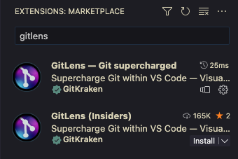
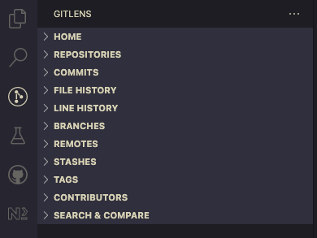
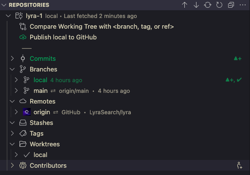
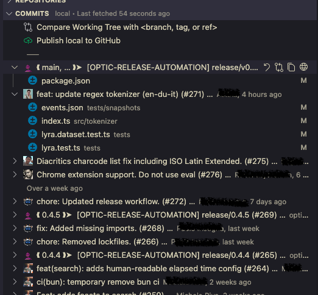
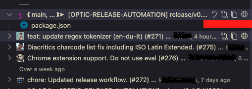
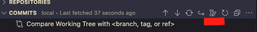
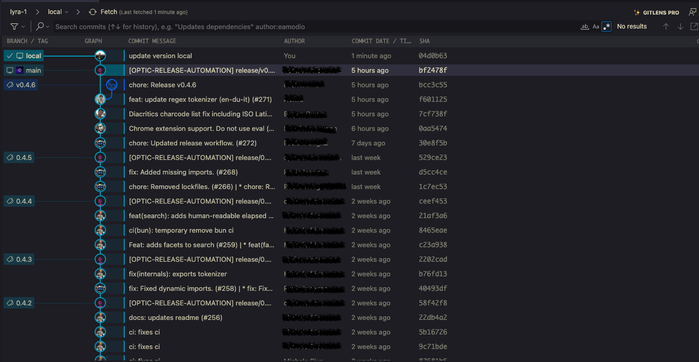
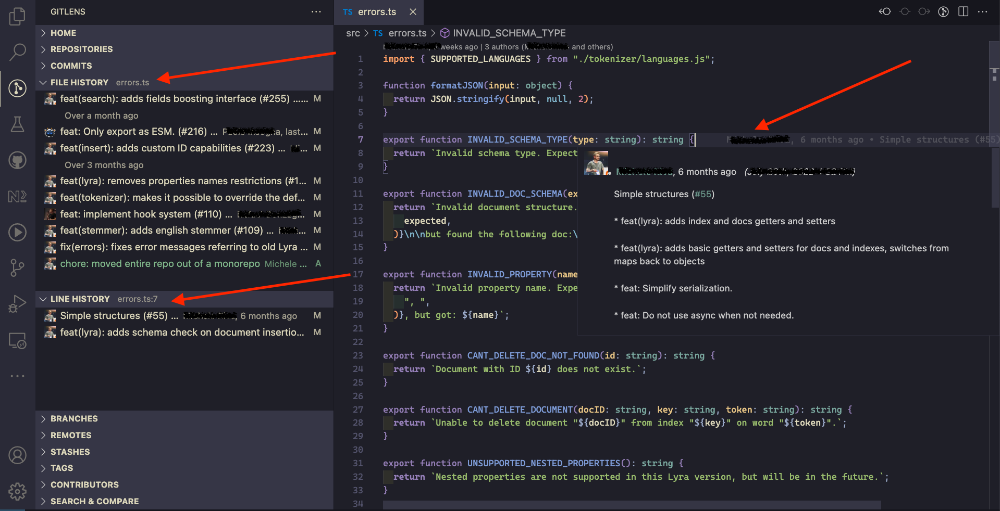
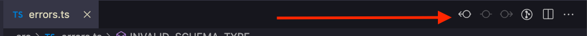
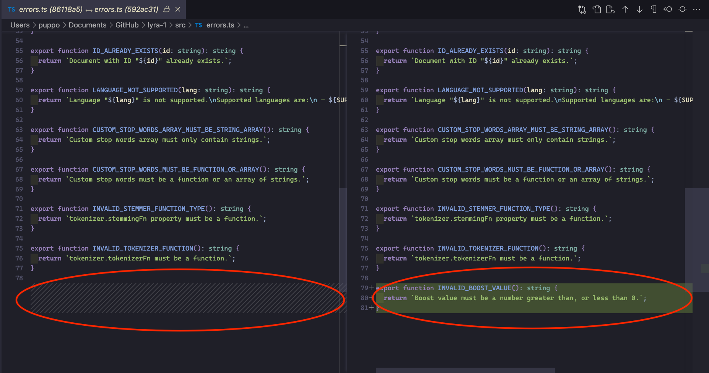

---
{
title: "Why I love GitLens in my VsCode - First Steps",
published: "2023-02-14T07:00:39Z",
edited: "2023-02-28T18:20:51Z",
tags: ["git", "vscode", "gitlens", "gitkraken"],
description: "In my daily routine, I work with git, and I suppose it's the same for you. I know all the standard...",
originalLink: "https://blog.delpuppo.net/why-i-love-gitlens-in-my-vscode-first-steps",
coverImage: "cover-image.png",
socialImage: "social-image.png",
collection: "GitLens",
order: 1
}
---

In my daily routine, I work with git, and I suppose it's the same for you.\
I know all the standard commands to work with it in my terminal, and I love them.\
I think every developer must know git and its commands, and work with it by the command line. If you don't know at least the basic git commands, please go to study them right away. There are many articles or videos about them and don't forget the documentation; that is the best place to learn and study new things.\
When you have the fundaments, if you want to dive into it, this book is for [you](https://git-scm.com/book/it/v2).

Btw, today I want to speak about something different, I love git and I love terminal, but sometimes I love having the info visualised appealingly and get info about the source control quickly. I work with VsCode typically, so some months ago I tried to find a solution for this editor that resolves what was said before. After googling and some testing, the result of my search was: [GitLens](https://gitlens.amod.io/).\
Now, I want to show you how it works and how it can improve your routine.\
So don't waste time and let's jump in it!

## Installation

First of all, to use GitLens you have to install it. This process is a piece of cake if you are familiar with VsCode.

- Open your editor

- Go to the extension tab

- Search "gitlens"

- Install the extension

*N.B. There are two extensions, the official and the insider; you can choose the one you prefer because the insider it's typically stable too. It goes without saying the insider version could have some bugs sometimes.*

## First Impact

After the installation, the extension is ready to use, and you can find it in your sidebar.

Before going on, I want to say you that the extension is free, but not all the features are free. Some cool features are available only in the pro subscription; you can find more [here](https://help.gitkraken.com/gitlens/gitlens-plus/).

As you can notice from the previous image, GitLens has different sections, and each section has its goal. Each title is already comprehensible as you can see, but now we'll deep into some of them and not only.

I'll use the [Lyra](https://github.com/LyraSearch/lyra) repository for this article, so thanks to the [Lyra](https://docs.lyrasearch.io/) contributors if this article has a great git history and awesome code.

## Repository

In this tab, you can find all the info about your repository: branches, commits, tags, contributors and so on. I use this section sparingly because, in other areas, I find these data based on my needs. But here, you can find the best overview of your repository.

## Commits

This section starts to become more interesting. Here there is the commits list of the current branch.

Typically, I don't use this section to see the commit; I have a git alias showing me the terminal's history. But, in this section, there are 4 commands very helpful:

- Undo the commit (please pay attention when you use it)

- Compare the commit with the head

- Copy the SHA

- Open the commit in the browser

The first, the second, and the last one are my favourites because I always forget the undo syntax, comparing the commit in some cases is very helpful using this tool, and opening the commit in the browser is straightforward in this way.\
Another cool feature presented in this section is the commit-graph. This is a pro feature, but it's very powerful to understand the status of the branches. You can find it in the title bar of the Commit section.

The result of this command is this

With this graph understanding the branches' status or filtering or searching in your repository is easy, and you can find your answer quickly.\
This is very helpful for me when I want to check where my current branch is compared to the main branch or others.

## File history and line history

These sections are incredible! If you have a file open in the editor in these two tabs, you can see the history of the file in your repository and the history of the line where your cursor is.\
Another cool integration are the notions present on the right of the current line directly in the file, where you can find the last commit's info of that line of code. So you can blame your colleague 🤪

The last feature that I want to face out in this article is the button that permits to see the changes between the current version of the file and the previous one. This button is in the top right of the file and the result if you click it is like this.

This feature is very cool and allow us to see immediately what has changed in the last commit. In this view, it's possible to continue the history navigation using the same icon at the top right of the button.

So far so good; I suppose that as a first look at GitLens, that's all. In the next article, we'll dive into other cool features in GitLens, but for now, let me know what you think about it. Do you already use it? Which are your impressions in this case?

See you soon folks

Bye bye 👋

*If you are interested in it, use my referral* [*link*](https://www.gitkraken.com/invite/whbhwrJL) *to try GitLens or other GitKraken products for Free!* [*https://www.gitkraken.com/invite/whbhwrJL*](https://www.gitkraken.com/invite/whbhwrJL)

<!-- ::user id="puppo" -->
