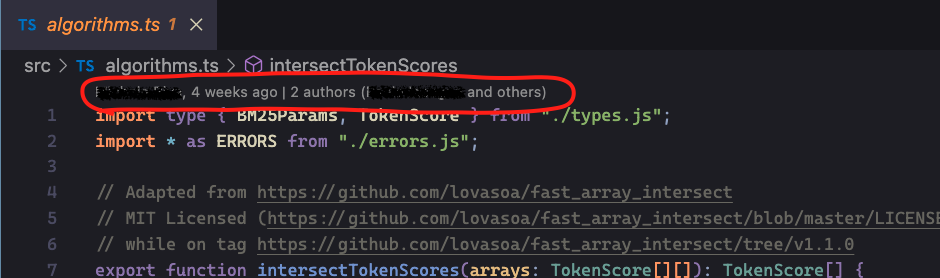
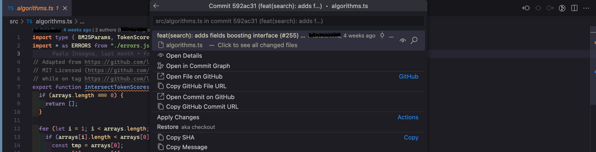
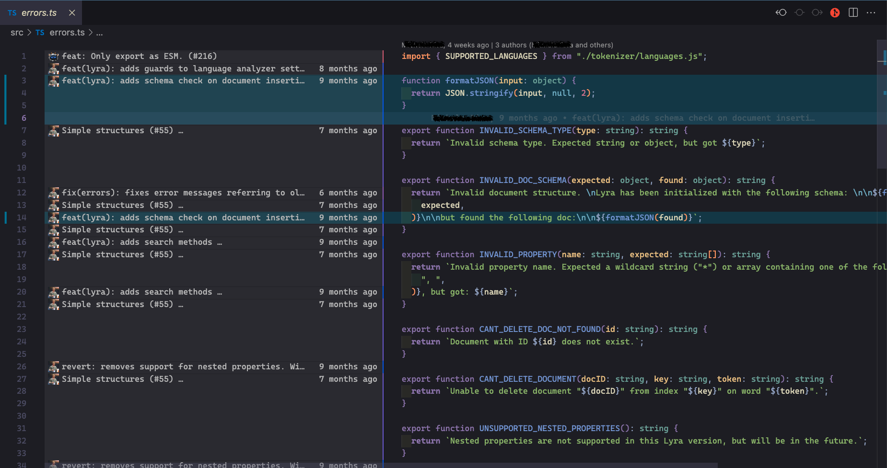
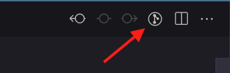
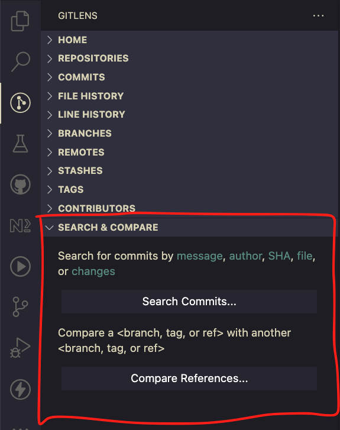
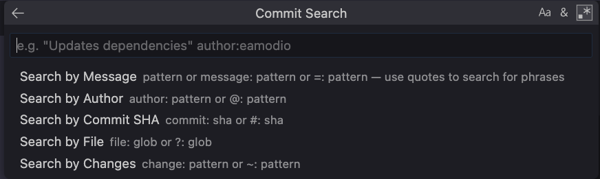
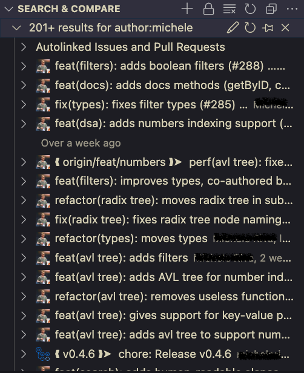

---
{
title: "Why I love GitLens in my VsCode - Blame & Compare",
published: "2023-02-21T07:00:39Z",
edited: "2023-02-28T18:19:45Z",
tags: ["git", "vscode", "gitlens", "gitkraken"],
description: "When you work with git, you want to get info about commits and who changed the codebase...",
originalLink: "https://blog.delpuppo.net/why-i-love-gitlens-in-my-vscode-blame-compare",
coverImg: "cover-image.png",
socialImg: "social-image.png",
collection: "GitLens",
order: 2
}
---

When you work with git, you want to get info about commits and who changed the codebase quickly.

With GitLens, you can get much info about your current file without losing focus on it. First, at the top of your file, you can get info about the last change and the name of the person who pushed that commit. In addition, there is also info on the number of people that touched the file.

This information is clickable. You can click on the part relative to the last commit or the other one.\
The first part opens the VsCode command with some possible actions to see the commit; you can see all the files relative to the commit, open the commit detail, and see the commit in the commit-graph. This is very helpful if you want to get info quickly about the changes in the file.

Instead, If you click on the second part (that is relative to the other authors of the file), GitLens opens a new bar on the left of the file and shows, for each line, the last commit relative to it, so you can understand who and why someone has changed the line.

This view is also available using the icon with the git logo in the top right of the file, and you can toggle this view by clicking it easily.

All these features are fantastic, but sometimes we need more, for instance, searching for a commit or comparing two different commits.\
To do that, in the GitLens bar, you can find an option called "Search & Compare".

Let's start with the search feature. Using this feature, you can search for a commit by different filters: commit message, author, SHA, file or changes. Typically, in my case, I use this feature to find an old commit by message or by author. The feature is very straightforward. If you click the button, the extension opens a command with different options; you can select your choice and type your terms. After that, in the GitLens panel will appear the results of the search.

With this view, you can check the commits and see the files changed in those commits.

After the search could be necessary to compare two commits, you can use the other button called "Compare references" to do that.\
Also, this feature is easy to use. Clicking the button "Compare References" appears a new VsCode command, where you can type the reference of your branches/tags or commits. Obviously, you have to indicate two references for the comparison.

For me, this is really convenient when I have to compare two different versions of the code in the past or to check when and why a piece of code has changed.

Ok, that's all folk.\
I hope you have other tips for improving your productivity with git using GitLens.

Let me know if you think these features could be helpful to you too or if you already use them in your daily work.

See you soon folks

Bye bye 👋

*If you are interested in it, use my referral* [***link***](https://www.gitkraken.com/invite/whbhwrJL) *to try GitLens or other GitKraken products for Free!* [***gitkraken.com/invite/whbhwrJL***](http://gitkraken.com/invite/whbhwrJL)

<!-- ::user id="puppo" -->
