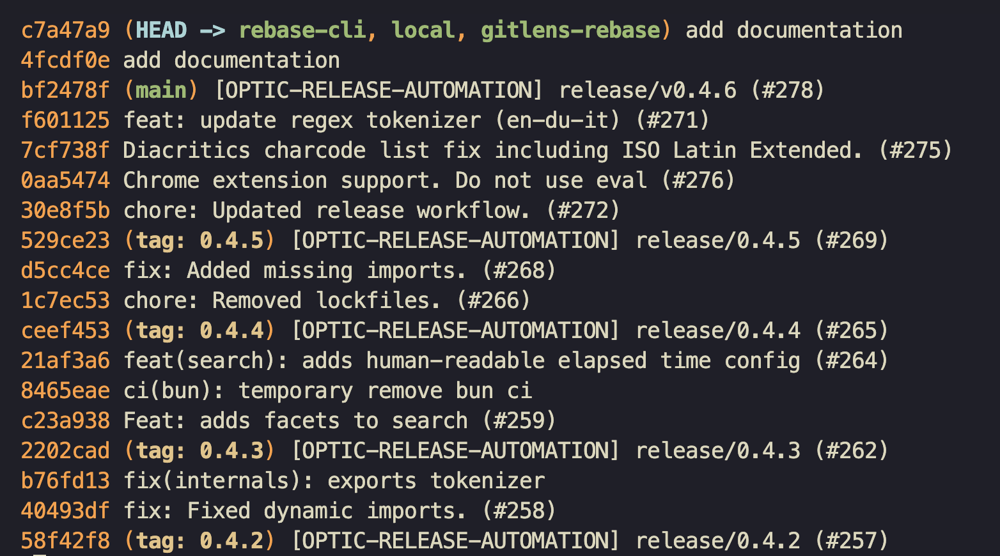
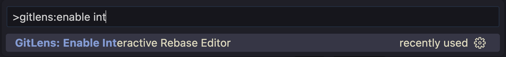
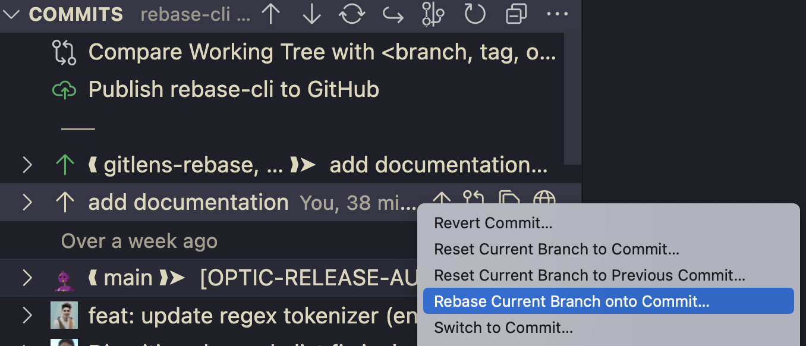
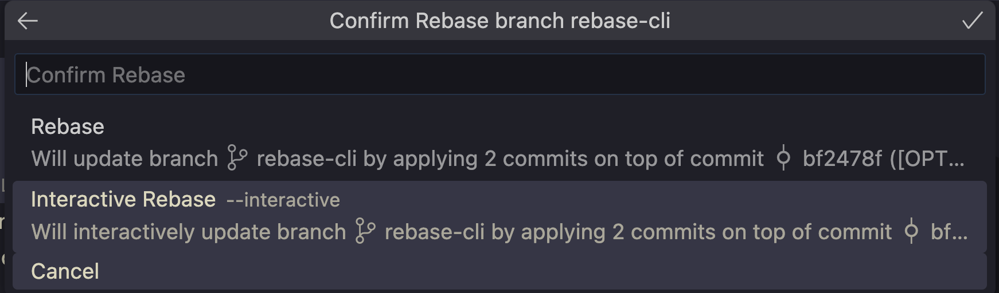
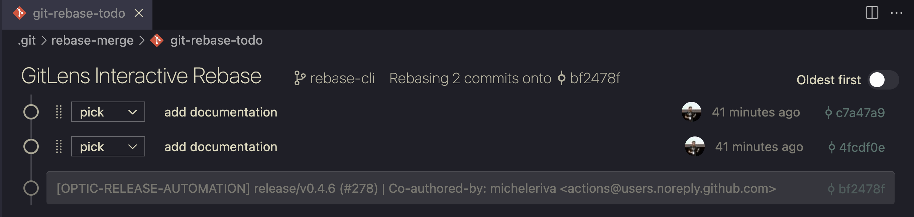
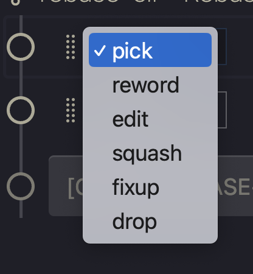
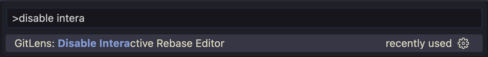

---
{
title: "Why I love GitLens in my VsCode - Interactive Rebase",
published: "2023-02-28T07:00:39Z",
edited: "2023-03-15T05:46:25Z",
tags: ["git", "vscode", "gitlens", "gitkraken"],
description: "One of the processes I typically do in my daily work is interactive rebase. I commit a lot, and then...",
originalLink: "https://blog.delpuppo.net/why-i-love-gitlens-in-my-vscode-interactive-rebase",
coverImage: "cover-image.png",
socialImage: "social-image.png",
collection: "GitLens",
order: 3
}
---

One of the processes I typically do in my daily work is interactive rebase.\
I commit a lot, and then before pushing the result, I try to make the history more readable.

If you have to do that by CLI, you should follow many steps:

```bash
> git log --oneline
```

This command returns the list of the commit



Now, you have to get the SHA of the commit from where you want to start the interactive rebase and run the command

```bash
> git rebase -i bf2478f
```

Now you can handle your rebase from your best editor, in my case VsCode.

```bash
pick 4fcdf0e add documentation
pick c7a47a9 add documentation

# Rebase bf2478f..c7a47a9 onto bf2478f (2 commands)
#
# Commands:
# p, pick <commit> = use commit
# r, reword <commit> = use commit, but edit the commit message
# e, edit <commit> = use commit, but stop for amending
# s, squash <commit> = use commit, but meld into previous commit
# f, fixup [-C | -c] <commit> = like "squash" but keep only the previous
# commit's log message, unless -C is used, in which case
# keep only this commit's message; -c is same as -C but
# opens the editor
# x, exec <command> = run command (the rest of the line) using shell
# b, break = stop here (continue rebase later with 'git rebase --continue')
# d, drop <commit> = remove commit
# l, label <label> = label current HEAD with a name
# t, reset <label> = reset HEAD to a label
# m, merge [-C <commit> | -c <commit>] <label> [# <oneline>]
# create a merge commit using the original merge commit's
# message (or the oneline, if no original merge commit was
# specified); use -c <commit> to reword the commit message
# u, update-ref <ref> = track a placeholder for the <ref> to be updated
# to this position in the new commits. The <ref> is
# updated at the end of the rebase
#
# These lines can be re-ordered; they are executed from top to bottom.
#
# If you remove a line here THAT COMMIT WILL BE LOST.
#
# However, if you remove everything, the rebase will be aborted.
#
```

When you've finished fixing the history, you can save the file, close it and voila, your interactive rebase is completed.

First, you must know this flow before moving to the next solution.\
The goal of this series is not to forget or don't learn git, but to help you understand how you can improve your developer experience with git using GitLens.

So now it's time to see how the interactive rebase becomes easier with GitLens.\
First, you have to enable the feature from the command palette in this way.



Now you can use it from the commit history. Right-click on the interested commit and choose "Rebase Current Branch onto Commit".



Then you have to choose between two types of rebase, the normal and the interactive. It goes without saying that you have to choose the interactive rebase.



The view that appears is something like this



Here you can handle the rebase using drag and drop if you want to move the commit, or you can change the action for the commit using a simple dropdown.



When you're done, you can click the button in the bottom right, "Start Rebase", so the rebase will be completed.

If you change your mind during the rebase, you can abort the operation or close the file or click the "Abort" button.

But the magic doesn't end here. When you enable the Interactive Rebase, if you have set up VsCode as the default editor for git, when you run the `git rebase -i ....` command from the terminal, by default, VsCode opens the rebase page with the GitLens view.

Before closing, if you don't like this feature, you can disable it from the VsCode's command palette in this way.



Ok, that's all! I hope now your rebase will be easier and you will have a better developer experience during this operation.

See you soon folks

👋 Bye Bye 👋

*If you are interested in it, use my referral* [***link***](https://www.gitkraken.com/invite/whbhwrJL) *to try GitLens or other GitKraken products for Free!* [***gitkraken.com/invite/whbhwrJL***](http://gitkraken.com/invite/whbhwrJL)


