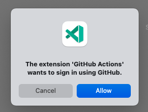
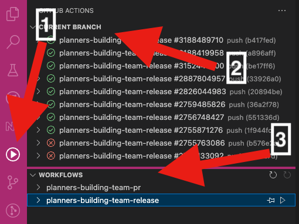
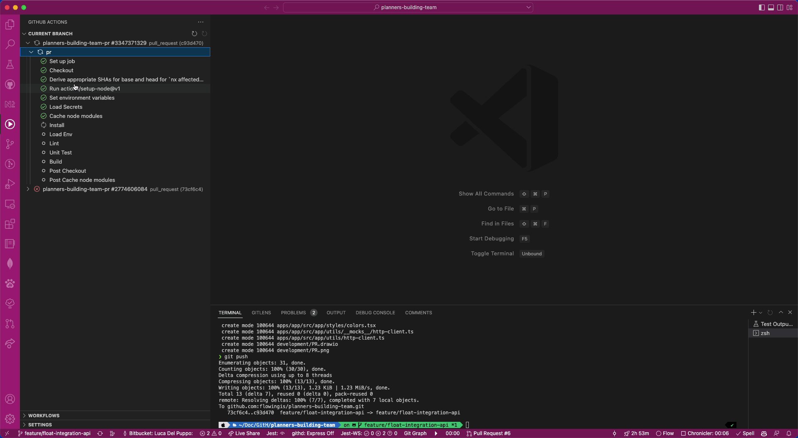
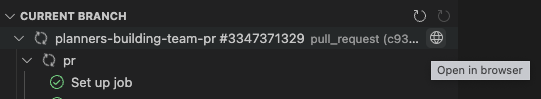

---
{
title: "Working with GitHub Actions from your best editor",
published: "2022-11-08T09:00:42Z",
edited: "2022-11-08T10:20:03Z",
tags: ["github", "code", "actions"],
description: "Hi folks, today I'm going to speak about another cool VsCode Extension.  In many projects, I love...",
originalLink: "https://blog.delpuppo.net/working-with-github-actions-from-your-best-editor",
coverImg: "cover-image.png",
socialImg: "social-image.png",
collection: "VsCode - Tips & Tricks",
order: 4
}
---

Hi folks,\
today I'm going to speak about another cool VsCode Extension.

In many projects, I love using [GitHub Actions](https://github.com/features/actions) as CI/CD tool, but switching between VsCode and the GitHub website is very boring and frustrating. So, one day I decided to google if there was a way to follow my actions directly in my best Editor, and some minutes later I found this fantastic extension: [GitHub Actions](https://marketplace.visualstudio.com/items?itemName=cschleiden.vscode-github-actions). This extension and that seen in the previous article have changed my way of working, and now I'm almost free from the browser during my coding phase. I say almost because sometimes I have to check my email or scroll the Twitter wall to stay updated and get the last news 🙂 But let's see together what this extension is able to do 🚀

## Installation

As with any other extensions, the installation is a piece of cake, you have to open the extensions tab and in the search box you can type `GitHub Actions`. There are many extensions with this name but you have to choose the extension created by `Christopher Schleiden`, after that, press the install button and wait until the process is ended.

## Getting started

After the installation, the extension asks you to sign in with your GitHub account, so it will be able to read the status of your GitHub Actions.

Okay, press the "Allow" button, enter your GitHub credentials in the browser and follow the instructions to permit VsCode to get the access token for your extension.

After that, the extension is ready to visualize your actions.

There are 3 main sections to use this extension:

1. The icon to open the extension

2. The current branch section, where we can see all the actions about our current branch

3. The Workflows section, where we can see all our workflows and monitor their execution over time

## Run and Watch your Workflow

To see the extension in action you have to push your commits into your repository as usual and when the action starts, you can follow its status directly from your Editor, without moving in your browser. Here is a demo.

As shown in the demo, you can see the status of the action, and for each status, there is a specific icon that represents the state. You are also able to watch the logs by clicking the step of your interest.

Unfortunately, sometimes opening the browser to see the action on the Github website is necessary, and to do that, there is a fantastic button that opens the browser directly to the action page.

## Conclusion

Okay, I hope we had a short but exhaustive trip into this beautiful extension. I hope the combo of this extension with the `GitHub Pull Requests and Issues` extension improves your daily work and I hope they could be useful for you too. If you know other's extensions or you prefer others let me know, I'm curious and open to trying different extensions, especially if they improve my productivity.

See you soon with other tricks for our best editor (VsCode) :)

*p.s. if you are interested in helping the VsCode team use the [Insider version](https://code.visualstudio.com/insiders/) and test the new features before their release. In this way, you can help the team to release a better stable version*

*p.s.s. if you want to get your hands dirty, you can also contribute to making VsCode better, by implementing new features or fixing bugs. if you are interested in that but don't know where to start, watch this [video](https://www.youtube.com/watch?v=W_xau3w4GJo)*
