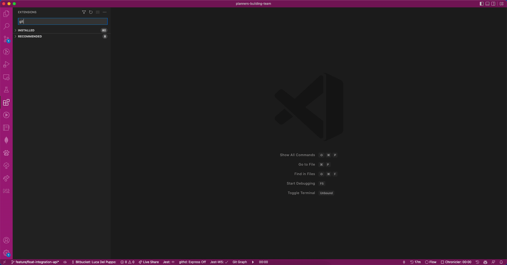
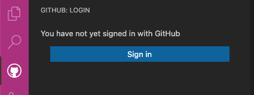
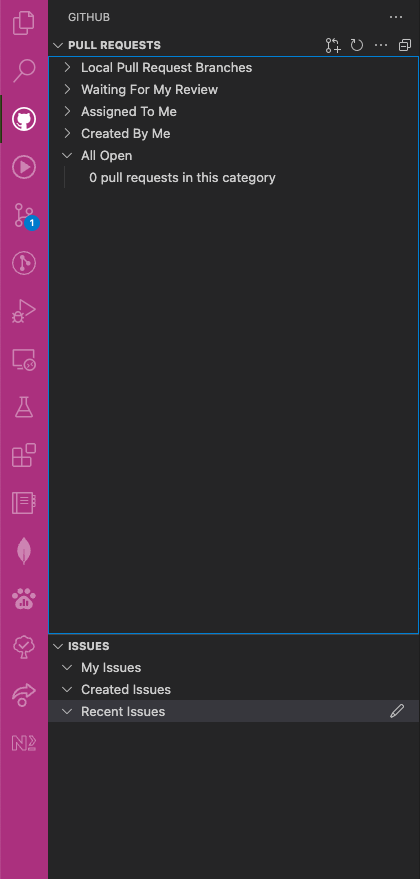
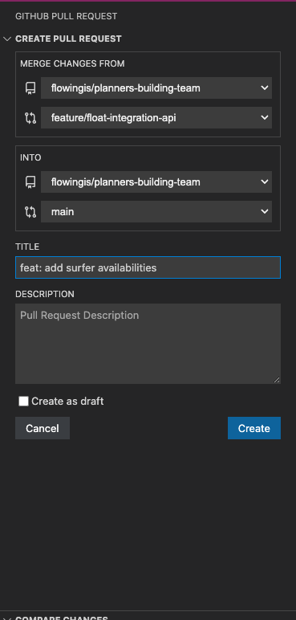
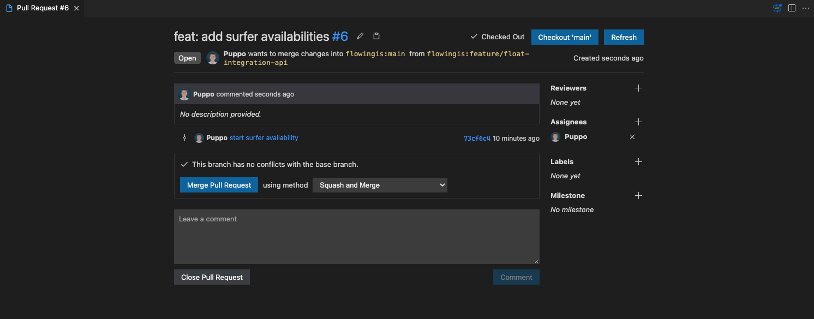

---
{
title: "Working with Github from your best editor",
published: "2022-11-03T10:00:45Z",
edited: "2022-11-03T12:14:44Z",
tags: ["productivity", "vscode", "github"],
description: "In my daily work routine, many times I have to switch from VsCode and Github to create a PR, review a...",
originalLink: "https://blog.delpuppo.net/working-with-github-from-your-best-editor",
coverImg: "cover-image.png",
socialImg: "social-image.png",
collection: "VsCode - Tips & Tricks",
order: 3
}
---

In my daily work routine, many times I have to switch from [VsCode](https://code.visualstudio.com/) and [Github](https://github.com/) to create a PR, review a PR, check a GitHub Action, and more.

Therefore I have decided to google if there is a solution to prevent all these switches. The result of my search terminated with 2 new VsCode Extensions:

- [GitHub Pull Requests and Issues](https://marketplace.visualstudio.com/items?itemName=GitHub.vscode-pull-request-github)
- [GitHub Actions](https://marketplace.visualstudio.com/items?itemName=cschleiden.vscode-github-actions)

Today I'll speak a bit about the first one, and the second will be discovered in another article.

## GitHub Pull Requests and Issues

This extension is an official extension created by the GitHub team. This extension allows you to do whatever you want if you are working with a PR and Issues. You can:

- Create PR
- Edit PR
- Delete PR
- Review PR
- See all PR
- Create Issue
- Delete Issue
- Edit Issue
- See all Issues

As you can imagine, in our daily work if we are familiar with PRs and we work well with them, creating, editing, or reviewing PRs is a common practice.

So let's see better how this extension works.

## Installation

Obviously, to install this extension we have to pass by the VsCode MarketPlace. Click the extension button in VsCode menu and in the search bar type "GitHub Pull Requests and Issues". When the search is finished, click the install button on the right, wait some seconds, and voila the extension is installed.

## Login

It's going without saying that we have to sign in with our credentials to work with GitHub. To do that we have to open the extension and click the SignIn button that appears. After that VsCode asks you permission to open a new browser window to allow you to type your credentials, and at the end a popup browser asks you the permission to reopen VsCode with your credentials so you can begin to use our extensions. Now we are ready to use the extensions.

## First Impression

When you are logged the extension shows you two sections:

- Pull Request
- Issues

its obvious that each section handles its topic.

### PR

To create your first PR you have to click the icon in the top right of the PR section.

After that, the extension opens a new window where you can input the data of your PR:

- From branch
- To branch
- Title
- Description

Now, if you work using the review feature, you can add your review/s to your PR and if you want you can edit your PR too, or you can also add labels or milestones.

In the extension panel, under the PR section, you can find your PR and view or edit it if it is necessary.

If you select your PR, you can see all the changed files by the PR, and if you want to add some comments you can do that in the file directly.

It is awesome, innit?

The flow for your Issues is very similar to the PR flow and in my case doing these kind of stuffs direct in my editor is very useful because Im able to handle my projects direct in VsCode without switching every time from the editor to the browser and vice-versa.

Okay, I hope I stimulated your curiosity so what are you waiting for? Open your VsCode and try this fantastic extension. Let me know your impressions and if you wanna other info dont hesitate to ask me anything, you are welcome and for me its a pleasure to help you.

Thats all today folks.

See you soon to speak about the second extension GitHub Actions.

Bye bye
