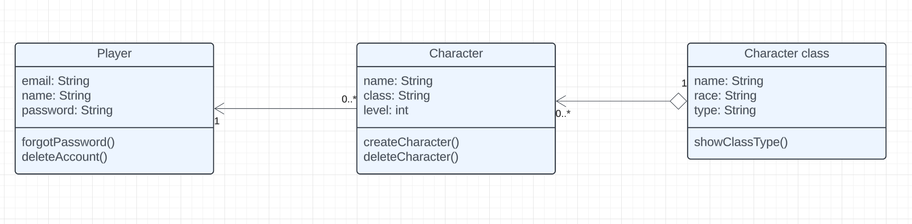

---
{
  title: "Where should you start building your application",
  description: "Talking about where you should start building your full stack application",
  published: '2024-08-10',
  tags: ["meta"],
  license: 'cc-by-4'
}
---

On our Discord channel we have started "book club" where someone suggest article for that week, and then we have discussion around it.

This week [article](https://www.freecodecamp.org/news/how-to-build-a-full-stack-application-from-start-to-finish/) was about how to architect a full-stack application from start to finish.

Author explained why he thinks that you should start with frontend, then persistence layer and finish with API. I will change his naming and refer to persistence layer as database and API as backend.

I think that everyone can have their own approach on how they are going to architect their full-stack application, so there is no "wrong way" to do it. If it works for you, great, keep doing it. i am going to try to offer different perspective than author of article why I think that frontend isn't the best way to architect your application. My approach to building application or new feature would be something like this:

1. Design application by using diagrams (i.e. UML diagrams)

2. Add tables, fields, relations and everything else to database

3. Build back-end (data model, API, if you have some logic)

4. Build frontend (or design it if you have no frontend at all)

When I think about developing application, I always start thinking with diagrams in my head. Sometimes I will even draw them, especially in beginning when I started working and I didn't have any experience.

I have learned about [UML diagrams](https://www.uml-diagrams.org/) in university where we would need to design our application with different UML diagrams (showing actions, use case, class and so on).

If you don't know about UML diagrams, I suggest you take a look at them because they helped me a lot to get a picture of whole applications in my head. There are a lot of different UML diagrams that have different purposes, but logic is always same. You will use diagrams to describe something in visual way with diagrams.

On the next image I have created simple example of UML Class diagram about video game where you can have multiple characters. You have Player, Character and Character class. Connection between Player and Character is telling us that Player can have zero or more characters. Now we know that character variable is going to be nullable in our code. We can also see that Player has some attributes like email, name and password with their type. Those are going to be our fields in table player in our database. You can see that we also have some operations at bottom like forgotPassword, createCharacter, showClassType... You can think about them as methods you will need to implement later. Player can perform action where he says I forgot my password, and then we are going to send him recovery link. 

 

Once you start doing this, you will find out that you basically already have most of the tables, fields and even relations between tables (if you are working with SQL) you will need in your database. So after designing application "on paper", I find it natural to deal with database when I already know most of what I am going to need.

Once I am done with database, I switch to backend. Updating data models and everything that comes with it. I like to create some basic APIs that I already know that I will need. For example, if I am working on feature to add history of purchase in application. I already know that I will need to get data for specific user, so I will create that API while I am on backend right now. The same applies for any other logic. I don't like to play "ping pong" between database, back-end and frontend, so I aim to do most work I can do right away when I am working on each of them. Of course, you will probably have to return later and still do some changes because requirements can change during development. One of benefits that I forgot to mention, because I already have "finished" most work on database, I already know all my types for variables which I would maybe not be the case depending on if you are using TypeScript or not in your frontend.

Now that I have database and back-end, I can fully focus on frontend. I can work with real data without mocking up anything. I have found mocking up data "tricky" because when you mock up something, you will always have "perfect" set of data. Furthermore, I have mocked data before and then had to rewrite part of code because data I received in frontend was for some reason different from my mock-up example. We could talk about if this is really a problem if you need to change small part of your code when most of it you are going to leave it as it is. I personally don't like this because I feel like I can escape this by leaving frontend for last, and it makes my frontend development much easier when I already know what I have in database and back-end. Also, you can lose a lot of time on developing frontend if you start nitpicking stuff around design. If you are working with limited time, you can easily not have enough time for back-end and database if you spend too much time on designing frontend UI and UX. This can apply to backend and database but I most time that I lose in such a way was on frontend because you can get new ideas or get inspired by some other website design.

At the end, all of this is subjective opinion. I think that approach you are going to take in developing your application also depends on how you started learning about software engineering. My roots are with C++, SQL and UML Diagrams, so I think that highly influenced how I think and approach developing application. If you have started with JavaScript, HTML and CSS, you will probably prefer taking frontend first which is also fine. What approach you are going to take also depends on how your team work. You will maybe not get to develop whole feature or application by yourself, instead you are going to need to take only one part to develop.