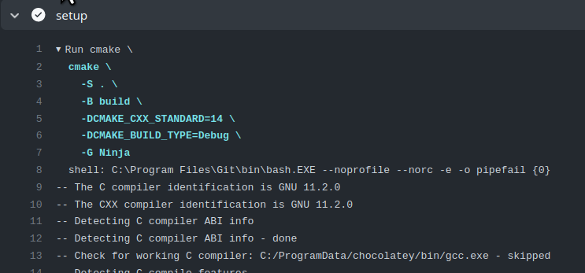
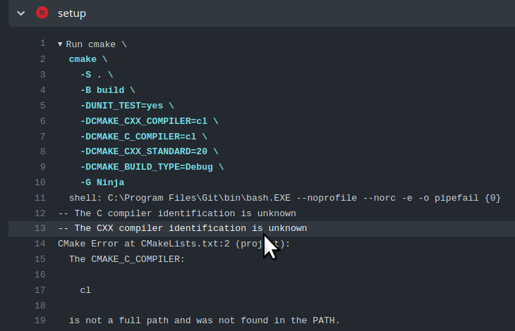
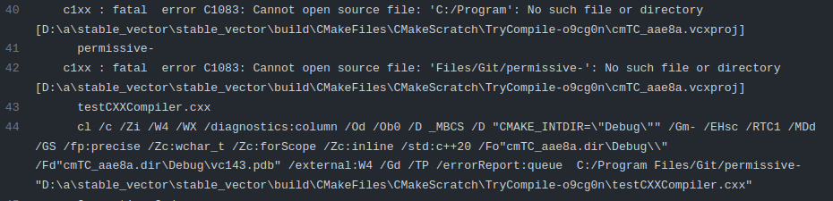
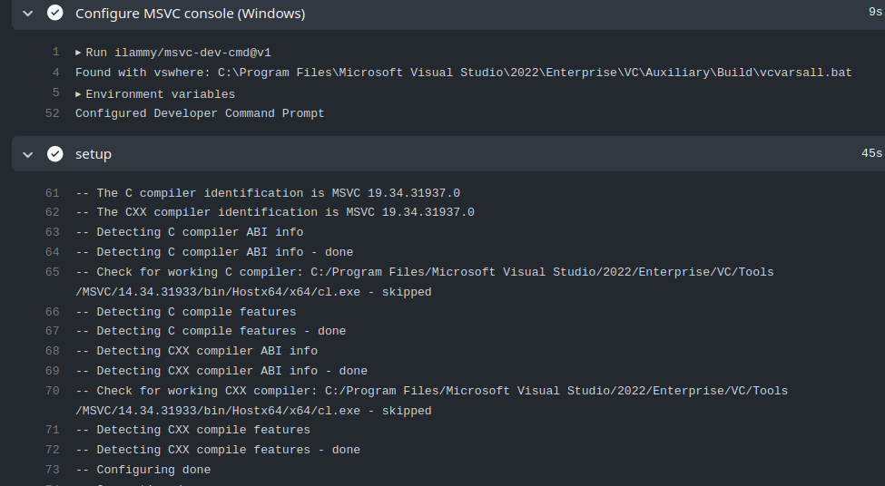

---
{
  title: "A Linux C++ programmers adventure in improving Windows CI on GitHub actions",
  published: "2023-01-06",
  edited: "2023-01-07",
  tags: ['linux', 'cpp', 'windows'],
  originalLink: "https://playfulprogramming.blogspot.com/2023/01/a-linux-c-programmers-adventure-in.html"
}
---

**TL;DR;**

* [Ninja](https://ninja-build.org/) is available directly in the windows images
* Use [`ilammy/msvc-dev-cmd@v1`](https://github.com/ilammy/msvc-dev-cmd) to set up the MSVC environment for building
  with Ninja.
* You need nested quotes for CXX flags from [CMake](https://cmake.org/) CLI options.

# How it started:

It has been very frustrating, on and off, for a few days now, and I thought that if I write down my findings someone
else may perhaps find them and be saved the frustration.

The background. I have a few open source C++ libraries hosted on GitHub. They are well covered for Linux builds with
both [clang](https://clang.llvm.org/) and [gcc](https://gcc.gnu.org/), and have had poor, if any, coverage for
Microsoft's [MSVC](https://visualstudio.microsoft.com/vs/features/cplusplus/). I should say right away that the
frustrations were about build environments, and not about peculiarities of MSVC, which Linux C++ programmers are
otherwise well known to be tripped by.

A few days ago, I decided to split the single header file template
library [`strong_type`](https://github.com/rollbear/strong_type/), into several small headers, and split the unit test
sources similarly.

This had the effect that build times for Windows went from around one minute to around 4 minutes. On Linux I used Ninja
for parallel builds, and it was not much affected by the change.

# First attempt: --parallel

```shell
cmake --build build -t self_test --parallel
```

As far as I can tell, the `--parallel` flag did bugger all on Windows.

# Second attempt: ninja

Search for how to build with Ninja on Windows in [GitHub actions](https://docs.github.com/en/actions). Unfortunately
this search lead me to several actions for installing Ninja on the GitHub
actions [marketplace](https://github.com/marketplace?type=actions). I tried a few. They all involve an extra step in the
pipeline, but it only adds a few seconds, but the clincher is that they change the compiler to gcc instead
of [cl.exe](https://learn.microsoft.com/en-us/cpp/build/reference/compiling-a-c-cpp-program?view=msvc-170).



More searching found several explanations for why this is exactly what you want (what???), but that if you insist, you
just explicitly set the compiler to 'cl' and all will be fine. Except that CMake now said it couldn't find 'cl'.



At this point I decided to shelve ninja and instead direct my attention to strengthening the warning levels.

# Third attempt: Add CMAKE\_CXX\_FLAGS

I want to adhere to strict C++ and clean builds at high levels of warnings, so I
added `-DCMAKE_CXX_FLAGS="/permissive- /EHsc /W4 /WX"` to the CMake command line. This caused all types of problems,
because apparently the quote isn't carried through and CMake made a complete hash of all its arguments.



This, of course, lead to some advanced quotology, i.e. randomly changing quote characters, nesting quotes, escaping
quotes, order of quotes, until suddenly it worked with `-DCMAKE_CXX_FLAGS="'/permissive- /EHsc /W4 /WX'"`. As with any
CI problem, each tiny change is a commit/push/wait/observe cycle.

# Fourth attempt: Back to Ninja again

By this time I had stumbled upon the information that Ninja is available in the build images already, so no need to add
it as a separate step. I also learned that there's a tool named '`vcvarsall.bat`' that sets up the environment.
Unfortunately I also learned that the location of that script depends on the version of Visual Studio installed, and
since I'm not a regular windows developer, I'd have to go through the frustration of finding out the path whenever
there's a new visual studio. Fortunately, it turns out that GitHub user Oleksii
Lozovskyi ([@ilammy](https://github.com/ilammy)) seems to have taken upon themselves to carry that frustration for us,
so that we don't have to, by publishing the GitHub
action [`ilammy/msvc-dev-cmd@v1`](https://github.com/ilammy/msvc-dev-cmd). Just use it as a step prior to running CMake.
This now works, with "-G Ninja". Woohoo!



One last frustration is that the the path to the built program differs when building with Ninja. It changed
from `./build/test/Debug/self_test.exe` to `./build/test/self_test.exe`.

# Result: Around 90 seconds for Windows builds instead of 4 minutes, and better warnings.

Here's an excerpt from the ci.yml file:

```

   name: "Windows C++${{matrix.config.std}}"
   steps:
     - uses: actions/checkout@v3

     - name: Configure MSVC console (Windows)
       uses: ilammy/msvc-dev-cmd@v1

     - name: "setup"
       shell: bash
       run: |
         cmake 
           -S . \
           -B build \
           -DCMAKE_CXX_COMPILER=cl \
           -DCMAKE_C_COMPILER=cl \
           -DCMAKE_CXX_STANDARD=${{matrix.config.std}} \
           -DCMAKE_CXX_FLAGS="'/permissive- /EHsc /W4 /WX'" \
           -DCMAKE_BUILD_TYPE=Debug \
           -DSTRONG_TYPE_UNIT_TEST=yes \
           -G Ninja

     - name: "build"
       shell: bash
       run: |
         cmake --build build --target self_test

     - name: "test"
       shell: bash
       run: |
         ./build/test/self_test.exe
```

90s, with huge variability I might add, is not as fast as I'd like it to be, but it's a huge improvement over 4-ish
minutes.
