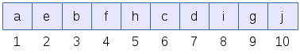
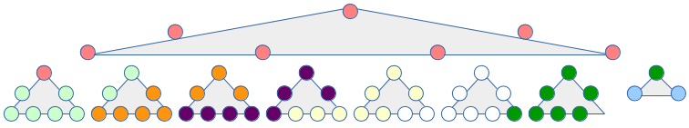

---
{
  title: "Cache optimizing a priority queue",
  published: "2015-08-03",
  edited: "2015-08-04",
  tags: ['cpp']}
---

I must begin by saying that, ***if you found this because you have a performance problem, you should almost certainly look elsewhere.*** It is highly unlikely that your performance problem is caused by your priority queue. If, however, you are
curious, or you have done careful profiling and found out that the cache characteristics of your priority queue are
causing your performance problem - and you cannot fix that by altering your design - by all means read on.

# Introduction

A priority queue is typically implemented as a binary heap.
The [`std::priority_queue<>`](http://en.cppreference.com/w/cpp/container/priority_queue) class template in the C++
standard library is such an example. There is a reasonably good explanation for how they work
on [Wikipedia](https://en.wikipedia.org/wiki/Binary_heap), but I'll go through some operations anyway since it leads
naturally to the optimization process.

The heap is a partially sorted tree-like structure. Below is a heap with the letters 'a'-'i'. A parent node always has
higher priority than its children. In this example, 'a' has the highest priority. There is no order between the
children, though. Either can have higher priority.


The numbers next to the nodes are the node indexes. A interesting property of the binary heap is that the index of a
parent is always half of the index of a child (rounded down.) Another interesting property of the binary heap is that it
is always packed towards lower indexes. There are never any holes in the structure.

If a new node is added, space is made for index `11`. Then the new value is compared with that of the parent, i.e. index
`5`. If the new value has higher priority, the parent is moved to index `11`, and the new value is compared with the parent
of index `5`, i.e. index `2`. If index `2` has higher priority, the new value is inserted at index `5` and the insertion is
done.

Removing the highest priority element is more involved. When 'a' is removed above, index `1` becomes free, which is
forbidden, so the child with highest priority is moved to it. So 'b' is moved to index `1` and index `3` becomes free. The
child of index `3` with highest priority is 'c', which is moved to index `3`, which makes index 6 free. Since index `6` has no
children, the phase shifts to insertion of the last element at index `6`. So the last element is compared with the parent
of index `6`, i.e. `3`. Since index `3` (which now holds 'c') has higher priority than 'j', the job is done and 'j' is moved
from index `10` to index `6`. Index `10` becomes free, but since its the last element that is legal and the heap shrinks in
size so that index `9` becomes the last element.

Both insertion and popping the top element are O(log2(n)).

The clever thing about this is that it fits very well in an array. The above heap could as well have been drawn as
below.



Traversing the nodes by doing division or multiplication by 2 on indexes is very fast compared to following pointers in
a traditional tree structure.

A drawback, however, is that when the number of nodes becomes large, the distance between parent and child becomes such
that only the ones nearest the root share a cache line. Assume for the sake of illustration that each cache line can
hold 8 nodes. With a large heap, the result will become as illustrated below, where each color is one cache line in
size.


The top 3 levels are fine, as they are all in one cache line, but after that each step towards a child or towards a
parent is on a new cache line. This can become a performance problem since the caches are severely underutilized. You
read a whole cache line only to access 1/8 of it. If you pop the highest priority element, the first cache-line will get
accesses to at least 5/8 of its data, which is good, but the rest will get at most 2/8 accessed.

This leads to the idea of another arrangement, a heap of mini-heaps, or B-heap as it is also called. There is a brief
explanation on [Wikipedia](https://en.wikipedia.org/wiki/B-heap).

If the mini-heaps hold 7 elements, the cache graph above instead becomes like this.



The grey triangles each represent a 7 element mini-heap. This is better, but not that good, and the index calculations
become very complicated. Within each mini-heap, you make the multiplication or division by two, but the index to the
parent of the top of a mini-heap and the index of children in the last row of a mini-heap is very different. Both
involves modulo 7 calculations, which are not very fast. I implemented this and ran some benchmarks, but it was slower
than [`std::priority_queue<>`](http://en.cppreference.com/w/cpp/container/priority_queue), despite having substantially
fewer cache misses, which was rather disappointing.

Another idea is to deliberately waste space and although each mini-heap will hold only 7 values, it will consume the
space of 8 values and thus a whole cache line. The result is illustrated below.


This is much better. The lower image illustrates the layout in an array where the numbers to the left are the array
offset to the beginning of the mini-heap. Offset `0` in each mini-heap is not used, which makes the parent/child
calculations within a mini-heap multiplication or division by 2. With mini-heap size of 8 (or any power of two) the
checks for mini-heap root or last child in mini-heap becomes simple bit masking operations, which are very cheap.
Calculating hops between mini-heaps is more elaborate, but is limited to multiplications or divisions by 8, and those
are fast.

In the above case, inserting a new element is guaranteed to touch at most 2 cache lines, even if the added element will
replace the root. Compare with the first binary heap layout which would touch 4 cache lines to replace the root. Also,
the more elements in the B-heap, the better it becomes, because of the huge fan out. Each mini-heap has 8 mini-heap
children, so the number of cache-lines to touch when traversing between leaf and root are log8(n).

After implementation, I ran a number of performance measurements. The graphs presented here are generated on an Intel
i7-4500U CPU running Ubuntu 15.04. The test programs are compiled with g++ 4.9.3 using the flags -O3 and -std=c++14. The
CPU has a 32K L1d cache, and each cache line is 64 bytes.

Of the different measurements made, the most telling one is where a heap is filled to a certain number of elements, then
operated on. In pseudo-code:

```cpp
for (size) queue.push() 
for (cycles) {
  for (n) queue.push()
  for (n) queue.pop() 
}
```

I have rather arbitrarily chosen 'n' to be 320. It's large enough to exercise the memory a bit. Pushing is done from a
large array pre-populated with random numbers.

The first measurement is a priority queue of ints. There are room for 16 elements in each cache line, so measurements
are made with mini-heaps of 8, 16, 32 and 64 elements. The graph displays the relative speed of the B-heaps with
different mini-heap sizes over [`std::priority_queue<int>`](http://en.cppreference.com/w/cpp/container/priority_queue).


Two interesting observations here. It's always faster
than [`std::priority_queue<int>`](http://en.cppreference.com/w/cpp/container/priority_queue), and the size of the
mini-heaps does not seem to matter much.

However, a priority queue of just integers is almost always uninteresting. Usually the priority is associated with
something, a message for example. A reasonable implementation is to let the priority queue hold the
a `std::pair<int, std::unique_ptr<msg>>`, and prioritize on the int.


This is wild and difficult to say anything about. There are even examples of worse performance
than [`std::priority_queue<>`](http://en.cppreference.com/w/cpp/container/priority_queue). I do not understand what
causes this.

This leads to another idea, though. The priority queue could hold two data structures. One being the B-heap of
priorities, the other an array holding the pointers. They are connected via the indexes. There are two advantages with
this. One is that it holds the B-heap of priorities tight. Popping the top object always involves moving the highest
priority child up, so reading the value of the lesser prioritized child is a wasted read and can evict more valuable
data from the L1 cache. With a tighter B-heap structure that waste is reduced. Also, the structure holding the pointers
is only touched when actual moves are being made, it's not touched during the tests. These together is likely to give
better performance.


Well, it is still all over the place, but at least it's now consistently
outperforming [`std::priority_queue<>`](http://en.cppreference.com/w/cpp/container/priority_queue). We can also see that
a mini-heap size of only 8 elements is consistently bad. I expected a mini-heap size of 16 elements to be the best
performer since 16 ints takes up exactly one cache line, but this is obviously not the case. The bigger mini-heaps
outperforms it most of the time. I do not have an answer for why this is so.

Yet another idea is to continue with the separate storage for the values, but keep the `unique_ptr<>` in an array
outside the priority queue, and use the index into that array as the data associated with the priority. This has two
advantages in addition to the advantages outlined above - it further shrinks the data set being operated on, and ints
are very cheap to move, relative to `unique_ptr<>`.


This is consistently much faster
than [`std::priority_queue<std::pair<int,int>>`](http://en.cppreference.com/w/cpp/container/priority_queue). It is still
difficult to say much about the preferred mini-heap size, except that 8 is too small and suffers, and that my idea of 16
being the optimum was wrong.

Source code for the priority queue, including the benchmark program, is available
from [GitHub](https://github.com/rollbear/prio_queue).
