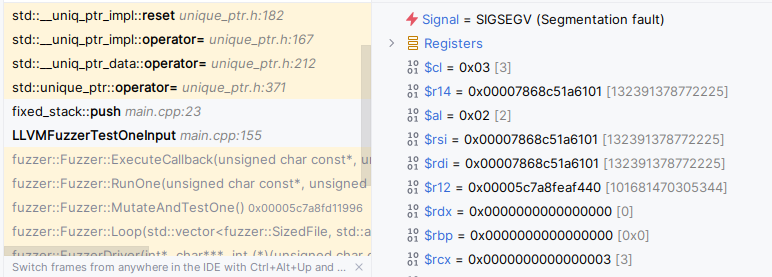
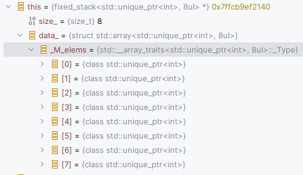
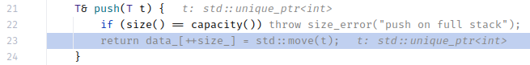

---
{
  title: "Fuzzing an API with libfuzzer",
  published: "2024-01-23",
  edited: "2024-01-28",
  tags: [ 'cpp' ]}
---

> [Edit] I was just told that libFuzzer is deprecated. I think the ideas presented are valid for any fuzzer, but the
> details will differ.

When I mentioned fuzzing a data structure, I was asked some questions like "how does one actually do that?", and "how
does fuzzing work?"

This article intends to bring a very brief introduction to explain what is going on and how to use it. Making
sophisticated use of it, is up to you, once you have started, but after having read this you should be able to make your
first fuzz test.

TL;DR;

Fuzzing is to programmatically exercise your code under test through rules that are controlled by guided randomness. You
write the rules with your fuzz test, and the fuzzing library provides the guided randomness.

## Basics

In this example, I'm using [libFuzzer](https://llvm.org/docs/LibFuzzer.html) from [LLVM](https://llvm.org/). The entry
point for your fuzz test is this function:

```cpp
extern "C"
int LLVMFuzzerTestOneInput(const uint8_t *data, size_t size)
```

This is the fuzzer equivalent of "main" for an ordinary C or C++ program, and `data` and `size` are the bytes of guided
random data. It is up to you to come up with a way to exercise your API through those bytes.

What do I mean by guided randomness? You should always build with coverage analysis enabled when using libFuzzer.
libFuzzer uses the coverage information to learn which bits in the input data causes new paths to be taken through the
code, and which bits does not. It calls `LLVMFuzzerTestOneInput` several times, first with very small data sets, and
then
makes them larger, guided by the coverage information. This makes the fuzzer cover more of your code paths much quicker
than a true random data set.

Whenever the fuzzer detects a problem, it saves the bytes in a file, for you to analyze later. What is a "problem"?
Crashes, calls to abort() or terminate(), but also reports from [sanitizers](https://github.com/google/sanitizers). You
should definitely build your fuzz test with sanitizers.

## Example API

For this blog post, I have a very naïve stack data type, with fixed size storage. It's API looks like this, you can push
and pop data, query its size and capacity and the last element, and errors are reported by throwing a `size_error`.

```cpp
struct size_error : std::out_of_range {
    using out_of_range::out_of_range;
};

template <typename T, size_t Capacity>
requires (std::is_nothrow_move_constructible_v<T> && std::is_nothrow_move_assignable_v<T>)
class fixed_stack
{
public:
    T& push(T t);
    T& back();
    T pop();
    [[nodiscard]] bool empty() const;
    [[nodiscard]] size_t size() const;
    [[nodiscard]] static size_t capacity();
};
```

I've chosen to limit it to types that do not throw when moved, because it makes life so much easier and reduces clutter
that would otherwise distract from the topic of fuzzing.

## Unit tests

First some basic tests to see that the stack indeed does what it's meant to do.

An extremely simple ad-hoc unit testing framework runs named tests and reports errors as exceptions. It's good enough
for this simple thing. Here are tests that elements can be pushed, and when popped they're retrieved in the reversed
order of the pushes, tests that the size changes as expected, and that an exception is thrown when trying to pop from
empty. It's not perfect, but it's decent.

```cpp
struct failure : std::string {
    using std::string::string;
};

#define REQUIRE(...) if (__VA_ARGS__) {;} else throw failure(#__VA_ARGS__)
#define FAIL(...) throw failure(__VA_ARGS__)

int main()
{
    unsigned fail_count = 0;
    struct test {
        const char* name;
        std::function<void()> f;
    };
    test tests[] {
            { "default constructed stack is empty",
              []{
                fixed_stack<int, 8> s;
                REQUIRE(s.size() == 0);
                REQUIRE(s.empty());
            }},
            { "Each push grows size by one",
              [] {
                fixed_stack<int, 8> s;
                s.push(3);
                REQUIRE(s.size() == 1);
                s.push(2);
                REQUIRE(s.size() == 2);
                s.push(8);
                REQUIRE(s.size() == 3);
              }
            },
            { "Pop returns the pushed elements in reverse order",
              []{
                fixed_stack<int, 8> s;
                s.push(3);
                s.push(2);
                s.push(8);
                REQUIRE(s.pop() == 8);
                REQUIRE(s.pop() == 2);
                REQUIRE(s.pop() == 3);
            }
            },
            { "pop on empty throws",
              []{
                fixed_stack<int, 8> s;
                s.push(3);
                s.pop();
                try {
                    s.pop();
                    FAIL("didn't throw");
                }
                catch (const size_error&)
                {
                    // good!
                }
            }}
    };
    for (auto& t : tests)
    {
        try {
            std::cout << std::setw(60) << std::left << t.name << "\t";
            t.f();
            std::cout << "PASS!";
        }
        catch (const failure& f)
        {
            std::cout << "FAILED!\nError: " << f << '\n';
            ++fail_count;
        }
        catch (...)
        {
            std::cout <<  "FAILED!\nUnknown reason!";
            ++fail_count;
        }
        std::cout << '\n';
    }
}
```

Running it shows that everything works.

```
default constructed stack is empty                              PASS!
Each push grows size by one                                     PASS!
Pop returns the pushed elements in reverse order                PASS!
pop on empty throws                                             PASS!
```

Push to production, right?

## Example implementation

Here's its implementation. The eagle eyed among you can see a problem right away, but pretend that you don't.

```cpp
template <typename T, size_t Capacity>
requires (std::is_nothrow_move_constructible_v<T> && std::is_nothrow_move_assignable_v<T>)
class fixed_stack
{
public:
    T& push(T t) {
        if (size() == capacity()) throw size_error("push on full stack");
        return data_[++size_] = std::move(t);
    }
    T& back() {
        if (empty()) throw size_error("back on empty stack");
        return data_[size_];
    }
    T pop() {
        if (empty()) throw size_error("pop on empty stack");
        return std::move(data_[size_--]);
    }
    [[nodiscard]] bool empty() const { return size() == 0; }
    [[nodiscard]] size_t size() const { return size_; }
    [[nodiscard]] static size_t capacity() { return Capacity; }
private:
    size_t size_ = 0;
    std::array<T, Capacity> data_{};
};
```

Let's write a fuzz test and see if it can find the problems.

## Fuzz tests

The simplest test you can make is to just let the bytes from the input control which functions to call, and call them
without doing anything with the information. It can look like this:

```cpp
extern "C"
int LLVMFuzzerTestOneInput(const uint8_t *data, size_t size)
{
    fixed_stack<int, 8> stack;
    for (size_t i = 0; i != size; ++i) {
        try {
            switch (data[i]) {
            case 0:
                stack.push(0);
                break;
            case 1:
                stack.back();
                break;
            case 2:
                stack.pop();
                break;
            case 3:
                (void)stack.empty();
                break;
            case 4:
                (void)stack.size();
                break;
            case 5:
                (void)stack.capacity();
                break;
            }
        }
        catch (const size_error&) {
            // OK
        }
    }
    return 0;
}
```

This is super naïve, but when compiled with sanitizers, it may still provide useful information about things like memory
access errors or undefined behavior.

When possible, I usually try to mimic the behavior of my API through another implementation, so that I can compare the
actual results with expected results. For things like data structures, I find that populating them
with [`std::unique_ptr<>`](https://en.cppreference.com/w/cpp/memory/unique_ptr) is a good way to catch many errors (the
sanitizers are very good at picking them up).

I also try to populate my data structure with data from the input, so that I can distinguish between values. For this a
small helper is useful:

```cpp
struct exhausted {};
struct source {
    std::span<const uint8_t> input;
    template <typename T>
    requires (std::is_trivial_v<T>)
    T get() {
        constexpr auto data_size = sizeof(T);
        if (input.size() < data_size) throw exhausted{};
        alignas (T) uint8_t buff[data_size];
        std::copy_n(input.begin(), data_size, buff);
        input = input.subspan(data_size);
        return std::bit_cast<T>(buff);
    }
};
```

A source instance is created from the random data, and you can get any trivial type from it, as long as there's
sufficient data remaining.

A fuzz test can then look like this:

```cpp
extern "C" int LLVMFuzzerTestOneInput(const uint8_t *data, size_t size) {
    source s{{data, size}};
    std::vector<int> comparison;
    std::optional<fixed_stack<std::unique_ptr<int>, 8>> stack;
    try {
        for (;;) {
            if (!stack.has_value()) {
                stack.emplace();
            }
            const auto action = s.get<uint8_t>();
            switch (action) {
                case 0: // push
                {
                    const int v = s.get<int>();
                    const auto size = stack->size();
                    try {
                        stack->push(std::make_unique<int>(v));
                        comparison.push_back(v);
                        assert(stack->size() == comparison.size());
                        assert(stack->back() != nullptr);
                        assert(*stack->back() == v);
                    }
                    catch (size_error)
                    {
                        assert(size == stack->capacity());
                        assert(stack->size() == size);
                    }
                }
                break;
                case 1: // pop
                {
                    if (!stack->empty()) {
                        auto v = stack->pop();
                        assert(v);
                        assert(*v == comparison.back());
                        comparison.pop_back();
                    }
                }
                break;
                case 2: // destroy
                {
                    stack.reset();
                    comparison = {};
                }
            }
        }
    }
    catch (exhausted) { /* done */ }
    return 0;  // Values other than 0 and -1 are reserved for future use.
}
```

Here a [`std::optional<>`](https://en.cppreference.com/w/cpp/utility/optional) is used to hold the stack, because that
makes it very easy to test destruction.

I've chosen [`std::vector<>`](https://en.cppreference.com/w/cpp/container/vector) as the reference to compare with, and
here I use my knowledge of when it should throw. I've chosen to not test `empty()`, `size()` and `capacity()` as
separate
operations, but they are all exercised in the tests.

A more sophisticated test should also include copy and move construction/assignment, but this.

## Here comes the fuzz!

Building this with `-fsanitize=address,undefined,fuzzer --coverage` and running the program yields this output:

```cpp
INFO: Running with entropic power schedule (0xFF, 100).
INFO: Seed: 2488563521
INFO: Loaded 1 modules   (1392 inline 8-bit counters): 1392 [0x611ca56471e8, 0x611ca5647758), 
INFO: Loaded 1 PC tables (1392 PCs): 1392 [0x611ca5647758,0x611ca564ce58), 
INFO: -max_len is not provided; libFuzzer will not generate inputs larger than 4096 bytes
INFO: A corpus is not provided, starting from an empty corpus
#2	INITED cov: 245 ft: 246 corp: 1/1b exec/s: 0 rss: 31Mb
#8	NEW    cov: 245 ft: 309 corp: 2/3b lim: 4 exec/s: 0 rss: 31Mb L: 2/2 MS: 1 InsertByte-

...
#10496	NEW    cov: 658 ft: 2904 corp: 57/815b lim: 38 exec/s: 0 rss: 37Mb L: 36/38 MS: 1 PersAutoDict- DE: "\001\000P \000\010\030\324"-
#11605	NEW    cov: 658 ft: 2921 corp: 58/862b lim: 48 exec/s: 0 rss: 38Mb L: 47/47 MS: 4 PersAutoDict-CopyPart-CrossOver-PersAutoDict- DE: "\001\000"-"\001\000"-
MS: 2 CrossOver-InsertRepeatedBytes-; base unit: 3ff2147bfcadde9ab222b3e35e51e922693dbb7e
0x2e,0xd9,0xa,0xd9,0x0,0x0,0x0,0x0,0x0,0x0,0x0,0x0,0x0,0x0,0x0,0x0,0x0,0x0,0x0,0x0,0x0,0x0,0x0,0x0,0x0,0x0,0x0,0x0,0x0,0x0,0x0,0x0,0x0,0x0,0x0,0x0,0x0,0x0,0x0,0x0,0x0,0x0,0x0,0x0,0x0,0x0,0x0,0xa,
.\331\012\331\000\000\000\000\000\000\000\000\000\000\000\000\000\000\000\000\000\000\000\000\000\000\000\000\000\000\000\000\000\000\000\000\000\000\000\000\000\000\000\000\000\000\000\012
artifact_prefix='./'; Test unit written to ./crash-8234995591abace9eff323632db0a3b28800dbe5
Base64: LtkK2QAAAAAAAAAAAAAAAAAAAAAAAAAAAAAAAAAAAAAAAAAAAAAAAAAAAAAAAAAK
```

So the fuzzer found a problem. Line 16 shows an important bit. The crash data. This file holds the byte sequence that
caused the problem.

If you run the fuzzer with that file name as argument, it will run exactly that sequence. You can run it through a
debugger. If I run it in a debugger and just run until it crashes, I get this result:



A memory access error in `unique_ptr<>::operator=` for when doing push.

Looking at the member data when in the `push()` member shows:



And the source code for `push()` says:



And here it is revealed, the logic for accessing the `data_` member uses 1-based indexing, and the `data_` array uses
0-based indexing, so when `size_` was 7, it is incremented to 8 and accesses data past the end.

Fixing that error, to ensure 0-based indexing in `push()`, `pop()` and `back()` makes it pass this set of tests.

## More!

This was a very simple example to get you going. More complex APIs can be considerably more difficult to fuzz.

For data-structure like types, I almost always try to fuzz them, because they're reasonably easy and it tends to pay off
very well.

For APIs that in their turn communicates with other APIs that you need to have test doubles for, it can be very tricky
indeed.

One last thing. As shown the fuzzer runs in one thread. Start your fuzzer with `-fork=X`, where X is the number of
threads
you want it to spawn if you want to parallelize and accelerate the finding of problems. In my experience, you probably
want to start single threaded because the first found bug tends to come embarrassingly early, when it starts to look
good, run over night with as many threads as you have CPU cores.
