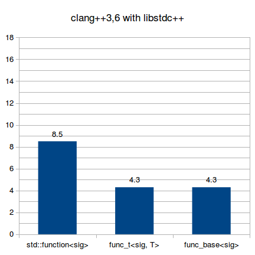

---
{
  title: "Performance observations on a C++ vector of lambdas",
  published: "2015-06-05",
  edited: "2024-12-12",
  tags: [ 'cpp' ]}
---

> **Edit (June 2015)::** 
> The source code is now available on [GitHub](https://github.com/rollbear/vector_lambda).

When writing unit tests, you typically don't care much about execution speed, but compile time performance is important.
After all, if building your unit test program takes 3 minutes, Test Driven Development becomes so painful it requires
super human determination, but if the build takes 3 seconds, TDD becomes a joy.

I became interested in this in part from observations when making
the [Trompeloeil](https://github.com/rollbear/trompeloeil/) header only C++14 mocking framework, and also from the
interesting blog
post "[Template Code Bloat Revisited: A Smaller make_shared](http://blog2.emptycrate.com/content/template-code-bloat-revisited-smaller-makeshared)"
by Jason Turner ([@lefticus](https://twitter.com/lefticus).) Here's hoping that the information presented can aid other
developers of C++ unit test tools in shortening the test program build times.

With the set up in place, I decided to measure run time performance as well, since the extra effort was very minor and
makes the findings interesting to a much wider audience than just makers of unit test tools.

# Setup

This simple lambda is repeated 1000 times in the source.

```cpp
[](int n) { return n + __COUNTER__; }
```

`__COUNTER__` is not needed, but it makes sure each function body differs a bit, making it a more difficult for the
compiler to be clever and just make one lambda type.

The lambdas are stored in a `std::vector<>`. There are two representations of the vector. The simple and straight
forward
representation being:

```cpp
std::vector<std::function<int(int)>> v;
```

The less straight forward representation uses an interface class:

```cpp
template <typename sig>
struct func;

template <typename R, typename ... A>
struct func<R(A...)>
{
  virtual ~func() = default;
  virtual R call(A...) = 0;
};

template <typename Lambda, typename R, typename ... A>
struct func_n : public func<R(A...)>
{
  template <typename U>
  func_n(U&& u) : t(std::forward<U>(u)) {}
  R call(A... a) override { return t(a...); }
  Lambda t
};

std::vector<std::unique_ptr<func<int(int)>>> v;
```

This version has two variants. The first is to create `std::unique_ptr<func<int(int)>>` and populate the vector with.
The second is to create `std::unique_ptr<func_n<Lambda, int, int>>>` and let the conversion constructor for std::
`unique_ptr<>` work. The second version is inspired by
the [blog post](http://blog2.emptycrate.com/content/template-code-bloat-revisited-smaller-makeshared) by Jason
Turner ([@lefticus](https://twitter.com/lefticus),) where the idea is that the more specialized `std::unique_ptr<>` is
costly to create and convert from, even though it is never needed.

To further the complications, there are separate measurements of populating the vector with `.push_back()` and with
`.emplace_back()`. The idea is that the potential run time performance gain with `.emplace_back()` comes with a compile
time penalty.

The vector is not pre-reserved to capacity, which should not matter for compile time or evaluation time performance, but
almost certainly impacts population time performance.

The contenders in this shootout are *g++4.9*, *g++-5.1* and *clang++3.6*. *clang++* uses *libstdc++* from *g++4.9*. I
have measurements with *clang++3.6* using *libc++*, but they came out so exceptionally unflattering that I suspect my 
*libc++* installation is flawed somehow.

The machine that the measurements are made on is an Intel X980 i7@3.33GHz with 12G ram, running X86_64 Gentoo.

Compile time measurements are from a single run of each type since they take several seconds. The run time measurements
are repeated 20 times, and the shortest time found is used, hoping that it has the least disturbance from other
activities on the computer.

# Compilation performance

Here the time (in seconds) required to compile the single source file program is measured.

## Unoptimized builds

All builds are with `-std=c++14 -ggdb`

<table>
<thead>
<tr>
<th colspan="3">push_back</th>
</tr>
</thead>
<tbody>
<tr>
<td>


</td>
<td>


</td>
<td>



</td>
</tr>
</tbody>
</table>

It is clear that compilation time with `std::function<sig>` is roughly twice as long as with the hand crafted function
class template regardless of compiler. The expected difference between creating a `std::unique_ptr<>` to the interface
and a `std::unique_ptr<>` to the derived template and convert, is no where to be seen.

<table>
<thead>
<tr>
<th colspan="3">emplace_back</th>
</tr>
</thead>
<tbody>
<tr>
<td>


</td>
<td>


</td>
<td>


</td>
</tr>
</tbody>
</table>

Here it is obvious that std::function\<sig> suffers even more when emplace\_back() is used, and now requires more than 3
times longer time to compile than the unique\_ptr<> to hand crafted interface alternative. For the latter, the compile
times don't seem affected.

## Optimized builds

All builds are with `-std=c++14 -O`

<table>
<thead>
<tr>
<th colspan="3">push_back</th>
</tr>
</thead>
<tbody>
<tr>
<td>


</td>
<td>


</td>
<td>


</td>
</tr>
</tbody>
</table>


This one is weird. For *g++4.9* and *g++5.1*, compilation times are slightly shorter with optimized builds using `std::
function<>` than with unoptimized builds. *clang++3.6* on the other hand needs quite a long time to compile the source.
Again the expected difference between `std::unique_ptr<>` to the interface and `std::unique_ptr<>` to the derived class
is not seen.


<table>
<thead>
<tr>
<th colspan="3">emplace_back</th>
</tr>
</thead>
<tbody>
<tr>
<td>


</td>
<td>


</td>
<td>


</td>
</tr>
</tbody>
</table>


*clang++3.6* works very hard with optimized builds using `std::function<>`. It looks bad when you glance at the graph,
but
read the numbers - it shoots out above the graph an order of magnitude above that of the *g++* compilers, requiring a
whopping 338 seconds to compile the source. The `std::unique_ptr<>` alternatives seem unaffected by optimization. For
*g++* there is extra suffering compared to `push_back()` when using `std::function<>`, even more so than with
unoptimized
builds.

# Populate time

Here the time needed to populate the vector with the 1000 lambdas is measured. The program is run 20 times, and the time
from the fastest run is shown. Only optimized builds are measured.

<table>
<thead>
<tr>
<th colspan="3">push_back (µs)</th>
</tr>
</thead>
<tbody>
<tr>
<td>


</td>
<td>


</td>
<td>


</td>
</tr>
</tbody>
</table>

It is not obvious if the differences are in the compilers or in the library versions, but given that *clang++* uses
*libstdc++* from *g++4.9* and shows very similar performance, I'm leaning towards a library improvement
for `std::function<>`
in *g++5.1* being shown.

<table>
<thead>
<tr>
<th colspan="3">emplace_back (µs)</th>
</tr>
</thead>
<tbody>
<tr>
<td>


</td>
<td>


</td>
<td>


</td>
</tr>
</tbody>
</table>

The expected performance boost of `emplace_back()` does turn out to be a disappointing performance pessimization when
using *g++*. I guess item 42 in [Effective Modern C++](http://shop.oreilly.com/product/0636920033707.do) is correct that
while emplacement can improve performance, it might not always do so. With *clang++3.6* a performance improvement can be
seen, but it is very minor. However, given that the vector capacity was not pre-reserved, the move constructor called
when growing the vector is likely to dominate. Perhaps the improvement with *clang++3.6* would be greater with
pre-reserved capacity.

# Evaluation performance

Here the time is measured to call every lambda in the vector. Again, only optimized builds are measured, and the time
shown is from the fastest run of 20.

<table>
<thead>
<tr>
<th colspan="3">evaluate all (µs)</th>
</tr>
</thead>
<tbody>
<tr>
<td>


</td>
<td>


</td>
<td>


</td>
</tr>
</tbody>
</table>

Here `std::function<>` shines. I have not tried to find the cause for the performance difference, but I am guessing that
the improvement comes from better locality of reference if these small lambdas can be stored in the `std::function<>`
objects themselves, instead of being spread all over the heap as is the case with the `std::unique_ptr<>`
implementations.

# Conclusions

Estimating performance is difficult, there is no other way to put it. That enabling optimizations can reduce compilation
time, as is shown with *g++* and `push_back()` of `std::function<>`, is baffling. That emplacement slows down
compilation
time is perhaps not surprising, but neither is the size of the cost obvious. `std::function<>` is very fast to call, at
least in this example, but it is obviously costly to create both in run time and compilation time. *clang++* choking
completely on optimized builds with std::function<> is rather unexpected, and that it doesn't show any run time
performance advantage for it is disappointing.

The expected conversion cost from `unique_ptr<derived>` to `unique_ptr<base>` is not seen at all, but perhaps the
situation would be different if the source was split into several files.

The only things clear are that `std::function<>` is slow to compile and fast to call.
