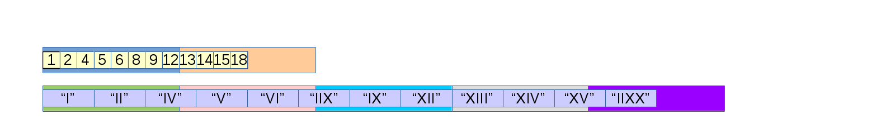
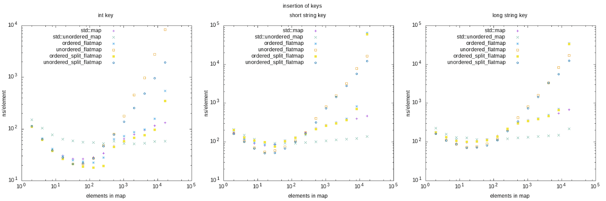

---
{
  title: "Performance of flat maps",
  published: "2017-08-07",
  edited: "2017-08-07",
  tags: [ 'cpp' ]}
---

A flat map is a data structure that maps a key to a value, and that stores the data in a compact flat memory structure
to get better cache hit rate. They can be substantially faster than hash tables and trees, for provided the data sets
are small, but how small? There's also more than one way to implement a flat map, and what are the pros and cons of the
alternatives?

I set out to compare 4 alternatives, and added
C++ [`std::map<key, value>`](http://en.cppreference.com/w/cpp/container/map) (which is a balanced binary tree,)
and [`std::unordered_map<key, value>`](http://en.cppreference.com/w/cpp/container/unordered_map) (which is a hash table)
into the performance measurements. Note that most of what's mentioned here is language agnostic. C++ happens to be the
language of choice for this post, but any language that allows access to contiguous blocks of memory would be equally
suitable.

# The contestants

My alternatives are the `unordered_flatmap<key, value>`, `flatmap<key, value>`, `unordered_split_flatmap<key, value>`,
and `split_flatmap<key, value>`.

## `unordered_flatmap<key, value>`

This is the simplest of them all.

This is a map from integer to string, where key and value are stored next to each other. The coloured blocks in the
background are illustrations of possible cache lines. In this illustration, each cache line holds two key,value pairs. A
key is 1/8 of a cache line in size, and a value is 3/8 of a cache line in size.

Searching for a key in this structure is simply a matter of trying the keys one by one from the beginning.

An obvious disadvantage with this structure is the cost of searching for a key that isn't there.

All elements must be searched, as there is no way to know when to stop. Another less obvious disadvantage of this layout
is that it is quite wasteful of the cache when it comes to lookup. In this case, as it traverses the elements to (
possibly) find the desired key, it only takes advantage of 1/4 of the data read into a cache line. The memory occupied
by the uninteresting values is wasted.

On the other hand, since there are no guarantees of order of elements in this structure, removal of an element, once
found, can be made very efficient, by simply moving the last element into the spot no longer occupied by the removed
element.

Above, key=8 is removed from the flat map.

Insertion is also fairly efficient, just add the new element last.

The insertion, however, requires first a failed find to ensure that the key is unique.

These linear searches may not be as bad as they first seem. Modern CPUs quickly spot a linear access pattern and
speculatively [pre fetch](https://en.wikipedia.org/wiki/Cache_prefetching) data into the cache.

## `ordered_flatmap<key, value>`

This one has the same storage structure as before, but it always stores the keys in order.

Since the keys are stored in a sorted order, lookup can be made using binary search

This scales much better, since the number of accesses is log2(N), where N is the number of elements stored. It is
especially good when it comes to lookup of a key that isn't there.

However, the disadvantage is that this access pattern kills
the [pre fetch](https://en.wikipedia.org/wiki/Cache_prefetching) of data into the cache since the CPU cannot predict
where the next access will be.

To make matters worse, maintaining the sort order when doing insertion and deletion carries a non-trivial cost.

Removing key=8 above, and inserting it again
below.

There are a lot of move constructors involved above, but again, the access pattern for these are very predictable
meaning that the move constructors almost certainly operate in hot caches.

Both of these maps above are really good when you want to iterate over all stored elements. Easily predictable pattern,
and key/value are stored together.

## `unordered_split_flatmap<key, value>`

This version addresses the waste of precious cache when searching, by storing keys and values in separate arrays, linked
by the same index.

A lookup example makes the advantage obvious

There is no wasted cache space at all. Even though a failed lookup shares the characteristics of the
`unordered_flatmap<key,value>`, the cache waste cost is 1/4, which can be a substantial saving.

Insertion and deletion works as with `unordered_flatmap<key, value>`, except it works on the two arrays instead of one.

Iteration is troubling in this one. There are two parallel sequential accesses, which is fine, but at least in C++, the
precedent set by the standard library mandates that an iterator gives a `std::pair<key, value>` (or a reference to one,)
and that doesn't work here since key and value are stored in completely different locations. You need proxy iterators,
and those are not free from problems. [Eric Niebler](https://twitter.com/ericniebler) wrote about this in his 2015 blog
post ["To be, or not to be (an iterator)."](http://ericniebler.com/2015/01/28/to-be-or-not-to-be-an-iterator/)

## `ordered_split_flatmap<key, value>`

Here's the same as above, but with the keys, and thus values, in sorted order.

The idea is to combine the reduced cache waste in the lookup, while taking advantage of a logarithmic algorithm.

It is not obvious if this offers an advantage over the `ordered_flatmap<key, value>`,
since [pre fetch](https://en.wikipedia.org/wiki/Cache_prefetching) of data into the cache is killed anyway.

# Other alternatives

There are many possible implementations of flat maps, and I felt like I had to limit myself. Alternatives I find
interesting to explore are sorted with linear search, giving on the average twice as fast lookup in the failure case,
and a hybrid `ordered_split_flatmap<key, value>` where only the keys are sorted, and contain an index to the value,
which is stored in whichever location is free, offering fast lookup at the cost of non-linear access for iterations.

# Observations on keys

Integer keys are always nice. They consume little memory space and all comparison operations on them are fast. Strings
are interesting. One observation of note is that equality comparison is often fast when strings are unequal, since any
sane implementation checks the length first, and if they are different there is no need to check the string contents,
whereas a less-than comparison for a string is always expensive. Another interesting aspect of strings as keys, is that
all modern C++ library implementations use a short string optimisation, where short strings are stored in the string
object itself and long strings are stored on the heap and the string object points to it. So short strings provide great
locality of reference whereas long strings are likely to result in cache misses.

# The shoot out

All benchmarks are made on an Intel i7-4500U CPU @ 3GHz. It has 32K of L1-data cache, 32K of L1-instruction cache, 256K
of L2 cache and 4M of L3 cache. The benchmark program is compiled with clang++-4.0 -O3 -DNDEBUG, -std=gnu++1z and libc++
where `sizeof(std::string)` is 24 bytes and short string optimisation allows for strings up to 22 characters of length
without using the heap. `sizeof(int)` is 4 bytes.

The implementations are not super-tweaked for performance. They are implemented
using [`std::vector<>`](http://en.cppreference.com/w/cpp/container/vector) and
the [`std::find_if()`](http://en.cppreference.com/w/cpp/algorithm/find) algorithm from the standard library. I believe
tweaking could improve the results a little bit, but the patterns would look the same because performance is mainly
limited by data accesses and comparison operations.

In all measurements the keys are integers, short strings and long strings. The strings are a snapshot of the file names,
presented in a random order. The long strings are the full paths, the short strings are the base name. A few of the
short strings are too long for the short string optimisation, whereas most fit, just as a few of the long strings do in
fact fit in the short string optimisation whereas most do not.

All measurements are also made with cold L1 and L2 caches. The way this is done is that all elements in an array of 256K
size is traversed after setup and before each measurement iteration. This is to see how much one cache hit helps another
access. I intended to cool down the L3 cache as well, but 12h to run the benchmark with cold L2 cache was long enough.
It would have taken days with the L3 cache cooled down.

The source code for the implementations and the benchmark can be found
on [github.com](https://github.com/rollbear/flatmap).

## Lookup of known keys

The main surprise for me, here, is how good [`std:map<int, string>`](http://en.cppreference.com/w/cpp/container/map) is
for up to about 100 items, and how
poor [`std::unordered_map<>`](http://en.cppreference.com/w/cpp/container/unordered_map) generally is, unless you have
around 100 items or more.

The ordered versions perform poorly for string keys until you have a few hundred of them. I believe this is not
primarily due to cache effects, but rather because determining the string ordering relation is always an expensive
operation whereas equality comparison is often cheap when unequal (since comparing size alone suffices.)

## Lookup of unknown keys

I found it surprising to see how well the unordered versions performed for strings, as long as the number of elements
are a few tens. For integer keys the ordered versions
outperform [`std::unordered_map<>`](http://en.cppreference.com/w/cpp/container/unordered_map) until somewhere between
256
and 512 elements.

## Insertion of elements

The Y-scale is the total time taken to populate a map to that number of elements, and then divided by the number of
elements, so it's an average of the time to populate the map.

Again, [`std::unordered_map<>`](http://en.cppreference.com/w/cpp/container/unordered_map) needs a few hundred elements,
and for integer keys it's performing really poorly with smaller data sets.

`ordered_split_flatmap` holds up until surprisingly large number of elements, probably due to good enough locality of
reference, cheap comparisons and good algorithmic complexity, despite the cost of moving elements to make place for the
new one. For strings it's still the unordered flatmaps that rule the performance graph until about 100 or so elements.

## Removing elements

The Y-axis is the average time taken to one by one, in random order, remove every element in a map, starting with the
size on the X-axis.

This one really surprised me at first, seeing how very poorly the ordered versions performed compared to how reasonably
well they performed with insertion. But, with insertion in flat maps, the cost of occasionally reallocating the vector(
s)
to make space, is amortised over the elements. With erase, there is no such cost, so what is seen is the cost of
maintaining the sort order. In every case, this seems to over shadow the algorithmic advantage of quickly finding the
element.

I was also surprised to see how well the unordered versions held up
to [`std::map<>`](http://en.cppreference.com/w/cpp/container/map)
and [`std::unordered_map<>`](http://en.cppreference.com/w/cpp/container/unordered_map) with integer keys. For string
keys, the advantage of unordered flat maps
over [`std::unordered_map<>`](http://en.cppreference.com/w/cpp/container/unordered_map) is minor except for very small
data sets.

## Iteration

This is a measurement of the time taken, per element, to iterate over all elements in a map.

It is no surprise that the flat maps outperform [`std::map<>`](http://en.cppreference.com/w/cpp/container/map)
and [`std::unordered_map<>`](http://en.cppreference.com/w/cpp/container/unordered_map). The flat maps have simple
straight access patterns that are exceptionally cache friendly.
Both [`std::map<>`](http://en.cppreference.com/w/cpp/container/map)
and [`std::unordered_map<>`](http://en.cppreference.com/w/cpp/container/unordered_map) must chase pointers to find the
elements. As the data set grows, this becomes an increasingly large burden.

I did not expect to see the split flat map versions outperform the co-located flat maps, especially given the nasty
proxy iterators, but perhaps the CPU can offer an advantage with two parallel iterations?

# Conclusion

Flat maps can outperform the maps from the standard library quite substantially, providing the data sets are small.
There are several ways to implement them, of which 4 versions are measured here, and each of them have different pros
and cons. Which ones to choose depends on your CPU, how much data you have, the comparison characteristics of your key
type, and which operations are the most important.

This study is no where near exhaustive, but perhaps it can provide some pointers to which data structure you should
prefer in your situation?
