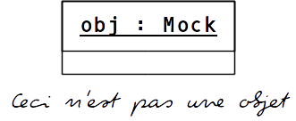
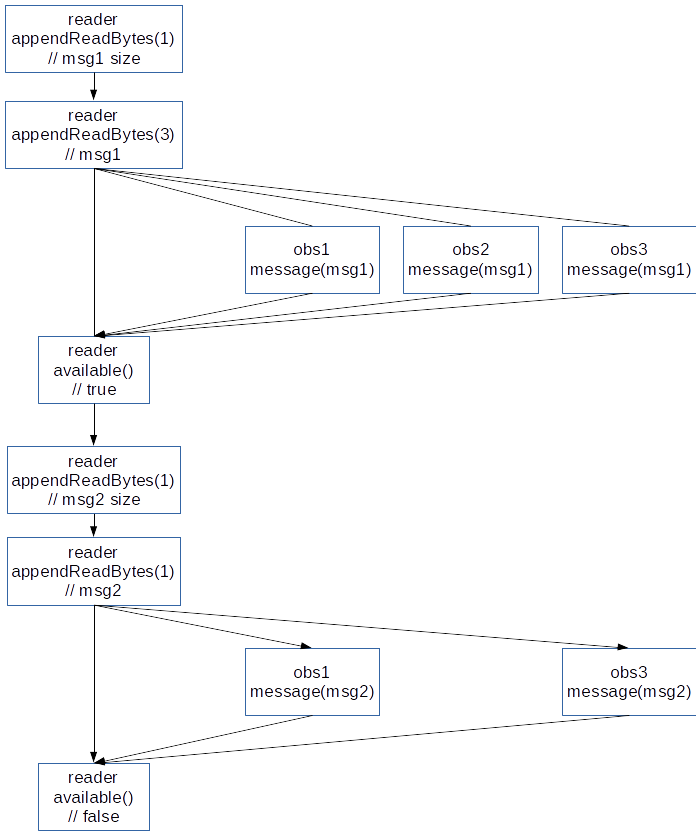

---
{
  title: "Sequence control with the Trompeloeil C++ mocking framework",
  published: "2015-01-06",
  edited: "2024-12-12",
  tags: [ 'cpp', 'testing' ]}
---



As previously [introduced](/posts/introducing-trompeloeil-c-mocking.html),
the [Trompeloeil](https://github.com/rollbear/trompeloeil) C++ framework is a new mocking framework for C++14. If you're
not at all familiar with [Trompeloeil](https://github.com/rollbear/trompeloeil), you may want to read
the [introductory](/posts/introducing-trompeloeil-c-mocking.html) first.

# Quick recap

Before diving in to the topic of sequence control, here comes a brief recapitulation
of [Trompeloeil](https://github.com/rollbear/trompeloeil).

You need to define a mock class, and you do that as you define any class, but with mock implementations of the
interesting functions.

```cpp
class DataReader
{
public:
  virtual ~DataReader() = default;
  virtual bool available() const = 0;
  virtual size_t appendReadBytes(size_t desiredLength, std::vector<uint8_t>& data) = 0;
};

class ReaderMock : public DataReader
{
public:
  MAKE_CONST_MOCK0(available, bool());
  MAKE_MOCK2(appendReadBytes, size_t(size_t, std::vector<uint8_t>&));
};
```

Mock classes typically inherit from interfaces but they are not required to, and they typically do not have data
members, but they are allowed to. `MAKE_MOCKn(name, sig)` creates a mock implementation of a member function with n
parameters. `MAKE_CONST_MOCKn` is the same, but for const member functions. The first parameter to both is the name of
the member function, and the second is the signature.

In tests, you let your test subject interact with the mock instances, which you place expectations on.

In this post, I will use the term *expectation* to mean any
of `REQUIRE_CALL()`, `ALLOW_CALL()`, `FORBID_CALL()`, `NAMED_REQUIRE_CALL()`, `NAMED_ALLOW_CALL()`
and `NAMED_FORBID_CALL()`.

# Setting up the scene

The example used in this post is a `MessageDispatcher` that reads messages from a `DataReader` and calls observers with
the received messages. The observers can subscribe and unsubscribe to receiving messages.

```cpp
class MessageDispatcher
{
public:
  class subscriber_handle;
  MessageDispatcher(DataReader& reader);
  void readMessage();
  subscriber_handle subscribe(std::function<void(const std::vector<uint8_t>&)>);
  void unsubscribe(subscriber_handle);
};
```

In this example, messages are constructed as 1 header byte containing the length of the message payload. Subscribers
expect only the message payload. For different reasons, it is possible that all of a message is not available for
reading, in which case the `MessageDispatcher` must retry reading the tail when data is available.
The `MessageDispatcher` is expected to continue reading messages as long as `DataReader` says data is available.

The observers are also made as simple mocks:

```cpp
class ObserverMock
{
public:
  MAKE_CONST_MOCK1(message, void(const std::vector<uint8_t>&));
};
```

# Default sequencing

By default, expectations on different mock objects and different member functions are unrelated and any order
permutation is equally good, as long as all expectations are met by the end of their surrounding scope. Several
expectations on the same member function for the same mock object are tried in reverse order of creation until a match
is found. This is often useful, since you can state a default in a wide scope, and place specific expectations in narrow
local scopes.

Here's a first simple test for receiving one message and forwarding it to its observer.

```cpp
TEST(a_received_message_is_forwarded_to_a_single_subscriber)
{
  using trompeloeil::_;

  // the players
  ReaderMock        reader;
  MessageDispatcher dispatcher(reader);
  ObserverMock      obs;

  // setting up the scene
  dispatcher.subscribe([&](auto& m) { obs.message(m); });

  const std::vector<uint8_t> msg{'c', 'd', 'e'};

  REQUIRE_CALL(reader, appendReadBytes(1U, _))
    .WITH(_2.empty())
    .LR_SIDE_EFFECT(_2.push_back(msg.size()))
    .RETURN(1U);
  REQUIRE_CALL(reader, appendReadBytes(msg.size(), _))
    .WITH(_2.empty())
    .LR_SIDE_EFFECT(_2 = msg)
    .LR_RETURN(msg.size());
  REQUIRE_CALL(reader, available())
    .RETURN(false);
  REQUIRE_CALL(obs, message(_))
    .LR_WITH(_1 == msg);

  // action!
  dispatcher.readMessage();
}
```

In this example, there is little sequence control. There are two expectations on `reader.appendReadBytes()` on lines 15
and 19, meaning that when a call arrives, the one on line 19 is tried first and if it does not match the parameters, the
one on line 15 is tried.

A reasonable implementation of `MessageDispatcher` will pass, but so will a number of faulty ones too. What we want is
to ensure that the `MessageDispatcher` reads the length (the expectation on line 15), and then continues with reading
the payload, and finishes with checking if more data is available. The expectation on the observer is not really a
problem since the implementation would be unlikely to call it with the correct message unless it has read it properly.
The order between the call to the observer and `reader.available()` is irrelevant.

# Constrained sequences

A fixed version with constraints on the matching sequence of expectations could look like:

```cpp
TEST(a_received_message_is_forwarded_to_a_single_subscriber)
{
  using trompeloeil::_;
>
  // the players
  ReaderMock        reader;
  MessageDispatcher dispatcher(reader);
  ObserverMock      obs;
>
  // setting up the scene
  dispatcher.subscribe([&](auto& m) { obs.message(m); });
>
  const std::vector<uint8_t> msg{'c', 'd', 'e'};
>
  trompeloeil::sequence seq;
  REQUIRE_CALL(reader, appendReadBytes(1U, _))
    .WITH(_2.empty())
    .IN_SEQUENCE(seq)
    .LR_SIDE_EFFECT(_2.push_back(msg.size()))
    .RETURN(1U);
  REQUIRE_CALL(reader, appendReadBytes(msg.size(), _))
    .WITH(_2.empty())
    .IN_SEQUENCE(seq)
    .LR_SIDE_EFFECT(_2 = msg)
    .LR_RETURN(msg.size());
  REQUIRE_CALL(reader, available())
    .IN_SEQUENCE(seq)
    .RETURN(false);
  REQUIRE_CALL(obs, message(_))
    .LR_WITH(_1 == msg);
>
  // action!
  dispatcher.readMessage();
}
>
```

The sequence object created on line 15, is used to impose a strict order on the matched expectations (lines 18, 23 and
27.) Now only the expectation for `obs.message()` on line 29 is unconstrained, the other three must occur in the stated
order, or a violation is reported.

# Interleaved sequences

Let's up the ante and verify that several messages can be read in one go, and that an observer can unsubscribe in
the `message` member function. This is considerably longer, but despair not, an explanation follows.


<!-- HTML generated using hilite.me -->

```cpp
TEST(an_observer_can_unsubscribe_in_the_callback_mid_message_processing)
{
  using trompeloeil::_;
>
  // the players
  ReaderMock        reader;
  MessageDispatcher dispatcher(reader);
  ObserverMock      obs1, obs2, obs3;
>
  // setting up the scene
  dispatcher.subscribe([&](auto &m){ obs1.message(m); });
  auto i2 = dispatcher.subscribe([&](auto &m){ obs2.message(m);});
  dispatcher.subscribe([&](auto &m){ obs3.message(m); });
>
  trompeloeil::sequence read_seq, obs1_seq, obs2_seq, obs3_seq;
>
  // first message
  const std::vector<uint8_t> msg1{'c', 'd', 'e'};
>
  REQUIRE_CALL(reader, appendReadBytes(1U, _))
    .WITH(_2.empty())
    .IN_SEQUENCE(read_seq)
    .LR_SIDE_EFFECT(_2.push_back(msg1.size()))
    .RETURN(1U);
  REQUIRE_CALL(reader, appendReadBytes(msg1.size(), _))
    .WITH(_2.empty())
    .IN_SEQUENCE(read_seq, obs1_seq, obs2_seq, obs3_seq)
    .LR_SIDE_EFFECT(_2 = msg1)
    .LR_RETURN(msg1.size());
  REQUIRE_CALL(obs1, message(_))
    .LR_WITH(_1 == msg1)
    .IN_SEQUENCE(obs1_seq);
  REQUIRE_CALL(obs2, message(_))
    .LR_WITH(_1 == msg1)
    .IN_SEQUENCE(obs2_seq)
    .LR_SIDE_EFFECT(dispatcher.unsubscribe(i2));
  REQUIRE_CALL(obs3, message(_))
    .LR_WITH(_1 == msg1)
    .IN_SEQUENCE(obs3_seq);
  REQUIRE_CALL(reader, available())
    .IN_SEQUENCE(read_seq, obs1_seq, obs2_seq, obs3_seq)
    .RETURN(true); // continue reading messages
>
  // second message
  const std::vector<uint8_t> msg2{'f'};
>
  REQUIRE_CALL(reader, appendReadBytes(1U, _))
    .WITH(_2.empty())
    .IN_SEQUENCE(read_seq)
    .LR_SIDE_EFFECT(_2.push_back(msg2.size()))
    .RETURN(1U);
  REQUIRE_CALL(reader, appendReadBytes(msg2.size(), _))
    .WITH(_2.empty())
    .IN_SEQUENCE(read_seq, obs1_seq, obs2_seq, obs3_seq)
    .LR_SIDE_EFFECT(_2 = msg2)
    .LR_RETURN(msg2.size());
  REQUIRE_CALL(obs1, message(_))
    .LR_WITH(_1 == msg2)
    .IN_SEQUENCE(obs1_seq);
  REQUIRE_CALL(obs3, message(_))
    .LR_WITH(_1 == msg2)
    .IN_SEQUENCE(obs3_seq);
  REQUIRE_CALL(reader, available())
    .IN_SEQUENCE(read_seq, obs1_seq, obs2_seq, obs3_seq)
    .RETURN(false); // no more data
>
  // action!
  dispatcher.readMessage();
}
```

The first interesting thing is the many sequence objects defined on line 15. While we still don't want to impose any
specific order between the different subscribers, we want to ensure that the two messages are delivered to the observers
in order, and immediately after having been read.

Lines 30-39 say that each observer is expected to be called, but since they have different sequence objects, any order
between them is OK. But, already the expectation for appendReadBytes() also refers to each of the sequence
objects `obs1_seq`, `obs2_seq` and `obs3_seq`, meaning that the observers may not be called until after the message has
been read.

Line 41 says that `reader.available()` must be called after the messages have been read, since it refers to `read_seq`,
which also the expectations on appendReadBytes() on lines 21-21 do. Line 41 also refers to each
of `obs1_seq`, `obs2_seq` and `obs3_seq`, meaning that although there is no restriction on which observer gets called in
which order, all of them must have been called before `reader.available()` is called.

The second section on lines 44-65 is more or less the same, but since obs2 unsubscribes on line 36, the only remaining
references to `obs3_seq` are for reads.

A graphic representation of allowed sequences may be viewed as follows:



# Wrap-up

By default, calls to unrelated mock objects and unrelated member functions on a mock object have no restrictions on the
order of matched calls, while expectations to the same member function of the same mock object are tried in reverse
order of creation, until a match is found.

Sequence objects is a powerful tool for both ensuring that calls to unrelated objects happens in a required sequence,
and for imposing a more readable sequencing of calls matching several expectations to the same member function on the
same mock object.

Using several sequence you can describe interleaved sequences that may, but need not, have common points. This allows
you to restrict the test exactly as much as necessary, but also allows you to relax the test as much as desired, to
allow for flexibility in implementation; for example, you typically don't want to impose an order of objects visited
from a hash-table.
