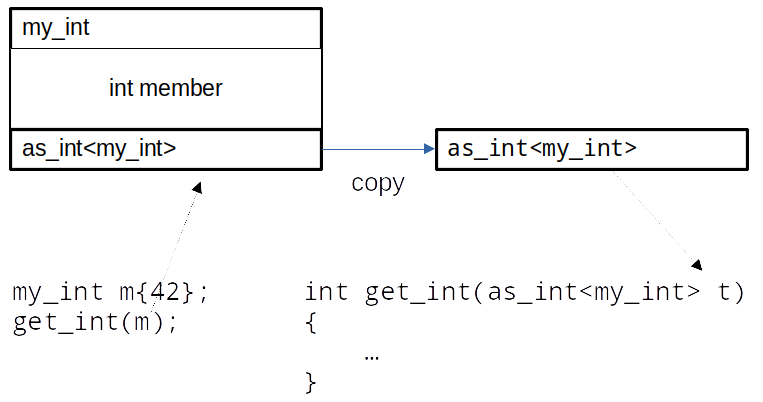

---
{
  title: "The accidentally sliced CRTP base",
  published: "2020-12-22",
  edited: "2020-12-22",
  tags: [ 'cpp' ]}
---

Some time ago, I received a bug report that, in short, said "your class does not work with CRTP". I was very confused by
this statement.

First a short recap. [CRTP](https://en.wikipedia.org/wiki/Curiously_recurring_template_pattern), the Curiously Recurring
Template Parameter idiom (more often referred to as Curiously Recurring Template Pattern), a C++ construction where a
class inherits from a template instantiated with itself.

A simple, but admittedly somewhat contrived, example:

```cpp
template <typename T>
class as_int
{
public:
    int get_int() const {
        const T* t = static_cast<const T*>(this);
        return t->get_implementation();
    }
};

class my_int : public as_int<my_int>
{
public:
    int get_implementation() const { return 42;}
};
```

On line 11, class `my_int`, inherits from `as_int<my_int>`. This may seem a bit curious, but looking at `as_int<T>` on
lines 1 through 9, we see that it implements a `get_int()` member function. The `get_int()` member function assumes that
it is safe to `static_cast this` to `const T*`, and call `get_implementation()` on that. This assumption is safe if `T` (in
this case `my_int`) inherits from `as_int<T>`, as it does.

Now, the bug report said that this technique doesn't work with my type, and an example was attached. It looked like
this:

```cpp
template <typename T>
int get_int(as_int<T> t)
{
    return t.get_int();
}
```

Do you see the error? Curiously, as written, no tools that I know of report the error.

To expose it, let's make `my_int` a little bit more interesting:

```cpp
class my_int : public as_int<my_int>
{
public:
    my_int(int value) : member(value) {}
    int get_implementation() const { return member;}
private:
    int member;
};
```

Now when run with [**ASAN**](https://en.wikipedia.org/wiki/AddressSanitizer), we get an error saying there's a stack
buffer overflow in `get_implementation()`. Try it out in [CompilerExplorer](https://godbolt.org/z/vc87vd).

So why is this an error? What is happening?

It is valid to call the global function template `get_int(as_int<T>)` with an instance of `my_int`, because `my_int`
publically inherits from `as_int<my_int>`. Note, however, that t is a copy of the `as_int<my_int>` part of the full
`my_int` object.



Thi is a consequence of passing the parameter by value. A copy is made, by calling the copy constructor for the type of
the parameter, not the type of the object it is called with. So when `t.get_int()` is called, it is not safe to
statically cast `this` to `const my_int*`, because `t` is not an instance of `my_int`. What we have here is
called [object slicing](https://www.geeksforgeeks.org/object-slicing-in-c/).

This was an honest mistake. The error is not that the `my_int` type doesn't work with CRTP, but that `get_int<T>` either
should take its parameter by reference, or should take the whole object by value. Which is preferable depends on the
situation, but can the honest mistake be prevented?

# Prevent copy

The root of the problem is that it is possible to have instances of `as_int<my_int>` that are
not [subobjects](https://en.cppreference.com/w/cpp/language/object) of `my_int` by inheritance. Specifically that
`as_int<my_int>` is copied from `my_int` when calling a function that takes `as_int<my_int>` by value. A way to prevent
this is to make the copy constructor inaccessible. However, we still want it to be possible to copy instances of
`my_int`. A simple solution is to make the copy constructor protected. In C++11 and later, this makes the move
constructor inaccessible, so you may want to make it protected too (for clarity, if for no other reason. There's no data
to optimize for when moving, so copy is a safe default.) Also, when writing any constructor, the default constructor is
no longer automatically provided, so that must be added too (and make it protected too, otherwise free instances of
`as_int<my_int>` can still be constructed.)

```cpp
template <typename T>
class as_int
{
protected:
    as_int() = default
    as_int(const as_int&) = default;
    as_int(as_int&&) = default;
public:
    int get_int() const {
        const T* t = static_cast<const T*>(this);
        return t->get_implementation();
    }
};
```

Now, the original `get_int(as_int<T>)` will not compile. See on [CompilerExplorer](https://godbolt.org/z/G9acW4).
Changing the `get_int` function template to accept `as_int<T>` by reference works.

```cpp
template <typename T>
int get_int(const as_int<T>& t)
{
    return t.get_int();
}
```

See [CompilerExplorer](https://godbolt.org/z/zqWYYb) again.

An alternative, but more obscure technique to achieve almost the same thing, is to make only the destructor protected:

```cpp
template <typename T>
class as_int
{
protected:
    ~as_int() {}
public:
    int get_int() const {
        const T* t = static_cast<const T*>(this);
        return t->get_implementation();
    }
};
```

This doesn't compile the original buggy `get_int()` (see [CompilerExplorer)](https://godbolt.org/z/76Yrfc) because the
copied parameter must be destroyed, and the destructor is not accessible. However, this is, in my opinion, more obscure
and gives less helpful compilation error messages, and is not worth the saved key strokes, but I wanted to mention it as
a viable alternative. Another interesting effect of this technique is that if someone decides to make a naked allocation
on the heap of an `as_int<my_int>` object and never deallocate it, that will work fine. I leave it to you to decide if
that's an advantage or not.
