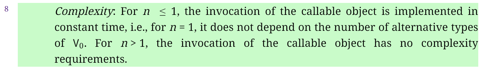
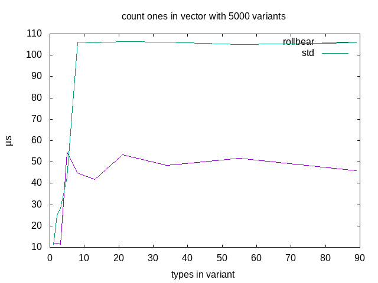

---
{
  title: "When performance guarantees hurts performance - std::visit",
  published: "2018-12-22",
  edited: "2018-12-22",
  tags: [ 'cpp' ],
  originalLink: "https://playfulprogramming.blogspot.com/2018/12/when-performance-guarantees-hurts.html"
}
---

The performance of [`std::visit`](https://en.cppreference.com/w/cpp/utility/variant/visit) came up in a discussion, and
my
first thought was that from reading generated assembly code, it's a jump table, so it should be pretty fast. But then it
dawned on me, all examples I've seen have been jumps to functions. The compiler has not been able to inline the visitor.
This is, of course, of no consequence if your visitor does any work worth speaking of, but if the visitor does trivial
work, like incrementing the given variable, then it may be important if done in a hot path.

Looking at the (draft) standard, I found this on `std::visit(visitor, variant...)`:

[](https://eel.is/c++draft/variant#visit-8)

> Click the image to read the (draft) std on [eel.is](https://eel.is/c++draft)

`n`, here, is the number of variants in the call
to [`std::visit`](https://en.cppreference.com/w/cpp/utility/variant/visit).

I believe the only way to achieve this is to implement `visit` more or less like this:

```cpp
namespace detail {
template <std::size_t ... I, typename F, typename V>
auto visit(std::index_sequence<I...>, F&& f, V&& v)
{
    using ftype = void (*)(F&&, V&&);
    static constexpr ftype funcs [] = {
        [](F&& f, V&& v){ return f(std::get<I>(std::forward<V>(v)));}...
    };
    if (v.index() == std::variant_npos) throw std::bad_variant_access{};
    return funcs[v.index()](std::forward<F>(f), std::forward<V>(v));
}
}
template <typename F, typename V>
auto visit(F&& f, V&& v)
{
    using Vb = std::remove_cv_t<std::remove_reference_t<V>>;
    constexpr auto size = std::variant_size_v<Vb>;
    return detail::visit(std::make_index_sequence<size>{},std::forward<F>(f), std::forward<V>(v));
}
```

A table of functions is created at compile time, lines 5-8. At line 9 a check is made if the variant is invalid by
exception, and if not, at line 10, the call is made via the jump table. In this case I've simplified the implementation
to only work with visitors that do not return any value.

Unfortunately, it is extremely difficult for the compiler to inline the calls that go via the table. Look at the example
on the compiler explorer[godbolt.org](https://gcc.godbolt.org/z/gCI25J). It is also a possible pessimization to have to
check for the [valueless by exception](https://en.cppreference.com/w/cpp/utility/variant/valueless_by_exception) state
first.

I began to wonder if it would be better if I ignore the O(1) requirement and let the compiler generate trivial if-else
tests, since it can probably inline them. How many alternative types can the variant hold before the jump table becomes
faster?
My idea was to use templates to generate code that compares the value
of [`.index()`](https://en.cppreference.com/w/cpp/utility/variant/index) on
each [`variant`](https://en.cppreference.com/w/cpp/utility/variant), with the possible indexes, and make the call when
it
matches. So, if we imagine a call to `visit`, using two variants `variant<int,char> v1`
and `variant<bool,void*,char> v2`,
then the index space is a 2x3 rectangle, since `v1` has two valid indexes, and `v3` has 3. The desired generated code
should
be something like this:

```cpp
template <typename F>
auto visit(F f, V1 v1, V2 v2)
{
  if (       v1.index() == 0 && v2.index() == 0) {
    return      f(std::get<0>(v1),   std::get<0>(v2));
  } else if (v1.index() == 1 && v2.index() == 0) {
    return      f(std::get<1>(v1),   std::get<0>(v2));
  } else if (v1.index() == 0 && v2.index() == 1) {
    return      f(std::get<0>(v1),   std::get<1>(v2));
  } else if (v1.index() == 1 && v2.index() == 1) {
    return      f(std::get<1>(v1),   std::get<1>(v2));
  } else if (v1.index() == 0 && v2.index() == 2) {
    return      f(std::get<0>(v1),   std::get<2>(v2));
  } else if (v1.index() == 1 && v2.index() == 2) {
    return      f(std::get<1>(v1),   std::get<2>(v2));
  } else {
    throw std::bad_variant_access{};
  }
}
```

Doing this requires some helpers dealing with index sequences:

```cpp
template<std::size_t I, std::size_t ... Is>
constexpr
auto
prepend(std::index_sequence<Is...>) {
  return std::index_sequence<I, Is...>{};
}

constexpr
std::index_sequence<>
next_seq(std::index_sequence<>, std::index_sequence<>) {
  return {};
}

template<
  std::size_t I, std::size_t ... Is,
  std::size_t J, std::size_t ... Js
>
constexpr
auto
next_seq(std::index_sequence<I, Is...>, std::index_sequence<J, Js...>) {
  if constexpr (I + 1 == J) {
    return prepend<0>(next_seq(std::index_sequence<Is...>{},
                               std::index_sequence<Js...>{}));
  } else {
    return std::index_sequence<I + 1, Is...>{};
  }
}
```

The type function `next_seq` takes a current index sequence and an upper limit for each index. Calls evaluates to:

```
next_seq(<0,0>,<2,3>)  ->  <1,0>
next_seq(<1,0>,<2,3>) -> <0,1>
next_seq(<0,1>,<2,3>) -> <1,1>
next_seq(<1,1>,<2,3>) -> <0,2>
next_seq(<0,2>,<2,3>) -> <1,2>
next_seq(<1,2>,<2,3>) -> <0,0>
```

The meat of the visit implementation can now be written:

```cpp
template<std::size_t ... I>
static
constexpr
std::size_t
sum(std::index_sequence<I...>) { return (I + ...); }

template<
  std::size_t ... Is,
  std::size_t ... Ms,
  typename F,
  typename ... Vs
>
constexpr
auto
visit(
  std::index_sequence<Is...> i,
  std::index_sequence<Ms...> m,
  F &&f,
  Vs &&... vs)
{
  constexpr auto n = next_seq(i, m);
  if (std::tuple(vs.index()...) == std::tuple(Is...)) {
    return f(std::get<Is>(std::forward<Vs>(vs))...);
  }
  if constexpr (sum(n) > 0) {
    return visit(n, m, std::forward<F>(f), std::forward<Vs>(vs)...);
  } else {
    throw std::bad_variant_access{};
  }
}
```

It's a compile time recursion over all possible indexes. Line 22 checks if the tuples current indexes matches the
indexes of the recursion. If they do the call to the visitor function is made on line 23. The sum function, on lines 1-5
are a convenience to make the condition for recursion easier (line 25. If the sum of all indexes in the next sequence is
0, then it has wrapped.) If no match was found anywhere, at least one of the variants must have been invalid by
exception, so an exception is thrown.

The real visit function is a wrapper that provides the index sequences:

```cpp
template<typename>
static constexpr std::size_t zero = 0;

template <typename T>
using remove_cv_ref_t = std::remove_const_t<std::remove_reference_t<T>>;

template <typename F, typename ... Vs>
auto visit(F&& f, Vs&& ... vs)
{
  return detail::visit(
    std::index_sequence<zero<Vs>...>{},
    std::index_sequence<std::variant_size_v<remove_cv_ref_t<Vs>>...>{},
    std::forward<F>(f),
    std::forward<Vs>(vs)...);
}
```

[cppinsights.io](https://cppinsights.io/lnk?code=I2luY2x1ZGUgPHZhcmlhbnQ+CiNpbmNsdWRlIDx1dGlsaXR5PgojaW5jbHVkZSA8c3RyaW5nPgojaW5jbHVkZSA8c3RyaW5nX3ZpZXc+CiNpbmNsdWRlIDxpb3N0cmVhbT4KI2luY2x1ZGUgPHR1cGxlPgoKbmFtZXNwYWNlIHJvbGxiZWFyCnsKICBuYW1lc3BhY2UgZGV0YWlsIHsKICAgIHRlbXBsYXRlPHN0ZDo6c2l6ZV90IEksIHN0ZDo6c2l6ZV90IC4uLiBJcz4KICAgIGNvbnN0ZXhwcgogICAgYXV0bwogICAgcHJlcGVuZChzdGQ6OmluZGV4X3NlcXVlbmNlPElzLi4uPikgewogICAgICByZXR1cm4gc3RkOjppbmRleF9zZXF1ZW5jZTxJLCBJcy4uLj57fTsKICAgIH0KCiAgICBjb25zdGV4cHIKICAgIHN0ZDo6aW5kZXhfc2VxdWVuY2U8PgogICAgbmV4dF9zZXEoc3RkOjppbmRleF9zZXF1ZW5jZTw+LCBzdGQ6OmluZGV4X3NlcXVlbmNlPD4pIHsKICAgICAgcmV0dXJuIHt9OwogICAgfQoKICAgIHRlbXBsYXRlPAogICAgICBzdGQ6OnNpemVfdCBJLCBzdGQ6OnNpemVfdCAuLi4gSXMsCiAgICAgIHN0ZDo6c2l6ZV90IEosIHN0ZDo6c2l6ZV90IC4uLiBKcwogICAgPgogICAgY29uc3RleHByCiAgICBhdXRvCiAgICBuZXh0X3NlcShzdGQ6OmluZGV4X3NlcXVlbmNlPEksIElzLi4uPiwgc3RkOjppbmRleF9zZXF1ZW5jZTxKLCBKcy4uLj4pIHsKICAgICAgaWYgY29uc3RleHByIChJICsgMSA9PSBKKSB7CiAgICAgICAgcmV0dXJuIHByZXBlbmQ8MD4obmV4dF9zZXEoc3RkOjppbmRleF9zZXF1ZW5jZTxJcy4uLj57fSwKICAgICAgICAgICAgICAgICAgICAgICAgICAgICAgICAgICBzdGQ6OmluZGV4X3NlcXVlbmNlPEpzLi4uPnt9KSk7CiAgICAgIH0gZWxzZSB7CiAgICAgICAgcmV0dXJuIHN0ZDo6aW5kZXhfc2VxdWVuY2U8SSArIDEsIElzLi4uPnt9OwogICAgICB9CiAgICB9CgogICAgdGVtcGxhdGU8c3RkOjpzaXplX3QgLi4uIEk+CiAgICBzdGF0aWMKICAgIGNvbnN0ZXhwcgogICAgc3RkOjpzaXplX3QKICAgIHN1bShzdGQ6OmluZGV4X3NlcXVlbmNlPEkuLi4+KSB7IHJldHVybiAoSSArIC4uLik7IH0KCiAgICB0ZW1wbGF0ZTwKICAgICAgc3RkOjpzaXplX3QgLi4uIElzLAogICAgICBzdGQ6OnNpemVfdCAuLi4gTXMsCiAgICAgIHR5cGVuYW1lIEYsCiAgICAgIHR5cGVuYW1lIC4uLiBWcwogICAgPgogICAgY29uc3RleHByCiAgICBhdXRvCiAgICB2aXNpdCgKICAgICAgc3RkOjppbmRleF9zZXF1ZW5jZTxJcy4uLj4gaSwKICAgICAgc3RkOjppbmRleF9zZXF1ZW5jZTxNcy4uLj4gbSwKICAgICAgRiAmJmYsCiAgICAgIFZzICYmLi4uIHZzKQogICAgewogICAgICBjb25zdGV4cHIgYXV0byBuID0gbmV4dF9zZXEoaSwgbSk7CiAgICAgIGlmIChzdGQ6OnR1cGxlKHZzLmluZGV4KCkuLi4pID09IHN0ZDo6dHVwbGUoSXMuLi4pKSB7CiAgICAgICAgcmV0dXJuIGYoc3RkOjpnZXQ8SXM+KHN0ZDo6Zm9yd2FyZDxWcz4odnMpKS4uLik7CiAgICAgIH0KICAgICAgaWYgY29uc3RleHByIChzdW0obikgPiAwKSB7CiAgICAgICAgcmV0dXJuIHZpc2l0KG4sIG0sIHN0ZDo6Zm9yd2FyZDxGPihmKSwgc3RkOjpmb3J3YXJkPFZzPih2cykuLi4pOwogICAgICB9IGVsc2UgewogICAgICAgIHRocm93IHN0ZDo6YmFkX3ZhcmlhbnRfYWNjZXNze307CiAgICAgIH0KICAgIH0KCiAgICB0ZW1wbGF0ZTx0eXBlbmFtZT4KICAgIHN0YXRpYyBjb25zdGV4cHIgc3RkOjpzaXplX3QgemVybyA9IDA7CgogICAgdGVtcGxhdGUgPHR5cGVuYW1lIFQ+CiAgICB1c2luZyByZW1vdmVfY3ZfcmVmX3QgPSBzdGQ6OnJlbW92ZV9jb25zdF90PHN0ZDo6cmVtb3ZlX3JlZmVyZW5jZV90PFQ+PjsKICB9CiAgdGVtcGxhdGUgPHR5cGVuYW1lIEYsIHR5cGVuYW1lIC4uLiBWcz4KICBhdXRvIHZpc2l0KEYmJiBmLCBWcyYmIC4uLiB2cykKICB7CiAgICByZXR1cm4gZGV0YWlsOjp2aXNpdCgKICAgICAgc3RkOjppbmRleF9zZXF1ZW5jZTxkZXRhaWw6Onplcm88VnM+Li4uPnt9LAogICAgICBzdGQ6OmluZGV4X3NlcXVlbmNlPHN0ZDo6dmFyaWFudF9zaXplX3Y8ZGV0YWlsOjpyZW1vdmVfY3ZfcmVmX3Q8VnM+Pi4uLj57fSwKICAgICAgc3RkOjpmb3J3YXJkPEY+KGYpLAogICAgICBzdGQ6OmZvcndhcmQ8VnM+KHZzKS4uLik7CiAgfQoKfQoKdm9pZCBxKHN0ZDo6dmFyaWFudDxzdGQ6OnN0cmluZyxzdGQ6OnN0cmluZ192aWV3PiB2MSwKICAgICAgIHN0ZDo6dmFyaWFudDxzdGQ6OnN0cmluZywgc3RkOjpzdHJpbmdfdmlldywgY2hhcio+IHYyKQp7CiAgcm9sbGJlYXI6OnZpc2l0KFtdKGNvbnN0IGF1dG8mIHMxLCBjb25zdCBhdXRvJiBzMikgeyBzdGQ6OmNvdXQgPDwgczEgPDwgJzonPDwgczI7fSwKICAgICAgICAgICAgICAgICAgdjEsdjIpOwp9Cg==\&rev=1.0)
does a reasonable job of showing how the compiler sees the code after template expansion.

Using this version of visit on the first example where the visitor does nothing, generates a function that does nothing,
because now the compiler can inline the visitor. Here's a link to the [godbolt.org](https://gcc.godbolt.org/z/FxrYAD)
compiler explorer.

So, how fast is this when trivial work is actually done?



The graph above shows the time in µs to count ones in a vector of 5000 elements. The X-axis is the number of types is
the variant. The measurement is made with clang-7 using the flags `'-O3 -std=c++17 -stdlib=libc++'` on this machine:

```shell
Intel(R) Core(TM) i7 CPU       X 980  @ 3.33GHz
CPU Caches:
  L1 Data 32K (x6)
  L1 Instruction 32K (x6)
  L2 Unified 256K (x6)
  L3 Unified 12288K (x1)
```
Other compilers and standard library implementations shows similar results.

I think there are two interesting observations to be made from the graph. One is that the standard library
implementation isn't strictly speaking O(1). It is substantially faster for very small numbers of types in the variant.
The other is that for very simple visitors, it really pays to let the compiler be able to inline the call.

If you want to play with this, or shoot it down, the implementation and benchmark is available
from [github.com](http://github.com/rollbear/visit).
