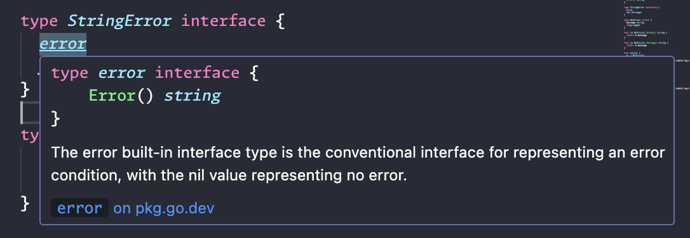
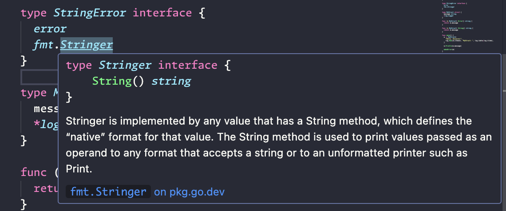

---
{
    title: 'Embedding Interfaces in Go',
    published: '2024-03-06',
    authors: ['rusher2004'],
    tags: ['go', 'testing'],
    description: "Creating tests can feel tedious, but doing it in Go can be, dare I say, *fun*. Let's take a look at how embedding interfaces clears some of that tedium for us."
}
---

I think about testing a lot. I've come to enjoy writing the tests for the things I build more than the things themselves.
A large reason why is because of how easy it is to do with the Go standard library, especially when it comes to mocking dependencies with the use of interfaces.
Here I'd like to show an example of how I make use of embedding interfaces to quickly create mocks for use in tests.

## Embedding in Go

Go doesn't do inheritance, but you can take a little shortcut to borrow from other types when you want to.
First, let's look at an example of embedding a struct:

```go
type MyStruct struct {
	message string
	*log.Logger
}

m := MyStruct{
    "Hello, Unicorns!",
    log.New(os.Stdout, "MyStruct: ", log.Ldate|log.Ltime),
}

m.Println(m.message)
```

We get to use the `log.Logger` struct methods on our struct without the extra verbosity of doing `m.Logger.Println` all over the place. Pretty handy!

You can also embed interfaces. Let's say that you want to make use of something that should satisfy both the [error](https://pkg.go.dev/builtin#error) and [fmt.Stringer](https://pkg.go.dev/fmt#Stringer) interfaces.
You could make a definition like this:

```go
type StringError interface {
	String() string // fmt.Stringer
	Error() string  // error
}
```

It works, but it doesn't quite communicate our intent to implement those existing and widely used interfaces.
To improve that, we can embed the interfaces.

```go
type StringError interface {
	error
	fmt.Stringer
}
```

That's better. Now, developers familiar with common Go types will see what you're intending to do.
Bonus points: your IDE will show you what those embedded interfaces define.

#### error



#### fmt.Stringer



## Defining and Using an Interface

Often, you will collect methods used across your Go package into interfaces you define. Let's take a look at an example to then see how we might need to implement or embed it elsewhere.

---

We have a program where we've created a `stuff` package and defined our own interface called `Thinger`. It says that, in order to be considered a Thinger, a struct must have at least two methods: 

- DoThisThing() (Thing, error)
- DoThatThing() error

```go
package stuff

type Thinger interface {
	DoThisThing() (Thing, error)
	DoThatThing() error
}

type Thing struct {
	ID string
}
```

And in this package, we have two functions that accept a `Thinger` as an argument, and uses its methods.

```go
func DoSomeStuff(t Thinger) (Thing, error) {
	out, err := t.DoThisThing()
	if err != nil {
		return fmt.Errorf("error doing some stuff: %w", err)
	}

	return out
}

func DoOtherStuff(t Thinger) error {
	err := t.DoThatThing()
	if err != nil {
		return fmt.Errorf("error doing that thing: %w", err)
	}

	return nil
}
```

These are simple and arbitrary examples, but it demonstrates a very common pattern in Go: **Accept interfaces, and return structs.**

Put that all together, and we have this package:

```go
package stuff

import "fmt"

type Thinger interface {
	DoThisThing() (Thing, error)
	DoThatThing() error
}

type Thing struct {
	ID string
}

func DoSomeStuff(t Thinger) (Thing, error) {
	out, err := t.DoThisThing()
	if err != nil {
		return fmt.Errorf("error doing some stuff: %w", err)
	}

	return out
}

func DoOtherStuff(t Thinger) error {
	err := t.DoThatThing()
	if err != nil {
		return fmt.Errorf("error doing that thing: %w", err)
	}

	return nil
}
```

Now, in our program's `main` package, we want to make use of the `stuff` package. so we make a struct `myThing` that implements `stuff.Thinger`.

```go
package main

import (
	"fmt"
	"log"
	"main/stuff"
)

type myThing struct {
	id string
}

func (m myThing) DoThisThing() (stuff.Thing, error) {
	return stuff.Thing{ID: m.id}, nil
}

func (m myThing) DoThatThing() error {
	return nil
}

func main() {
	m := myThing{id: "123"}

	t, err := stuff.DoSomeStuff(m)
	if err != nil {
		log.Fatalf("error doing some stuff: %v", err)
	}

	fmt.Println("did some stuff and got thing:", t.ID)

	if err := stuff.DoOtherStuff(m); err != nil {
		log.Fatalf("error doing other stuff: %v", err)
	}

	fmt.Println("did other stuff")
}
```

Looks good, let's ship it! 🚀

...

Except we should have some tests in place before we do, right?

## Mocking and Embedding in Tests

Let's talk about unit testing. In general, the goal is to test each of our functions for expected output based on some given input. Specifically, I like to create at least one test for the happy path, no matter how simple the function signature, and then create test cases around anticipated failures. Table-driven testing makes this super easy.

So let's put together some tests that will incorporate the interface embedding we've been looking at to tie all of this together.

---

In our `stuff_test.go` file, we can setup a mock struct to embed `stuff.Thinger`.

```go
type mockThis struct {
	stuff.Thinger
}
```

Which will then let us run tests against our functions. Let's start with `DoSomeStuff`.

```go
func TestDoSomeStuff(t *testing.T) {
	tests := []struct {
		name    string
		want    stuff.Thing
		wantErr error
		mock    mockThis
	}{
		// happy path
		{
			name:    "happy path",
			want:    stuff.Thing{ID: "123"},
			mock: mockThis{},
		},
	}
	for _, tt := range tests {
		t.Run(tt.name, func(t *testing.T) {
			got, err := stuff.DoSomeStuff(tt.mock)

			if tt.wantErr != nil {
				if err.Error() != tt.wantErr.Error() {
					t.Errorf("%s:\ngot error: %v\nwanted: %v", tt.name, err, tt.wantErr)
					return
				}
			}

			if !reflect.DeepEqual(got, tt.want) {
				t.Errorf("DoSomeStuff() = %v, want %v", got, tt.want)
			}
		})
	}
}
```

This test runs, and should succeed, right? Well, the compiler is happy, but we're going to get a nil pointer error because we left a piece out.

```sh
➜ go test ./...
?   	main	[no test files]
--- FAIL: TestDoSomeStuff (0.00s)
    --- FAIL: TestDoSomeStuff/happy_path (0.00s)
panic: runtime error: invalid memory address or nil pointer dereference [recovered]
	panic: runtime error: invalid memory address or nil pointer dereference
[signal SIGSEGV: segmentation violation code=0x2 addr=0x20 pc=0x10221ee38]
```

Unlike an embedded struct, an embedded interface doesn't come with anything, only its definition. Hence, a nil pointer is found where the `DoThisThing` method was expected to be. So, we need to implement the method we want to use.

Here's what that will look like for our `DoSomeStuff` test:

```go
type mockThis struct {
	stuff.Thinger

	exp stuff.Thing
	err error
}

func (m mockThis) DoThisThing() (stuff.Thing, error) {
	return m.exp, m.err
}
```

 Using the `exp` and `err` values let us setup and fulfill expectations in our test without having to do any heavy work to re-implement its logic. This is especially useful when you need to test functions that make calls to remote services like a database or third-party API.

 Now let's update our first test case to use a real value for its mock.

 ```go
 {
	name:    "happy path",
	want:    stuff.Thing{ID: "123"},
	mock: mockThis{
		exp: stuff.Thing{ID: "123"},
		err: nil,
	},
},
```

```sh
➜ go test ./...
?   	main	[no test files]
ok  	main/stuff	0.139s
```

Success!

Now it's super easy to add test cases.

```go
// happy path
{
	name: "happy path",
	want: stuff.Thing{ID: "123"},
	mock: mockThis{
		exp: stuff.Thing{ID: "123"},
		err: nil,
	},
},
// errors
{
	name:    "errors",
	wantErr: errors.New("error doing some stuff: something went wrong"),
	mock: mockThis{
		err: errors.New("something went wrong"),
	},
},
```

For more complex functions, you'll have a lot more test cases that produce various errors and return values. For now, let's finish out with some tests for `stuff.DoOtherStuff`.

```go
type mockThat struct {
	stuff.Thinger

	err error
}

func (m mockThat) DoThatThing() error {
	return m.err
}

func TestDoOtherStuff(t *testing.T) {
	tests := []struct {
		name    string
		wantErr error
		mock    mockThat
	}{
		// happy path
		{
			name: "happy path",
			mock: mockThat{
				err: nil,
			},
		},
		// errors
		{
			name:    "errors",
			wantErr: errors.New("error doing that thing: something went wrong"),
			mock: mockThat{
				err: errors.New("something went wrong"),
			},
		},
	}
	for _, tt := range tests {
		t.Run(tt.name, func(t *testing.T) {
			err := stuff.DoOtherStuff(tt.mock)

			if tt.wantErr != nil {
				if err.Error() != tt.wantErr.Error() {
					t.Errorf("%s:\ngot error: %v\nwanted: %v", tt.name, err, tt.wantErr)
					return
				}
			}
		})
	}
}
```

Nothing new or special here, but take notice that for each test I created a new mock, and only implemented the interface methods that I would need. This is possible because we won't encounter that nil pointer for a missing method error until a function is called at runtime.

This enables us to tightly couple our mocks to the tests that them. If you try to pack everything you need into a single mock struct, things get pretty messy as your project grows, and different tests bring new requirements. It also communicates *what* your mock is testing, which of course makes things more readable, but also helps your tests to serve as added documentation for your project.

## Wrapping up

To summarize, Go uses struct and interface embedding as tools to ***compose*** the behavior of our objects, instead of ***inheriting*** from things like superclasses.

We can use this behavior to keep our type definitions neat and succinct, and enable easy, yet still robust, testing of our packages.

Now go forth and test stuff.

> The above `stuff` example can be found on [GitHub](https://github.com/rusher2004/interface-embedding-go).
