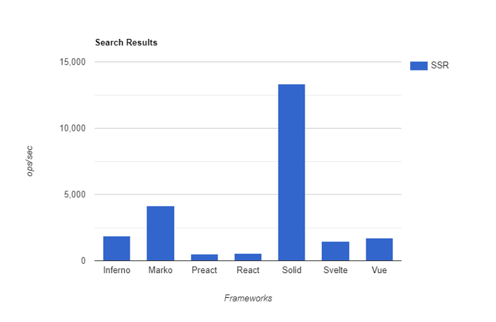

---
{
title: "5 Places SolidJS is not the Best",
published: "2021-04-06T16:24:00Z",
edited: "2021-04-06T17:57:40Z",
tags: ["solidjs", "webdev", "javascript", "webperf"],
description: "In this article, I wish to finally address the question \"What is Solid not as good at?\" The list migh...",
originalLink: "https://dev.to/this-is-learning/5-places-solidjs-is-not-the-best-5019",
coverImage: "cover-image.png",
socialImage: "social-image.png"
}
---

In this article, I wish to finally address the question "What is Solid not as good at?" The list might not be very long but it exists. No tool is the absolute best at everything. I think it is even more important to understand the shortcomings of our tool of choice than their strengths.

I spend a decent amount of time talking about the benefits of fine-grained reactivity and the power of wielding it in a purist way in [Solid](https://github.com/ryansolid/solid). But this doesn't come without trade-offs.

There are certain places where being fine-grained or reactive is not beneficial. Solid fully embracing these, unlike more hybrid solutions like Vue, has slightly different challenges.

You can judge for yourself if these are large enough deterrents.

# 1. The smallest in small apps

That honor goes to Svelte in trivial examples. Svelte has a very small runtime. They accomplish this by using a reactive system that doesn't need to manage subscriptions. Through compilation Svelte basically wires the reactions directly to the setters. This leads to more component code but has an incredibly small baseline.

While this means Svelte will quickly become larger than Solid as our trivial demo grows, a small VDOM library like HyperApp will be smaller for basic apps. A minimal VDOM library won't be much more than a 200 line `patch` function. This combined with small components is difficult to match.

Where granular reactivity makes a comeback is as things grow past this. As any library adds features their code grows. A minimal VDOM library does not stay minimal. Reactive libraries tend to re-use their primitives even for the library code. So while maybe the smallest baseline might be 500 lines of code, features tend to scale better.

Still, even if Solid has the smallest Realworld Demo and Hackernew clone, it will never have the smallest TodoMVC. 5.9kb minified + gzipped, might come in under Preact at 6.4kb, but will never touch Svelte at 4.0kb or HyperApp 4.9kb

# 2. Component Lifecycles

Ever wonder how Svelte is so good at animations. It builds these stages right into the component lifecycle. Look at what happens with a simple interactive hello world:

```html
<script>
  let name = 'world';
</script>

<h1 on:click={() => name = "Jo"}>Hello {name}!</h1>
```

Svelte compiles this to:

```js
/* App.svelte generated by Svelte v3.32.3 */
import {
  SvelteComponent,
  append,
  detach,
  element,
  init,
  insert,
  listen,
  noop,
  safe_not_equal,
  set_data,
  text,
} from "svelte/internal";

function create_fragment(ctx) {
  let h1;
  let t0;
  let t1;
  let mounted;
  let dispose;

  return {
    c() {
      h1 = element("h1");
      t0 = text("Hello ");
      t1 = text(/*name*/ ctx[0]);
    },
    m(target, anchor) {
      insert(target, h1, anchor);
      append(h1, t0);
      append(h1, t1);

      if (!mounted) {
        dispose = listen(h1, "click", /*click_handler*/ ctx[1]);
        mounted = true;
      }
    },
    p(ctx, [dirty]) {
      if (dirty & /*name*/ 1) set_data(t1, /*name*/ ctx[0]);
    },
    i: noop,
    o: noop,
    d(detaching) {
      if (detaching) detach(h1);
      mounted = false;
      dispose();
    },
  };
}

function instance($$self, $$props, $$invalidate) {
  let name = "world";
  const click_handler = () => $$invalidate(0, (name = "Jo"));
  return [name, click_handler];
}

class App extends SvelteComponent {
  constructor(options) {
    super();
    init(this, options, instance, create_fragment, safe_not_equal, {});
  }
}

export default App;
```

Notice that in the fragment it returns an object with a bunch of keys like `c`, `m`, `p`, etc... These are separate hooks into different lifecycles. You can see the lifecycle code right there. Svelte uses a `SvelteComponent` base class to define its component instance making it easy to manage.

Most VDOM libraries don't even have this ability to slice apart their render/update cycle. Solid by contrast has even less. The equivalent example:

```jsx
import { createSignal } from 'solid-js';

function App() {
  const [name, setName] = createSignal("world");

  return (
    <h1 onClick={() => setName("Jo")}>
      Hello {name()}
    </h1>
  );
}

export default App;
```

becomes:

```js
import { template, delegateEvents, insert } from "solid-js/web";
import { createSignal } from "solid-js";

const _tmpl$ = template(`<h1>Hello </h1>`, 2);

function App() {
  const [name, setName] = createSignal("world");
  const _el$ = _tmpl$.cloneNode(true);
  _el$.$$click = () => setName("Jo");
  insert(_el$, name, null);
  return _el$;
}

export default App;

delegateEvents(["click"]);
```

Our `App` is just a function call. There is no lifecycle here. We just have a single code path that clones our template and wires up an event and the content insertion. This is incredible for performance as Solid basically generates the same code someone handwriting Vanilla JavaScript with a reactive system would. This means almost zero overhead but there is no Component instance to tap into.

In Solid, all rendering and DOM interaction is a side effect of the reactive system. Even basics like mount/unmount are not based on DOM action. A reactive context is "mounted" when it has finished settling for the first time, and "unmounted" when its parent context is re-evaluated or removed.

This means that while it's possible to handle things like exit animations in a similar way to React or Vue using the reactive lifecycle the framework doesn't really keep track of the DOM in a way that is accessible outside of a user's own references.

# 3. Deep View Diffing

Fine-grained reactivity is not a diff engine. Any reactive system can be built to do diffing, but Solid uses granularity to avoid doing diffing. This is a large part of why it is so performant. Solid does less diffing than basically every other library out there.

For most things, you don't need to do view diffing. It just isn't necessary because the source of change can know what changed. For other scenarios, Solid has the means through a `reconcile` helper to diff the data rather than the view. This approach requires a bit more consideration for those cases but benchmarks have shown Solid to perform in line with the most performant VDOM libraries even in the tests catering to them.

But there are a few places where diffing actually is valuable and it becomes much harder in this scenario. Hot Module Replacement(HMR) is one. Where when doing Hydration during Server Side Rendering you expect the browser to reflect what was rendered on the server, for HMR it is a completely different sort of hydration. Things are being changed intentionally by the developer and the boundaries need to be at the module level. We don't get to make things more granular.

Preserving state in a reactive graph that treats the whole render experience (DOM and Components) as side effects makes it really challenging. Not to mention it is a dependency graph so any replacement of reactive nodes needs to propagate down the whole graph. It isn't hard to swap out branches but in place, swaps are very challenging.

React makes use of diffing for apply patches from its concurrent rendering and for its upcoming Server Components too. These aren't the only way to handle the problem. Solid's concurrent rendering uses a sort of quantum approach where each reactive atom used in a transition forks as the change progresses. Synchronous updates that occur between transition start and commit are then applied to each observed reality.

But React definitely has the simplicity advantage for these sort of problems when it can write and throw away at will knowing it can always diff the results.

# 4. Debugging

This one might just be a needs improvement and not a fundamental strike but I do believe the declarative nature of a library can make it harder to debug. While it is easier to reason about the way change occurs is more distributed.

Picture debugging HTML. One simply doesn't. A declarative system has relations that hold or don't. The execution of that code is queued up and no longer resembles the structure that it describes. Stepping through the engine has already lost track of why that work is queued.

But bugs do happen in user-written Solid code. There are number of imperative sections. Places where we accidentally wire up infinite loops or access reactive properties outside of reactive tracking.

Now the templates themselves are easy to debug as Solid puts all the DOM operations out in the open for the most part so you can see any issues. But this isn't where most bugs occur.

Visualization ultimately seems our way out but figuring out the best way isn't the easiest. Solid's components are basically non-existent and don't own state. The equivalent ownership hierarchy is based on control flow and is meaningless to end-users. The dependency graph, by comparison, can be huge. So large it provides no help unless look in small sections.

Unfortunately, approaches I've come up with to combat this involves changing the graph to fake components in dev mode, but that further changes the code that runs in development from production. I don't believe this is an impossible problem but it is definitely a difficult one.

# 5. Server-Side Rendering



Solid currently touts the fastest raw SSR speeds of any JavaScript Framework. With exception of Marko, which has respectable performance, often orders of magnitude faster. But that alone doesn't make much of a difference to your end-users. It will save your compute time in your serverless functions but not much else.

Progressive Rendering(streaming) and Partial Hydration make a much bigger impact. Solid has a form of Progressive Rendering. So that sets it apart from almost every other JavaScript framework today, but Partial Hydration in a natural way is a very difficult problem.

Without resorting to hacks like `.server.js` etc.. it is very difficult to determine intent. While Solid's explicit APIs allow for the greatest control and raw performance in either the server or browser, it is less analyzable than frameworks that build it into the language. Libraries like Marko or Svelte have the ability to identify statefulness and track how it is used through your whole application.

While we haven't seen a framework successfully pull this off as of yet, nor have an architecture granular enough it can leverage it, it will happen. For now, Solid will just have to be satisfied being the fastest raw renderer in the server and the browser, with the knowledge that it is theoretically possible that other frameworks will outperform it on the server one day.

# Conclusion

I think these are the most standout places where Solid's approach provides distinct limitations that aren't easily resolved. Not to say there aren't workarounds, but just these are areas that likely will always be less than ideal for Solid.

In some cases, no solutions today are particularly good so perhaps you shouldn't be concerned. But in others, we are dealing with the framework's fundamental nature.

And that's ok as long as you know what you are in for.


