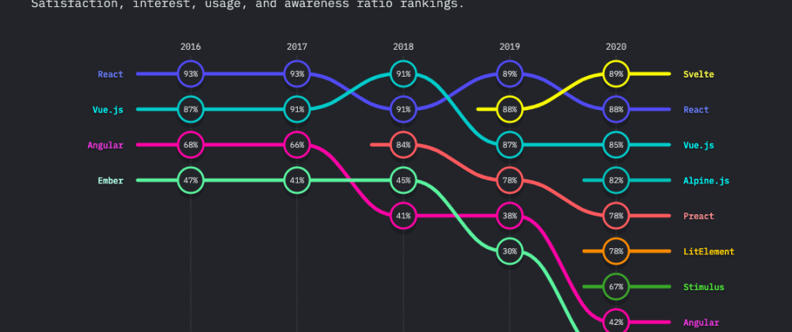
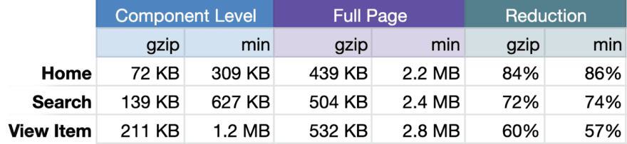

---
{
title: "Building JavaScript Frameworks to Conquer eCommerce",
published: "2021-07-14T14:42:07Z",
edited: "2021-07-16T18:40:07Z",
tags: ["javascript", "webdev", "marko", "astro"],
description: "There was a time that I would have never imagined the need to write an article like this. If you were...",
originalLink: "https://dev.to/this-is-learning/building-javascript-frameworks-to-conquer-ecommerce-3glc",
coverImage: "cover-image.png",
socialImage: "social-image.png"
}
---

There was a time that I would have never imagined the need to write an article like this. If you were to ask someone how a website worked, even 10 years ago, the answer would have been pretty simple. A site consists of a collection of HTML documents that reside at locations (URLs), that each describe how a page is displayed and provide links to navigate to additional pages. A web browser is used to request and display these pages.

But in the past 10 years how we build for web has evolved significantly. The paradigm has flipped so much that it is the traditional Multi-Page Application (MPA) that requires explanation now that Single Page Apps (SPA) are becoming the ubiquitous product.

When I talk about this I find many JavaScript developers don't understand the difference and how profound an impact it has. How Frameworks like [Marko](https://markojs.com/), [Astro](https://astro.build/), [Elder](https://elderguide.com/tech/elderjs/), or [Qwik](https://github.com/BuilderIO/qwik) are a completely different architecture than [Next.js](https://nextjs.org/), [Nuxt.js](https://nuxtjs.org/), or [SvelteKit](https://kit.svelte.dev/).

While SPA's bring a lot to the table, I'm going to talk today about where they are the less optimizable solution, and how that has been the motivation for a whole different sort of JavaScript framework.

---

## The State of Frontend JavaScript in 2021

The vast majority of JavaScript Frameworks are designed to help you make what we call Single Page Apps(SPA). [React](https://reactjs.org/), [Vue](https://vuejs.org/), [Ember](https://emberjs.com/), [Preact](https://preactjs.com/), [Svelte](https://svelte.dev/), [Solid](https://solidjs.com/), you name it. A SPA is simple an app where the whole experience is served from a single page sent from the the server(or CDN). This characteristic carries on in Metaframeworks built on top of these like [Next](https://nextjs.org/), [Nuxt](https://nuxtjs.org/), [Gatsby](https://www.gatsbyjs.com/), [SvelteKit](https://kit.svelte.dev/), [Remix](https://remix.run/), [Blitz](https://blitzjs.com/), etc..

The defining trait is that these are built around client-side routing. That is that the browser handles navigation after initial page load without sending HTML page requests to the server. The JavaScript then re-renders portions page. They can opt into using server-side routing but the application runs through a single entry.

These frameworks are really amazing to use and their use case has grown from their origins in admin dashboards and highly interactive apps, to branching into things like blogs, content sites, and eCommerce.

However, for these sites where SEO is important as well as initial page load we face a problem. We need to have the pages rendered on the Server so that content is present when the page first appears.

---

## Server Side Rendering to the Rescue?

Yes and no. Server Rendering is not free. No one wants to maintain multiple conceptual applications all of sudden because things are on the server now. Projects have been working at creating a universal JavaScript environment where your single application code base seamlessly works on both server and browser.

It can also be complicated to configure and host for different deployment environments. One easy solution is Static Site Generation. We can use the framework's server rendering to render static HTML pages ahead of time.

Now when the user requests the page it can send the already pre-generated page to the browser. Since it is static it can be hosted in a CDN and this loads really quickly. A lot of solutions in this space even advertise how they have this quick initial render and then afterwards the client navigation takes over.

But there are still a couple problems. First Static Generation doesn't lend to dynamic content. Sure nothing beats a pre-rendered page but if the page needs to customizable per person, and involves A/B testing different products etc.. the combinatorics get prohibitively expensive quickly. There are situations where this is fine, and solutions are looking at pre-rendering 10's of thousands of pages in parallel but for dynamic content it just can't keep up to date without great cost.

Even if that doesn't apply to your site the bigger issue is, Frameworks and libraries require a lot of JavaScript and that is expensive to load and parse even when the application is server rendered. Additionally, in order to make the application interactive in the browser JavaScript Frameworks need to hydrate or walk over their component tree in the browser to create the initial framework scaffolding and wire up event listeners. This all takes time and directly impacts end user experience.

Now we've seen these frameworks let you turn off JavaScript for certain pages but it's basically all or nothing. This is serviceable but we can do much better if we know that we are optimizing for First Paint and Time to Interactivity.

It really does beg the question. Are we ok with this?

<iframe src="https://x.com/n_moore/status/1415067187446960129"></iframe>

---

## Return of Multi Page Applications

So what does viewing apps as a collection of separate pages have going for it? Most of the content on the page never needs to be rendered in the browser.

How much of your page actually needs to be re-rendered? The answer is probably very little. How many points on the page can the user interact with? Probably not as many as you think, when you remove all navigation from from the picture. How about if you can remove all the async loading too?

This isn't necessarily no JavaScript(although it can be), just way less of it. You can see this is difficult for an application written as if it were all one big application. Code splitting doesn't really save you here. If the page shares a single root that renders top-down how can we view this thing independently? We can prune unused branches but not the trunk.

Very few frameworks optimize for this since they aren't setup to build this way. When you have chains of props running down through a component tree it's hard to break this apart. You really only have 3 options:

1. Don't. Manually break your page into a bunch of micro-apps or Islands. ([Astro](https://astro.build/))
2. Do all data passing through dependency injection. Every part of your page is independent and ship as needed. ([Qwik](https://github.com/BuilderIO/qwik))
3. Have a compiler smart enough to understand the statefulness of your application and output optimized bundles. ([Marko](https://markojs.com/))

These all require special consideration. The first requires you to identify the islands and only scales as well as you are diligent. The second forces you to push state outside of your components which puts a lot of pressure on DX, like can you pass `props.children`? Are there limits to what can be serialized? The 3rd is immensely complicated and requires specialized language and years of R\&D to pull off.

But the results are obvious. Here's a simple example of the impact the [Marko](https://markojs.com/) team saw when toggling this optimization off some eBay pages.

**The optimization has 60%-84% savings in JavaScript bundle size!**

Why so much? [Marko](https://markojs.com/) is not a huge library weighing in at 13kb minified and gzipped. Obviously you are saving on the component code but there is more. Having components only on the server also means certain API wrappers, and formatters like Moment and Lodash just never need to reach the browser.

[Marko](https://markojs.com/) no-bundle Streaming also helps in this case since it can serve the page immediately without waiting for async calls. It can stream content into server rendered placeholders in real-time all without pulling that code into the bundle.

---

## To the Point

If you need the cutthroat performance for that initial load like you do in eCommerce where milliseconds mean potential lost sales; Where you can't be guaranteed the network or the device power of your customers; You aren't reaching for a framework like [Next.js](https://nextjs.org/). It just isn't optimized for that. Even if you are using it with a smaller library like [Preact](https://preactjs.com/) here you still are doing way too much in the browser.

You might be thinking, what about things coming in React 18 like [Server Components](https://reactjs.org/blog/2020/12/21/data-fetching-with-react-server-components.html) and Streaming SSR? These can help but they don't change the physics alone.

Streaming SSR is incredibly powerful as seen already in [Marko](https://markojs.com/) and [Solid](https://solidjs.com) as it removes the initial delay on async data. You can remove most of the overhead of on-demand server rendering over static site generation this way, but it alone doesn't reduce the amount of JavaScript sent.

Server Components make it much easier to write customized APIs. This saves sending the Lodash and Moment to the browser, but you are still running client side diffs, the template is getting sent via API. You can view this as lazy loading/hydration of sorts, but it actually increases the core library size to handle it. If you think about it a different way, given Server Component rules these would just be the static parts an MPA would never be sending to the browser anyway!

---

## Conclusion

Right tool for the job. Yada yada. In all seriousness though, while I dream of a point in the future where this is all the same thing today, MPA frameworks can optimize in ways that are just not available to those building with SPA architecture in mind.

It doesn't take a different language or platform. I'm not saying pull out Rails or Django. You can still get that modern single application JavaScript execution and feel already with the tools available. But if you care about the greatest performance on your initial page loads you aren't going to find that with the likely candidates.

Next time you come across a new solution for eCommerce that promotes its speed. Ask if it is optimized for MPAs, because most likely if not, it is more of the same. There is a reason eBay, Alibaba, and Builder have invested in building their own JavaScript frameworks.

This isn't new but revisiting web foundations. But it's been a decade so maybe it's time. Don't get me wrong. I'm an author of one of those SPA frameworks. One that prides itself on being the [fastest of them all on client and server](https://dev.to/ryansolid/introducing-the-solidjs-ui-library-4mck). But architecture trumps raw speed almost every time when comes to delivering the best user experience. So depending on your use case [Maybe you don't need that SPA?](https://medium.com/@mlrawlings/maybe-you-dont-need-that-spa-f2c659bc7fec)
