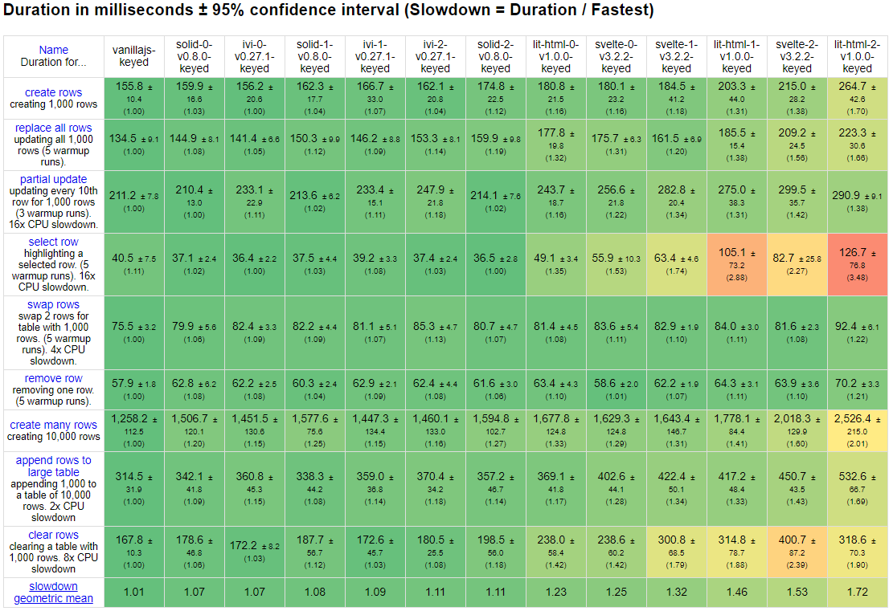

---
{
title: "Components are Pure Overhead",
published: "2021-05-10T17:13:15Z",
edited: "2021-05-10T18:47:33Z",
tags: ["javascript", "webdev", "react", "svelte"],
description: "A couple of years ago in the The Real Cost of UI Components, I explored the cost of components in Jav...",
originalLink: "https://dev.to/this-is-learning/components-are-pure-overhead-hpm",
coverImage: "cover-image.png",
socialImage: "social-image.png"
}
---

A couple of years ago in the [The Real Cost of UI Components](https://betterprogramming.pub/the-real-cost-of-ui-components-6d2da4aba205), I explored the cost of components in JavaScript frameworks. I asked whether components were just overhead?

And the answer was: it depends. The Virtual DOM library I tested, [ivi](https://github.com/localvoid/ivi), had no issues handling more components. But [Lit](https://lit.dev/) and [Svelte](https://svelte.dev/) were dramatically worse. They scaled back to almost [React](https://reactjs.org) levels of performance as I broke them down to more components. All their non-VDOM performance benefits basically disappeared.



> The versions scale from "0" having the least number of components, through "1" which has a component per row, to "2" where each `<td>` is wrapped in a component.

Luckily for both of those frameworks, almost all benchmarks can be written as a single component.

*But when was the last time you wrote an app in a single component?*

In their defense, 50,000 components on a page is a bit much. But this still illuminates an inevitable shortcoming we need to overcome. 2 years later I still stand by the conclusion.

> So I’m going to make a bold statement here for the Non-Virtual DOM crowd. I think Components should vanish in the same way as Frameworks. If the new world is compilers, we can do better. We can optimize along bundle chunk lines instead of ES modules. If Components are throw away think about how much overhead we could reduce by inlining them.

But I've come to realize there is much more to this than performance.

---

# Your Framework is Pure Overhead

This is not an appeal to the Vanilla JavaScript purists that lurk in the comments section on every site. Instead this an honest look at JavaScript frameworks from someone that builds them.

When one says the [Virtual DOM is pure overhead](https://svelte.dev/blog/virtual-dom-is-pure-overhead) they are often referring to unnecessary object creation and diffing. And Rich Harris, creator of Svelte, covers this topic well.

Of course, as shown above, there are Virtual DOM libraries faster than Svelte, so what gives?

Consider this example from the article:

```js
function MoreRealisticComponent(props) {
  const [selected, setSelected] = useState(null);

  return (
    <div>
      <p>Selected {selected ? selected.name : 'nothing'}</p>

      <ul>
        {props.items.map(item =>
          <li>
            <button onClick={() => setSelected(item)}>
              {item.name}
            </button>
          </li>
        )}
      </ul>
    </div>
  );
}
```

The criticism is that on any state update a VDOM is forced to re-render everything. Only change your selection, but you still recreate the whole list again. However, most performant VDOM libraries can recognize that most of these VDOM nodes never change and cache them rather than recreate them each render.

But more importantly, there is a solution to isolate updates that every React developer knows. No, it's not `useMemo`. Create a child component.

For the cost of almost nothing, a VDOM library can stop update propagation by wrapping this logic in a different component. A simple referential check of properties will tell it when to re-render. Unsurprisingly the VDOM can be pretty performant.

Speaking of `useMemo` some recent attention brought to the fact that [it probably shouldn't the be the first thing you reach for](https://overreacted.io/before-you-memo/). However, reactive libraries tend to memoize by default.

In React or any other VDOM library when you want to break out of the update cycle structurally, you split out components and lift state. To improve initial render performance with a library like Svelte, you do the opposite and remove as many intermediate components as possible.

Why? Because each component is a separate reactive scope. Often this means more than just creating the reactive scope. There is overhead to synchronizing updates between them. This is all corroborated by the benchmark at the beginning of the article.

While we were busy focusing on how VDOM libraries do all this potentially unnecessary work, we weren't paying attention to our reactive libraries doing all this unnecessary memoization.

*So yes, your Reactive library is pure overhead too.*

---

# Component DX > Performance

When I look at both approaches I see the same problem. The way we structure Components has too much say in how our applications perform. This is a problem.

*A component's purpose is more than just performance. The way our components are structured directly impacts the maintainability of our code.*

When you have too few components you end up duplicating logic. The typical component has state and a view. The more complicated the control flow you have and the more nested state is, the more you will find the need to duplicate that logic in both. When a new requirement arises, as simple as say toggling visibility, you find yourself creating that same conditional in multiple places.

```js
export function Chart({ data, enabled, headerText }) {
  const el = useRef();
  useEffect(() => {
    let chart;
    if (enabled) chart = new Chart(el.current, data);
    return () => chart?.release();
  }, [enabled]);

  return (
    <>
      <h1>{headerText}</h1>
      {enabled && <div ref={el} />}
    </>
  );
}
```

> How many different places are we doing additional checks due to `props.enabled`? Can you find all 4? This isn't React specific. Equivalent code in Svelte(and most frameworks) touches 3 locations.

Conversely breaking things up into too many components leads to heavy coupling. Too many props to pass. This is often referred to as [prop drilling](https://kentcdodds.com/blog/prop-drilling). The indirection can make changing the shape of that state surprisingly complicated. There is potential to continue to pass down props no longer used, to pass down too few that get swallowed by default props, and for tracing to be further obscured by renaming.

```jsx
function Toggle() {
  const [on, setOn] = useState(false)
  const toggle = () => setOn(o => !o)
  return <Switch on={on} onToggle={toggle} />
}
function Switch({on, onToggle}) {
  return (
    <div>
      <SwitchMessage on={on} />
      <SwitchButton onToggle={onToggle} />
    </div>
  )
}
function SwitchMessage({on}) {
  return <div>The button is {on ? 'on' : 'off'}</div>
}
function SwitchButton({onToggle}) {
  return <button onClick={onToggle}>Toggle</button>
}
```

---

# Vanishing Components


The future is in primitives. Primitives that are smaller than Components. Things like you find today in reactive systems. Things that might look like what you see in React Hooks and Svelte. With one exception. They are not tied to the component that creates them.

The power of fine-grained reactivity and the reason for [Solid](https://github.com/solidui/solid)'s unmatched performance are not fine-grained updates.  Too expensive at creation time. The real potential is that our updates are not tied to our components. And that goes beyond one implementation of the idea.

Between reactive models and these hooks, we have converged a language for change:

`State` -> `Memo` -> `Effect`

or, if you prefer, `Signal` -> `Derivation` -> `Reaction`. We don't need components anymore to describe our updates. This is the mismatch React developers intuitively feel with Hooks. Why do we need to keep track of both our components re-rendering and the closures over our Hooks?

And typical Single File Components(SFCs) are just the opposite extreme where we are still imposing (unnecessary) boundaries by technology. Ever wonder why there is friction between JavaScript frameworks and Web Components? Too much conflated on a single concept.

Every time we write a component there is this mental overhead on how we should structure our code. The choice doesn't feel our own. But it doesn't have to be that way.

---

# The Future is Component-less

Not that we won't write re-usable components or templates. Just components will vanish, removing their impact on the output. That doesn't require a compiler to start. We can move to make components no heavier than a simple function call. That is essentially [Solid](https://github.com/solidui/solid), but that is only one way to attack this.

We don't need separation to accomplish this either. It is unnecessary to hoist all our state into a state management tool playing puppeteer to our renderer. I'm proposing aggressive co-location. Modern frameworks have that right. Whether JSX or SFC we've been pulling it together and should continue to.

Ultimately, if a compiler could look beyond the current file it was processing to use language to understand your whole app, think of the doors that would open. Our logic and control flows could solely define the boundaries. That's not just unlocking levels of performance, but freeing ourselves of the mental burden of ever worrying about this again.

Wouldn't it be amazing to recapture the pure declarative nature of something like HTML in authoring our sites and applications? The unadulterated cut and paste bliss? I'm not certain where this goes, but it starts here.
