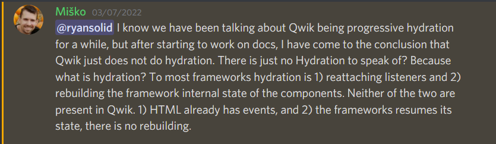

---
{
title: "Conquering JavaScript Hydration",
published: "2022-03-21T14:50:07Z",
edited: "2022-03-22T07:38:48Z",
tags: ["javascript", "webdev", "marko", "qwik"],
description: "That is an ambitious title for an article. An ambitious goal in general. Hydration, the process of...",
originalLink: "https://dev.to/this-is-learning/conquering-javascript-hydration-a9f",
coverImage: "cover-image.png",
socialImage: "social-image.png"
}
---

That is an ambitious title for an article. An ambitious goal in general. Hydration, the process of spreading JavaScript interactivity back into our applications after server rendering, has been regarded as the most challenging problem for JavaScript frameworks for the past several years.



For all the effort we've put into Server Rendering on the web, we still haven't found a universally good solve for balancing the developer costs with end user costs.

Regardless of how we optimize for server rendering, hydration hangs over us. That JavaScript that needs to be run on page initialization, that makes our First Contentful Paints deceptive, that adds first input delay no matter how much we progressively enhance, and only gets worse the larger or more complex our web applications become.

<!-- ::start:link-preview -->
[Why Efficient Hydration in JavaScript Frameworks is so Challenging](https://playfulprogramming.com/posts/why-efficient-hydration-in-javascript-frameworks-is-so-challenging-1ca3)
<!-- ::end:link-preview -->

Many have worked on the problem, contributing to various projects, all hitting different tradeoffs. Through them, we've seen the pieces of the puzzle come together. To that end, we are nearing a point where we can consider Hydration a solved problem.

---

## Finding Resumability

It was March 2021. We'd been staring at how to solve async data fetching for the next version of [Marko](https://www.markojs.com) for months but had decided to move on. We had already implemented most of our cross template analysis, a mechanism to generate metadata for each module, that any parent could use to understand exactly how what is passed to it would be used. Our handcrafted benchmarks showed the approach was very performant. It was time to just build the compilation.

But Michael Rawlings(@mlrawlings) couldn't get past this sinking doubt that we were doing the wrong thing. Not wanting to rely on caches to prevent unnecessary data fetching during hydration he proposed we just not. Not re-run any components. Not execute any reactive expressions we already ran on the server. But doing that was *not* simple.

The initial answer came from [Svelte](https://svelte.dev/). Svelte components slot all state into a hoisted scope and sort all expressions into appropriate lifecycles to avoid needing a reactive runtime.

So why not take that further if we can analyze across templates? As demonstrated by [Solid](https://solidjs.com) when components no longer are the unit of change we can unlock incredible performance. And the benefits of breaking down this work for hydration may be even more pronounced.

As long as this scope is globally available, then we can break apart our components into many pieces without them being tied together by closures. Every piece is independently tree-shakeable and executable. All we need to do is serialize this scope from the server as we render, and register any browser-only code to run immediately on hydration.

> I wrote about this journey in more detail in 

As it turns out we weren't the only ones to arrive at a similar conclusion. Within a couple of months, Misko Hevery(@mhevery), creator of Angular, revealed this approach to the world in his framework [Qwik](https://github.com/BuilderIO/qwik). And he'd done something better than us. He'd given the idea a name.

Resumability.

---

## Eliminating Hydration?

Fast forward to March 6th, 2022. Both projects have been working in this direction for about a year now. I was tasked that week with adding the `<effect>` tag to Marko 6. Yes, everyone's favorite hook.

Effects are fun as they live in userland and they have this quirky behavior in that they only run in the browser, as they are your opportunity to interact with the DOM. And you tend to want them to run after everything else which means inevitably some secondary queue that needs to run.

> You could use JSDOM on the server but I'd recommend against that. Severely slows down server rendering speed to be working with an emulated DOM when you could just be using strings ([How We Wrote the Fastest JavaScript UI Framework, Again](https://levelup.gitconnected.com/how-we-wrote-the-fastest-javascript-ui-framework-again-db097ddd99b6)).

So sitting there Monday morning in a meeting, we are agonizing about adding more runtime to handle the scheduling, when Dylan Piercey asks the obvious question.

*Does anything other than effects need to run in the browser at hydration time?*

We have event registration but it didn't do much as the events are all delegated to global handlers. Couldn't we just skip creating a hydrate export on any template that didn't run effects? If the end-user didn't register any effects at all do we need to run anything beyond a small script to bootstrap these global events?

While he and Michael continued working through the trade-offs of what it would mean for the compilation, I moved on to doing some performance benchmarks for various reactive queuing mechanisms where we'd noticed a bottleneck.

Misko sends me this message:

The timing was impeccable.

And he's completely right. Some people might want to argue the details. And it is justified. But it is more or less splitting hairs on definitions. We'd all been staring at these problems for a year now and somehow had completely missed the headline:

---

## Hydration is a Solved Problem

There are details here that need some ironing out. But it has gotten to a point where there is a clear path to only running browser-only code in the browser at hydration time. Nothing beyond a simple bootstrap to load global event handlers needs to run. No re-running of components. No component-specific code is required to be executed otherwise. Just "resuming" where the server left off.

This covers the execution part of the story. There is still the problem of data serialization, as resumability has the potential to increase it. The solution Marko is developing leverages the reactive graph, along with the knowledge that the root of the page is only rendered on the server, to automatically detect what data needs to be serialized.

Resumability is also independent of when we load the code in the browser. Qwik has been developing a granular means to progressively load only the code required on each interaction. The intention is that usage analytics could be leveraged to optimally bundle in the future.

So there are going to be differences between different solutions. And details to reconcile. But the bottom line is we've seen 2 approaches to this now, and there will be more in the future.

This is just the starting line. With hydration potentially a thing of the past, the next generation of web development starts now.

---

If you want to see what it's about today check out [Qwik](https://github.com/BuilderIO/qwik). It uses JSX and reactive primitives to make developing performant apps easy. Here is my recent interview with Misko:
<iframe src="https://www.youtube.com/watch?v=lY6e7Hw4uVo"></iframe>

If you want to see what I've been working on, you will need to wait a bit longer. We are looking forward to releasing our first version this summer when [Marko](https://www.markojs.com) 6 goes into beta.
<iframe src="https://www.youtube.com/watch?v=Y22xf8EjioE"></iframe>
