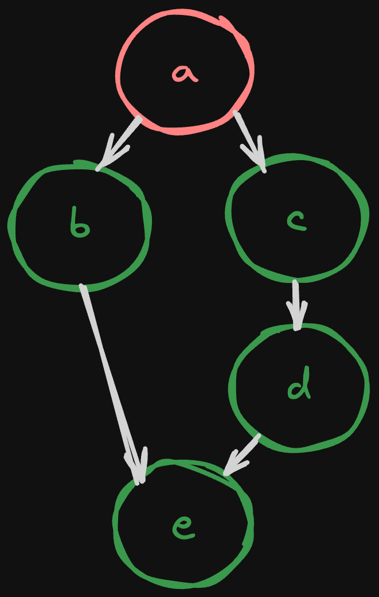

---
{
title: "Derivations in Reactivity",
published: "2024-01-19T08:00:00Z",
edited: "2024-10-22T21:50:15Z",
tags: ["javascript", "webdev", "reactivity", "signals"],
description: "There is a reason why the first time you learn about a reactive system the example always looks...",
originalLink: "https://https://dev.to/playfulprogramming/derivations-in-reactivity-4fo1",
coverImg: "cover-image.png",
socialImg: "social-image.png",
collection: "Derivations in Reactivity",
order: 1
}
---

There is a reason why the first time you learn about a reactive system the example always looks something like this:

```js
let name = state("John");

effect(() => {
  console.log("Hi" + name);
})
```

> *We will be using pseudocode not to cater to the syntax of a specific library or framework.*

It doesn't take much to understand that when I update this state an event happens that calls my side effect. It also isn't too difficult to implement this behavior yourself. But this is far from the full story.

Whether you are trying to forget React, explore runes with Svelte or are angling for Angular; whether you build Solid apps, construct views in Vue, or live in QwikCity this topic is relevant. It transcends the Virtual DOM or Signals. Before you decide that `useEffect` was created to be the bane of everyone's existence let's take a look at the most important part of reactivity: Derivations.

---

## Derivation vs Synchronization

You've probably seen derived values in your JS framework/reactivity system of choice. It may have looked like `useMemo` or maybe `computed` or maybe it was just behind a `$` which assigned a value. But the constant in all of these is you were told they were for producing a reactive relationship. A is the sum of B + C even if B or C changes:

```js
let a = state(1);
let b = state(1);

const c = memo(() => a + b);

effect(() => console.log(c));
```

They may have told you that a derived value should be pure--that is it should not write to any other state--but that rule applies to it internally too.

You may apply this as your mental model for derived state at first:

```js
function memo(fn) {
  let internal = state();
  effect(() => internal = fn());
  return internal;
}
```

But this would never work properly.

Most UI frameworks are concerned with providing interactivity. That is taking the input of a user's action, applying it to some state, and then updating the UI. We see that formalized as `ui = fn(state)` but it is a cycle that repeats.

In terms of reactivity, it looks like:

> update state ->
> run pure calculations ->
> run side effects (like updating the DOM)

The reason is an end user interacting with UI needs consistency. What they see (and can't see) should all be in sync. You can't be interacting with part of the page this out of date as it sets false expectations. UI libraries schedule their side effects to run all together synchronously to ensure the end user can trust the experience.

This means there are definite stages to when code runs. Libraries need to ensure that any dependent calculations are resolved before rendering.

Which leads to what exactly the difference is between:

```js
let name = state("John");
const upperName = memo(() => name.toUpperCase());

updateUI(name, upperName);
```

```js
let name = state("John");
let upperName = state();
effect(() => upperName = name.toUpperCase());

updateUI(name, upperName);
```

The first example is derivation where the derived state is a function of the state it depends on. The second example is synchronization, where a change in state causes other state to be updated. This is an important distinction.

In the second example, depending on your reactivity model different things could happen than simply showing everything immediately as expected. Depending on when the effect is scheduled versus UI rendering, when you update `name` you might briefly see an updated `name` and the previous value of `upperName` together. In a course-grain rendered framework like React your component might run twice. Because updating the state in an effect starts the loop over again.

---

## Glitch-less Consistency

Even if you can always synchronize before you render, you still have the potential to run expressions multiple times with values in different intermediate states, possibly unexpected states, until the graph settles. Derivations can provide predictability.

Many reactive systems now guarantee that for any state update, each node only runs up to one time and when it runs it is glitch-free. By glitch-free, the code the developer provides to the library can never observe an intermediate or out-of-date state.

Consider:

```js
let a = state(1);
const b = memo(() => a + 1);
const c = memo(() => a + 1);
const d = memo(() => c + 1);
const e = memo(() => b + d);

effect(() => console.log(e));
```

Or as a graph


Different systems run differently, but in all cases, we expect the initial run to produce `e` with a value of 5.

It is also clear that certain state depends on other state. When we update `a = 2`, regardless of mechanism we know `c` must resolve before `d` and `d` before `e` if we want to execute each node only once.

---

## Push vs Pull


So how do we approach this? It usually starts following one of 2 ideas. Scheduling(pull), and events(push). Let's look at each using the example from the previous section.

### Pull (Scheduling)

The idea is to start from the side effect (goal) and then ask for the values as it comes across them. React is generally regarded as having "pull" based reactivity. In this system when state is updated, it schedules a check to see if it has to do any work.

But what does it check? Naively, perhaps everything, as it doesn't know what has changed. However, many UI libraries deal in components. If state is owned by a component, then that can be the starting point. When the component state is updated, schedule that component to run.

Pull-based systems are coarse-grained. That is they rely on replaying everything top-down because they have no idea of what has changed. If we were to imagine a more granular "pull" system it could not know anything has changed until it is traced up to the source of that change which may or may not exist in its dependencies. That extra traversal is just extra work when ultimately it needs to run downwards anyway.


In our example, picture we run the effect that asks for `e` first. We have no idea if `e` has changed without running `b` or `d` before it. Explicit dependencies (like React's dependency arrays) can give a path upward without executing nodes. So we could trace back `e`, `b`, `a` and then run `b`, and then trace back `d`, `c`, `a`, and run `c`, `d`, `e` before finally running our effect. But given we are running the whole scope (component) anyway, even if part of it hasn't changed, this is all unnecessary.

Memoization (often in the form of derivations), allowing early exits, helps optimize this scenario but the approach, while consistent, is fundamentally inefficient.

### Push (Event)

The idea is that the update propagates outward from the source state that has changed. RxJS is a common example of "push" based reactivity. It would have every node subscribe to change events from its dependencies and then on notification, run and notify its observers if its value changed.

Consider a depth-first propagation as that mirrors how execution occurs when initially created.



`a` updates, notifying `b` and `c`. Then `b` runs and notifies `e`. Then `e` runs and sees the updated value of `b` but then it comes across `d` which hasn't run yet and has the old value...

Breadth-first has a similar problem as `d` and `e` are at the same distance from the source `a`, leading again to stale values. It would try to run `b`, `c`, then `e`, `d` only to find that `d` isn't evaluated before `e`.

"Push" based systems have a pretty hard time ensuring the guarantees we are looking for efficiently. Doing sorted inserts could work. But it will still do work even when no effects are listening at the end. It knows exactly what changes as it propagates but not what the impact of that change will be.

### Push-Pull

A 3rd option is to combine both techniques. Signals are the defacto "push-pull" reactive system. Subscriptions and notifications are made similar to "push" but work is scheduled similarly to a "pull" based system. In this way, only things that would change are scheduled and it remains consistent.

In our example on updating `a`, `b` and `c` are notified they could change, which in turn notify `e` and `d`. Finally, the effect that listens to `e` is queued. Then it is our effect that runs first pulling down the values as it hits them, similar to our hypothetical fine-grained "pull" system described above. Except this time only the effects that could be impacted are queued.

It knows what changed and the impact of those changes, ensuring we only do the required work.

If you are interested in more details on how push-pull algorithms work in various Signals libraries check out:

<!-- ::start:link-preview -->
[Super Charging Fine-Grained Reactive Performance](https://dev.to/milomg/super-charging-fine-grained-reactive-performance-47ph)
<!-- ::end:link-preview -->

---

## What Can Be Derived Should Be Derived


I am not 100% sure where this first came from, but I first heard this quote from Michel Westrate, creator of MobX. These are words to live by.

It should go without saying at this point the consistency we have come to expect from our libraries and frameworks would not be possible with only state and effects. When an effect writes to state you no longer can walk up the graph of dependencies to know what needs to be calculated. The dependency is gone. It isn't just inefficient. It's error-prone.

This is a deep topic. So much so I've only touched the surface. There are other implications of "push" vs "pull" and there are a lot of details even when looking at systems that fall into the same category. Next time, we will look at lazy vs eager derivations and the potential for handling async.

---

Special thanks to Atila Fassina, Fabio Spampinato, and Daniel Afonso for reviewing.
