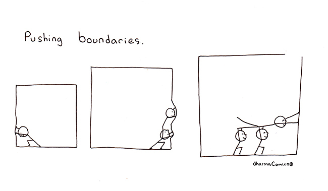

---
{
title: "JavaScript Frameworks - Heading into 2023",
published: "2022-12-29T20:09:40Z",
edited: "2025-12-12T18:20:34Z",
tags: ["career", "productivity", "discuss"],
description: "The wonderful thing about glimpsing into the future is that the path is never completely clear. We...",
originalLink: "https://dev.to/this-is-learning/javascript-frameworks-heading-into-2023-nln",
coverImage: "cover-image.png",
socialImage: "social-image.png",
collection: "34445",
order: 1
}
---

The wonderful thing about glimpsing into the future is that the path is never completely clear. We can look at trends, and look at innovations and try to chart a course. Better still we can be part of those innovations to guide the direction. But nothing is certain.

2022 had a ton of big releases that push web development forward. We saw the 1.0 releases of both Astro and Sveltekit. SolidStart, and Qwik entered Beta. React 18 was released adding streaming support that found its way into Next and Remix, as well as powering React Server Components and the Next 13 app directory. And I'd be remiss to skip the impact TypeScript has had on how we design framework solutions. From tRPC and Tanstack Router to the opinionated Next.js meta-framework create-t3-app.

---

## How We Got Here

"Focus on the Server", they said. "Solve the tradeoffs of Single Page Apps", they said. This isn't new, but what often isn't understood is how it isn't a panacea.

Server Side rendering allowed us to render pages sooner by fetching data sooner (and usually closer to our data source), but it wasn't without compromise. It slowed down our response times and didn't help with the ever-growing size of JavaScript bundle sizes. It often actually increased our bundle sizes as now we need the code not only to client render but to hydrate the page.



There are some partial solutions: We can cache more aggressively, stream our HTML responses, and we can invest in smaller/faster frameworks. There are some red herrings: We can think progressive enhancement is a substitute for hydration or that moving away from client-side caches meaningfully changes the math. Spoiler: It doesn't.

I'm not convinced everyone is on the same page yet, but many leading minds in the space actually agree on a particular thing. This is not something to take lightly.

---

## Where We Are At

> Single Page Apps aren't the most suitable architecture for everything.

I mean this shouldn't come as a surprise, but after the past decade, it takes some convincing. And perhaps I need to elaborate a bit on what I mean by Single Page App. I mean any of the typical JavaScript client routed and rendered architectures. Even the ones that boast server rendering. Everything from React, Next, and Remix to Vue and Nuxt, through Sveltekit, and SolidStart.

This is a natural evolution. Create a solution that pairs great UX with great DX and people want to take it with them everywhere. Even where it doesn't belong. Where is that? Well, any place that cares about page load performance to make its bottom line, any place that cares about low-end devices and networks, and arguably anywhere the complexity isn't justified.

If I could sum up the greatest alignment between framework thought leaders in 2022, it is that routing belongs on the server.



We're not suggesting we do away with client-side routing (although that is an option). Just that client-routed and rendered architectures are pressed again the limits of where they can be effectively used.

Whether you are looking at Marko, Astro, or Fresh and their Islands of interactivity, or Next and SolidStart's Server Components you see the server stepping up on routing duties. Rendering the next page in response to navigation after the initial load. Even Qwik, which could legitimately start as an optimized partially loaded application and scale up to full-blown SPA, prefers server routing(MPAs) in all their examples and demos.

---

## Reflecting on 2022

### Conquering Hydration

With server rendering being the focus, it is no surprise that hydration has been a topic of importance. This is a cost that we pay for every server-rendered application that is authored with a declarative JavaScript framework. Or so we thought.



Both Qwik and early Marko 6 resumable demos showed that hydration is something that one day soon may be something in the past.

### Hybrid Nesting Routing

Before the end of 2022, we saw 2 experimental technologies that seem to offer the best of both worlds. We get client-side navigation paired with after-the-fact server rendering. Next 13 app directory saw Server Components paired with Nested Routing.

I wrote about Solid's approach which blew bundle size expectations out of the water.



While not everyone is sold on Server Components it's hard to argue with delivering significantly less JavaScript than even the smallest SPA frameworks are capable of while maintaining that SPA UX. It's a testament that another way drastically reduce Hydration is simply not to send the code.

### Signals Everywhere



Fine-grained reactivity has made a comeback in 2022. The Vue community would (correctly) tell you that for them it never went out of style. But only in the past year have we seen it make its way in a much wider scope and under the new banner of Signal. From Solid's unique fine-grained renderer to Preact and Qwik using it to augment their Virtual DOM solutions. Marko 6's compiler shows how fine-grained reactivity can be compiled in a Svelte-esque way and even the Angular team is strongly looking into adding these primitives.

### TypeScript Driven Development

2022 saw TypeScript go from being an option to the default to many meta-framework CLIs.

Having type-safe APIs across the client-server boundary isn't even a consideration anymore. tRPC was a game changer, but over the year we saw this being considered in JavaScript meta-frameworks. From SolidStart's compiled type-safe RPCs to improvements to Remix and Next's data loading mechanisms.

Tanstack Router showed us what type-safe routing looks like and now there is no turning back. We are still seeing these technologies propagate outwards but the gains are so significant people will not accept developing the way they did before when these technologies exist.

---

## Forward to 2023

### Wrangling in Complexity

This will continue to be a theme coming into the new year. You don't dump a bunch of innovation in a space in a short time and not expect something to give. Astro and Remix's return to "it is just PHP/Rails" for MPAs and SPAs, respectively, have been largely successful, even if they both lack important benefits of more sophisticated solutions.

Having spent a lot of time in Qwik and Marko for MPAs and React and Solid's flavor of Server Components for hybrid-routed solutions, there is something that still needs to be learned here. When a custom language server plugin is the only way to keep Server Components in check, or you need to be an expert on where serialization boundaries happen in your code, you need to start questioning things.

These technologies are the future. But we need to remember we aren't the first ones to try this. Backend technologies were tried in the mid 2000s, and instead, we largely moved to SPAs. We need to answer "What's different this time?"

And it might still come down to answering the question: Do we believe that what could be shipped to the browser, should be eventually, or is the server a place we should uniquely leverage? As the barrier between MPA and SPA melts away it's quite possible this division just takes a new form.

### Edge: The Unexplored Frontier

Edge function support has rolled out to pretty much every meta-framework over the past 12 months. At this point, the vast majority of them can deploy to a variety of serverless and edge offerings. However, that hasn't changed how we develop.

We are quick to point out that data isn't on the edge. And we should assume that not all data will be on the edge even as solutions solve for it.

The edge needs to move beyond monolithic deployments. We need to figure out how to distribute compute to where it makes sense. I am not talking about micro-frontends or micro-services. But monolithic authoring with distributed deploys. I'm not sure what that looks like but I'm sure we will find out in the next 12 months.

### Other Technologies

> Will 2023 finally be the year of Web Components?

About as likely as it will be the year of the Linux desktop. Take that how you will.

> Will 2023 be the year of WASM?

Probably not yet. But quietly WASM has been finding itself applicable in more spaces than ever. That includes DOM rendering. The overhead we thought we understood was not what we thought and the fastest WASM Rust libraries have closed the gap with JavaScript on client-side rendering.



Page load is still a prohibitive metric for many things, but you can still do progressive enhancement with WASM. So if it's good enough for Remix it might be good enough for you.

> Will AI/No-Code take my job in 2023?

No. But it might help you migrate your code from one framework to another.

---

## Conclusion

No one has a crystal ball but it doesn't take one to see we are at a time of change. New frameworks have been emerging in the last year or so after about 5 years of relative silence for good reason. It isn't that we stopped making them, but the time is right.

Even the big players are flirting with ecosystem resetting technologies like Server Components, new Virtual DOM-less compilers like Vue Vapor, and new change mechanisms like Signals.

But there is no clear direction yet. Existing approaches are at their limit. Radical new approaches are incomplete and pass complexity on to the developer in whatever form they take. Attempts to bury this in meta-frameworks have only been somewhat successful.

Developer experience expectations have never been so high while the demand on user experience isn't lessening. So whether you are waiting for the next revolution or living at the bleeding edge, buckle up because you are in for a ride whether you signed up or not.

---

Banner credits: ©️ Original concept artwork (https://www.artstation.com/artwork/nqrYo) by Alex Feliksovich based on Ghost in the Shell.

---

**Appendix**

If you are unclear on any of the terminology and technology I refer to in this article I recommend:

