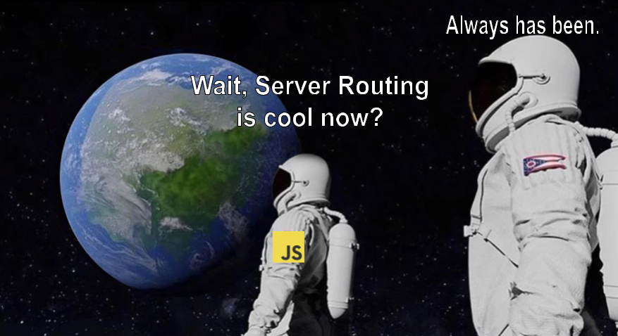

---
{
title: "JavaScript Frameworks - Heading into 2024",
published: "2023-12-21T22:44:48Z",
edited: "2025-12-12T18:20:53Z",
tags: ["webdev", "javascript", "webperf", "frameworks"],
description: "I won't be the first to say it, but I will say it nonetheless, 2023 was quite the year for JavaScript...",
originalLink: "https://dev.to/this-is-learning/javascript-frameworks-heading-into-2024-i3l",
coverImage: "cover-image.png",
socialImage: "social-image.png",
collection: "JavaScript Frameworks - Heading Into XXXX",
order: 2
}
---

I won't be the first to say it, but I will say it nonetheless, 2023 was quite the year for JavaScript frameworks. Between new technologies we've been watching finally showing they can deliver, and older frameworks making a resurgence if you weren't paying attention you may have missed a pretty significant shift.

I anticipate that 2024 will continue to see even larger changes across the board. This time it isn't about new technology, but refinement. Now that the base is present there is so much more to deliver on.

---

## Server First

If I were to pick a theme for the past couple of years this would be it. This has been a source of contention, but it is undeniable. A few short years ago everyone was talking about Progressive Web Applications and offline first. But that dialog has all but disappeared.



Instead, we are subject to the sharp wit of HTMX explaining why JavaScript is just a mistake. And Astro unapologetically taking over content site development. Even the React Core team embraced the simplicity of server with React Server Components, expressed convincingly by Dan Abramov's talk that looked into what if React had always been Server first.

<iframe src="https://www.youtube.com/watch?v=zMf_xeGPn6s"></iframe>

So what happened to our Single Page App darling in such a short time? Is it still alive or do we live in the age of Multi-Page Apps and server-rendered HTML only?

---

## Reflecting on 2023

Last year I wrote a very similar article looking at the trends in JavaScript frameworks coming into the new year and I think that is a good place to start.

<!-- ::start:link-preview -->
[JavaScript Frameworks - Heading into 2023](https://playfulprogramming.com/posts/javascript-frameworks-heading-into-2023-nln)
<!-- ::end:link-preview -->

The three major technology trends identified in that article became a significant part of the discussion this past year.

### Signals Everywhere

What started at the end of 2022 with the adoption of these Reactive primitives by Preact, and Qwik, following in the footsteps of SolidJS and Vue, only continued stronger into 2023.



In February, the Angular team announced their adoption. This announcement shook social media. Not only that. It was one of a few factors that played into a very notable change in Angular's presence. One some even call it an Angular Rennaissance. And it was the first time in the past few years that we saw the React team join the fray as the very real question being asked was, "Signal's in React, When?".

There is a lot longer answer to that question that I wrote about in the following article (and a discussion with Dan Abramov in the comments).

<!-- ::start:link-preview -->
[React vs Signals - 10 Years Later](https://playfulprogramming.com/posts/react-vs-signals-10-years-later-3k71)
<!-- ::end:link-preview -->

But the short answer is Signals, at least as an API, is not something they are interested in, and their much anticipated "Forget" compiler would be serving a similar role.

Signal propagation didn't end there though. Lit, the web component framework from Google, unveiled [Lit 3 with first-party support of Signals](https://lit.dev/blog/2023-10-10-lit-3.0/#preact-signals-integration). And Rich Harris unveiled the future of Svelte, [their new Signals-based "Runes"](https://svelte.dev/blog/runes), to be the main source of reactivity in the upcoming Svelte 5.

Ending 2023 Signals are a major part of most front-end JavaScript frameworks.

### Hybrid Routing

Server-based routing has stepped up and taken on a new role this past year. Again starting from the end of 2022, and coming into its own this year, we've seen people get used to this paradigm shift with things like React Server Components and [Astro's View Transition API integration](https://astro.build/blog/astro-3/).

The premise is that server rendering after initial page load shouldn't prevent client navigation and client navigation shouldn't mean that we need to send all the JavaScript to render parts of the page that could be statically server-rendered.

It is important to note that not all solutions are equivalent and this is an area that is still very much under construction. We are moving into a new space that isn't quite a Single Page App and isn't quite a traditional multi-page site. There are new tradeoffs and new understandings to be had. And we are in no way done navigating the pitfalls.

### Edge Networks: The Final Frontier

Edge functions seem like one of those obvious wins. Move your server closer to your end user and you drastically reduce latency. Use a lighter runtime and you drastically reduce cold start time. We finally can deliver the web experience we've always dreamed of. Dynamic at the speed of Static.

Well if anything 2023 was a year of growing pains with the edge. We started incredibly enthusiastic. After all, Cloudflare was releasing Edge Databases, all our favorite providers started offering Edge functions, and our favorite frameworks were adding out-of-the-box support. The providers had formed a committee WinterCG to talk about standardizing the platform. The future was here.



Where we ended up was the realization that certain Node APIs were essential even in these edge functions. You can thank or hate Next and Vercel for pushing `AsyncLocalStorage` into every runtime, but we needed it.

We also realized Edge Databases would never suffice for all applications. And even with streaming, Server Waterfalls are real and impactful. Yes, even with React Server Components.

But this did forward the goal I put forward last year, of monolithic authoring with distributed deploys. We saw Server Functions(`server$`, `use server`) and even variations like Worker Functions show up early in the year to show that we could distribute how we deploy our APIs, adopted by Solid, Qwik, and Next.

By the end of the year [Next 14 released the new experimental Partial Pre-rendering](https://nextjs.org/blog/next-14) which allowed a single request to serve static content from the edge while proxying through to Server-less Functions closer to the database all being streamed to offer an Edge-like experience without deploying your whole app there. It is awesome to see some ingenuity offer a best-of-both-worlds solution.



---

## Forward to 2024

### The Year of Signals

I know I've talked about Signals enough for one article already, but the real payoff hasn't happened yet. We've had fine-grained Signal-like primitives in JavaScript for 15 years, so why now?



It isn't about just having them, it's about what you do with them. Vue has had these primitives under the hood for years, as has React with MobX but that barely touches on where things are heading. And that thing is fine-grained rendering. What was popularized by SolidJS, now is finding its way into Vue in the form of Vue Vapor, and Svelte in Svelte 5. And these are just the ones that have been announced.

I expect the others that have adopted Signals to work them more natively into the framework to better benefit from them.



There is so much excitement in this area on the potential, the group working on the TC-39 proposal for bringing Signals into the browser includes representatives from every major JavaScript framework, a group not always associated with working closely with standards.

### Infrastructure-Led Development

Now that Server side rendering frameworks have gotten a shot in the arm the next logical place to go is to continue to look at maximizing what this new capability gives us. Standards are slow and WinterCG will take some time, but that will not stop the flow here.

To differentiate I expect pressure for frameworks and infrastructure providers alike to offer unique features that may only work on specific platforms. While 2023 saw a push for equalization across providers to offer similar features beyond their base static and function hosting--things like Key Value Storage Blobs--I only see the competition here to provide unique value heating up.

Frameworks' role in this is to keep a consistent authoring experience and mental model while finding ways to leverage the new abilities presented to us. It isn't unlike browser wars of the late 2000s and there is still a lot to come.

### AI

Last year was too early to talk about AI from a framework standpoint. And next year might be too. But it is on the horizon. Code migration and generation tools are all great ideas but they suffer the same issue we've had for years with visual No or Low Code editors. Human interface points are still essential. After all, code is a living thing. It grows and is maintained over time.

Talking with other framework authors the past year we've seen it catch the fascination of those around us, but hadn't gotten to a point where it was clear our role in this. But that is changing.



Yes, that AI is answering the eternal question of why your application is slow.

The impact on developer tooling is one thing. But we are also seeing increased potential of real-time being built into our frameworks. I don't just mean Websockets for persistent backends either. APIs in meta-frameworks have evolved beyond simple JSON to fully streaming cross-network JavaScript execution with "Server Functions" in SolidStart, Qwik, and Next. It isn't hard to picture generative technologies creating your UI in real time.



---

## Conclusion

2024 is likely to continue on the maturing trend we've seen in the last couple of years. From 2020-22 we saw a lot of new JavaScript(and WASM) frameworks (Qwik, Million.js, Astro, Next 13, Remix, Hydrogen, SvelteKit, SolidStart, Leptos, Dioxus, HTMX), but that hasn't been the case the last year. We've found the approaches and now we need to take them to their full potential.

I'm not sure we've succeeded at wrangling the complexity yet, which gives big nods to solutions that simplify like Astro or HTMX. But I'm still hopeful.

It may be too much to expect everyone to agree on what exactly a "Single Page App" is or when they should be using the various options laid in front of us, but every day these solutions are getting more capable of delivering on what they set out to do.

It is no longer a question of whether web development as we know it is going to change. Even if the direction isn't completely clear, the revolution is already here. Look forward to seeing you there.
