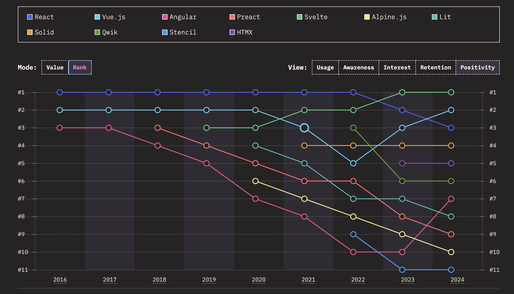
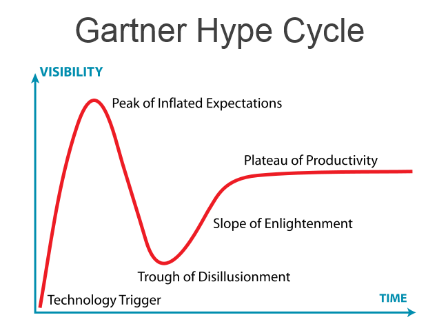

---
{
title: "JavaScript Frameworks - Heading into 2025",
published: "2025-01-06T17:13:46Z",
edited: "2025-12-12T18:21:15Z",
tags: ["webdev", "javascript", "webperf", "frameworks"],
description: "I admit I wasn't sure I'd be writing this article this year. It's easy to write articles that excite...",
originalLink: "https://https://dev.to/playfulprogramming/javascript-frameworks-heading-into-2025-hkb",
coverImg: "cover-image.png",
socialImg: "social-image.png",
collection: "JavaScript Frameworks - Heading Into XXXX",
order: 3
}
---

I admit I wasn't sure I'd be writing this article this year. It's easy to write articles that excite people about the potential of new technology. But 2024 was a year of coming to terms with reality.

The past several years have been an exploration to discover the unknown. We entered this year excited. It was finally time for these advancements to find refinement. They have. But one thing is abundantly clear:

> The quest for simplicity hasn't resulted in making web development simpler.

Clearly, some things have become easier to do but the overall picture hasn't simplified. We already knew this. But something changed in 2024 aided in part by pressure from the global economy tightening budgets and keeping solutions on the safe path. I think it has finally been acknowledged there are no silver bullets. Difficult problems are difficult to solve.

It isn't just that the tools are complicated but the problems. It has taken hitting obstacles around every corner while going back to basics to only re-invent the wheel to return to that fundamental place.

It is a sobering thought but it gives me hope in 2025 that we can take some time and re-evaluate. And that starts with reflecting on 2024.

---

## The Promise of the Server

Making things "server-first" has been the narrative over the last 5 years in the front end. This is not a new concept, the web was born on the server, but after a decade of client-centric single-page apps, it was clear the pendulum had swung too far. Especially for page load-sensitive websites, which did not benefit as much from increased interactivity.

The pandemic only amplified this with both the rise of online shopping habits and the influx of capital driven by low interest rates. The result is we got a bunch of new server-first meta-frameworks like SvelteKit, Astro, Remix, SolidStart, Qwik, Fresh, and Analog along with significant upgrades to existing ones like Next and Nuxt.

The last couple of years have seen SPA-influenced isomorphic (same code runs differently on client/server) approaches up against MPA-influenced split-execution (Islands/Server Components) approaches in a search to find a universal solution for all. It is an exercise of two opposites trying to approach each other in the middle. This has resulted in amazing developments in routing like Next App Router and View Transitions Routing, as well as technology like Out-of-Order Streaming, Server Functions, Optimistic Updates, Server Islands, and Single-Flight Mutations. But even so, the gap remains larger than anyone imagined.

When you assemble all these features, things are not so simple anymore. And it is arguable whether we are even solving the problems we set out to:

<iframe src="https://www.youtube.com/watch?v=nzbV0YgSBuo"></iframe>

It has been incredibly difficult to measure success. We've seen benchmark fails:

<iframe src="https://x.com/Rich_Harris/status/1828514851741933689"></iframe>

We've seen performance attributed to new technologies when the root cause was elsewhere:

<iframe src="https://x.com/RyanCarniato/status/1818402060238565722"></iframe>

Not wanting to wade through this mess, has led the conversation back to more traditional server approaches. Ones that exist outside of "SSR". Ones where you aren't trying to run a client JavaScript framework on a server. This has always been a great choice for projects where it makes sense. But it is also uninteresting.

We wouldn't be where we are if there wasn't a need to improve upon what came before. And that can take a lot of trial and error. The simplest tool for the job is the correct answer, but when the problems cease being simple you will want options that scale with you.

If 2021/22 was a reset to a simpler base, a return to our beginnings on the server, 2024 reminded us that simple doesn't always cut it.

---

## Compilation to the Rescue

Compilation is an ever-present aspect of JavaScript development. Whenever we've hit an obstacle, whether it be browser feature support, clunky syntax, or the ability to address the language's shortcomings we build a compiler for that.

It is so ubiquitous at this point Standards committees are considering going that direction to introduce new features. Compilation and through extension bundling is the core of how modern JavaScript applications are created. It is also the root of most complexity in JavaScript tooling.

The benefits are immense. Types, Linting, Treeshaking, Code Splitting, Minification, Isomorphism, Macros, DSLs, Monolithic Authoring/Distributed Deployment. Every advancement in the past 15 years in this field has been built on this foundation. There is no alternative that could even remotely be considered adequate by comparison. Call it unfortunate. Call it a limitation of the JavaScript language. Call it necessary complexity. But to deny this is futile.

However, if we want to understand complexity it is at least important to understand its source. The most interesting development in 2024, thanks largely to both the release of the React Compiler and Svelte 5 Runes is how muddled the conversation has gotten.

On one side we have the React Compiler, an auto-optimizing compiler, that transforms code in a way that reduces unnecessary re-execution without manual intervention. Very similar in principle to the Svelte 3 compiler released back in 2019. And on the other, you have Svelte 5 Runes which brings a syntactual sugar over a fine-grained Signals renderer similar to what SolidJS released back in 2018.

These are two major compiler projects that couldn't be more different that called into question the fundamental nature of both projects. React acknowledging that re-renders do matter enough to optimize around. Svelte traded away its minimal syntax for a more expressive language with increased capability and a better fundamental basis for performance. Ironically, these stances are both exactly opposite of their initial selling point.

<iframe src="https://x.com/onlyspaceghost/status/1704497139131314638"></iframe>

And interestingly both choices come at the expense of increased complexity in tooling compared to their existing approaches.

The verdict is still out on whether these will ultimately be good moves for these projects. The common ground is the foundation we build upon continues to get more complicated as we attempt to create solutions to make development easier.

---

## AI and Dev Tools

If compilation and bundling are fundamental, it is clear at this point these are foundational pieces for giving AI the tools it needs to create very dynamic solutions in the future. While we are seeing a bigger impact every year on what these tools are capable of in improving our local developer experience, AI's impact on JavaScript frameworks themselves is still minimal.

Early in the year, we saw Devin make headlines by creating simple apps. Although it did call into question what our expectations are from this technology. Is it simply enough to make something functional or does it need to be good?

<iframe src="https://x.com/RyanCarniato/status/1767652623640072658"></iframe>

In that sense technology like Vercel's v0 has been largely a success at creating prototypes. Maybe that is where the biggest benefit is for now.

MillionJS developer Aiden Bai got our attention again with React Scan which scans your application for performance issues.
<iframe src="https://x.com/aidenybai/status/1858543720788042121"></iframe>
While one might argue that re-renders aren't necessarily a sign of a problem or that this exercise of finding re-renders in React is like shooting fish in a barrel, it definitely opened my eyes to the potential of development tooling just around the corner.

If tasks are complicated and core tooling more complex it makes sense that supporting tools rise up to meet that. It is more than the [shift left in development](https://www.swyx.io/language-servers). The need is fully integrated across the whole spectrum. While Biome (and previously Rome) set out this goal newer players in the space like VoidZero (from Vue/Vite creator Evan You) show that this foundation is essential for where things go next.

---

## Looking Forward

### Server-second

We already have started seeing some of the swing back of the pendulum towards the middle of 2024 with SPA modes in Sveltekit, SolidStart, and Remix. Remix ported back their non-server functionality to React Router. SolidStart's additive approach to Server Functions and Single Flight Mutations laid down the eventual foundations for Tanstack Start a React framework built on the same principles.

<iframe src="https://x.com/tannerlinsley/status/1861124006621184041"></iframe>

We've also seen an increase in local-first/sync engine technology. How that is to manifest itself is still left to be seen, but I expect it to be a continuing trend into 2025.

### Slow & Steady Wins the Race

One thing that caught me looking at the results of the JavaScript Survey this year is that in the sea of growing dissatisfaction with our tools some have shown more positivity growth than others. This differs slightly from say Retention(Satisfaction) which is focused on current users of the tool and caters to smaller players (SolidJS and Svelte have sat on the top of that list for years).

They aren't the tools I talk about as much, but when the economy is tight and maintenance a concern, they tend to shine. Both Vue and Angular are frameworks I'd have my eye on this next year. Not because I expect to be blown away by some innovation here, but because these tools go the extra mile in making developers happy. Sometimes the best tool isn't the "best" tool.

### Signal Growing Pains

It is no secret that pretty much all non-React frameworks run off Signals now. But some time has passed and developers are starting to understand the depths of tradeoffs present. While it is this author's biased opinion these are minor issues, I do expect people to come to a new appreciation for React. It's an appreciation they should have probably always had and that doesn't excuse any of React's flaws. But everything is a series of tradeoffs and you can only appreciate the choice you've made once you understand both sides.

That being said Signals are still evolving. The collective experience in this area has grown immensely the past few years. I expect the collective result of smaller innovations over the next year will showcase the unique value prospect of this approach in ways we've never seen.

### Web Components

...[Just kidding](https://dev.to/ryansolid/web-components-are-not-the-future-48bh).

---

## Conclusion

Unlike previous years I'm not predicting some big technology leap in the next 12 months. I don't know if the community at large would be that accepting. I've watched the conversation devolve from whether Resumability makes sense vs Partial Hydration to who has the best templating syntax again. This is a part of the cycle that lends to reflection and innovation on the horizon. But not today. And that's okay.

We have a lot of complexity to catch up with. A lot of hard decisions to make on what technology is worth our investment and effort. The raw capabilities for the next generation of solutions exist now but I'm not sure we've seen the right combination of pieces yet in a consumable form. But at least we are beginning to acknowledge that in our quest for simplicity, we set ourselves on a path to add back that complexity in new ways.

A single solution hasn't shown itself. HTMX is not going to take over the world, but it is a great option to have. React isn't necessarily any more complex at doing things than other solutions. Async and Client/Server interaction by extension is a complex thing. Compilers can't solve all issues. But they can do a lot:

<iframe src="https://x.com/RyanCarniato/status/1795501182024323316"></iframe>

We live in a world full of complexity and that doesn't appear to be changing any time soon. So 2025 feels like a good time to hunker down and get stuff done.

And, for those looking for the next great thing? Look around. There are plenty of interesting problems to solve. Between you and me, this is the type of environment I thrive in.
