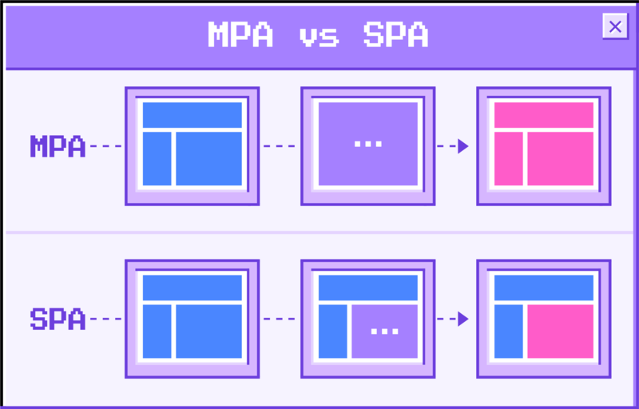
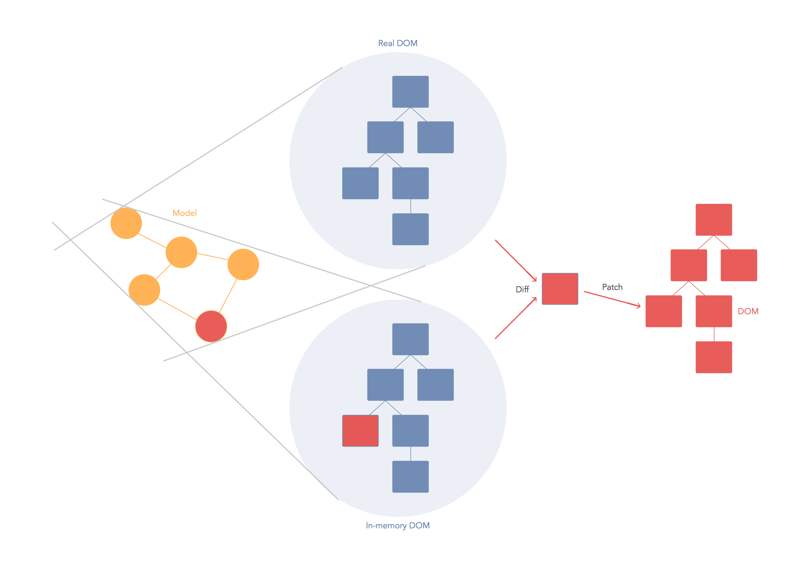
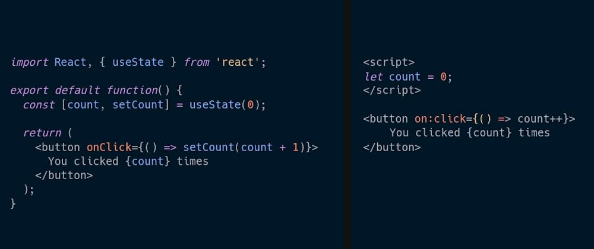
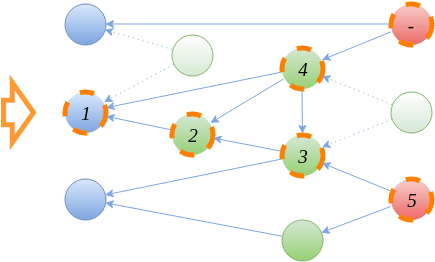

---
{
title: "JavaScript vs JavaScript. Fight!",
published: "2021-08-19T14:12:54Z",
edited: "2021-09-10T23:40:52Z",
tags: ["javascript", "webdev", "react", "frameworks"],
description: "With software development, we are often presented with alternative choices for libraries and tools...",
originalLink: "https://dev.to/this-is-learning/javascript-vs-javascript-fight-53fa",
coverImage: "cover-image.png",
socialImage: "social-image.png",
collection: "14561",
order: 1
}
---

With software development, we are often presented with alternative choices for libraries and tools that appear to accomplish the same sort of things. Each one will advertise its key advantages, and we attempt to weigh the pros and cons.

Sometimes, the differentiators have less to do with what we are accomplishing and everything with how we accomplish it. In those cases, it isn't always as clear what the tradeoffs are. Are these things that even matter?

There isn't a rule here. Finding myself in the middle of these discussions regularly I thought I'd share a few around JavaScript web development.

---

## 1. MPA vs SPA

Single Page Apps vs Multi-Page Apps is by far one of the biggest sources of confusion I've seen for the web. There are so many different patterns that exist for building websites and applications it is far from clear what people even mean by these terms.

Historical considerations aside, the simplest heuristic for identifying between a Modern SPA and MPA is the concept of JavaScript entry point. If it is the same for all pages you have a SPA. If each page has its own topmost entry it is an MPA.

Your bundler might produce different chunks per page but if your application starts from the same point regardless of the page you have a SPA. You can pre-render it into 1000 different pages. You can preload the per page chunks for each. You can even turn off client-side routing. It is still a SPA architecturally. Single application execution defines behavior for all pages.

[Next](https://nextjs.org/), [Gatsby](https://www.gatsbyjs.com/), [Nuxt](https://nuxtjs.org/), [SvelteKit](https://kit.svelte.dev/), you name it falls into this category. Single Page App architecture applies to server-rendered pages and statically rendered pages just the same.

So what's an MPA then? A website or application that is written from the top at a per-page level. You can use the same components across pages but there is not a single entry point. When the server receives a request and serves that page the JavaScript execution entry is unique to that page.

This means your routing is server-side. While a SPA can opt into this from a top-level architectural perspective an MPA must function this way since it doesn't have the code immediately or lazily loaded to render any page other than itself. Some tradeoffs are worth an article in itself. But in short, MPAs having no expectation of being re-rendered in the browser can be optimized to send significantly less JavaScript.

In JavaScript land, only a few frameworks are optimized for this scenario. [Marko](https://markojs.com/) is one. And recently we've seen frameworks like [Astro](https://astro.build/) and [Elder](https://elderguide.com/tech/elderjs/) provide wrappers for existing SPA frameworks. Albeit ones that only support static rendering for now. And [Qwik](https://github.com/BuilderIO/qwik) as new framework from the creator of Angular also coming to answer the question.

It's worth mentioning, MPAs are each pages themselves so they could always host a SPA on a given page. And through iFrames or other HTML injection frameworks like [Turbo](https://turbo.hotwired.dev/), it is possible to serve an MPA off a single page.

The key takeaway is that SPA vs MPA isn't about how many pages you are serving. It is a decision you make depending on how important initial load performance(MPA) is versus future navigation experience(SPA). Either approach has tools to improve their weaknesses but each is fundamentally tailored to optimize for their primary usage.

---

## 2. React vs Reactivity

You've probably heard somewhere [React](https://reactjs.org/) is not reactive. Maybe someone thought it was a funny joke. You know, [React](https://reactjs.org/) is in the word Reactive. Maybe you read a blog post that got into the fundamentals of push-based observables versus scheduling. Maybe you saw a framework advertise itself as "Truly Reactive" or "Purely Reactive" as a differentiator from React.

Here is the thing. There have been many attempts to formalize what Reactive programming means. Some are more narrow than others. So much so that even within reactive circles we've needed to differentiate between "Functional Reactive Programming" and "Functional + Reactive Programming".([source](https://medium.com/@andrestaltz/why-i-cannot-say-frp-but-i-just-did-d5ffaa23973b))

The common thing driving all these solutions is they are systems based on declarative data. You code in a style that describes the state in terms of fixed relationships. You can think of it as equations in a spreadsheet. The guarantee is that with any change everything stays up to date.

If this sounds like pretty much any web UI development you've worked with it's for good reason. HTML is declarative and we build on top of it. At this point in terms of frameworks being reactive means any number of things.

Some take it to mean you have control over the primitives to wire up behavior, but it would be hard not to consider [React](https://reactjs.org/) Hooks in this way.

Some take it to mean that updates happen automatically without calling an update function, but these libraries like [Svelte](https://svelte.dev/) do in fact call component update functions behind the scenes.

Some take it to mean granular updates without diffing. But every framework diffs (more on that below). Or that it means we remove scheduling but almost all frameworks batch changes and schedules them on the next microtask.

So React might not be formalized reactive programming but for all effective purposes, the same things are being accomplished in, perhaps surprisingly, almost the same way.

## 3. VDOM vs No VDOM

Does old become the new new? Well, sort of. All rendering in JavaScript frameworks comes down to knowing what has changed and updating the DOM accordingly. The update part can be done pretty effectively with familiarity with DOM APIs. All frameworks have access to these tools. But what about knowing what has changed?

Believe it or not, this process is similar in the majority of frameworks. The reason is reading values from the DOM does not come without consequence. In the worst case, it can even cause premature layout calculations/reflows. So what do we do? We store values outside of the DOM and compare those. Has it changed yes? Apply updates. Otherwise no. This is true of all libraries VDOM or not.

But how we go about this is where the differences lie. There is 2 axis along which solutions differ:

1. Granularity of change - How much do we re-run in response to the user changes
2. What are we diffing - data, VDOM abstraction

For a VDOM library, like React, the granularity of change is per component. On the first run the code you supply to render functions or function components executes and returns a bunch of Virtual Nodes. The reconciler then creates the DOM nodes from that. On subsequent runs, new Virtual nodes are diffed from the previous Virtual Nodes, and updates to the existing DOM nodes are patched in.

For a non-VDOM library, like [Svelte](https://svelte.dev/), the granularity of change is also per component. This time the compiler has split create and update paths. On the first run, the create path creates the DOM nodes and initializes locally stored state. On subsequent runs, it calls the update path which compares the values of state and patches the DOM where applicable.

If these processes sound incredibly similar, it's because they are. The biggest difference is that the VDOM has an intermediate format for diffing instead of just a simple locally scoped object and [Svelte](https://svelte.dev/)'s compiler just compiles only the needed checks in. It can tell which attributes change or which locations child components are inserted.

Other frameworks like Tagged Template Literal [uhtml](https://github.com/WebReflection/uhtml) or [Lit](https://lit.dev/) don't use a compiler but still do the diff as they go in a single pass like Svelte versus React's two pass approach.

These traversals don't need to be expensive. You can apply similar optimizations to VDOM libraries as we've seen with [Inferno](https://infernojs.org/) and [Vue](https://vuejs.org/) using compilation. In so they prevent recreating VNodes similar to how a non-VDOM library avoids unnecessary creation of DOM nodes. It is all about memoization, whether of VDOM nodes, data objects, or through reactive computations.

So what is the meaningful difference? Not very much. Diffing isn't that expensive. The only thing left we have to play with is the granularity of change, if ideal diffing and updates are about the same cost all we can do is do less diffing. But granularity generally brings heavier creation costs. Thankfully there is a lot more optimization to be done with compilers to address those creation costs.

---

## 4. JSX vs Template DSLs

This probably seems similar to the last comparison and it is related for sure. Some people view JSX as HTML in JavaScript, and Template DSLs or Single File Components(SFCs) as JS in HTML. But the truth is these are all just JavaScript. The output, in the end, is JavaScript with maybe some string HTML in there somewhere.

So if the output is more or less the same how are these different? Well, they are becoming exceedingly less different. A framework like [Svelte](https://svelte.dev/) has full access to JavaScript in its Script tags and template expressions. And JSX while dynamic still has contiguous blocks that can be analyzed statically and optimized.

So where is the difference? Mostly around what can be inserted. Attributes are easy to analyze and optimize, but what goes between the tags in JSX could be a few things. It could be text, it could DOM elements, it could components or control flow. Ultimately though it's text or DOM elements.

So a template DSL removes a little bit of the guesswork with what is being passed here which otherwise requires a check every time. But that isn't huge savings. Even with JSX, you have some ability to look at what the JavaScript expressions are doing. SolidJS uses heuristics to determine if something could be reactive.

The biggest benefit of Template DSLs is the explicit syntax for control flow can make it more easily optimizable for different targets. For instance, a `for` loop is more optimal than `map`. If you are rendering on the server just creating a giant HTML string, something as small as that can improve performance by a noticeable amount. But that is just a simple abstraction.

But outside of these sort of scenarios there really isn't any differences fundamentally. Sure most Template DSLs don't have equivalent to React's Render Props, but they could. [Marko](https://markojs.com/) does.

---

## 5. Runtime vs Compiled Reactivity

This one might be a bit more niche but it's still a question I get often. What's the difference?

It comes down to dependency tracking. Runtime reactive systems like [Solid](https://solidjs.com), [MobX](https://mobx.js.org/), or [Vue](https://vuejs.org/) collect dependencies as their computations run. They intercept reactive atoms(signals, refs, observables) reads and subscribe the wrapping scope to them. So that later when those atoms update they can re-run these computations.

The key thing is that since the dependency graph is built on the fly they are dynamic. They can change run to run, and in so you are managing a set of dependencies. Every run means potentially new subscriptions and releasing others.

Compile-time figures out the dependencies ahead of time. In so, there is no need to manage subscriptions as the relationship is fixed. The code runs whenever the dependency changes. This has far less overhead at runtime. And even means that computations don't need to run to know their dependencies.

However, these dependencies aren't dynamic so there is always a chance of oversubscribing and over executing. Situations, where runtime can pull reactivity from a deep call stack, become harder because you can't know if something is reactive without tracing its bindings.

This works both ways though. If you were to put a setTimeout in an effect, with runtime reactivity by the time it executes it would not be in scope. With compile-time, if it's inside the function it's easy to register the dependencies. Similar considerations when you update values. [Svelte](https://svelte.dev/) looks for an assignment operator which is why `list.push` doesn't just work.

There is a lot to be done with the compiler and it is easier to do some things than others. In the end, for the most part in terms of raw performance, this is mostly a wash. But a compiler can bring a lot of other benefits when you can leverage specific syntax to better convey intent. This is the next logical step over template DSLs and I think we are just scratching the surface here.

---

## 6. Components vs Web Components

I want to open this by saying if there is one takeaway here, don't assume the word component means the same thing to everyone.

I've been on both sides of this. I used Web Components in production for 6 years at the startup I previously work at and I've also worked and written Component frameworks. To me when people compare these they are talking about very different things.

A Web Component is very much a Custom Element in every sense. It is a DOM node that encapsulates behavior with a common interface. We get attributes and convenient hooks to write custom behavior on creation, and when attached and removed from the DOM. The latter 2 lifecycles are important because they are complementary. It means that for the most part all side effects are tied to DOM connectivity.

What is a Framework Component? To paraphrase something Rich Harris once said, they are tools to organize our minds. Now that's abstract. But that's the thing. When you look at components in frameworks, they are abstract. They might output DOM elements, or not. Their lifecycle is not tied to the DOM. Some manage state, they are rendered on the server or maybe mobile. They are anything the framework needs them to be.

The first is an interopt story, the second an organization story. Are these congruent goals? To a point. But neither will compromise on their primary purpose. And in so they are destined to stay in their lanes. I mean you can add more framework-like behavior to Web Components but then you become a framework yourself and no longer are standard. But as soon as you take the solution farther, like SSR you are inventing new territory.

This can be argued to be ground for new standards but I'd argue that standards development isn't an exercise in building a framework for the browser. Opinions change, technologies evolve. In the web, the DOM may be timeless but the way we organize our applications is not.

On the framework component side, there is no lack of incentives to take the abstraction further. The truth of the matter is a specific solution can always be more tailored to the problem. And in so a React Component is always going to be capable of being better in a React App than a Web Component. And this is true for any framework.

When people talk about re-inventing the wheel, they aren't wrong but how much does this matter. In this petri dish of JavaScript frameworks constant re-invention is the catalyst to evolution. Ideally, we are talking about 2 sides of the same coin. In practice, there might be more friction there.

This isn't a "use the platform" or "don't use the platform" argument. Web Components have a role to play as long as we clearly understand the difference. Every framework uses the platform. Some are just better than others. And some better than Web Components can. After all Web Components are just Custom Elements. And sometimes more DOM nodes are not the solution to the problem.

---

It was fun to dive into a few topics that I've gathered opinions on over the years. If you have any ideas of similar comparisons let me know in the comments.
