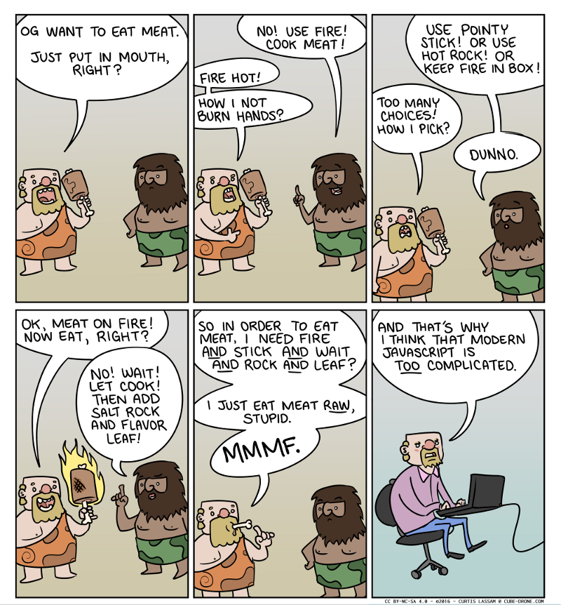
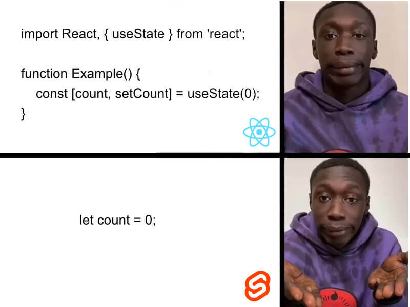
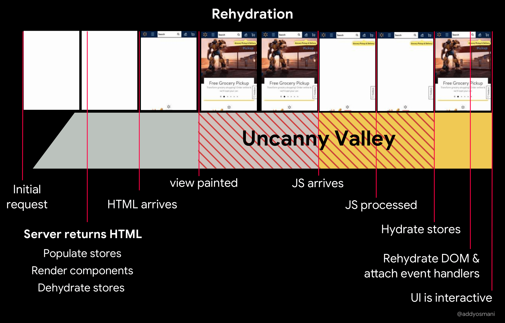

---
{
title: "JavaScript vs JavaScript: Round 2. Fight!",
published: "2021-09-17T14:01:56Z",
edited: "2021-09-17T14:20:31Z",
tags: ["javascript", "webdev", "frameworks", "react"],
description: "After I finished the first article I wasn't sure how long it would be before we'd have enough topics...",
originalLink: "https://https://dev.to/playfulprogramming/javascript-vs-javascript-round-2-fight-2m44",
coverImg: "cover-image.png",
socialImg: "social-image.png",
collection: "JavaScript vs JavaScript",
order: 2
}
---

After I finished the first article I wasn't sure how long it would be before we'd have enough topics for the next round. But given the continuing atmosphere around the JavaScript ecosystem, many of these topics just fell on my lap.

So let's get this started. Fight!

---

## 1. Build vs No Build



Several years ago I read a great article(which I can't seem to find anymore) that saw JavaScript being at a crossroads. That "the language" of JavaScript was at odds with what the author considered "the machine". I barely appreciated the nuance in the take but standing here now it all makes sense.

For some of us old-timers, our first introduction to JavaScript was through viewing the page source on public websites. We saw something we liked we'd just copy it. And the web being the open platform it is we embraced this freedom.

Fast forward 15 years later and we're trying to support some ancient browser while lamenting all the new features we know are coming out. So what do we do? Compile. CoffeeScript, and later Babel. And our desire to build native experiences has meant more and more JavaScript so we minimize and we optimize our bundles.

And now over 25 years after the launch of the web, we've been doing this for over 10 years. Almost half the time JavaScript has been around. So which is the truer JavaScript?

I've been calling JavaScript a meta-language for several years. We use JavaScript to rewrite how other JavaScript executes to the point now, that looking at some source code you see in a random Github repo, you don't really know what you are going to get by the time it gets to the browser.

Is that good or bad? Not sure. But it's definitely a thing. The ecosystem has become ingrown feeding off itself. Machine writing the machine. Our compilers are more advanced. Our tooling is more sophisticated. Do we even know how to write without these? Do we even need to?

Well according to some it's time for the great collapse. The native platform has improved greatly over the same period of time and is more capable than ever. But can it dead code eliminate all the concurrent mode code out of the core routines of a reactive library based on what the end application imports? Can it analyze cross templates how all state is used in declarative views to determine exactly what JavaScript needs to be sent to the browser?

No. Not even close.

Ever wonder why Bundle-less tools like [Vite](https://vitejs.dev/) still pre-bundle `node_modules`? How [Svelte](https://svelte.dev) can resemble plain HTML, CSS, and JavaScript but do so much more? Tooling is becoming so ingrained we don't even think about it. It keeps "shifting left" moving right into our IDEs.

But that might be alright if you don't need any of that.

As the author of the original article concluded it's too late to stop the machine. What tools offer us paint a world of developer experience we can only imagine in our dreams. We don't need to give up UX for this DX either. More tools don't mean more JavaScript in the browser. In the next several years I expect it to mean less. Much less.

But what is great about the web is we can always just turn it off. `index.html` anyone? You won't find me in that lineup. But who knows with import maps and native ESM you might even feel like exposing your unminified source to inspire the next generation of JavaScript developers anew.

---

## 2. Framework Specific vs Framework Agnostic


Framework Agnostic. I mean that's the dream, right? We've been trying to achieve this for decades. So why aren't we here yet?

As much as people we like to generalize, if frameworks were all the same there wouldn't be so many. At best being framework-agnostic is catering to the lowest common denominator. It isn't just about syntax. [React](https://reactjs.org)'s concurrent mode, [Svelte](https://svelte.dev)'s animations, [Marko](https://www.markojs.com)'s automatic partial hydration, and progressive rendering... the list goes on. The wider the net the harder it is to generalize and to optimize.

And these differences are usually rooted in fundamental philosophies and architectures. Every decision has tradeoffs and we can't expect everything to align. Even when you have things that look as similar as [React](https://reactjs.org)'s Hooks, and [Solid](https://solidjs.com)'s Reactivity. Every decade or so the trends and the patterns change and adapt. Would you be happy to use jQuery plugins in your declarative modern SPA framework?

So what does framework-agnostic actually mean? Well, it just means we have a new framework. This is a great approach to gaining adoption and it can consolidate on like things. If all things are equal wouldn't you take the most efficient option? If you were going to use Web Components to create your cross framework micro-frontend design system would you author them in [React](https://reactjs.org)? Would you use [Preact](https://preactjs.com) perhaps?

Over time the agnostic thing will naturally consolidate on the most optimal underlying means that most align with its philosophy and goals. And at that point, you have to evaluate whether the wrapper actually adds sufficient value.

The thing is it is always possible to write a better version of a framework-agnostic thing when you make it specific. Interop definitely has value and a sense of future-proofing, but done wrong it's akin to over-engineering. The avarice that we can predict the future.

Even true when sufficiently complicated things are presented as standards or part of an official platform. As long as there are options some people number of people will gravitate to the most efficient way to accomplish something or what fits the guiding principles they are working under.

There is nothing wrong with that and like any pendulum, we really need both parts, experimentation/growth, and consolidation/standardization. Just, I wouldn't be so sure that either side presents more stability over the long term. Ultimately all things need to be adopted to ensure survival.

---

## 3. Language Primitive vs Composition



Composition is King. Or was it "Never bet against ~~JavaScript~~ composition"? As a framework author this is something I hold near and dear. Composition lets you build simple and extendable things without adding complexity. Being adaptable is much better than being flexible.

So what does this have to do with JavaScript. Well, frameworks have been working hard at reducing the experience of describing UIs to first principles. Regardless of approach frameworks have landed on the language of reactivity as those building blocks. Call it reactivity, hooks, composition api, they all have 3 concepts:

State - observables, refs, signals, atoms
Derivations - computeds, memos, selectors
Reactions - effects, autorun

Even if we don't name it like [Svelte](https://svelte.dev), we have the same 3:

```js
let x = 0; // state
$: y = x * 2; // derivation
$: console.log(`${y} is double ${x}`) // reaction
```

So are all of these the same? Well not quite. [Svelte](https://svelte.dev) went the way of language keyword versus [React](https://reactjs.org)'s use of functions. It isn't unlike the difference between:

```js
for(let i = 0; i < list.length; i++) {
  doSomething(list[i])
}

// and
list.forEach(item => doSomething(item));
```

What's the difference? Well once you want to abstract our list iterator here you can no longer call it with the same `for` syntax. Instead we need to use functions like `forEach`. In fact you can make `myForEach` with the exact same signature. And do so ad nauseum.

Know what else is composable? Components. They weren't always part of the frontend framework landscape, but since their introduction have been ubiquitous. You might use `list.map` somewhere but `<VirtualList>`, `<PaginatedList>` also extend the pattern forward in a composable way.

Like `for` loop, template helpers like [Svelte](https://svelte.dev)'s `#each` are language level instead of composable. This allows for a dedicated and clean syntax. But when you move to `<PaginatedList>` it requires a completely different syntax([Slot Props](https://svelte.dev/tutorial/slot-props)). And [Svelte](https://svelte.dev) isn't alone. Most template DSLs have gone this way with their control flow.

So who cares? Well there is something incredibly powerful about the framework provided primitives and the end user creations being the same. It provides a simplicity in its consistency and makes extensions feel native. If you've used `useState` you know how to use `useLocalState`. If you've used `<For>` you know how to use `<PaginatedList>`. It isn't special.

The best part is if you don't like what is provided with composable APIs you can create your own and have it feel first party. It lets developers own their experience and drive the ecosystem entirely on what fits their usage. [React](https://reactjs.org)'s Components and Hooks have been incredibly successful for this reason. And though I've been using Svelte as the counterpoint, Svelte Stores are good at this as well.

Language level primitives do have benefits. They are often easier to analyze which lends to compilers being able to optimize. So I look forward to seeing how developers look to incorporating the best of both worlds without too much compromise. So far that's things like [Vue](https://vuejs.org)'s [ref sugar](https://github.com/vuejs/rfcs/discussions/369) and [Marko](https://www.markojs.com)'s [Tags API](https://dev.to/ryansolid/introducing-the-marko-tags-api-preview-37o4). It's definitely something to keep an eye out for.

---

## 4. Runtime vs Runtime-less Frameworks


Ok, I admit it. This one is complete bait. It would be interesting to see a truly runtime-less JavaScript framework with a significant feature set. But these don't really exist and for good reason.

To clarify, I'm not talking about frameworks that enable not sending JavaScript to the browser. I am talking about ones that make heavy use of compilation to do work ahead of time. The term "disappearing" or "runtime-less" has floated around but it is hyperbole.

Re-using code is good. You don't want to compile away the framework completely as that can lead to a lot of duplication that doesn't scale.

More often than not compiling away the library just moves the size from one place to another. Often some of the savings you make in the runtime translate into larger components. For that reason, Svelte who is the poster child for small runtime is also the poster child for comparisons on how Components scale.

[React/Svelte Size Analysis](https://github.com/halfnelson/svelte-it-will-scale/blob/master/README.md)
[Vue/Svelte Size Analysis](https://github.com/yyx990803/vue-svelte-size-analysis)

30 TodoMVCs or 19 TodoMVCs is still a steep curve to reach size equivalency so obviously, this is net positive on size for the most part.

And making this trade can have other benefits. More specific code can be more performant than generalized code and at each touchpoint be less code than the equivalent generic method. Obviously, these can add up, but these sorts of tradeoffs are often worth it.

Alternatively, there are frameworks that are completely runtime that have even smaller base runtimes. [HyperApp](https://github.com/jorgebucaran/hyperapp) advertises a size of about \~1kb, which is even smaller than Svelte's \~1.6kb. So there is no hard and fast rule.

In fact, it's become a mostly pointless exercise even looking at [bundlephobia.com](https://bundlephobia.com/) sizes. Modern tree-shaking and dead code elimination can produce sizes noticeably smaller than advertised. But probably more important is that a pattern you find in many frameworks of using submodules like `preact/hooks`, `svelte/motion`, or `solid-js/store` don't count towards the advertised bundle size.

So the takeaway is the only way to really know framework size is in examples of where it is being used. Marketing buzz like runtime-less is mostly irrelevant to the conversation on size. There are small libraries and there are smaller libraries.

---

## 5. Progressive Enhancement vs Hydration


I hear the term progressive enhancement thrown around a lot. Although the first place I really acknowledged it was the promise of Web Components. The idea is that you could define extra behavior and fallback to native behavior if say the browser didn't support certain features or JavaScript was enabled. Sadly, due to Apple blocking progress on native built-ins it's pretty hard to consider Web Components successful here.

Nowadays, I hear this term to mean adding small amounts of JavaScript to enhance a server-rendered page. Things like [Stimulus](https://stimulus.hotwired.dev/), [Alpine.js](https://alpinejs.dev/), or [Petite Vue](https://github.com/vuejs/petite-vue). And admittedly these can be progressive enhancement but they can also not be. Simply adding JavaScript to add functionality to a page doesn't mean it works fine without it. There is no guarantee a button works as intended without the JavaScript.

Conversely, anyone who watched [Svelte Summit](https://www.youtube.com/watch?v=fnr9XWvjJHw\&t=19103s) this year or saw the [Remix Run beta preview video](https://www.youtube.com/watch?v=4dOAFJUOi-s), knows these frameworks were showing off fully functioning sites with all JavaScript turned off even though they are full-blown Single Page Apps. Sure it's Svelte or React but that's progressive enhancement in my book.

[Alpine.js](https://alpinejs.dev/), [Stimulus](https://stimulus.hotwired.dev/), and company are ultra-small frameworks that are built for adding JavaScript functionality on top of server-rendered DOM nodes instead of more substantial client-side rendering. But all JavaScript frameworks that server render do this as well. They just call it "Hydration".

A framework might run top-down instead of doing the independently targeted hydration these smaller libraries do but that is more of an implementation detail. Same steps of initializing client state and attaching event listeners.

And that's it. Progressive enhancement is a consideration like Accessibility. A choice we make as developers to implement rather than a specific technology. Hydration is an inevitability that comes with adding JavaScript functionality to server-rendered nodes. The only thing that matters is how much or little of it we do.

This brings us to...

---

## 6. Partial vs Progressive vs Resumable Hydration



So there are 3 things here. Or is this one thing. That's the whole problem. I'm sure some of you are just thinking this all makes you thirsty. Just how hydrated should our JavaScript be?

All joking aside, this is an area with a huge amount of confusion and the reason is instead of naming a specific technique these are loosely-held descriptors. They describe a characteristic of the approach but not how it works. Regardless of the solution, we all need to do it to have interactive JavaScript on our server-rendered pages.

Partial Hydration as the name implies is that not all of the page needs hydration. In practice, this means we don't need to send all of our component code to the browser. The term "Islands" gets used a lot and it makes sense as the most common approach involves breaking the app into a static page with only these "Islands" of components we need to send to the Browser.

Progressive Hydration is the ability to hydrate the page as needed. Maybe when it comes into view or maybe on interaction. Even if you end up hydrating the whole page, by breaking up Hydration we can reduce the time spent during the initial load.

Resumable Hydration is a technique to reduce the execution time during Hydration by serializing the data needed at a local component level to skip the need to do any calculations at hydration time. In so Hydration's only job at that point is to add event handlers.

These techniques are all not mutually exclusive. [Astro](https://astro.build) leverages Partial and Progressive Hydration through its manual Islands approach to extend this capability on top of familiar frameworks. [Qwik](https://github.com/builderio/qwik) has been pioneering Resumable Hydration alongside its use of Component level Progressive Hydration to do a pretty good impression of Partial Hydration without explicit Islands. [Marko](https://www.markojs.com) has long used its compiler to automatically detect Islands but has been incorporating Resumable Hydration as a means to ship the least possible code to the browser.

But what this all means in a mechanical sense is a lot less clear. It comes down to what gets hydrated and when. There is a very fine line between deferring work until later and never doing it all. Is your hydration truly resumable if you need to redo work that was done on the server the second your component updates? Is backloading JavaScript to when you interact with it a different sort of cost metrics today aren't capturing?

You might have noticed the lack of mention of the common solutions in this section like [React](https://reactjs.org), [Vue](https://vuejs.org), or [Svelte](https://svelte.dev). And part of that is Multi-Page App Frameworks are dominating innovation in this space given Single Page Apps are less optimizable in this way. But [VuePress](https://vuepress.vuejs.org/)' split bundles, and [React Server Components](https://reactjs.org/blog/2020/12/21/data-fetching-with-react-server-components.html) are looking at ways to apply some of the savings there too.

---

And that does it for another installment of JavaScript vs JavaScript. I'm sure it won't be long before new topics present themselves in this ever-evolving ecosystem.
