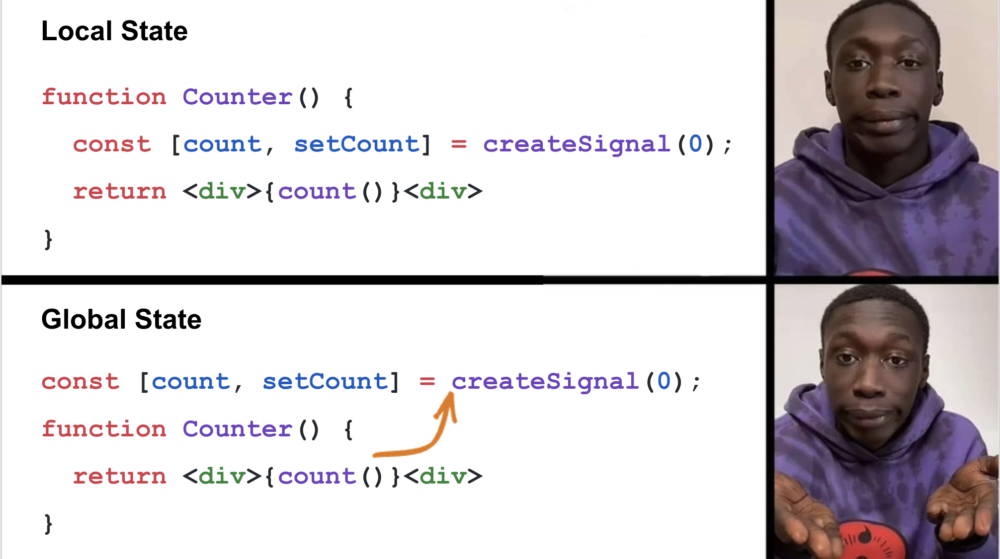

---
{
title: "Making the Case for Signals in JavaScript",
published: "2023-03-03T19:06:06Z",
edited: "2023-03-03T19:23:39Z",
tags: ["javascript", "webdev", "solidjs", "reactivity"],
description: "Amidst all the conversation around Signals the recent weeks, I have forgotten to talk about arguably...",
originalLink: "https://dev.to/this-is-learning/making-the-case-for-signals-in-javascript-4c7i",
coverImage: "cover-image.png",
socialImage: "social-image.png"
}
---

Amidst all the conversation around Signals the recent weeks, I have forgotten to talk about arguably the most important topic. Why should you care? I've covered their [evolution](https://dev.to/this-is-learning/the-evolution-of-signals-in-javascript-8ob) and [opposition](https://dev.to/this-is-learning/react-vs-signals-10-years-later-3k71), but I haven't actually made the case for using them.

There has been a narrative around them related to performance which is not without merit but it is so much more than that. It is more than about developer experience too. It is about flipping the current paradigm on its head.

React famously popularized:

> view = fn(state)

Which is a very powerful mental model for thinking about UIs. But more so it represents an ideal. Something to strive for.

Reality is a lot messier. The underlying DOM is persistent and mutable. Not only would naive re-rendering be prohibitively costly, but it would also fundamentally break the experience. (Input's losing focus, animations, etc...)

There are ways to mitigate this. We build ever-better constructs in hopes of reshaping our reality to fit. But at some point, we need to separate the implementation from the ideal to be able to talk about these things honestly.

So today we look at Signals as they are and what they have to offer.

---

## Decoupling Performance from Code Organization



This is the moment when you first realize that something really different is going on. There is more to it, though. This is not an invitation to litter your app with global state, but rather a way to illustrate state is independent of components.

```js
function Counter() {
  console.log("I log once");

  const [count, setCount] = createSignal(0);
  setInterval(() => setCount(count() + 1), 1000);

  return <div>{count()}</div>
}
```

Similarly, a `console.log` that doesn't re-execute when a counter updates is a cute trick but doesn't tell the whole story.

The truth is this behavior persists throughout the whole component tree. State that originates in a parent component and is used in a child doesn't cause the parent or the child to re-run. Only the part of the DOM that depends on it. Prop drilling, Context API, or whatever it is the same thing.

And isn't just about the impact of spreading state changes across components but also multiple states within the same component.

```js
function MoreRealisticComponent(props) {
  const [selected, setSelected] = createSignal(null);

  return (
    <div>
      <p>Selected {selected() ? selected().name : 'nothing'}</p>

      <ul>
        {props.items.map(item =>
          <li>
            <button onClick={() => setSelected(item)}>
              {item.name}
            </button>
          </li>
        )}
      </ul>
    </div>
  );
}
```

Porting the example from Svelte Creator Rich Harris' [Virtual DOM is Pure Overhead](https://svelte.dev/blog/virtual-dom-is-pure-overhead) to SolidJS it is important to understand, with Signals, updating the selected state does not cause any execution other than changing the text in that `<p>`. There is no re-running the list or diffing it. That is even true if the name in one of the rows updates. With Signals, we can directly update the text of that one button.

> Note: It is customary in Solid to use `<For>` component instead of `.map` when rendering a loop so as to not recreate every row when entries of the `items` are inserted, removed, or moved.

You might be thinking, "I get it. It's fast. But I've never had trouble ensuring good performance in something like React." But the takeaway is more than that.

**You no longer need to be concerned with components for optimal execution.**

You can put your whole app in one component or many components and get the same benefit. You can break apart components for your sake. How you want to organize your app. Not because you need to isolate some part of the UI that changes. If performance ever became a concern it wouldn't be due to the structure of your components necessitating costly refactoring.

**This is not an insignificant benefit to developer experience.**

---

## Separating Dynamic from Static

<iframe src="https://x.com/dan_abramov/status/1629928626278858752"></iframe>

There have been some conversations to suggest this is a bad thing. If you want more perspective see @dan\_abramov's [response to my previous article](https://dev.to/dan_abramov/comment/256g9).

I don't just want to talk about why this is a good thing, but how it is actually an amazing thing. Being able to optimize for each is beneficial. This is one of those places where aligning with the underlying platform pays off with dividends.

Classically speaking there is a tradeoff with using a distributed event system like Signals vs something that runs top-down. While updates will be quicker for the event system, at creation it has the additional overhead of setting up subscriptions.

This is even compounded by the fact that the web generally is a document-oriented interface. Even in Single Page Apps, you will be doing a lot of navigation which involves a lot of creation.

Makes sense. However, the web platform is aware of this cost and has made it more efficient to create elements in bulk than individually. Extracting the static parts for mass creation makes a bigger impact than those subscriptions.

And the benefits don't stop with the browser. With a Signals-based system the complexity, size, and execution of your code scale with how interactive your UI is rather than how many elements are in it.

Consider a server-rendered page with few interactions. Maybe an eCommerce site. The static parts are server-rendered HTML. You don't even need the code for that to make it interactive. Just delete the static parts from the bundle.

Steve from Builder.io (at 1:16) explains how this works in [Qwik](https://qwik.builder.io/):
<iframe src="https://www.youtube.com/watch?v=lXDDNM5rZQI"></iframe>

Admittedly this is mostly a performance concern. It comes from the same motivation for [Islands architecture](https://jasonformat.com/islands-architecture/) and [React Server Components](https://nextjs.org/docs/advanced-features/react-18/server-components). It addresses a very [real pain point we are facing today](https://infrequently.org/2022/12/performance-baseline-2023/) with the trend towards ever-bigger JavaScript bundles and slow initial page loads.

Overall, my position is this separation leads to a certain amount of transparency. It makes it easier to explain and reason about what is actually going on. While less simple than the ideal, it makes escape hatches, which are an important part of any system, more coherent.

---

## Universalizing the Language of UI

One of the most powerful things about Signals is viewing their impact as a language. And I don't mean a compiled language. Signals are completely a runtime mechanism. There is no magic here. Just a Directed Acyclic Graph.

While it seems clear there is a convergence in concepts of State, Derived State, and Effects, not all the mental models and implementations line up.

Signals are independent of any component or rendering system. And only represent state relationships. Unlike something like React Hooks which have additional primitives to describe how to guard execution like `useCallback`, `React.memo` and concepts like stable references(`useRef`) to handle the coordination of effects.

> Both of Dan's articles listed at the bottom of the article are a really good exploration into how to effectively use these primitives in React.

Additionally, Signals lend to traceability. They give you a way of understanding what updates and why.
<iframe src="https://x.com/thetarnav/status/1625177986197778434"></iframe>

They encourage patterns that lead to more declarative code. By making organizing code around data instead of component flow we can see what data is driving change. (Thanks Dan for the example).

```js
// control flow
const count = videos.length;
let heading = emptyHeading;
let somethingElse = 42;
if (count > 0) {
  const noun = count > 1 ? 'Videos' : 'Video';
  heading = count + ' ' + noun;
  somethingElse = someOtherStuff();
}

// derived data
const format = (count) => count > 1 ? 'Videos' : 'Video';

const count = videos.length;
const heading = count > 0 ? format(count) : emptyHeading;
const somethingElse = count > 0 ? someOtherStuff : 42;
```

It poses an interesting question about the purpose of code. Should we optimize it for making it easier to write or easier to read?

---

## Ok, But What About the Tradeoffs?


There are definitely tradeoffs. The most obvious one is that they make the data special instead of the application of that data. We aren't dealing with plain objects anymore, but with primitives. This is very similar to Promises or Event Emitters. You are reasoning about the data flow rather than the control flow.

JavaScript is not a data flow language so it is possible to lose Reactivity. To be fair this is true of any JavaScript UI library or framework without the aid of tooling or compilation. For Signals, this is more emphasized as where you access the value is important.

I call this Signal's (*singular*) Hook Rule. There are consequences to this. There is a learning curve. It pushes you to write code a certain way. When using things like Proxies there are additional caveats like certain mechanisms in JavaScript language (like spreading, destructuring) have restricted usage.

Another consideration is around disposal. Subscriptions link both ways so if one side is long-lived it is possible to hold onto memory longer than desired. Modern frameworks are pretty good at handling this disposal automatically but this is inherent to Signal's design.

Finally, historically there were concerns about large uncontrollable graphs. Cycles and unpredictable propagation. These concerns largely are in past due to the work that has been done over the [past several years](https://dev.to/this-is-learning/the-evolution-of-signals-in-javascript-8ob). I'd go as far as these problems are what Signals solve and why you would use them over other message/event systems.

---

## Conclusion

<iframe src="https://x.com/youyuxi/status/1631089471377801216"></iframe>

There are many ways to approach the challenge of creating great user interfaces. I've aimed at keeping this discussion grounded but I think there is a lot to get excited about here.

When you are building with a foundation of primitives there is a lot you can do. The exploration into reducing JavaScript load overhead and incremental interactivity is an area that Signals naturally fits in.

And thing is to use Signals to great benefit you do not need a compiler. Not even for templating. You can use Tagged Template Literals and do it all with [no build step](https://codesandbox.io/s/solid-tagged-template-literal-example-btgbk). We tend to use compilation though to make ergonomics smoother. But Signals are also a great choice for compilation.

Compilers and language exploration become that much easier when you have efficient building blocks you can target. And that isn't just true of us but for AIs. We've seen this suggested to improve upon everything from using analytics to drive code splitting to optimize initial load to optimizing compilers ability to understand code intent.

<iframe src="https://x.com/trueadm/status/1631045681900077057"></iframe>

Whether Signals are best suited to be held by developers or to be low-level primitives for machines, they appear to be an important step in the ever-evolving world of web front-end.

---

Related Resources:

[A Hands-on Introduction to Fine-grained Reactivity](https://dev.to/ryansolid/a-hands-on-introduction-to-fine-grained-reactivity-3ndf)
[The Evolution of Signals in JavaScript](https://dev.to/this-is-learning/the-evolution-of-signals-in-javascript-8ob)
[React vs Signals: 10 Years Later](https://dev.to/this-is-learning/react-vs-signals-10-years-later-3k71)
[Virtual DOM is Pure Overhead](https://svelte.dev/blog/virtual-dom-is-pure-overhead) By Rich Harris
[Components are Pure Overhead](https://dev.to/this-is-learning/components-are-pure-overhead-hpm)
[Metaphysics and JavaScript](https://docs.google.com/presentation/d/1PUvpXMBEDS45rd0wHu6tF3j_8wmGC6cOLtOw2hzU-mw/edit#slide=id.p) By Rich Harris
[Making setInterval Declarative with React Hooks](https://overreacted.io/making-setinterval-declarative-with-react-hooks/) By Dan Abramov
[Before you memo()](https://overreacted.io/before-you-memo/) By Dan Abramov
