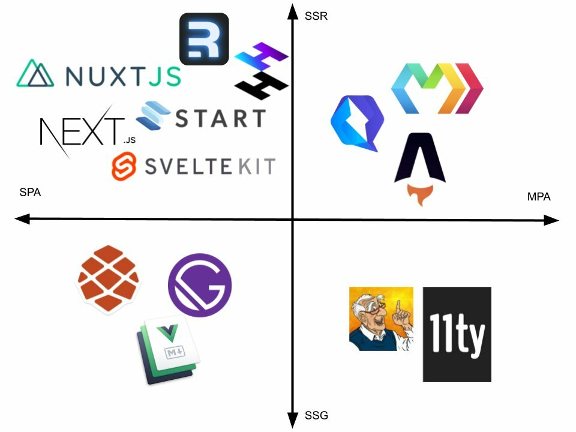
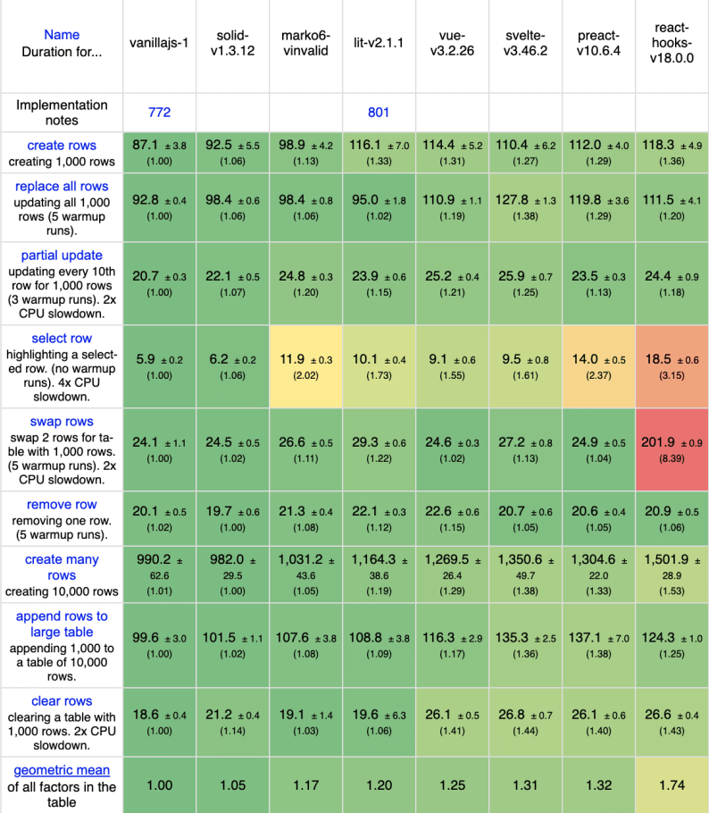

---
{
title: "Marko for Sites, Solid for Apps",
published: "2022-04-25T18:27:04Z",
edited: "2022-04-25T19:51:55Z",
tags: ["javascript", "webdev", "solidjs", "marko"],
description: "I've been sitting on writing this article for 2 years. In my heart this was the article I was going...",
originalLink: "https://https://dev.to/playfulprogramming/marko-for-sites-solid-for-apps-2c7d",
coverImg: "cover-image.png",
socialImg: "social-image.png"
}
---

I've been sitting on writing this article for 2 years. In my heart this was the article I was going to write even before I read @swyx's quintessential [Svelte for Sites, React for Apps](https://dev.to/swyx/svelte-for-sites-react-for-apps-2o8h). When I signed on to join the [Marko](https://www.markojs.com) team back in March 2020 (I know, perfect timing to relocate for work) something was very clear to me. I would have the opportunity to work on two of the most exemplary approaches to what the future of JavaScript frameworks could look like.

Some wondered why I would take on working on a second framework but I never saw a conflict. In many ways, they couldn't be more different. Every design decision made with different set of tradeoffs, where the "right" answer for each is allowed to be different. But the reason this excited me so much was that [Solid](https://www.solidjs.com) and [Marko](https://www.markojs.com) represented the most powerful approaches on the axes that matter. A pincer movement of sorts for the JavaScript framework world.

<iframe src="https://www.youtube.com/watch?v=ANtSWq-zI0s"></iframe>

Evan You, creator of Vue gave a great talk on tradeoffs of frameworks where he positioned Vue as that middle ground between React and Angular. It's easiest to explain this as a bunch of independent ranges but the reality is we live in a multi-dimensional world and one solution isn't always fully on one side for all decisions. But we as developers keep on changing our perspective to pull out these 2D comparisons.

So the task was simple: Don't change the world, change the perspective. And instead of being focused on the middle and being everything to everyone focus on the more achievable task at being the best version in the places that are divisive. Nothing wrong with backing multiple horses.

---

## So Sites Vs Apps?

Well, this has been the dichotomy of the web for a long time. It even predates Single Page Apps, although that is why it has come into focus so much the past decade. We have seemingly two very different use cases trying to leverage the same technology. So it does make sense that maybe there is a way to make this unified even when it hasn't been feasible. And the frameworks/libraries I'm talking about today represent both sides to a tee.

---

### Marko for Sites

<iframe src="https://www.youtube.com/watch?v=IHHJiiLLH9E"></iframe>

[Marko](https://markojs.com) was created at eBay sometime in the early 2010s and was open sourced in 2014. It was built for eCommerce and the demanding nature of support global customers where not every device and network is made equal. A huge emphasis placed on page load, being the first JavaScript framework to introduce both [Out of Order Streaming and Partial Hydration](https://tech.ebayinc.com/engineering/async-fragments-rediscovering-progressive-html-rendering-with-marko/) right from its inception.

Marko also was one of the earliest compiler-based frameworks as its origins were from server side templating languages. It was very clear from its beginning it was ultimately a language rather than a framework; a line of thinking that wasn't really popularized until [Svelte did similar half a decade later](https://gist.github.com/Rich-Harris/0f910048478c2a6505d1c32185b61934).

Marko is a Superset of HTML where the whole world lives in Single File Components and a new user can enter this world simply by changing the extension of the HTML files they got from a designer to `.marko` or using the HTML they copied and pasted from StackOverflow. Components are auto discovered and the impact of adding JavaScript feels minimal. It has all the characteristics people using server templating languages are used to but it is fully isomorphic to become interactive in the browser automatically.

And it sends the least JavaScript without thinking. Its "Islands" are automatic, and its streaming as easy as adding an `<await>` tag with a promise. Its Multi-Page forward approach isn't worried about persistent client state or client routing and just works like a website the way you'd expect. It has the tersest syntax that lets you [write the least code of all JavaScript Frameworks](https://dev.to/ryansolid/marko-designing-a-ui-language-2hni). It's an effortless way to get unmatched page load performance without getting away from the simplicity, that in the end we are just making pages in a website.

---

### Solid for Apps

<iframe src="https://www.youtube.com/watch?v=J70HXl1KhWE"></iframe>

[Solid](https://www.solidjs.com) came from a very different home. First created as a side project in 2016 when I was at a startup creating private Social Media. It was a long lived project that needed to keep on changing and pivoting to find its customer. While we could never rewrite what we had we would quickly rip out and replace parts. Solid was modular from the start, built to work with Web Components as a component-agnostic solution. It evolved to shedding that weight as it came into its own.

Solid's power is that everything is a primitive, right down to the JSX. Components are just functions, `
` are just HTMLElements, and state is just reactivity. It scales down to a jQuery replacement and up to concurrent time-slicing, with the portability to run on non-web platforms using the same techniques. There is no VDOM or required abstractions. It is a chameleon that is exactly what it needs to be when it needs to be.

While it leverages compilation, only the JSX is compiled. It is very much a "Just JavaScript" library. Everything is built upon composing simple primitives and every corner has an escape hatch for complete control over how your application runs. The icing on the cake is this way of modelling things is also extremely performant making Solid a benchmark king in [all](https://ryansolid.medium.com/how-i-wrote-the-fastest-javascript-ui-framework-37525b42d6c9) [environments](https://javascript.plainenglish.io/how-we-wrote-the-fastest-javascript-ui-frameworks-a96f2636431e) [it runs on](https://levelup.gitconnected.com/how-we-wrote-the-fastest-javascript-ui-framework-again-db097ddd99b6).

This adaptability has made it easy to port libraries, and for people to opt into compiling down to Solid from their preferred DSLs. And it has been championing this composable primitive approach well before modern trends like Hooks. It gives "Just JavaScript" a new life in a world looking like it is heading deep into custom DSLs and compiled languages and returns to developers all the control they need to execute on the most demanding of applications.

---

## False Dichotomy?

I admit I lured you here under a false pretense. If anything we've seen JavaScript centric web technologies collapsing on themselves. At first there was a clear difference between Static(SSG) and Dynamic(SSR) experiences but that has disappeared, and soon the difference between Sites(MPA) and Apps(SPA) will as well.

When we are seeing [Solid acing page load metrics in impossibly expensive pages when used with Astro](https://youtu.be/2ZEMb_H-LYE?t=8163), something historically only Marko could pull off:

Or Marko bringing incredible client side rendering performance and composability with its [new compiled reactivity](https://dev.to/ryansolid/marko-compiling-fine-grained-reactivity-4lk4) that rivals even Solid, you start realizing we are just seeing a path to finally unify the opposite sides of the spectrum.

And this makes me hopeful, because these frameworks philosophically couldn't be more different. Language vs Library, HTML vs JavaScript first, Mutability vs Immutability, Implicit vs Explicit state updates, 2-way data-binding vs Unidirectional flow. And despite these differences we are here.

It would even not be unfair to claim that Marko is more svelte than Svelte, or Solid is more reactive than React. These frameworks sit at the the opposite edges with different values and philosophy but they both have unmatched performance, the smallest bundle sizes, and can serve use cases that span the whole spectrum. If these frameworks can do this any framework in between could as well.

---

## Conclusion

Isn't it great that soon we could live in a world where Site vs App won't impact your choice of tool on technical merit?  Nor JSX vs Custom DSL, or a HTML-first vs JS-first mentality? Sure, there will always be preferences and solutions that cater on developer experience. But you can choose the framework that speaks to you, and I wouldn't be able to convince you that there's a "winner". There is a path here regardless of what philosophy you hold close to your heart.

It took me giving [Marko](https://markojs.com) a chance to see this. To challenge my preferences and view of the world. As with [Solid](https://www.solidjs.com) I looked at an approach that seemed to do all the right things years ahead of its time and leveraged that experience to explore what the best version of that looks like. Now, I see that potential to varying degrees in other frameworks. There really is an answer here for everyone. And that is exciting. The web is truly an amazing place.

---

Notes:

*Acing scores refers to getting mid 90s lighthouse scores for [this brutal page](https://astro-solid-hn.netlify.app/stories/30186326). This doesn't count the idle time. For the loading image I decided it was better to show the full time even if it was non-blocking, because otherwise it would look like [Astro + Solid hydrated immediately](https://www.webpagetest.org/video/view.php?end=all\&tests=220425_AiDc5B_ED8%2C220425_BiDcN6_DAM\&bg=ffffff\&text=222222\&loc=Virginia+USA+-+EC2++-+Chrome+-+Emulated+Motorola+G+%28gen+4%29+-+4G).*

*Svelte + Astro can do the same trick. And SvelteKit performs no worse than SolidStart, Remix, Next, Nuxt, etc. This is just showing Partial Hydration coming to other frameworks. Marko and Qwik still are more optimal here.*

*JS Framework Benchmark results are run locally against the currently unreleased version of Marko. While this is not the final version it is close enough that I feel comfortable sharing these numbers. I've seen them be higher and lower than those but this should be close to where things should land.*
