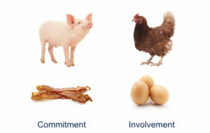

---
{
title: "Of Chickens and Pigs - The Dilemma of Creator Self Promotion",
published: "2021-04-22T18:18:01Z",
edited: "2021-04-25T02:43:09Z",
tags: ["webdev", "devjournal", "javascript", "opensource"],
description: "Have you ever created a new library? You saw a gap when creating a project at work. So you worked on...",
originalLink: "https://dev.to/this-is-learning/of-chickens-and-pigs-the-dilemma-of-creator-self-promotion-51ea",
coverImage: "cover-image.png",
socialImage: "social-image.png"
}
---

Have you ever created a new library? You saw a gap when creating a project at work. So you worked on it for months, and are pretty excited about the result. You think it is at a pretty good place and you go and share it. You put something up on github but no one is really checking it out.

So you go out of your comfort zone and you write an article. But where to post it? You look at the usual channel's you consume information like Twitter, Facebook, Medium, Reddit, Hackernews, and dev.to.

You give the article one last edit and then you go and submit everywhere you can. And...

Silence.

I mean this is what happens most of the time when you first put yourself out there. But the other times something else happens. You see the notifications and people are talking about your project. You excitedly open up the pages, and...

Nope. They are talking about WASM. Why WASM? Who knows? Someone decided to mention how Rust is just better than another JS library. And Vanilla JS guy is there and ready to tell anyone that libraries are unnecessary.

Someone else who admits they didn't read the article decides to point out that you could have just not written the library and do something else. You go to explain how you looked at those other solutions and even explain it in the article, but they are long gone by the time you reply.

If you are lucky a couple of people actually opened up the README.md on your Github repo and pointed out your logo sucks and they might even stick around to give you other advice too.

For better or worse this is probably what is going to happen to you. I could say it's a good learning experience. But it really isn't. It's just your first taste of what is to come.

# Creation

Anyone who creates something and tries to share it with the wider world is going to hit this at some point. As some of you know I was in a punk rock band for years. At the risk of revealing my age, because I'm probably older than you might expect, I got my start in post-Green Day success punk scene.

I played my first show at 14 years old and we were playing pop-punk in an era when those in the know were trying to go back underground. At my first show, some people in the audience thought it would funny to throw stuff at us. I got hit in the forehead with a bottle by a particularly "funny" guy.

Was this the fault of our new guitarist who put on the show, and probably booked the wrong lineup? Should we have been the opener instead of the second in the lineup? Probably. It showed disrespect to the established order. Did I have any idea of this? Of course not as I was stoked to have this slightly older guitarist join our group and to play our first show.

Thankfully this never happened again. Not to say there weren't some trolls in the crowds over the years, but I went on to play about 500 more shows with that band. It served as an early indicator that there is more to creating something than the creation itself.

# Pigs and Chickens

It was several years later I came across this analogy when learning about Agile principles. The idea spawns from this fable-like story where a Chicken suggests to a Pig that they should start a business together. He suggested "Eggs & Ham". And the Pig responds that this wasn't an equal arrangement. Where the "Eggs" provide immense value the Pig would be committed, as he *is* the "Ham".

We use this analogy often to describe different sorts of roles in Agile practices, so it is clear where ownership lies. To illustrate clearly what each stakeholder has at stake. There are always Chickens and Pigs. And that can even differ within different domains in the same organization although I am not sure mixing roles is actually a good thing.

Once you are invested in something, once you are committed, you now have an undeniable bias.

# Creators and Critics

I am no stranger to critics. You play music and before long you come across them. And they don't have to be writing for the New York Times, it could be the local hot 'Zine or blog site.

Now everyone is selling an angle so you can't take anything as truly unbiased, but I have always been wary of critics who are pushing a very obvious agenda. Pigs can't be unbiased so while if they are good at their art can provide insight, they are incapable of being neutral. Chickens can be the perfect critics because they aren't committed.

A master chef who has impeccable skills and understanding of cuisine could be a great critic of food, but you'd always know where they stand. The best food critiques bring their own perspective to provide an authentic perspective. But what happens when the critic decides to open up their own restaurants?

Well, maybe nothing because maybe they can maintain still being Chicken's so to speak. But it definitely muddies the waters.

# Creators and Meta-Creators

I was watching this video from Maksim Ivanov with @swyx on this idea of content creation. It spoke about combating the urge to do low-brow content to get a few more likes.

<iframe src="https://www.youtube.com/watch?v=sL\_uefhT51g"></iframe>

A super interesting topic because Meta Creation is something I've never understood that well. If you aren't familiar with the term, it is the idea of creating content to help others succeed rather than being responsible for creating the original thing that is being promoted. "10 ways to save time each week", "Be successful with these 3 steps", etc.. although it isn't limited to this sort of content.

Occasionally I write articles and then people paraphrase the high-level ideas and republish them as their own. I've never thought very much of it either way.

That is just is what it is. But generally, I am a Pig. I look for projects where I can be committed. The thing I am creating is what I am contributing. But we aren't all good at everything. It was mentioned that some maintainers have difficulties writing beginner tutorials (I feel I am the same).

Meta Creators have the ability to provide incredible value in terms of propagating ideas and making things more accessible to all. It is recommended, that it should be done with care and consideration though, otherwise you cheapen your brand.

Creators have to be held to a different standard. They are not playing the same game if you can call it a game at all. @swyx suggests that Meta Creators should aim to not be trapped by this sort of [glass ceiling](https://dev.to/swyx/the-meta-creator-ceiling-203h) they set up for themselves and move into opportunities where they can contribute.

But if you are starting from the Creator side you need a different set of guidelines to follow. You are already contributing. You will naturally attract peers and collaborate on projects.

# Self Promotion as a Creator

If you watched that video towards the end around the [40-minute mark](https://www.youtube.com/watch?v=sL_uefhT51g\&t=2433s) I was used as an example on the topic of self-promotion. Particularly this idea around finding balance with "give give give, take".

Now I don't think it was meant to be anything other than constructive but I'm not sure it gives any real path forward. What I mean by that is, if what you are giving is the thing that the other party might be predisposed to not accept, how do they gauge the degree to which you give. It potentially undercuts the value you bring before you even get started.

If the biggest value you give is bringing new information, technology, and methods is it better not to bring this into conversations? This is a tricky balance to maintain. I am very conscious of this and go out of my way not to directly plug my libraries or articles on Twitter replies until asked to elaborate on what I mean.



To be clear I don't hate self-promotion. But I've always struggled with doing it in good conscience. My bandmates made fun of me for weeks when I made a poster for a show we knew was going to be full capacity and sold out, and I wrote "Come early, this show *may* sell out." They could not understand why I said *may* instead of *will* and made sure to tell me all the things they *may* do for the next couple of weeks. They weren't wrong. We had a lineup down the street and we hit capacity before the openers even started playing.

And yet the perspective does exist.

I had a similar issue with Hacker News publishing my articles. When I actually talked to their support and called out the articles they blocked specifically they acknowledged they were mistaken about it being shallow marketing material or overly self-promoting, and offered to assist me in re-publishing the bulk of my work.

# Learning (and Creating) in Public

To me, it is about the process more than promotion. Who says learning in public has to be for beginners? We are always learning. Always improving our knowledge and in that process, we can help others.

If someone sat down and read my articles from start to end, they would chronicle the journey of someone creating JavaScript Frameworks. Right from the first article, [B.Y.O.F. — Part 1: Writing a JS Framework in 2018](https://medium.com/@ryansolid/b-y-o-f-part-1-writing-a-js-framework-in-2018-b02a41026929). I was sure there was a "use the platform" universal solution for all and I was intent to share those findings as I went along.

Obviously, things have been learned along the way, but the reader has been with me every step of it. Now they are contributing and I owe a lot of Solid's success to date from the work of others. From how they pushed innovation in Solid's early days, to creating projects like the [REPL](https://playground.solidjs.com/) or discovered the [critical escape algorithm](https://levelup.gitconnected.com/how-we-wrote-the-fastest-javascript-ui-framework-again-db097ddd99b6) to push SSR performance over the top.

So more than anything that is why I want to address this line of thought, because it undermines their commitment and contributions. And if I'm somehow responsible for that, it is just unacceptable. Even more so if it negatively impacted the great work being done on [Marko](https://markojs.com/) and that community as well.

I stopped at some point and asked myself, "What am I doing differently than other creators?" I concluded I wasn't doing much differently. The only difference was they already had an established audience. I was coming in as a relative newcomer and laying down disruptive (even if well-founded ideas) that honestly many people don't want to hear.

If I had maintained a popular React library for the same amount of time it would have been different. It's easier for someone to dismiss an idea as self-promotion than acknowledge that it could change their thinking. And let's face it. They don't owe you anything. Nada. In that sense, that Reddit/Hackernews comments section follows you no matter where we go.

Instead, it takes time and it is all about making those relationships. The exact thing Shawn(@swyx) was promoting in the video. This was cemented for me when @richharris (creator of Svelte) helped me a while back get unblocked by another creator, and he told me (paraphrasing):

> It's harder to block someone you know in person. If it weren't for that I suspect I would have blocked many times over.

An obvious point when you consider how on a platform like Twitter you are just another person behind a screen. But it was the lack of relationship in the first place that brought the situation about, and only through the connections made that it was resolved in the end.

So I don't have the answers here. I'm still figuring this out. My only advice is never to let the technology override the people involved. There are many people and projects that I work with and am involved in from the communities around Reactivity, and Benchmarking, people making great tools that integrate with frameworks like [Vite](https://vitejs.dev/) or [Astro](https://astro.build/), to cool new products like [JSX-Lite](https://github.com/BuilderIO/jsx-lite). And that makes these things ultimately fulfilling, and with a little luck successful.
