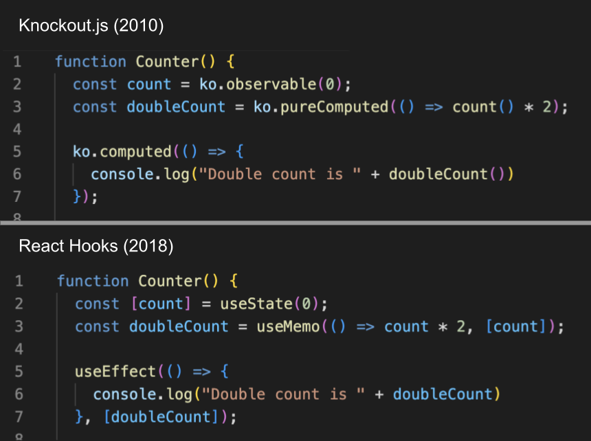

---
{
title: "React vs Signals: 10 Years Later",
published: "2023-03-01T17:27:05Z",
edited: "2023-03-01T18:19:37Z",
tags: ["watercooler"],
description: "How does the old Winston Churchill quote go?   Those who fail to learn from history are doomed to...",
originalLink: "https://dev.to/this-is-learning/react-vs-signals-10-years-later-3k71",
coverImage: "cover-image.png",
socialImage: "social-image.png"
}
---

How does the old Winston Churchill quote go?

> *Those who fail to learn from history are doomed to repeat it*

Although a more ironic addendum might add.

> *Those who study history are doomed to stand by while everyone else repeats it.*

In the past few weeks, we've seen the culmination of a build of excitement around the revival of fine-grained reactivity, being referred to as Signals, across the front-end world.

> For a history of Signals in JavaScript check out my article:
> 

The truth is Signals never went away. They lived several years in obscurity as third-party libraries or hidden behind frameworks' plain object APIs. Even though the common rhetoric that came in with React and the Virtual DOM condemned the patterns as unpredictable and dangerous. And they weren't wrong.



But there is more to it than a 10 year old debate. So I want to talk about how things have changed over the years and offer [SolidJS](https://solidjs.com) as a foil.

---

## "Fixing" Front-end



At the core of this conversation is understanding what React is. React is not its Virtual DOM. React is not JSX. To this date one of my explanations on the subject came from one of Dan Abramov's earliest articles [You're Missing the Point of React](https://medium.com/@dan_abramov/youre-missing-the-point-of-react-a20e34a51e1a), where he state React's true strengths are:

> composition, unidirectional data flow, freedom from DSLs, explicit mutation, and static mental model.

React has a very powerful set of principles that guide it that are more important than any implementation detail. And even years later there is this notion from the thought leaders around React that they fixed front-end.

But hypothetically, what if they didn't? What if there were other ways to address the problems of the day that didn't involve such drastic re-alignment?

---

## A Solid Alternative

The concept behind Solid is equally simple. It even shares ideas like composition, unidirectional data flow, and explicit mutation that made React feel like a simple answer to UI development. Where it differs is outside the world of reactivity everything is an Effect. It's almost the antithesis of React which treats everything you do as being pure (as in having no side effects).

When I think of creating a Counter button with Signals without any templating I'd do this:

```js
function MyCounter() {
  const [count, setCount] = createSignal();

  const myButton = document.createElement("button");
  myButton.onclick = () => setCount(count() + 1);
  
  // update the text initially and whenever count changes
  createEffect(() => {
    myButton.textContent = count();
  });

  return myButton;
}
```

I'd call my function and get a button back. If I need another button I'd do it again. This is very much set and forget. I created a DOM element and set up some event listeners. Like the DOM itself, I don't need to call anything for my button to update. It is independent. If I want a more ergonomic way of writing I use JSX.

```js
function MyCounter() {
  const [count, setCount] = createSignal();

  return <button onClick={() => setCount(count() + 1)}>
    {count()}
  </button>
}
```

Signals are not the same Signals as yesteryear. Their execution is glitch-free. They are push/pull hybrids that can model scheduled workflows like Suspense or Concurrent Rendering. And mitigate the leaky observer pattern with automated disposal. They have been [leading benchmarks for several years](https://krausest.github.io/js-framework-benchmark/index.html) not only for updates but for creation.

---

## Immutability

So far so good? Well maybe not:



Apparently, this is something React solves. What did they solve exactly?

Putting Dan's specific concerns aside for a moment, it comes down to immutability. But not in the most direct way. Signals themselves are immutable. You can't modify their content and expect them to react.

```js
const [list, setList] = createSignal([]);

createEffect(() => console.log(JSON.stringify(list())));

list().push("Doesn't trigger");

setList(() => [...list(), "Does trigger"]);
```

Even with variants from Vue, Preact, or Qwik that use `.value` you are replacing the value not mutating it by assignment. So what does it mean that Signals are "mutable state"?

The benefit of having a granular event-driven architecture is to do isolated updates. In other words, mutate. In contrast, React's pure render model abstracts away the underlying mutable world re-creating its virtual representation with each run.

How important is this distinction when looking at two declarative libraries that drive updates off state if the data interfaces are explicit, side effects managed, and the execution well-defined?

---

## Unidirectional Flow

I am not a fan of 2-way binding. Unidirectional Flow is a really good thing. I lived through the same things that are referenced in these tweets. You may have noticed Solid employs read/write segregation in its primitives. This is even true of its nested reactive proxies.

If you create a reactive primitive you get a read-only interface and a write interface. The opinion on this is so ingrained into Solid's design that members of the community like to troll me, abusing getters and setters to fake mutability.



One of the important things I wanted to do with Solid's design was to keep the locality of thinking. All the work in Solid is done where the effects are which is where we insert into the DOM. It doesn't matter if the parent uses a Signal or not. You author to your need. Treat every `prop` as reactive if you need it to be and access it where you need it. There is no global thinking necessary. No concerns with refactorability.

We re-enforce this by recommending when writing props you access the Signal's value rather than pass it down. Have your components expect values rather than Signals. Solid preserves reactivity by wrapping these in getters if it could be reactive.

```js
<Greeting name={name()} />

// becomes
Greeting({ get name() {  return name() })

<Greeting name={"John"} />

// becomes
Greeting({ name: "John" })
```

How does it know? A simple heuristic. If the expression contains a function call or property access, it wraps it. Reactive values in JavaScript have to be function calls so that we can track the reads. So any function call or property access, which could be a getter or proxy, could be reactive so we wrap it.

The positive is that for `Greeting` regardless of how you are consumed you access the property the same way: `props.name`. There is no `isSignal` check or overwrapping unnecessarily to make things into Signals. `props.name` is always a `string`. And being a value there is no expectation of mutation. Props are read-only and data flows one way.

---

## Opt-In vs Opt-Out



This might be the crux of the discussion. There are a lot of ways to approach this. Most libraries have chosen reactivity for Developer Experience reasons because automatic dependency tracking means not needing to worry about missing updates.

It isn't hard to imagine for a React developer. Picture Hooks without the dependency arrays. The existence of the dependency arrays in Hooks suggests React can miss updates. Similarly, you opt into client components (`use client`) when using React Server Components. There are other solutions that have been automating this via compilation for years, but at times there is something to be said about being explicit.

It isn't generally a singular decision. You have things you opt into and things you opt out of in any framework. In reality, all frameworks are probably more like this:


A frameworks ideals can be beyond reproach but the reality is not so clear cut.

This brings me to this example:



These are 2 very different functions from Solid's perspective, because of Solid's JSX handling and the fact they only run once. This is not ambiguous and easily avoided once you are aware. And there is even a lint rule for that.

It's like expecting these to be the same:

```js
const value = Date.now();
function getTime1() {
  return value;
}

function getTime2() {
  return Date.now();
}
```

Moving the expression doesn't change what `Date.now()` does but hoisting changes the function's behavior.

Maybe it is less than ideal, but it isn't like this mental model isn't without its own benefits:



---

## Can this be "Fixed" for real?

That's the logical follow-up. This is very much a language problem. What does fixed even look like? The challenge with compilers is that it is harder to account for edge cases and understand what happens when things go wrong. It is largely the reason historically React or Solid has been pretty careful about keeping clear boundaries.

Since the first introduction of Solid we've had people [exploring](https://github.com/orenelbaum/babel-plugin-solid-undestructure) [different](https://github.com/orenelbaum/babel-plugin-reactivars-solid) [compilation](https://github.com/lxsmnsyc/solid-labels) because Signals as primitives are very adaptable and very performant.

In 2021, I took a stab at it.



React team also announced they were looking at this too.



There are rules being imposed on both systems. React wants you to remember not to do impure things in your function bodies. That is because if you do you can observe abstraction leaks if they were ever to optimize what is under the hood. Including potentially not re-running parts of your component.

Solid is already optimized without the need for the compiler or extra wrappers like `React.memo`, `useCallback`, `useRef`, but like React could benefit from some more streamlined ergonomics like not having to worry about indicating where Signals are read.

The end result is almost the same.

---

## Final Thoughts



The oddest part of all of this is that the React team when looking at Reactivity doesn't feel like they are looking in the mirror. By adding Hooks they sacrificed part of their re-render purity for a model approaching that of Signals. And that by adding a compiler to remove the hooks concerned with memoization they complete that story.

Now it should be understood these were [developed independently](https://reactjs.org/docs/hooks-faq.html#what-is-the-prior-art-for-hooks). Or atleast no acknowledgement was ever given which is not surprising given the sentiment of the old guard:



Fortunately React today is not the React of 10 years ago either.

React changed the front-end world by teaching us the important principles that should guide how to build UIs. They did so by strength of conviction being a unique voice of reason in a sea of chaos. We are where we are today due to their great work and countless have learned from their lessons.



Times have changed. It is almost fitting that the paradigm that was "fixed" away would resurface. It closes the loop. Completes the story. And when all the noise and tribalism fade what remains is a tale of healthy competition driving the web forward.

---

*It is arguably never polite to construct a narrative by sewing together quotes out of context. Time moves on, and perspectives change. But this is a long and strongly held sentiment from React's thought leadership. One they've been vocal about since the beginning. I was able to grab all these quotes over conversations from just the last couple of days with very little effort.*

*For more on React's early history watch:*


