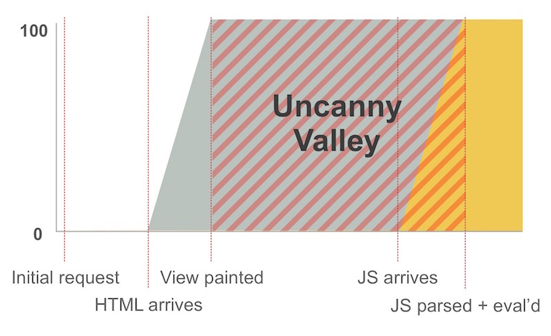

---
{
title: "Resumability, WTF?",
published: "2022-08-23T20:22:00Z",
edited: "2022-08-23T20:43:49Z",
tags: ["javascript", "webdev", "marko", "qwik"],
description: "Maybe you've heard the term Resumability thrown around recently. Maybe someone gushing over Miško...",
originalLink: "https://dev.to/this-is-learning/resumability-wtf-2gcm",
coverImage: "cover-image.png",
socialImage: "social-image.png"
}
---

Maybe you've heard the term Resumability thrown around recently. Maybe someone gushing over Miško Hevery's new [Qwik](https://qwik.builder.io/) framework. Maybe you've heard me mention it in our work for the upcoming [Marko 6](https://dev.to/ryansolid/fluurt-re-inventing-marko-3o1o). Maybe you heard it has something to do with hydration. But you aren't even clear what hydration is.

This article is for you.

---

## Why are JavaScript developers so thirsty?



There are many definitions for Hydration (which is part of the problem). But my favorite is:

> Hydration is the process to restore a server-rendered app to the state it would be if it were client-rendered. *(Credit: @mlrawlings)*

Why is this even a thing? It wasn't always. In yesteryear, one would server render a page in the backend of our choice, then add some sprinkles of JavaScript to handle interaction. Maybe some jQuery.

As the demands on that interactivity increased, we added more structure to our code. And imperative sprinkles became declarative frameworks you know and love today, like React, Angular, and Vue. The whole representation of the UI now lives in JavaScript.

To regain the ability to server render, these frameworks also run on the server to generate HTML. We get to author and maintain a single application in a single language. When our app starts in the browser, these frameworks re-run the same code adding event handlers and ensuring the app is in the correct state. And that "re-hydration" (later shortened to hydration) is what enables the application to be interactive.

Sound good so far? Well, there is a problem.

---

## Enter the Uncanny Valley



Re-rendering the entire application on page load can be costly as pages get larger, especially on slower networks and devices. It isn't actually recreating the DOM nodes, but the process does run through all the application code as if it were.

There are two problems with this. First, you see the server-rendered page but it isn't interactive until the JavaScript loads, parses, and executes.

You could make your page have JavaScript-less fallbacks, but it won't offer the same user experience until the JavaScript executes. Someone could be clicking on a button and nothing is happening with no indication. Or someone could trigger a full page reload, just to wait through this all over again. If they had waited a half second longer it would have been a smooth client-side interaction instead.

Second, execution can be expensive. It can block the main thread. A user trying to operate the page, like scrolling or trying to enter text fields, could face input lag.

Not the best experience.

---

## So what is Resumability?


Like it sounds: do some work, pause, then resume. It is a process that allows frameworks to avoid extra work when the application starts in the browser, and instead leverage what happened during its execution on the server. Sort of like a computer that hibernates and then is right where you left it when it wakes. Except Resumability does this across the server/browser network boundary.

How it achieves that is more complicated in one sense but very simple in another. It attaches some global event handlers at startup and then only runs the necessary code on interaction.

Sounds familiar? Isn't that what we were doing with Vanilla JavaScript or jQuery back in the day?

The big difference is you author your code in the modern way. It is a single app that works across server and browser. It is declarative and composable. All the benefits you find with your favorite framework.

So..., why is hydration a thing? Why isn't everything resumable?

This is pretty hard to do. Modern declarative frameworks are data-driven. On an event you update some state, and some components re-render. And therein lies the challenge.

How does state exist in an event handler if a component never executed to create it? Our modern frameworks are a tangle of functions closing over values.

```js
function Counter() {
  const [count, setCount] = useState(0);

  // How can I call `increment` without ever running
  // Counter once? Where does `count` and `setCount`
  // come from?
  const increment = () => setCount(count + 1);

  return <button
      className="counter-button"
      onClick={increment}
    >
      {count}
    </button>;
}
```

We need to update independent of components, and we need everything available globally. We need reactive state and we need to undo all the closures we make in our code.

```js
// Over-simplified example:

// global scope
const lookup = [
  ...,
  Counter,
  increment,
  ...,
  {
    count: createReactiveStateWhenAccessedFirstTime({
      value: 0,
      watchers: [Counter]
    })
  }
]

// global event handler
function increment(event, ctx) {
  ctx.count++; // update value and trigger watchers
  // ie.. only run the component for the first time now.
}

// global event listener
document.addEventListener("click", (event) => {
  // find the element we care about
  if (event.target.className === "counter-button") {
    // find the location of its handler and data from it
    const fn = lookup[event.target.$$handlerID];
    const context = lookup[event.target.$$handlerContext];
    fn(event, context);
  }
});
```

Moreso, we need to communicate the full state of our application from the server. Not just the state data you manage in your app, but also the internal state of the framework. The example above is oversimplified, but that global scope needs to consist of all our app's data.

This is non-trivial to implement and it isn't without tradeoff.

---

## Serialization

Besides heavier compilation, Resumability relies on what it can serialize. And this can be significantly more. Your typical server rendered application stores the initial state of the application in 2 places: hardcoded into JavaScript source code that you write, and as serialized JSON written into the page. The latter is how we get all the dynamic and async data generated at server execution time.

```js
// in the code
const [count, setState] = useState(0); 


// in JSON
<script id="__NEXT_DATA__" type="application/json">
  ...
</script>
```

We need this because when we wake up the application in the browser, our JavaScript code needs to be be in the same state as the currently-rendered HTML.

You might be thinking, "Can't we just pull this information from the HTML?"

We can and we can't. The final output only contains the final formatted data. This can be lossy.

```js
const [date, setDate] = useState(Date.now());
const [dateFormat, setDateFormat] = useState("MM/DD/YYYY")

return <time>{format(date, dataFormat)}</time>

// in HTML - how do I get the timestamp?
<time>08/19/2022</time>
```

Picture a formatted date that didn't include time, but the UI lets the user change the format to one that could. Using the HTML alone isn't enough to get that information.

Resumability does have a similar requirement to get the internal framework state as we server render, rather than only rely on the application data we typically serialize. At minimum, we'd need to serialize all the props coming into each component so that they could be woken up independently without running the whole component tree up front.

---

## The Three Musketeers


Luckily, to make the code resumable requires a lot of knowledge of what could update in the browser, since you need to know what events can update what UI. And for that reason Resumabilty usually is combined with two other optimizations.

One optimization is known as Progressive Hydration (or sometimes Selective Hydration). In Resumable frameworks you aren't really hydrating, but you can still defer loading code until you need it. This can drastically reduce the bundle and achieve "0Kb JavaScript by default". This helps with page load metrics, but it can push back work until you do interact. To Resumability's benefit, this is just loading and parsing costs, since it doesn't need this JavaScript to run eagerly. But it still needs to be done carefully, and it is recommended you preload any critical page interactions.

When applied to server-rendered pages you'd find in a Multi-Page Application(MPA), we can also know what never updates. This allows the framework to skip sending code or serializing any data for components that only need to run on the server. And it largely offsets the cost of Resumability.

This is known as Partial Hydration; you may have seen a version of this technique, [Islands](https://jasonformat.com/islands-architecture/), in frameworks like [Marko](https://markojs.com), [Astro](https://astro.build), or [Fresh](https://fresh.deno.dev/). The difference is resumable frameworks can do this at a sub-component level, much smaller than Islands, and they can do it automatically.

It is important to recognize while these optimizations often come as trio they work independently. Resumability is not concerned with when code loads, or how much of it does load.

---

## Living in a Resumable World

We aren't here yet, and it will take some time. But we are closing the circle that was opened up with Single Page App server rendering. We created the Hydration monster, and now we have to defeat it. The biggest ask is that to fully mitigate the performance tradeoffs we find ourselves with MPAs today.

Until we can reconcile the gap here, and this all relies on [routing](https://dev.to/this-is-learning/the-return-of-server-side-routing-b05), there is going to be a question of which tradeoffs are worth it. We need every piece working in tandem to even have a chance for this approach to prove itself.

But if it does, it will finally have unified the old Web of imperative jQuery with the machinery of modern declarative JavaScript frameworks. And maybe even delete the need for words like resumability and hydration in our Web vocabulary.

And that is something worth striving for.

---

Special thanks to @tigt & @t3dotgg for reviewing this article.
