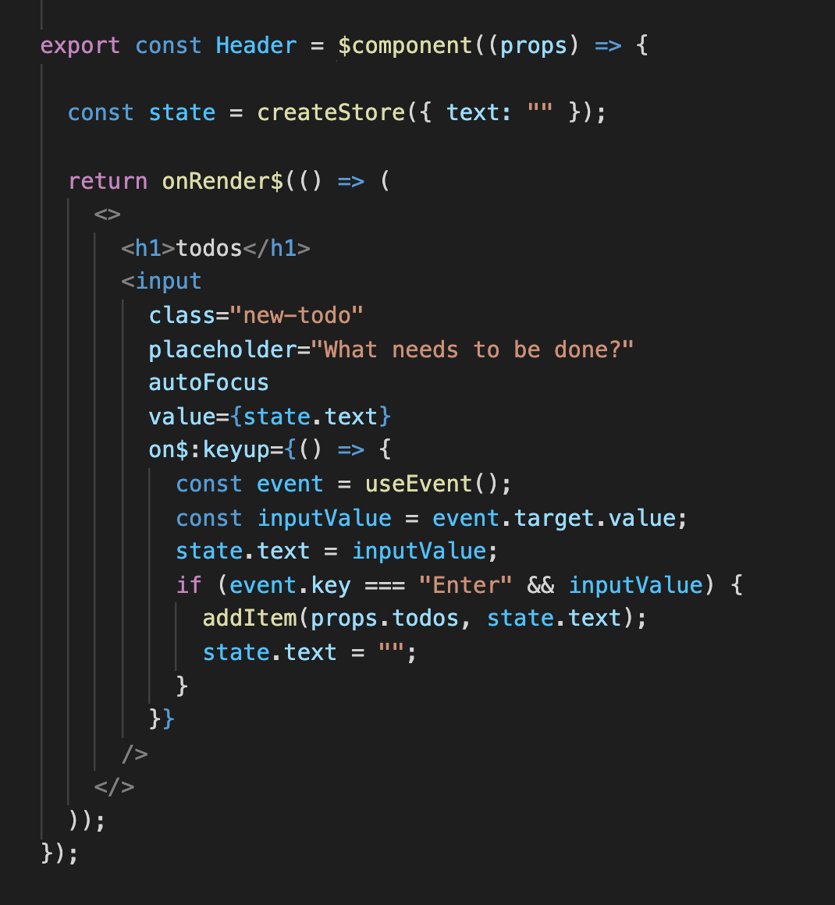

---
{
title: "Resumable JavaScript with Qwik",
published: "2022-02-17T15:27:13Z",
edited: "2022-02-21T07:31:33Z",
tags: ["javascript", "webdev", "qwik", "performance"],
description: "When Misko Hevery (creator of AngularJS) approaches you to look at his new framework, well, you stop...",
originalLink: "https://dev.to/this-is-learning/resumable-javascript-with-qwik-2i29",
coverImage: "cover-image.png",
socialImage: "social-image.png"
}
---

When Misko Hevery (creator of AngularJS) approaches you to look at his new framework, well, you stop and listen. I was already aware of [Qwik](https://github.com/BuilderIO/qwik) and saw the potential, but this was as good as any to stop and take a closer look.

[Qwik](https://github.com/BuilderIO/qwik) is a unique JavaScript framework in that it is the only one that exists today that can hydrate out of order at a component level. It goes beyond that though Qwik introduces a new concept to the vernacular of JavaScript: The Resumable Framework.

---

## Resumable Framework?

These days it is common for our JavaScript Frameworks to be isomorphic. That is to be able to render on the server and in the browser. But for most frameworks this ability was tacked on afterwards. A natural extension to their client side paradigms. But what if the framework was built on SSR in the first place?

Well before Qwik we've seen surprisingly few. Meteor, [Marko](https://markojs.com/), maybe a couple others. However, the modern isomorphic landscape is built on the back of libraries like React, Vue, and Svelte that weren't initially created for server rendering.

So unsurprisingly their core mechanics weren't designed in a way to leverage this information. If you knew that your app was always going to be rendered on the server first what sort of concessions could you make?

The most powerful one might be not redo any of the work in the browser that was already done on the server. A JavaScript framework designed to do less work in the browser. Not the first framework to do so. But perhaps the first to realize the idealized hydration execution.

> Hydration is the process of adding interactivity to server rendered HTML. It involves attaching event handlers, and initializing application state. For most JavaScript libraries this is a top-down process very similar to re-rendering the whole app again in the browser, even if it doesn't actually create any new DOM nodes. For a more complete guide on Hydration see [Why Efficient Hydration in JavaScript Frameworks is so Challenging](https://dev.to/this-is-learning/why-efficient-hydration-in-javascript-frameworks-is-so-challenging-1ca3).

---

## The Journey to Resumability

Creating a hydration approach that does not redo work in the browser is not an easy path. You don't simply pick up your existing Single Page App framework of choice and get here. We've been working on the same problem in [Marko](https://markojs.com/) the last couple years and although the approach different it does really come down to a few key things.

1. Ability to break apart the code needed for hydration (events, effects), from code needed to render the view and manage stateful updates.

2. Understanding what data is stateful(can update) and what depends on it. To resume work it must be done at a more granular level than the components as re-running components during hydration would be unnecessary work.

3. Serializing sufficient data so that unrelated changes don't require re-calculation and so that that parts of the app can be hydrated independently and out of order.

Some frameworks do maybe one of these but almost no frameworks do all three. Qwik accomplishes this through following rules on Component authoring, reactive primitives(similar to React Hooks), and the use of a compiler leverages markers in the JSX to indicate how code should be broken apart.

> Notice the `$` indicators to separate component code from view and from event handler in this header section of TodoMVC.

---

## What about Lazy-loading?

Beyond being resumable one the most standout features of Qwik is its progressive hydration. It progressively loads the JavaScript as needed. It can start with 0kb of bundled JavaScript component code and scale up to what needs to be on the page no matter how interactive it is.

Qwik does this very differently. Others that seek to solve this problem have used knowledge of what is server versus client to make choices. Those solutions rely on [islands](https://astro.build/), [special file extensions](https://reactjs.org/blog/2020/12/21/data-fetching-with-react-server-components.html), or even [advanced compiler analysis](https://markojs.com/). From where I'm sitting this is the 80% of the problem to solve. Most pages are mostly static once you remove async data loading and routing considerations. But what if the page is incredibly interactive? What if most of the page could and would be loaded in the browser?

Well, in that case progressive hydration may be the only way to get a responsive page during initial load. And it isn't as simple just delaying the inevitable. That just pushes the full cost to when the user first interacts with the page. No. What makes Qwik interesting is those same qualities that allow it to be resumable also allow any part of the page to hydrate independently.

Yes. That button half way down the page can load the necessary code to add an item to your cart before any JavaScript higher up in the hierarchy is loaded. This isn't how typical frameworks work. If you have components that contain other components and pass props throughout things need to run top down.

---

## So Problem Solved?

Well, maybe. But probably not in the way you are picturing. Understanding what I explained above I thought it would be fun to come up with a demo really showcase these unique features of Qwik. I mean picture it:

Writing your typical single page application(SPA) with JSX and reactive data like you've grown accustom to, except when the page loads barely any JS loads. And when you scroll down a bit you find something that interests you and the JavaScript just for that section loads and works. Content with that you click a link, suddenly the client side router loads, and client navigation takes over. Seamless SPA experience with perfect on demand hydration.

Until you realize that when you navigate to that new page you are loading routing information about the whole app and you are suddenly loading dozens of new mini JS files to render the whole page in the browser. At first you go, maybe this isn't great. But then you think well we can do something smarter here with bundling. And Qwik is looking into some smart approaches with bundling. But this goes beyond that.

For a framework that optimizes everything to reduce JavaScript in the browser why would you even want to render the whole next page in the browser?

Well, you wouldn't. And that's when everything starts to really make sense. Evaluating Qwik on the merits of existing frameworks is pointless. It seems like Qwik is the panacea for React's bundle size, but really it is entirely something else.

---

## It's a Brave New World

So what is Qwik? It's everything I've mentioned in this article. It's a framework that is optimized to do the least initial work in the browser regardless of app composition. More importantly it suggests the potential of a new paradigm in how we build apps in the frontend. Not one that just transitions from SPA but is built entirely with getting the most from the server in mind.

It's still relatively new. A lot of features are undocumented. And there are problems that still need solving.

It clearly benefits from classic server multi-page app routing to persist its experience even as we move to new pages. When going to new locations server rendering allows Qwik to continue to send no JavaScript by default. I anticipate that we will see more developments in this space in general to bring server rendered pages and partials without full page reloads.

Progressive Hydration is still a tricky problem to solve because it does have a cost. Critical interactions shouldn't be lazy-loaded and things should be loaded together in logical ways to prevent code split waterfalls. Qwik has an optimizer that gives you control over how things are bundled. In the future you will be able to feed your site analytics, how your users interact with your page, to inform bundling. Wild, I know. But part of the consideration of such an approach. You can play with the optimizer today in their [online playground](https://qwik-playground.builder.io/).

Data loading and serialization is still a consideration. Some other partial hydration solutions use the fact they know what is server only to only serialize the required data. Leveraging the fact they'd need to be passed in as props to top-level browser components can significantly reduce the double data problem (representing it both as JSON and the rendered HTML). Qwik doesn't innately have this knowledge but its approach to hydration isn't a limitation here. So it will be interesting to see what approach they take.

---

## Conclusion

Having had the pleasure of making a couple demos now ([Hackernews](https://github.com/ryansolid/qwik-hackernews), JS Framework Benchmark) in [Qwik](https://github.com/BuilderIO/qwik) I see the beginnings of a very promising framework. But it is also one a bit difficult to evaluate in the current environment because I feel we are yet to see the full picture. Not just because Qwik is still under development, but because the wider ecosystem and tooling hasn't really caught up to this shift. But that is only a matter of time.

In the meanwhile [Qwik](https://github.com/BuilderIO/qwik) provides one of the most unique takes on how to solve the problem of too much JavaScript. Handling 100% Lighthouse scores without breaking a sweat. If you are in the market for minimizing your Time to Interactive and wanting to try something new, you could hardly make a better a choice.

---

Interest more in how Qwik works? Misko Hevery has written a great article series on the topic:


