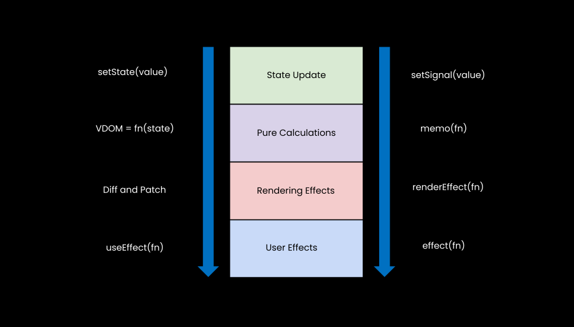
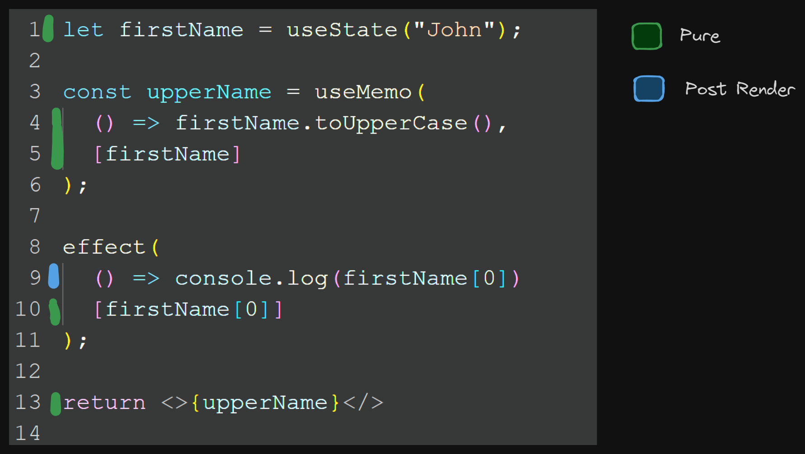
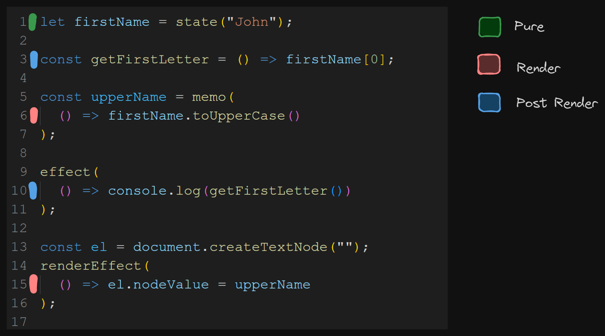
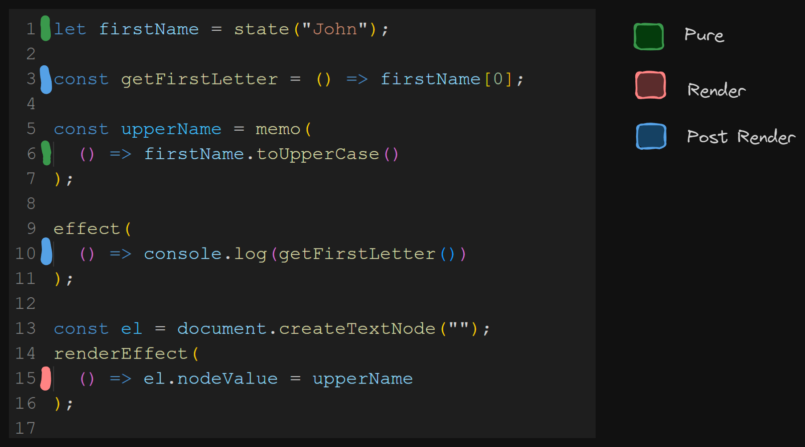
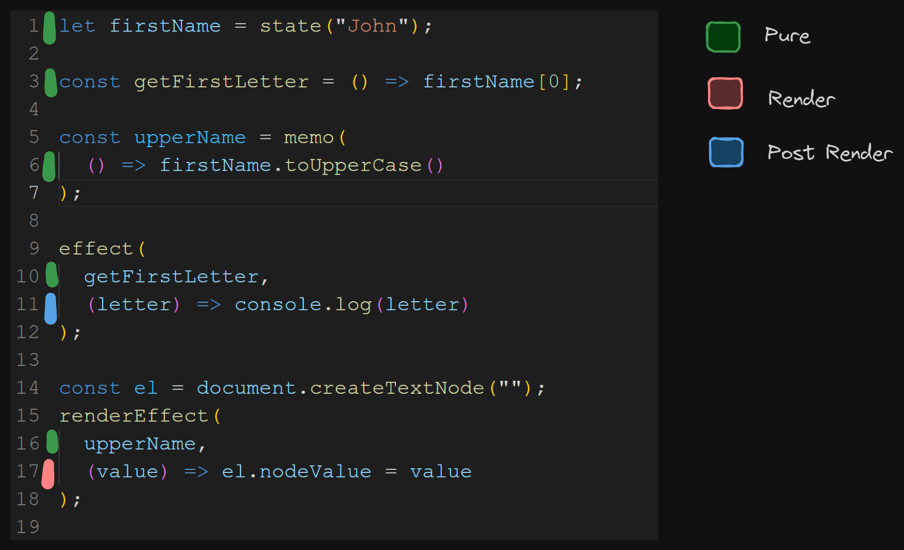

---
{
title: "Scheduling Derivations in Reactivity",
published: "2024-08-01T15:28:00Z",
edited: "2024-08-02T21:56:35Z",
tags: ["javascript", "webdev", "reactivity", "signals"],
description: "Most developers think about Reactivity as an event system. You have some state. You update that state...",
originalLink: "https://https://dev.to/playfulprogramming/scheduling-derivations-in-reactivity-4687",
coverImg: "cover-image.png",
socialImg: "social-image.png",
collection: "Derivations in Reactivity",
order: 2
}
---

Most developers think about Reactivity as an event system. You have some state. You update that state and things derived from it re-evaluate. Ultimately that change is reflected as a side effect.

```js
let name = state("John");
const upperName = memo(() => name.toUpperCase());

effect(() => console.log(upperName));
```

> *We will be using pseudocode not to cater to the syntax of a specific library or framework.*

But this is an oversimplification. As we learned in the previous article though there are multiple ways this change can propagate through the system, "Push", "Pull", or even "Push-Pull":

<!-- ::start:link-preview -->
[Derivations in Reactivity](/posts/derivations-in-reactivity-4fo1)
<!-- ::end:link-preview -->

While we tend to keep a simpler "Push" model in our heads as we talk about Reactivity, almost no modern framework uses a purely "Push" system. It is incapable of providing the guarantees we've come to expect.

Once you leave purely "Push" events, scheduling becomes a necessary part of the solution. If work isn't going to happen immediately it will need to happen later. What gets scheduled and when it runs has consequences.

---

## Immediate vs Lazy vs Scheduled


On the creation of something reactive, we have 3 choices when we evaluate it.

First of all, we could just run it immediately. An effect that creates other effects we may want to execute depth-first rather than breadth-first. We might want to evaluate the tree in one pass. This isn't that uncommon when rendering.

We might want to lazily defer evaluating it until we know the value will be read itself. Maybe we have a derived value that is never going to be read. Maybe it calculates something expensive that is only used if some other state in the UI changes. So why evaluate it if we won't be using it right away or ever?

Finally, we might want to schedule the node to run later. We want to make sure all the intermediates are sorted before running it. Maybe it is an effect, so it isn't read itself. You can only lazily evaluate nodes that can be read. Instead, we add it to a queue to execute later.

Upon an update, we have similar options. We don't run things immediately outside of "Push" but we can similarly choose whether to schedule the node or rely on it being read to be evaluated.

At first glance, it might appear obvious that we should lazily defer what we can and schedule what we need to. Otherwise, we could schedule unnecessary work. Derived state is a prime candidate for lazy evaluations because it must be read to be used. But are there any other considerations when determining what to schedule?

---

## Reactive Ownership


It is useful to understand another benefit of lazy evaluation other than reducing the risk of unnecessary work. Lazy derivations can be automatically garbage collected.

In reactive systems, like Signals, that follow the observer pattern there have historically been concerns around memory leaks. That is because usually, the implementation of subscribers and dependencies links both directions. When a reactive expression runs, it subscribes to the source signals and adds them to its dependencies. The reason for both directions is that signals upon update need to notify their dependent nodes, and those impacted nodes need to reset their dependencies for all nodes they access. In this way, dependencies are dynamic with each execution.

But it also means that losing reference to one of these nodes is insufficient for garbage collection. If you have a Signal and an Effect, just because you no longer have use for the Effect, the Signal will still have a reference and the Effect to it. If they both are no longer referenced they may be able to be disposed of, but it is not uncommon for state to outlive its side effects.

Generally, effects require manual disposal. However, derived state could release itself if no one reads from it. If something were to read it in the future it could re-run at that time and build its dependencies, in the same way that when first created it doesn't need to run until read.

Scheduling derived state instead means that the nodes and dependencies are always created eagerly regardless of whether it is read. In such a system we don't know at the time of scheduling whether a derived value will be read and thus it gets evaluated and dependencies created regardless. In so it is much more challenging to have it automatically dispose.

Creating UIs with systems that require manual disposal is cumbersome. Most external state libraries are concerned only with state and derived state and leave effects to the render library. So it has been beneficial that neither requires explicit disposal.

But what if there is no rendering library?

This is why S.js pioneered the Reactive Ownership model that has become a staple in Fine-Grained Renderers like SolidJS. If manually disposable nodes are created under a parent reactive context, then upon the parent re-executing, as with its dependencies, we dispose of those child nodes.

This is a secondary graph to the reactive dependency graph, but it links our Effects and other scheduled nodes together so all disposal can be automated. This is also the mechanism that powers things like the Context API and enables the grouping of boundaries for Errors or Suspense. It is a tree not unlike a VDOM, but it contains fewer nodes. Its nodes are decided by dynamic decisions(conditionals) rather than the number of elements and Components.

Still in either case, scheduling dictates what can live comfortably within and outside of the tree given its impact on how nodes can be disposed of.

---

## A Phased Approach



Should code run at a predictable time? With reactivity, we have the means to model all sorts of systems and aren't limited to the normal sense of time and progression. One line doesn't need to run after the other. But developers are only human, and when things occur can be of consequence.

You can't take back side effects. Once you are committed to displaying something you have to show it all or it is inconsistent. If something errors you need to block out everything related. It's why there are concepts like Error Boundaries and Suspense. And it is why we tend to schedule when things run with purpose.

<!-- ::start:link-preview -->
[Why All the Suspense? Understanding Async Consistency in JavaScript Frameworks](/posts/why-all-the-suspense-understanding-async-consistency-in-javascript-frameworks-3kdp)
<!-- ::end:link-preview -->

---

### React's Three Phases

React has popularized a model with 3 phases of execution.

1. Pure - User Code executes (components, calculations)
2. Render - VDOM is diffed and DOM is patched
3. Post-Render - User Effects execute

> I am using this naming as React has taken the term "render" in a way that is inconsistent with how other frameworks work. I use "render" to mean update the DOM, not to run component code.

As a developer, all your code is executed during the Pure phase except the effects, which are executed Post-Render.



That includes dependency arrays. React's model is aware of all dependencies for the updates before it runs any internal or external side effects. This ability to bail out of an update cycle until ready to commit is what powers things like concurrency. Some code can always throw a Promise without impacting what is currently on the screen.

This model works well in React's "Pull" reactivity where Components are re-run repeatedly. Every time they run you can expect the same behavior as the code executes on whole to completion.

---

### Phases with Granular Rendering

With "Push-Pull" one can also use a system like above, but then you wouldn't fully leverage its ability to "Push" more granular updates out. However, there are other ways to accomplish similar phased execution.

But first, we should recognize that left alone, lazily-evaluated derived values will execute when the earliest type of effect that reads them runs. If you were to introduce a `renderEffect` that runs before user defined `effect`s that is when the corresponding derived values would run.



Changing where the reactive expression or derived value is read can change the timing between being run before or after render. Incidentally adding it to a new phase by dependency could change the current behavior of otherwise unrelated code.

When I first created SolidJS 8 years ago I wasn't too concerned with this lazy behavior. We scheduled all computed nodes, both Derived and Effects. While it was true extra work could happen, a lot of state in Components is hierarchical so if things are unused they tend to be unmounted. But scheduling meant we could get this behavior:



Subtle difference from above, but it meant all our Pure calculations happened before our Effects.

But there is one difference. `getFirstLetter` runs during Post-Render. Any dependency that occurs for the first time during an effect that isn't scheduled happens too late to be discovered before any effects run. Since our Async primitives are also scheduled nodes this has very little consequence but it is a small but understandable discrepancy.

Solid like React has 3 defined phases. This is probably why Solid is the only Signals-based framework to support Concurrent rendering. You may be aware that unlike Solid almost all newer Signals libraries lazily derive state. And we've been looking at doing the same in the next major version.

But giving up the benefits of the Phased approach isn't an acceptable tradeoff. So let's explore an alternative.

---

### Rethinking Dependencies

Well, what works for "Pull" works for "Push-Pull".



Probably the last thing anyone wants to see is the return of "Dependency Arrays". But if effects were split between the pure tracking part and the effectful part, all user code except the effect itself could happen during the Pure phase before any rendering.

Similar to above:

1. Pure - Run all tracking contexts: front half of renderEffects and effects, reading (and maybe evaluating) all derived values.
2. Render - Run the back half of renderEffects
3. Post-Render - Run the back half of effects

This still differs from dependency arrays in that components don't re-run and they can be dynamic, reading different dependencies on every run. No Hook rules. But if one wants to have Lazy Derived values and still ensure the Phases are followed to enable consistent scheduling this is how you could do it.

---

## Deriving Async

The other reason to think about scheduling is Async. Most reactive systems are synchronous. Async works outside of the system. You create an effect and it updates your state when it is ready.

```js
let userId = state(1);
let user = state();
effect(() => {
  fetchUser(userId).then(value => user = value);
});
```

But like with synchronous synchronization we lose the information that `user` depends on `userId`. If we could represent asynchronous updates as a derivation then we could know exactly what depends on it.

```js
let userId = state(1);
const user = asyncMemo(() => fetchUser(userId));
```

And this doesn't just apply to direct dependencies but anything downstream:

```js
let userId = state(1);
const user = asyncMemo(() => fetchUser(userId));

const upperName = memo(() => user.firstName.toUpperCase());
```

`upperName` depends on `user` which depends on `userId` and it could possibly be async.

This is useful information if you want to implement systems like Suspense. We need to be able to trigger Suspense when `userId` is updated. So we need to know that it is a dependency of async operation. Also, it is better to suspend closest to where the data is ultimately used rather than immediately where the first node derives from it. We want to suspend when reading `upperName` not where `upperName` is defined. You want to be free to fetch your data higher in the tree to use in more places below than block rendering of the whole tree below that point.

---

### Should Async Be Lazy or Scheduled?

```js
let userId = state(1);
const user = asyncMemo(() => fetchUser(userId));

const upperName = memo(() => user.firstName.toUpperCase());
```

What happens if `fetchUser` hasn't resolved by the time `upperName` evaluates?

`user` is undefined initially. You might expect a `"Cannot find property 'firstName' on undefined"` error.

We can solve this. You can provide default values. But not everything wants to have a default value and with deep nested data you might have to mock more than you desire.

You can null check everywhere. This is fine. But it does mean a lot of code for checking if values exist dispersed around your app. It often leads you to check higher up in the tree than desired to avoid making additional checks.

Or you can throw a special error and re-run it when the value resolves. React has pioneered the approach of throwing Promises in this scenario. It's nice as you don't need to null check or provide a default value and you can trust that everything will be there when it finally commits.

But an old problem resurfaces:

```js
const A = asyncState(() => fetchA(depA));
const B = asyncState(() => fetchB(depB));

const C = memo(() => A + B)
```

If you go with throwing or some other type of conditional short-circuiting, and derived values are lazy, you, my friend, have accidentally created a waterfall. When we read `C` it will begin by evaluating `A`. It can start fetching `A` but it will throw as it hasn't resolved. `B` won't be read until it re-runs again after `A` has resolved. Only at that point will it start fetching `B`.

However, if scheduled `A` and `B` will start fetching regardless of whether `C` is read. This means even if `A` throws, `B` may be finished fetching by the time `A` resolves as everything is fetched in parallel.

In general Async values probably should be scheduled. While I could see it being powerful to lazily resolve Async by using the path through the code to determine what gets fetched it doesn't take much to cause performance issues. Waterfalls are very easy to create in systems that use throwing to manage unresolved async, so using scheduling and our knowledge of the reactive graph is one way to avoid that.

---

## Conclusion


I hope through this exploration you can see that scheduling plays a big part in Reactive systems. And that "Push-Pull" is a "Pull" system built inside a "Push" one. Lazily Derived State has many consequences that you don't find in systems that schedule everything or ones that are purely "Pull". Even when trying to optimize for laziness there are still several things that should be scheduled.

However, if carefully constructed "Push-Pull" is incredibly powerful in that it adds another dimension to typical "Pull" Reactivity. One can get all the consistency and predictability benefits while being able to apply them more granularly.

This is still an open area of research. Along with work towards Solid 2.0, I am thinking about this more because of progress on TC-39's Signals Proposal and the wider community asking that scheduling be built into the browser and DOM APIs. There is still a lot we don't understand or agree upon here so approaching this prematurely could be disastrous.

Next time we will look deeper into the nature of Asynchronous reactivity. Beyond scheduling Async poses an interesting challenge to what it means to be reactive.
