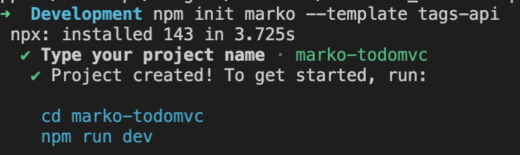
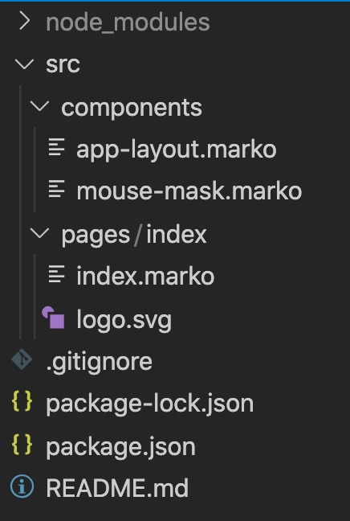
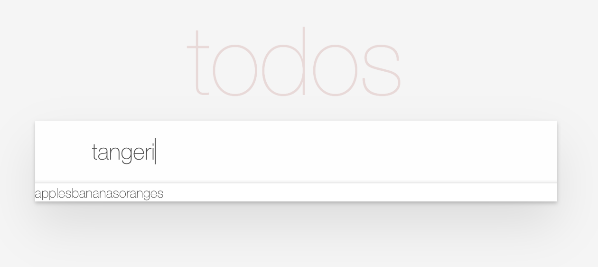
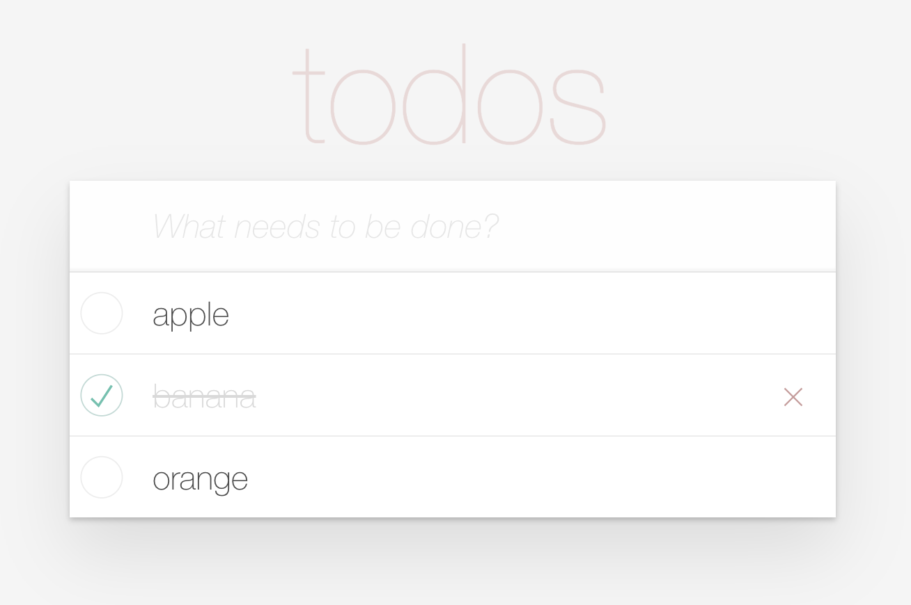
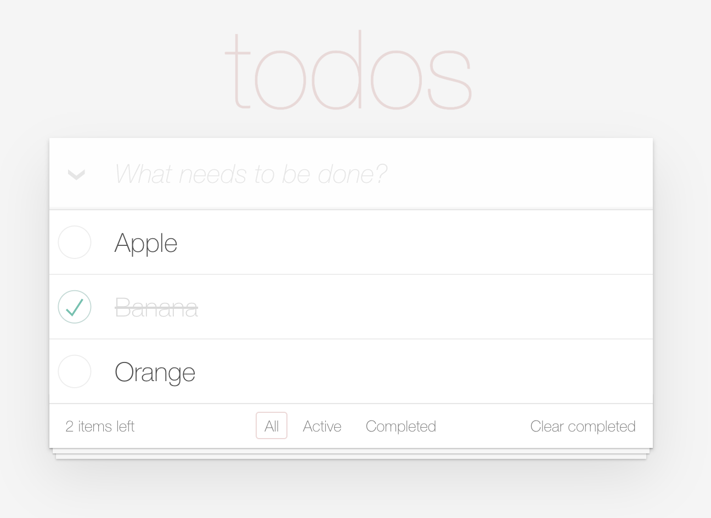

---
{
title: "Taking Marko's Tags API for a Test Drive",
published: "2021-08-31T19:27:23Z",
edited: "2021-09-01T02:25:30Z",
tags: ["marko", "javascript", "webdev", "tutorial"],
description: "Marko recently released a preview for its upcoming Tags API. This is pretty exciting as it adds a...",
originalLink: "https://https://dev.to/playfulprogramming/taking-marko-s-tags-api-for-a-test-drive-2n6i",
coverImg: "cover-image.png",
socialImg: "social-image.png"
}
---

[Marko](https://www.markojs.com) recently released a [preview for its upcoming Tags API](https://dev.to/ryansolid/introducing-the-marko-tags-api-preview-37o4). This is pretty exciting as it adds a minimal API layer over [Marko](https://www.markojs.com)'s state management that allows us to express complicated ideas in a more terse way than ever before.

So what's a good place to start. Well, I looked at Marko's TodoMVC example and decided it needed sprucing up. So this simple list managing example feels like the perfect place to get started and introduce this new approach.

In this article, we will build a TodoMVC application using Marko's Tags API. So let's get started.

---

# Setting up our project

It's easy to get set up with a new Marko project using the Tags API.

```sh
> npm init marko --template tags-api
```

It prompts us to name the project and gives instructions to get started.



Next, let's open our project in our code editor. I am using VSCode. And we see a simple folder structure.



We are going to keep this folder structure for our TodoMVC app but we will be replacing all the code. Before that, if you want to run `npm run dev` to see this example open in your browser.

Remove all the files under the `src/pages` and `src/components` folders and then we are good to get started with a clean slate.

---

# Building our Page

Marko is a Multi-Page Framework but TodoMVC is a simple single-page example. We won't worry too much about that since our starter project here will take care of all the details. So we start the same as any application and our index page. Create a `index.marko` file under your `src/pages` folder.

Let's add some markup to it. `.marko` files are basically HTML documents so to start we just add the following:

```html
<!doctype HTML>
<html lang="en">
  <head>
    <meta charset="UTF-8"/>
    <meta name="viewport" content="width=device-width, initial-scale=1.0"/>
    <meta name="description" content="Marko TodoMVC"/>
    <title>Marko - TodoMVC</title>
  </head>
  <body>
  </body>
</html>
```

And there we have a working app. Just run `npm run dev` and you should see a blank page with a title. You could add as much markup you want to this page. But let's add our first components.

---

# Creating a Store

TodoMVC is driven off a central store very much in line with Model View Controller from which it gets its name. In our case, Marko isn't an MVC framework but it still makes it easiest to abstract our logic into a template that we will use as a data store.

Create `TodoStore.marko` under components folder and copy in this code:

```html
<let/nextId=1/>
<let/todos=[]/>
<let/filter="all"/>

<return={
  todos,
  filter,
  setFilter(f) { filter = f },
  updateTodo(todoId, newProps) {
    todos = todos.map(function(todo) {
      if (todo.id !== todoId) return todo;
      return { ...todo, ...newProps }
    })
  },
  clearCompleted() {
    todos = todos.filter(function(todo) {
      return !todo.completed;
    });
  },
  removeTodo(todoId) {
    todos = todos.filter(function(todo) {
      return todo.id !== todoId;
    });
  },
  toggleAllTodosCompleted(completed) {
    todos = todos.map(function(todo) {
      if (todo.completed === completed) return todo;
      return { ...todo, completed };
    });
  },
  addNewTodo(todoData) {
    todos = [...todos, {
      title: todoData.title,
      id: 'c' + (nextId++),
      completed: false
    }];
  }
}/>
```

There is a lot going on in this file but really we are just seeing 4 tags being used in the template. The first 3 define state in our Marko Templates using Marko's `<let>` tag. The `<let>` tag allows us to define variables in our template. In this case, an id counter, the list of todos, and a variable to hold are filter state.

This leverages Marko's tag variable syntax where we can define a variable by putting it after a slash after the tag name, and Marko's default attribute syntax that lets us pass a value without an attribute name by assigning it to the tag directly.

The `<return>` tag is how we expose tag variables to a parent template. We are assigning an object that contains our state and some methods to mutate that state.

This template does not render any DOM elements itself but serves as a convenient way to encapsulate the behavior we'd like to use in other templates. We will be using this to drive the rest of our application.

---

# Creating the App

So let's start wiring this together. We're going to create a new `<TodoApp>` tag because I want to keep my top-level page document clean but this is completely unnecessary. So create `TodoApp.marko` under the components folder. Also, create a `TodoHeader.marko` file under the components folder as well since we will need that in a minute.

Let's start by dropping the following into `TodoApp.marko`:

```html
<TodoStore/{
  todos,
  addNewTodo
}/>
<section.todoapp>
  <TodoHeader addNewTodo=addNewTodo />
  <if=todos.length>
    <section.main>
      <ul.todo-list>
        <for|todo| of=todos by=(todo => todo.id)>
          ${todo.title}
        </for>
      </ul>
    </section>
  </if>
</section>
<style>
  @import url("https://unpkg.com/todomvc-app-css@2.2.0/index.css");
</style>
```

We will be coming back to this file a few times in the course of this tutorial but this is the skeleton of our app. The first tag is our `<TodoStore>` we created in the previous section. We can access the values returned as a tag variable we are destructuring. So far it is just the todos and `addNewTodo`.

This is the bulk of our template. We are including the `<TodoHeader>` component we are yet to implement. One of the great things about Marko is it can find tags in your local project automatically saving the need to import them.

Next, we see a conditional `<if>` tag that only displays the list if `todos.length`. Marko uses tags for control flow. These use all the same syntax and capabilities you can use in your custom tags.

Inside this block, there is also the `<for>` tag that iterates over our todos. Each iteration of the loop receives its values via Tag Parameters which we denote with enclosing pipes `| |`. This allows us to do scoped child templating similar to Render Props in React.

Finally, there is a `<style>` tag that imports the official TodoMVC CSS from their CDN. Marko automatically strips out the style tag out into its own `.css` files on build.

We can add our `<TodoApp>` to the body of our `index.marko` page and we should now see a grey background when we run it with `npm run dev` (you can keep this running in the background and it will refresh as we add changes).

```html
<!doctype HTML>
<html lang="en">
  <head>
    <meta charset="UTF-8"/>
    <meta name="viewport" content="width=device-width, initial-scale=1.0"/>
    <meta name="description" content="Marko TodoMVC"/>
    <title>Marko - TodoMVC</title>
  </head>
  <body>
    <TodoApp />
  </body>
</html>
```

---

# Adding Todos

Right now our app doesn't do very much so let's start working on the `<TodoHeader>`. This is where we will enter our new Todos.

Copy this into your `TodoHeader.marko` file:

```html
<attrs/{ addNewTodo } />
<header.header>
  <h1>todos</h1>
  <form onSubmit(e) {
    const titleInput = title();
    addNewTodo({ title: titleInput.value });
    titleInput.value = "";
    e.preventDefault();
  }>
    <input/title
      class="new-todo"
      placeholder="What needs to be done?"
    />
  </form>
</header>
<style>
  .header form {
    margin: 0;
  }
</style>
```

The first thing you will notice is the `<attr>` tag. This is how we define the input that comes into our template. We passed `addNewTodo` in from the `<TodoApp>` template and now we can use destructuring to get it here.

You can see Marko's shorthand class syntax on `<header.header>` which applies the `header` class to the `<header>` element. From there we create a `<form>` with an `<input>`.

The tag variable on the input element returns an Element Reference Getter. This is a function that when called retrieves the native DOM reference to that tag. We use it in our Submit handler.

Marko supports a shorthand for functions that we are using here that is very similar to JavaScript object methods. This is the equivalent of assigning the function to an attribute of the same name. Our Submit handler calls the `addNewTodos` method from our store.

Try it in the browser. You should see a large input field, and you should be able to enter some text and click enter and see it added to our page. Right now they all just get appended in a long line of text but we will add more functionality to our Todos in the next section.



---

# Making our Todos Functional

Well, it works but it ain't pretty. Let's now add our `<TodoItem>` component. So go ahead and add `TodoItem.marko` under your components folder and copy in the following.

```html
<attrs/{ todo, updateTodo, removeTodo }/>
<let/isEditing=false />
<let/editingTitle="" />
<const/saveEdit() {
  if (isEditing) {
    const el = title();
    updateTodo(todo.id, { title: el.value });
    isEditing = false;
  }
}/>

<li
  class={ completed: todo.completed, editing: isEditing }>
  <div.view>
    <input.toggle
      type="checkbox"
      checked=todo.completed
      aria-label="Toggle todo completed"
      onChange(e) {
        var completed = e.target.checked === true;
        updateTodo(todo.id, {completed});
      }/>
    <label onDblClick() {
      isEditing = true;
      editingTitle = todo.title;
    }>
      ${todo.title}
    </label>

    <button.destroy
      onClick() { removeTodo(todo.id) }
      aria-label="Delete todo"
    />
  </div>

  <input/title
    class="edit"
    title="Enter the new todo title"
    type="text"
    value=editingTitle
    onBlur=saveEdit
    onChange=saveEdit
    onKeydown(e) {
      if (e.keyCode === 13 /* ENTER */) {
        saveEdit();
      } else if (e.keyCode === 27 /* ESC */) {
        isEditing = false;
      }
    }/>
</li>
```

This is our biggest code snippet by far and it's because the Todos do a lot of stuff. You can check them, uncheck them, and double click to edit.

We are seeing the `<const>` tag for the first time here. It is useful for defining things in our template that do not get reassigned. In this case a function we use in multiple places. We also see nice usage of Marko's support of object syntax for applying classes.

If you add the necessary methods to the store and replace the contents of `<for>` in `TodoApp.marko` you should now have a basic working Todo application.

```html
<TodoStore/{
  todos,
  addNewTodo,
  updateTodo,
  removeTodo
 }/>
<section.todoapp>
  <TodoHeader addNewTodo=addNewTodo />
  <if=todos.length>
    <section.main>
      <ul.todo-list>
        <for|todo| of=todos by=(todo => todo.id)>
          <TodoItem todo=todo updateTodo=updateTodo removeTodo=removeTodo />
        </for>
      </ul>
    </section>
  </if>
</section>
```



---

# Filtering and Other Features

We aren't quite done yet. The rest of our features are going to be focused on `TodoApp.marko`. First, let's add a toggle all checkbox. We need to add `toggleAllTodosCompleted` to our list of properties we are pulling out of `<TodoStore>` and then we can replace the line `<section.main>` tag with this.

```html
<const/remainingCount=todos.length - todos.filter((todo) => todo.completed).length />
<section.main>
  <id/toggleId />
  <input.toggle-all
    id=toggleId
    type="checkbox"
    checked=(!remainingCount)
    onChange(e) {
      toggleAllTodosCompleted(e.target.checked);
    }>
  <label for=toggleId />
```

We introduce another new tag here `<id>`. This one gives us a unique identifier that is stable across server and browser execution and a perfect way to create an id to link our input to its label. And now we can toggle on and off all our todos.

The last feature we need to add is filtering the list by whether they are completed or not. Instead of trying to explain I'm going to just post the final `TodoApp.marko`:

```html
<TodoStore/{
  todos,
  filter,
  setFilter,
  addNewTodo,
  updateTodo,
  removeTodo,
  toggleAllTodosCompleted,
  clearCompleted
 }/>
<section.todoapp>
  <TodoHeader addNewTodo=addNewTodo />
  <if=todos.length>
    <const/remainingCount=todos.length - todos.filter((todo) => todo.completed).length />
    <const/filteredTodos = todos.filter(todo => {
      if (filter === "active") return !todo.completed;
      if (filter === "completed") return todo.completed;
      return true;
    })/>
    <const/handleFilter=((filter) => (e) => {
      setFilter(filter);
      e.preventDefault();
    })/>
    <section.main>
      <id/toggleId />
      <input.toggle-all
        id=toggleId
        type="checkbox"
        checked=(!remainingCount)
        onChange(e) {
          toggleAllTodosCompleted(e.target.checked);
        }>
      <label for=toggleId />
      <ul.todo-list>
        <for|todo| of=filteredTodos by=(todo => todo.id)>
          <TodoItem todo=todo updateTodo=updateTodo removeTodo=removeTodo />
        </for>
      </ul>
    </section>
    <footer.footer>
      <span.todo-count>
        <strong>${remainingCount}</strong> ${remainingCount > 1 ? "items" : "item"} left
      </span>
      <ul.filters>
        <li>
          <a
            href="#/"
            class={ selected: filter === "all" }
            onClick=handleFilter("all")>
            All
          </a>
        </li>
        <li>
          <a
            href="#/active"
            class={ selected: filter === "active" }
            onClick=handleFilter("active")>
            Active
          </a>
        </li>
        <li>
          <a
            href="#/completed"
            class={ selected: filter === "completed" }
            onClick=handleFilter("completed")>
            Completed
          </a>
        </li>
      </ul>
      <if=(remainingCount !== todos.length)>
        <button.clear-completed onClick=clearCompleted >
          Clear completed
        </button>
      </if>
    </footer>
  </if>
</section>

<style>
  @import url("https://unpkg.com/todomvc-app-css@2.2.0/index.css");
</style>
```

No new functionality. Just builds on what we have been doing this whole time.



---

# Conclusion

And that is it. We have our TodoMVC app with Marko. There are a few more things we can do. Like add persistence to local storage or database but I will leave that as an exercise for the reader. You can see the repo with our project [here](https://github.com/ryansolid/marko-todomvc).

Hopefully, through this tutorial, you gained an appreciation for how Marko and the new Tags API allows us to easily make stateful templates with some simple extensions over HTML to produce isomorphic apps.

That's right. The app we just made is fully server-rendered and dynamic in the browser. It doesn't get much easier than that.
