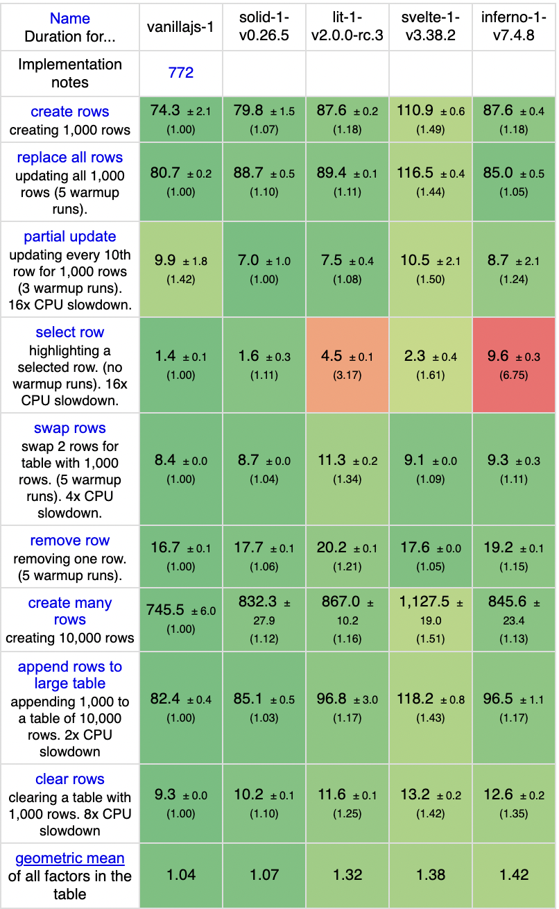
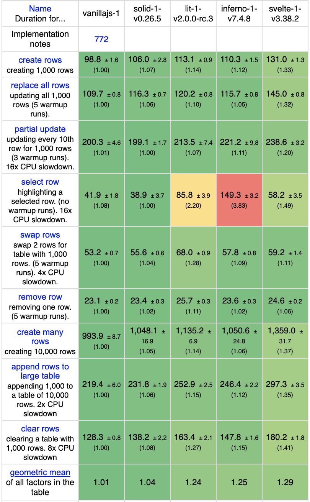
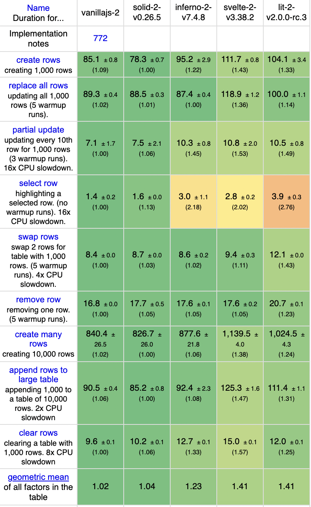
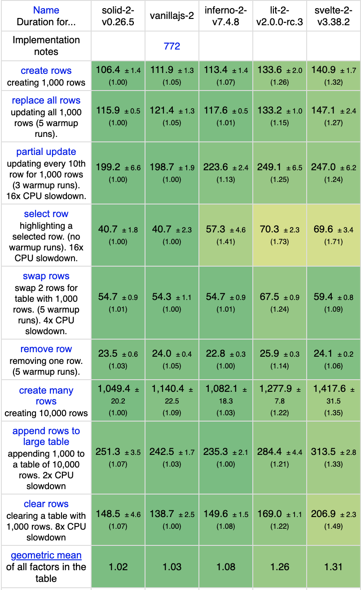
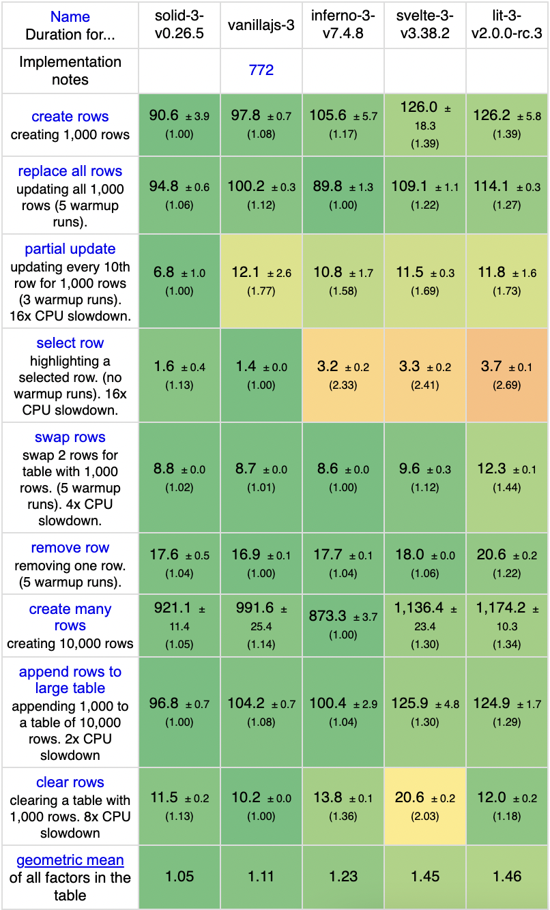
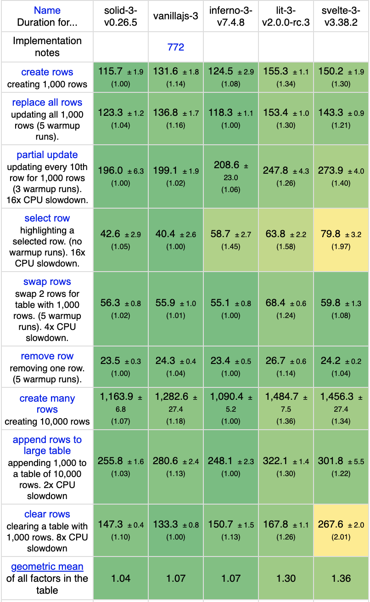
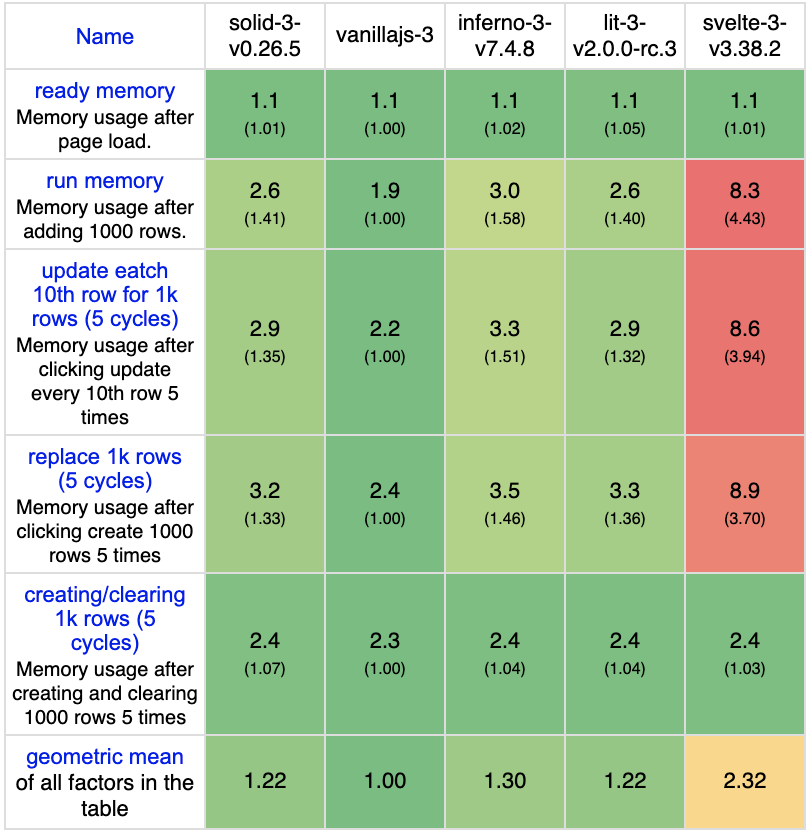
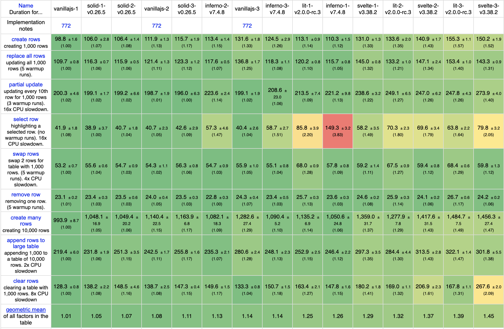

---
{
title: "The Real Cost of UI Components Revisited",
published: "2021-06-25T16:21:18Z",
edited: "2021-06-25T17:55:25Z",
tags: ["javascript", "webdev", "performance", "webperf"],
description: "With my focus recently going back to look at optimization for the Solid 1.0 release, I thought I'd...",
originalLink: "https://dev.to/this-is-learning/the-real-cost-of-ui-components-revisited-4d23",
coverImg: "cover-image.png",
socialImg: "social-image.png"
}
---

With my focus recently going back to look at optimization for the Solid 1.0 release, I thought I'd revisit my [The Real Cost of UI Components](https://betterprogramming.pub/the-real-cost-of-ui-components-6d2da4aba205?source=friends_link\&sk=a412aa18825c8424870d72a556db2169) article. When I wrote the original article I wasn't really sure what I'd find and I was a bit cautious not wanting to offend anyone. I let every framework have their showcase at level 0 and then just built on that.

The shortcoming of not equalizing the implementations is I didn't actually show the tradeoffs of the Virtual DOM and I completely glazed over the overhead of Web Components. So I wanted to look at this again with that in mind.

Why now? I recently have been benchmarking [Stencil](https://stenciljs.com/) and the new [Lit](https://lit.dev/). And it was sort of bugging me since neither of these support Native Built-ins. This is a problem since with a benchmarks using `HTMLTableElements` meant they can't just insert random Custom Elements. So these implementations were all done in a single large Component. I wanted to see if I could better approximate the way these scale.

> Mandatory Disclaimer: I wrote Solid, but I did not create this benchmark. Take it for what it is. I hope that your takeaway is more than Solid is fast. Different technologies scale differently and that should be where the focus is.

## The Setup

The test is once again a modification of [JS Frameworks Benchmark](https://github.com/krausest/js-framework-benchmark). This is our TodoMVC app on steroids. It will blast our implementations with some absurd data but we will quickly be able to see any bottlenecks.

The important thing to note is given the limitation of around Native built-ins we will be using hand optimized Web Component solutions. This means better performance than you'd typically find for Lit. So things are slightly skewed in its favor but it's the best I can do.

When I first started I did the tests on the new M1 Macbook Air but given the issues with applying CPU throttling(known issue) I also ran these on a Intel i7 Macbook Pro. This muddies the narrative a little but it can help view the difference between running on the latest greatest and on a slower device(via CPU throttling).

### The Scenarios

- **Level 1:** The whole benchmark is implemented in a single Component.
- **Level 2:** A Component is made per row and per button.
- **Level 3:** Each row is further subdivided into Cell Components for each of the four table columns and the remove Icon is also made into a Component.

### The Contenders

**1. [Inferno](https://infernojs.org/):** The one of the quickest Virtual DOM library around. While different than React, it boasts React compat and will serve as our proxy for VDOM libraries in this test. Source \[[1](https://github.com/ryansolid/js-framework-benchmark/tree/components-2/frameworks/keyed/inferno-1), [2](https://github.com/ryansolid/js-framework-benchmark/tree/components-2/frameworks/keyed/inferno-2), [3](https://github.com/ryansolid/js-framework-benchmark/tree/components-2/frameworks/keyed/inferno-3)]

**2. [Lit](https://lit.dev/):** Google-backed Tagged Template render library. Given the lack of support for Native Built-ins I'm using optimized hand written Custom Element wrappers. I also kept explicit event delegation in which is an advantage compared to every non-vanilla implementation. Source \[[1](https://github.com/ryansolid/js-framework-benchmark/tree/components-2/frameworks/keyed/lit-1), [2](https://github.com/ryansolid/js-framework-benchmark/tree/components-2/frameworks/keyed/lit-2), [3](https://github.com/ryansolid/js-framework-benchmark/tree/components-2/frameworks/keyed/lit-3)]

**3. [Solid](https://github.com/solidjs/solid):** Fastest runtime reactive library. It's Components are little more than factory functions so this should serve as a good comparison. Source \[[1](https://github.com/ryansolid/js-framework-benchmark/tree/components-2/frameworks/keyed/solid-1), [2](https://github.com/ryansolid/js-framework-benchmark/tree/components-2/frameworks/keyed/solid-2), [3](https://github.com/ryansolid/js-framework-benchmark/tree/components-2/frameworks/keyed/solid-3)]

**4. [Svelte](https://svelte.dev/):** Generates the smallest bundles with clever use of its compiler. It has its own component system as well. Source \[[1](https://github.com/ryansolid/js-framework-benchmark/tree/components-2/frameworks/keyed/svelte-1), [2](https://github.com/ryansolid/js-framework-benchmark/tree/components-2/frameworks/keyed/svelte-2), [3](https://github.com/ryansolid/js-framework-benchmark/tree/components-2/frameworks/keyed/svelte-3)]

**5. vanillajs:** Not a framework just the core implementation. I take the standard implementation and then layer on Web Components as we level up. \[[1](https://github.com/ryansolid/js-framework-benchmark/tree/components-2/frameworks/keyed/vanillajs-1), [2](https://github.com/ryansolid/js-framework-benchmark/tree/components-2/frameworks/keyed/vanillajs-2), [3](https://github.com/ryansolid/js-framework-benchmark/tree/components-2/frameworks/keyed/vanillajs-3)]

## Benchmarking

Instead of focusing a framework at a time I think it will be easier to just look at this in terms of levels. Relative positioning speaks a lot more to the trends. Since our baseline is moving with us by using Vanilla JS with Web Components, even though libraries are getting slower as we add more components by how much differs.

We are going to make heavy use of looking at the averaged geometric mean(the bottom row) to holistically look at how these libraries compare. It is important to look at the individual results for more information but this gives us an easy way to determine relative positioning.

### Level 1 - All in One

One component/app is all you get. While for most libraries this is the most optimal version this is not true of the VDOM where components are really important for managing update performance.

M1

Intel w/ Slowdowns

This is probably the worst you've ever seen Inferno perform and it's not its fault. This is what would happen if everyone wrote VDOM code the way it is described in Rich Harris' [The Virtual DOM is pure overhead](https://svelte.dev/blog/virtual-dom-is-pure-overhead). Hopefully most people don't do that. It actually isn't bad for most things but really takes a hit on the selection benchmark and where the updates are more partial.

### Level 2 - Rows and Buttons

This is what I'd consider the pretty typical scenario for a lot of frameworks in terms of the component breakdown. The VDOM now has enough components to operate.

M1

Intel w/ Slowdowns

Thanks to adding Web Components to Vanilla the gap between it and Solid has disappeared. Inferno is significantly faster now that it has enough components. The gap between Lit, Svelte, and Vanilla are keeping pace. So it looks like their components have comparable cost.

### Level 3 - Components \`R Us

At this level every table cell is a Component. This breakdown might seem a bit extreme to some. In Virtual DOM land we are used to this sort of wrapping. Things like Styled Components and Icon libraries push us to these patterns without flinching. Just how expensive is this?

M1

Intel w/ Slowdowns

Adding Web Components to our optimal Vanilla JS has actually made it more expensive than the equivalent Solid example. Inferno has now closed the gap considerably with Vanilla JS. And Svelte and Lit have continue to drop a few more points. On the slower system, Svelte is really getting hurt at this point by it's memory usage on benchmarks like clear rows:

Intel w/ Slowdown

## Conclusions

I feel like a broken record but really we shouldn't be comparing Web Components to JavaScript Framework components. They serve a different purpose and performance is not a place that they can win. There is nothing wrong with that once you understand they aren't the same thing.

If anything this test was setup in Web Components favor. There is no Shadow DOM or extra elements inserted. Those things you would find in real world would make them even heavier solution. I didn't want any contention so I kept in things like explicit event delegation which only benefits Lit in this test. This is really the most optimistic look at Web Components.

It might not always be this way to be sure. Web Component performance has improved in the 2 years since I last tested. But it isn't as simple as saying use the platform. As it turns out all JavaScript frameworks use the platform, just some more efficiently than others. It's a delicate balance between platform for standards sake, and using it only so far as it is empirically beneficial. There are way more factors than performance here.

But it is pretty clear that frameworks that scale with well with more components, such as Virtual DOM libraries like React or Inferno or ["component-less"](https://dev.to/this-is-learning/components-are-pure-overhead-hpm) libraries like Solid, don't experience as much overhead.

This doesn't come as much as revelation to me this time around. But maybe by looking at a few numbers we can better extrapolate where we should cautious. This is just a brutal microbenchmark that only really shows us the framework level bottlenecks and the real ones happen usually in our user code. But for those looking to evaluate on pure technological approach maybe there is some value here.

---

Results in a single table Intel w/ Slowdowns

