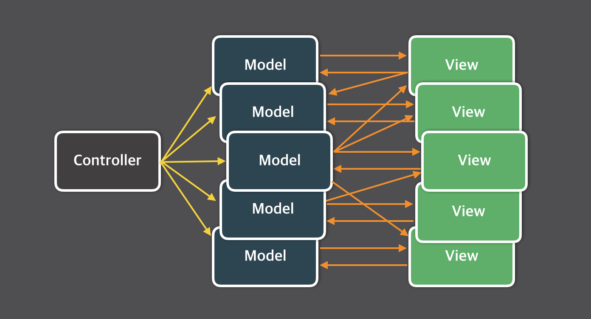
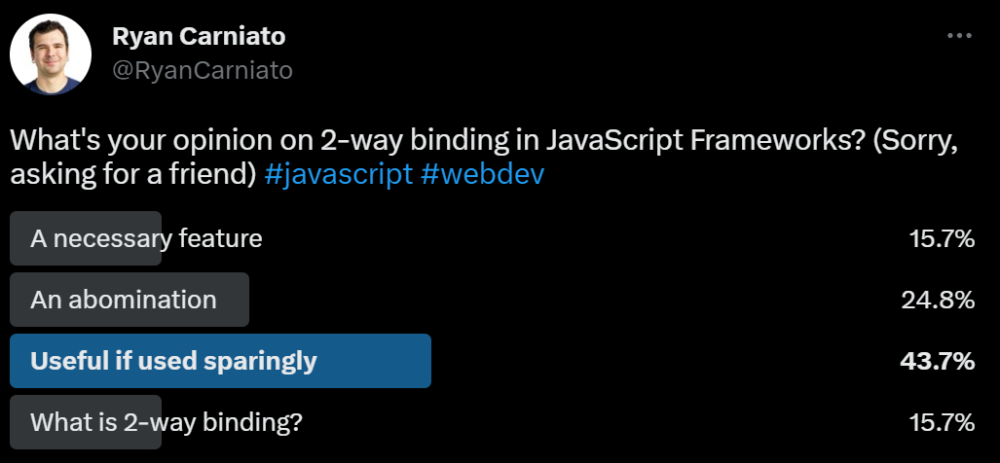

---
{
title: "Two-way Binding is a Two-way Street",
published: "2024-07-31T21:19:18Z",
tags: ["javascript", "vue", "svelte", "solidjs"],
description: "In some circles, two-way binding is seen as the scourge of modern frontends, while in others it is...",
originalLink: "https://dev.to/this-is-learning/two-way-binding-is-a-two-way-street-2d3c",
coverImg: "cover-image.png",
socialImg: "social-image.png"
}
---

In some circles, two-way binding is seen as the scourge of modern frontends, while in others it is seen as the ultimate ergonomic convenience. One group can barely utter the phrase without a visible look of disgust while the other considers its lack of inclusion a major strike against a solution.

<iframe src="https://x.com/AdamRackis/status/1640483922914996224"></iframe>

Today, I want to look at this topic so we can better understand the implications of it, and why some (including myself) feel so strongly about it.

---

## What is Two-way Binding

Two-way binding is the way of expressing a connection between the application state and its consumer in a bi-directional way. That data both travels down and changes synchronize back automatically and implicitly.

An example would be if you had an input element that stored a search term you would use to generate search results. With two-way binding. You could indicate that the searchTerm is associated with the `value` field of the input and both the `searchTerm` and the input would be kept in sync when the change from updating the `searchTerm` directly or from typing in the input.

```js
let searchTerm = createState("")

<input type="text" value={searchTerm} >
```

Effectively the above would be equivalent to:

```js
let searchTerm = createState("")

<input type="text" value={searchTerm}
  oninput={(e) => searchTerm = e.target.value} >
```

As you can see it reduces a bunch of boilerplate for a reasonably common thing. So isn't that a good thing?

---

## Appreciating the Problem



Data binding goes back before it made its way into JavaScript frameworks, which is why it showed up in the first declarative frameworks. Angular.js and Knockout.js had it right from 2010. This was a super powerful tool to have updates flow through your application and keep everything in sync.

Regardless of how we model the API, information flows both ways in hierarchical UIs. We have stateful data we wish to represent in our child views, and those views may have the ability to enact change on that state that was introduced above.

So what is the difference between two-way and unidirectional flow?

The mechanism for two-way binding involves passing down a state primitive that both causes the child to update on change and that the child can cause updates itself. The convenience comes from being able to pass down a single value.

However, it means that the creator of that state has no idea if and how the child will mutate it. There are no defined actions. You pass the value and leave that to the child to decide. This means that a state update might be occurring down in one leaf node that impacts a distant sibling without these ever being aware of each other since the parent acts as a conduit with no contract.

With everything connected implicitly, it does not take much to create "invisible" loops where updates travel up and down the render tree. A top-down rendering approach(like a VDOM, or dirty checker) might realize a change had happened part way down its update cycle and then have to start over again. Fine-grained reactive solutions might prevent unnecessary work but it still impacts traceability.

One can always opt out of two-way binding if they need to intercept the change event on the native element. But propagating that ability to split it up through component hierarchies is a new consideration. If not available you may be left breaking out of these loops on the way back down. This can lead to glitches as instead of stopping the propagation at the source we see different rules apply in different places eventually leading to things getting out of sync.

Ultimately, the thing most put into question is ownership. Who is responsible for updating this state? This problem is rarely an issue when applied locally. When we are binding to a native element in our component we can very clearly see the data relationship. But what about when `<input>` becomes `<Input>`, and when that `<Input>` becomes part of `<FeedbackForm>` which is part of `<SupportPanel>`?

---

## Are there Solutions?

As it turns out there are a few ways to address the concerns. While no one would likely have an issue if all two-way binding was local, even solutions that offer it [warn you of the dangers of "over-using" it](https://learn.svelte.dev/tutorial/component-bindings). Two-way binding can turn your code into an unpredictable mess, and that is not something you want to experience firsthand.

---

### 1. Explicit Opt-In

The first and essential piece is that this behavior should be opt-in. The mistake the earliest frameworks made was making it implicit. Everything could work two ways and in so everything by default could be tied together. One accidental mutation and you have no idea what could happen.

What comes along with this is not having recommended patterns accidentally get around these restrictions. If a framework uses mutable reactive Signals and you pass them to child components, and the pattern for two-way binding also involves mutating the component props coming in, people may not realize what they've opted in to. This is especially important if the framework supports nested reactivity via proxies or otherwise.

Svelte is a great example of a framework that uses writing to props to do its two-way binding. This is safer to do because Svelte does not have deep reactivity. No amount of indirection can have you accidentally setting a value in the child that would update the state in the parent without explicit opt-in. There is still a risk of too much coupling but you have complete control at each point.

```svelte
// App.svelte
<script>
import Input from './Input.svelte';
let name = 'world';
</script>

<Input bind:value={name} />

<h1>Hello {name}!</h1>

// Input.svelte
<script>
// `export` indicates it is prop
export let value = '';
</script>

<!-- passthrough -->
<input bind:value={value} />
<!-- direct -->
<input value={value} on:input={e => value = e.target.value} />
```

---

### 2. Internal Read/Write Segregation

What if you are dealing with a deeply reactive framework that wants two-way binding? One solution, as employed by Vue, is to not have the component treat props like a mutable value. It greatly reduces confusion if you don't write to props.

Instead either forward it directly or update it via an event dispatch. Consumers get the benefit of just passing a value but authors have more control without exposing an implicit mutable API.

```vue
// App.vue
<script setup>
const name = ref("world")
</script>

<template>
  <Input v-model="name" />
  <h1>Hello {{name}}!</h1>
</template>

// Input.vue
<script setup>
const props = defineProps(['modelValue'])
const emit = defineEmits(['update:modelValue'])
</script>

<template>
  <input
    :value="props.modelValue"
    @input="emit('update:modelValue', $event.target.value)"
  />
</template>
```

---

### 3. Read/Write Segregation Everywhere

Or you can just not support 2-way binding at all. This is easiest managed by providing a separate read/write interface on all your primitives. This is React's approach and the one I took in Solid.

```js
function App() {
  const [name, setName] = createSignal("world");

  // How do you 2-way bind this? You don't...
  return <Input value={name()} onUpdate={setName} />
}

function Input(props) {
  return <input
    value={props.value}
    onInput={e => props.onUpdate(e.target.value)}
  />
}
```

For reactive frameworks, directionality requires more consideration because it applies to more than just the view hierarchy but composable primitives. As their behaviors get richer and more layered you can run into the same two-way communication problems. This is well understood to the point libraries like MobX offer strict mode, which only allows mutation to occur in defined actions returning to explicit mutation patterns.

Albeit, this is a bigger buy-in because if your base primitives do not have explicit setters it is odd the derived ones would. So this is a pattern that makes the most sense from the source.

<!-- ::start:link-preview -->
[Thinking Locally with Signals](/posts/thinking-locally-with-signals-3b7h)
<!-- ::end:link-preview -->

---

## Yes or No?



It is always a question of whether we feel confident it is safe enough and whether it is worth the effort to support. An ergonomics consideration around explicit vs implicit relationships. Do we force that boilerplate on those who know what they are doing or do we design in a way that trims it out of the reasonable options?

For me, and with Solid, I'm very much on the "no" side. But I've also worked on Marko which does and resembles Vue's approach. Server Components are going to lead to people using "uncontrolled forms" more which side steps it in the only place it is truly beneficial.

There are a few things to look out for from a design standpoint as potential red flags for two-way binding solutions.

- Is two-way binding implicit?
- Are the primitives mutable and encourage passing the ability to read/write even when not data-binding?
- Does it encourage writing to props in a system with deep reactivity?

But then again when was anyone ever able to stop a developer from doing what they want?

<iframe src="https://x.com/lxsmnsyc/status/1529283545746665472"></iframe>
<iframe src="https://x.com/RyanCarniato/status/1440756417372176394"></iframe>
