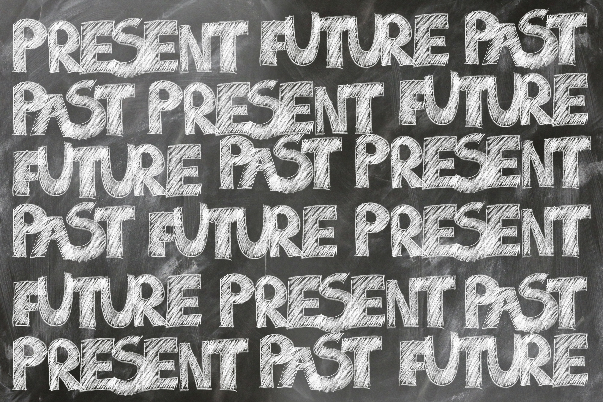
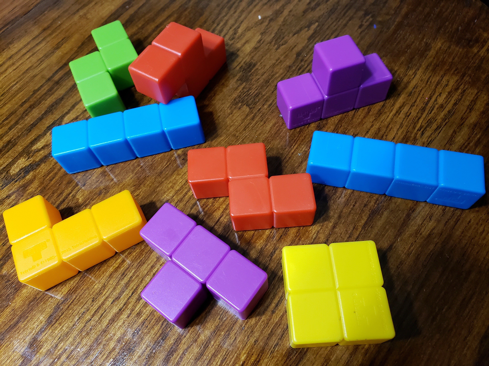
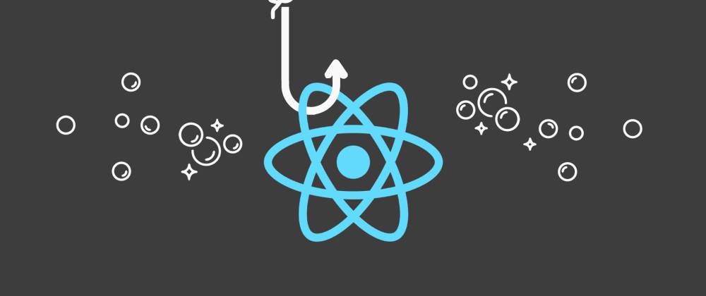

---
{
title: "Two Years of Writing about Designing JavaScript Frameworks (2018-2020)",
published: "2021-05-19T14:28:18Z",
edited: "2021-05-19T19:12:27Z",
tags: ["javascript", "webdev", "devjournal", "solidjs"],
description: "I decided to do a quick tally and I realized I've written almost 70 articles in the last 2 and a half...",
originalLink: "https://https://dev.to/playfulprogramming/two-years-of-writing-about-designing-javascript-frameworks-2018-2020-3ha5",
coverImg: "cover-image.png",
socialImg: "social-image.png"
}
---

I decided to do a quick tally and I realized I've written almost 70 articles in the last 2 and a half years. That's a lot of material. I've learned a lot of things in this time. I realized that a lot of people weren't with me from the beginning. I've decided to pull(in order) a few highlights which really reflect how my thinking has adapted over time.

---

# 1. [B.Y.O.F. — Part 1: Writing a JS Framework in 2018](https://ryansolid.medium.com/b-y-o-f-part-1-writing-a-js-framework-in-2018-b02a41026929)

This was my very first article. It was the culmination of my thinking for years leading up to the point of me deciding to take the plunge in writing my own JavaScript framework. I had a lot of ideas of how I'd leverage Web Components and the platform. Re-reading it feels almost naive at this point since I already saying the very fundamentals that would later change my thinking. But everyone starts somewhere.

This is the first of a 5 part series. Not all articles are equal but it definitely lays out my baseline of thinking.

---

# 2. [Why React Hooks: A Declarative Data Love Story](https://ryansolid.medium.com/why-react-hooks-a-declarative-data-love-story-bcaa73d61389)

This is still very early on in my writing. Only my 4th article. I was still internalizing what React Hooks meant for frontend dev, but this definitely starts the journey of examining the impact of component patterns on developer experience. I saw this cycle where we go from `functions` -> `objects` -> `classes` -> `functions` and were wondering if Hooks finally break out of it. I predicted all frameworks would land on the same pattern. I wasn't wrong.

---

# 3. [What Every JavaScript Framework Could Learn from React](https://ryansolid.medium.com/what-every-javascript-framework-could-learn-from-react-1e2bbd9feb09)

This was my favorite article of those I wrote for a while. The more I studied frameworks and reflected on my experiences the more I found I loved React. This is pretty much an open love letter and while some people felt it was a bait and switch at the end it was the first time I articulated everything I came to believe about JS Frameworks. And probably the first time I insulted every other JS Framework. It wouldn't be the last.

---

# 4. [The Fastest Way to Render the DOM](https://betterprogramming.pub/the-fastest-way-to-render-the-dom-e3b226b15ca3?sk=5ae1688dde789e46cecf5c976e708da5)

I was already accustomed to writing Benchmark articles at this point but I really wanted to answer the question once and for all on pure technology basis what was the best approach to rendering the DOM. I wanted to remove the templating solution out of the equation so I used Solid as a control in that I had multiple different versions (JSX, HyperScript, Tagged Template Literals) and put it against the best libraries to use those approaches to understand if Reactivity, Virtual DOM, or Dirty checking would be the true champion and where the bottlenecks are. Years later the results still stand even as new libraries enter the fray.

---

# 5. [The Real Cost of UI Components](https://betterprogramming.pub/the-real-cost-of-ui-components-6d2da4aba205?sk=a412aa18825c8424870d72a556db2169)

This is by far the most important article I wrote in my first year of writing. It is the one that caught the eye of the [Marko](https://markojs.com/) team for which I would pack up my life and move to San Jose to join.

I wanted to understand how Components affected performance and the results completely shook my thinking. This was the first time Virtual DOM was a clear winner in performance. I had been slow adopting Components into Solid since I was sure up to this point that I'd be using Web Components and in so had inadvertently left them lightweight and underpowered. This experiment both started my path away from Web Components, and developing thinking where component boundaries were a problem that needed to be solved.

---

# 6. [Designing SolidJS: Immutability](https://javascript.plainenglish.io/designing-solidjs-immutability-f1e46fe9f321?source=friends_link\&sk=912e32c63353ff0e084630bf3b63a8b1)

I found I was having an increasingly difficult time explaining the decisions I was making in designing Solid so I started a series(Designing SolidJS) of articles to describe my thinking. Honestly, these are a little cerebral and don't really teach much general knowledge. This one was interesting since it explains the thinking around the seemingly paradoxical "Immutable Reactivity" I employed in Solid. This article forced some self awareness in that I was actively heading on path that was in direct opposition to popular opinion.

---

# 7. [Reports of the Virtual DOM's Death are Greatly Exaggerated](https://javascript.plainenglish.io/reports-of-the-virtual-doms-death-are-greatly-exaggerated-2206d00beead?sk=b5f79f16c48ffc38b2d7ffad5ed67b71)

This was my first attempt at a Top 5 type of article. I don't consider it a click-bait one though. It sums up the realizations I had working most of 2019 benchmarking different approaches to rendering. Key topics were around combatting misunderstandings around the Virtual DOM, Web Component's, and Compilers.

Sadly, I think most of this thinking still is prevalent today but on the positive I guess that only means the subject matter is still relevant.

---

# 8. [The Trouble with TypeScript](https://dev.to/ryansolid/the-trouble-with-typescript-4fpp)

TypeScript has undeniable benefits, but coming to terms with the tradeoffs has been a several years long endeavor. I'm still struggle with it often. This was compounded by the fact that I'm no stranger to other typed languages nor other compile to JavaScript languages. TypeScript might not be the silver bullet some might lead you to believe, but it is probably the best we have for now.

---

# 9. [Maybe Web Components Are Not the Future?](https://dev.to/ryansolid/maybe-web-components-are-not-the-future-hfh)

Web Components are great but they aren't the same as Components as you know them in frameworks. A departure from where I started, while I don't consider them a failure, this reflects on what role they could play. Being a DOM element at their core is both their strength and their biggest limitation.

---

# 10. [The React Hooks Announcement in Retrospect: 2 Years Later](https://dev.to/ryansolid/the-react-hooks-announcement-in-retrospect-2-years-later-18lm)

This is almost an answer to my earlier article on Hooks. A lot can change in even just 2 years. I reflect on a cross-section of frontend dev from the early beginnings of Hooks until today. I predicted that Hooks would have a profound impact on thinking across the whole frontend ecosystem but I could have never predicted the double-edged effect they have had on React itself.

---

When I started writing I wasn't sure where this was going to go. I wanted to share the model around framework architecture that I'd come to believe made sense. In the process, I've seen my perspective change as I've uncovered new truths. Writing was the perfect vehicle to share this experience almost in realtime.

Hopefully there is some learning to be had from my experiences. But regardless I enjoyed the journey immensely.
