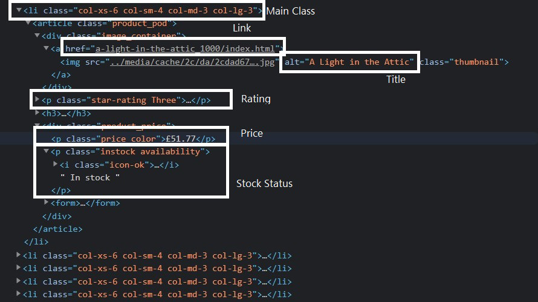
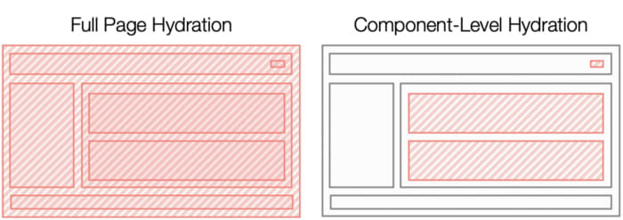
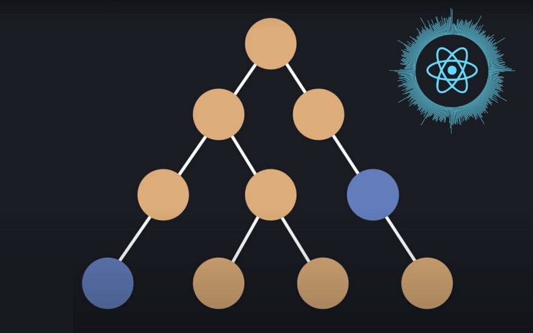

---
{
title: "Why Efficient Hydration in JavaScript Frameworks is so Challenging",
published: "2022-02-03T15:19:56Z",
edited: "2022-02-08T11:35:58Z",
tags: [],
description: "Hydration is the name given to the process in JavaScript frameworks to initializing the page in the...",
originalLink: "https://dev.to/this-is-learning/why-efficient-hydration-in-javascript-frameworks-is-so-challenging-1ca3",
coverImage: "cover-image.png",
socialImage: "social-image.png"
}
---

Hydration is the name given to the process in JavaScript frameworks to initializing the page in the browser after it has previously been server rendered. While the server can produce the initial HTML we need to augment this output with event handlers and initialize our application state in a way that it can be interactive in the browser.

In most frameworks this process carries a pretty heavy cost when our page is first loading. Depending on how long it takes for JavaScript to load and for hydration to complete, we can be presenting a page that looks to be interactive but in reality isn't. This can be terrible for user experience and is especially felt on lower end devices and slower networks.

You'd think there would be a lot ways to address this. And there are. But none of them are foolproof. Library authors have been circling around this for years incrementally improving on techniques. So today, I thought we'd take a look at the topic of hydration specifically to best understand what we are dealing with.

---

## Debunking Server Rendering as the Silver Bullet

So you've taken your favorite client rendering JavaScript Framework and now have it rendering on the server. Better SEO. Better performance. Best of both worlds.

> ... No. Let's stop you right there.

This is a common misconception. Simply server rendering your SPA doesn't suddenly fix everything. In fact, more than likely you've increased your JavaScript payload and may have even longer times until your application is interactive than when you were just client rendering.

> What?!...

I'm not messing with you. Most frameworks hydration ready code is larger than their typical client code because ultimately it needs to do both things. It might only be hydrating at first but since your framework allows client side rendering it needs the code to do that as well.

And now instead of shipping our mostly blank HTML page immediately that might show some feedback to the user while it loads data, we need to wait for the whole page to load and render on the server, before we then run a process similar to rendering in the browser. That page is also a lot larger as it contains all our HTML and the data our application needs to bootstrap itself.

It's not all bad. Generally speaking your main content should be visible faster since you didn't have to wait for the browser to do an additional round trip to load the JavaScript before it got to work. But you also delayed the loading of assets, including the JavaScript needed to hydrate your app.

> **Note**: This is highly dependent on consumer network and data latency. And there are many techniques to address this load performance timing like streaming. But I seek to illustrate this isn't a clear win and we have new tradeoffs and considerations.

---

## The Fundamental Problem

When it comes to client side hydration there are two characteristics that are pretty unfortunate. One is we render on the server, and now we basically need to re-render it again in the browser to hydrate everything. The second is we tend to send everything across the wire twice. Once as HTML and once in JavaScript.

Generally it gets sent across in 3 forms:

1. The Template - component code/static templates
2. The Data - the data we use to fill our template
3. The Realized View - the final HTML

The template views are both in your bundled JavaScript and rendered HTML, and the data is present both as usually a script tag rendered into the page and also in part in the final HTML.

With client rendering we just sent the template, and requested the data to render it. There is no duplication. However, we are at the mercy of the network loading the JavaScript bundle before we can show anything.

So having the realized HTML from the server is where we get all the benefits of server rendering. It lets us not be at the mercy of JavaScript loading times to display our site. But how do we combat the inherent extra overhead that comes from server rendering?

---

## Static Routes (No Hydration)

Examples: [Remix](https://remix.run/), [SvelteKit](https://kit.svelte.dev/), [SolidStart](https://github.com/solidjs/solid-start)

One idea that we've seen employed in a number of JS SSR frameworks is the ability to just remove the `<script>` tag on some pages. These pages are static and don't need the JavaScript. No JavaScript means no extra traffic over the network, no data serialization, and no hydration. Win.

Well of course unless you need JavaScript. You could sneak in some vanilla JavaScript on the page and maybe that'd be fine for somethings but this is far from desirable. You are basically creating a second app layer.

This is the no nonsense way to approach this though. But realistically once you add dynamic stuff and you want to leverage the framework you are pulling everything in. This approach is something we've always been able to do with SSR with pretty much every solution out there but it also isn't particularly flexible. It's a cool trick but it isn't really a solve for most things.

---

## Lazy-loading the JavaScript (Progressive Hydration)

Examples: [Astro](https://astro.build/)(*In combination w/ Islands*)

This approach is what I refer to as "Progressive" or "Lazy" Hydration. It isn't saying we won't load the JavaScript. Just that won't load it immediately. Let's load it on interaction, whether click or hover or when things scroll into view. The extra benefit of this is if we never interact with part of the page maybe we never even send that JavaScript. But there's one catch.

Most JavaScript frameworks need to hydrate top-down. This is as true for React as it is for Svelte. So if your app contains a common root (as Single Page apps do) we need to load that. And unless our render tree is really shallow you may find that when you click that button half-way down the screen you needed to load and hydrate a huge amount of code anyway. Deferring the overhead until the user does something isn't really any better. It's probably worse since now it's a guarantee that you will be making them wait. But your site will have a better Lighthouse Score.

So maybe this might benefit apps that have wide and shallow trees but that isn't really the common case in your modern Single Page App(SPA). Our patterns around client side routing, Context Providers, and Boundary Components (Suspense, Error, or otherwise) have us building things deep.

This approach alone also can't do anything to save us from serializing all the data that could be used. We don't know what will eventually load so it all needs to be available.

---

## Extracting Data from the HTML

Examples: [Prism Compiler](https://github.com/kaleidawave/prism)

The other thought that people usually have right away is maybe I can reverse engineer my state from the rendered HTML. Instead of sending a big JSON blob you would initialize the state from the values inserted in the HTML. It isn't a terrible idea on the surface. The challenge is model to view aren't always 1 to 1.

If you have derived data trying to get back to the original to re-derive is in many cases impossible. For example if you show a formatted timestamp in your HTML you might have not encoded the seconds but what do you do if another UI option allows you to change to a format that does.

Unfortunately this applies not only to state we initialize but data coming databases and APIs. And often it isn't as simple as not serializing the whole thing into the page. Remember most hydration runs the app again on initialization in the browser top-down. Isomorphic data fetching services will often try to refetch it again in the browser at this time if you don't send it and setup some sort of client side cache with the data.

---

## Islands (Partial Hydration)

Examples: [Marko](https://markojs.com/), [Astro](https://astro.build/)

Picture a web page as mostly static HTML that doesn't need to be re-rendered or hydrated in the browser. Inside it there are the few places where a user can interact which we can refer to as our "Islands". This approach is often called Partial Hydration since we only need to hydrate those islands and can skip sending the JavaScript for anything else on the page.

With an app architected this way we only need to serialize the inputs or props to the top level components since we know nothing above them is stateful. We know 100% it can never re-render. That outside of the islands is incapable of change. In so we can solve a lot of the double data problem simply by never sending the data we don't use. If it isn't a top-level input there is no way it can be needed in the browser.

But where do we set the boundaries? Doing it at a component level is reasonable as it is something we as humans can make sense of. But the more granular the islands the more effective they are. When anything under an island can re-render you need to send that code to the browser.

One solution is developing a compiler smart enough to determine state at a subcomponent level. In so not only are static branches pruned from our tree but even ones nested under stateful components. But such a compiler would need a specialized Domain Specific Language(DSL) so  that it could be analyzed in a cross module fashion.

More importantly, islands means server rendering each page on navigation. This multi-page (MPA) approach is the way the web classically works. But it means no client side transitions and loss of client state on navigation. Effectively, Partial Hydration is an improved version of our Static Routes above. One where you only pay for the features you use.

---

## Out of Order Hydration

Examples: [Qwik](https://github.com/builderio/qwik)

If Partial Hydration is an updated version of our Static Routes, Out of Order Hydration is an improvement on Lazy Loading. What if we weren't restricted by the typical top-down rendering frameworks do to hydrate. It lets that button half way down the page hydrate independent of you loading the pile of client routing and state managers on the page above it in the component hierarchy.

This has a fairly hard restriction. For this to work the component must have everything it needs to operate initially without depending on its parent. But components have a direct relationship with their parents as expressed through their input or "props".

One solution is dependency injection to get all inputs in the respective components. The communication isn't direct between parent child. And on server render the inputs of all components can be serialized (deduped of course).

But this also applies to children being passed into our components. They need to be fully rendered ahead of time. Existing frameworks do not work this way for very good reason. Lazy evaluation gives the child the ability to control how and when children are inserted. Almost every framework that eager evaluated children at one point now does it lazily.

This makes this approach very different feeling to develop in as the rules of parent child interactions we are used to need to be orchestrated and restricted. And like lazy-loading this approach doesn't save us on data duplication since while it can hydrate fairly granularly it doesn't ever know which components actually need to be sent to the browser.

---

## Server Components

Examples: [React Server Components](https://reactjs.org/blog/2020/12/21/data-fetching-with-react-server-components.html)

What if you could take Partial Hydration but then re-render the static parts on the server? If you were to do that you'd have Server Components. You'd have a lot of the same benefits of Partial Hydration with the reduced component code size and the removal of duplicate data, but not give up maintaining client side state on navigation.

The challenge is that to re-render the static parts on the server you need specialized data format to be able to diff the existing HTML against it. You also need to maintain normal server HTML rendering for initial render. This means much more complicated build step and different sort of compilation and bundling between these server components and those client ones.

More so even if you've removed incremental overhead you need a larger runtime in the browser to make this work. So the complexity of this system probably doesn't offset the cost until you get to larger websites and apps. But when you have reached that threshold this feels like the sky is the limit. Maybe not the best approach for maximizing initial page loads but a unique way to preserve the benefits of SPAs without scaling your site to infinite JavaScript.

---

## Conclusion

This is an area that is constantly being worked on so new techniques are constantly emerging. And the truth of the matter is the best solution might be a combination of different techniques.

What if we took a compiler that could automatically generate sub-component islands, could hydrate out of order, and supported server components? We'd have the best of all worlds, right?

Or maybe the tradeoffs would be too extreme that it wouldn't jive with people's mental model. Maybe the complexity of solution too extreme.

There are a lot of ways this can go. Hopefully now you have some more insight into the work that has been going on for the last few years to solve one of modern JavaScripts most challenging problems.
