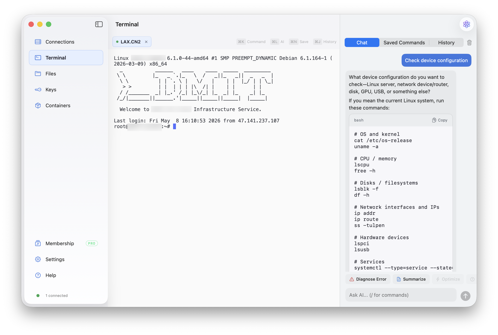

---
{
  title: "Keeping a Web-Backed SSH Terminal Alive Across SwiftUI Navigation",
  published: "2026-08-09",
  description: "How to separate SSH, renderer, and view lifetimes when embedding xterm.js in a native macOS app.",
  tags: ["ios", "webdev"],
  originalLink: "https://coderlegion.com/24308/keeping-a-web-backed-ssh-terminal-alive-across-swiftui-navigation",
}
---

A desktop SSH client can keep the remote connection alive and still give the user the impression that the terminal was reset. The failure often sits one layer above SSH: the UI destroys and rebuilds the terminal surface when the user switches to another section.

That distinction matters when a macOS app embeds xterm.js in `WKWebView`. The SSH process, terminal model, WebKit process, DOM, scrollback, focus chain, and visible geometry all have different lifetimes. Treating them as one SwiftUI view makes normal navigation surprisingly destructive.

This article describes the design rules we ended up using in a native macOS SSH client.



## Why rebuilding is not a harmless refresh

A straightforward SwiftUI implementation conditionally creates the selected section:

```swift
if selectedSection == .terminal {
    TerminalSurface()
} else {
    FilesView()
}
```

When the condition changes, SwiftUI is free to dismantle the terminal subtree. If that subtree owns a `WKWebView`, the app can lose much more than a view object:

- the WebContent process and xterm.js DOM may be destroyed;
- scrollback stored only in the browser process disappears;
- alternate-screen applications such as `vim`, `nano`, or `top` cannot be reconstructed from plain text;
- restoring a bounded output snapshot may omit older history;
- WebKit initialization and snapshot replay add visible latency;
- focus and resize events can arrive in a different order after reconstruction.

Keeping the SSH handle alive does not solve any of these UI-state losses. The remote PTY may still be healthy while the local terminal surface has forgotten how to represent it.

## Separate four lifetimes

The useful mental model is to separate at least four things:

1. **Logical session**: the tab, server identity, name, working directory, and user-facing state.
2. **Transport session**: the SSH handle and remote PTY that carry input and output.
3. **Terminal renderer**: the `WKWebView`, xterm.js DOM, parser state, and scrollback.
4. **Visible attachment**: whether that renderer currently participates in the AppKit view hierarchy and responder chain.

Navigation should normally change only the fourth lifetime. Closing a tab can end all four. A network failure may replace the transport while retaining the logical tab and renderer. Conflating those transitions is where most of the surprising behavior begins.

## Mount once, then deactivate

After the terminal section is opened for the first time, keep its SwiftUI subtree mounted. Other sections can still be created normally, while the terminal surface changes visibility and interaction state:

```swift
if terminalHasLoaded || selectedSection == .terminal {
    TerminalSurface(isActive: selectedSection == .terminal)
        .opacity(selectedSection == .terminal ? 1 : 0)
        .allowsHitTesting(selectedSection == .terminal)
}
```

This preserves the representable and its coordinator instead of asking SwiftUI to rebuild them on every sidebar click. The `isActive` value also gives terminal-specific shortcuts, toolbars, and event monitors an explicit lifecycle. Hidden terminal controls should not continue handling keyboard shortcuts while the user is working in Files or Settings.

Opacity alone, however, is not sufficient for a WebKit-backed terminal.

## Preserve the WKWebView object, not necessarily its attachment

On macOS, an embedded `WKWebView` participates in AppKit focus, drag registration, and window behavior. Keeping it attached but transparent can leave side effects in sections that should have nothing to do with the terminal.

A more reliable arrangement is:

- let `NSViewRepresentable` return a lightweight container;
- let its coordinator hold a strong reference to the `WKWebView`;
- attach the web view to the container only while the terminal section is active;
- remove it from the hierarchy while inactive, without releasing the object;
- attach the same object again when the user returns.

The WebKit object, WebContent process, xterm.js DOM, parser state, and scrollback stay alive even while the view is temporarily detached. The rest of the app no longer has an invisible WebKit view interfering with hit testing or drag sessions.

This is different from serializing terminal text and creating a new renderer. It preserves the renderer itself.

## Hand focus back before detaching

Focus is a correctness issue for terminals, not just polish. If the window's first responder remains inside the web view during a section switch, later keystrokes can be delivered somewhere the user cannot see. In the worst case, a stray character is interpreted by the remote shell.

Before detaching an active terminal web view:

1. Check whether the window's first responder is the web view or one of its descendants.
2. Explicitly clear or move the first responder.
3. Remove the web view from its container.
4. Disable terminal-only keyboard monitors and shortcut controls.

When reattaching, restore focus deliberately after the container is visible. Avoid assuming that SwiftUI's appearance callback and AppKit's responder-chain update happen in the same frame.

## Freeze hidden geometry

A hidden but mounted view can still receive geometry changes. If its width follows every animation in the visible section, xterm.js may repeatedly run `fit()`, and each result may resize the remote PTY.

That creates a subtle class of bugs: opening a file-transfer panel or animating another page changes the dimensions of a terminal the user is not looking at. Full-screen terminal programs then redraw against "ghost" sizes.

Record the terminal's last active width and freeze the inactive container at that width. On reattachment:

- align the web view to the visible container once;
- let the renderer's resize observer compute the new rows and columns;
- send one meaningful PTY resize instead of a frame-by-frame storm.

The same rule applies to side panels: reserve their width only in the section that owns them, not at a shared ancestor that also sizes the hidden terminal.

## Keep output flowing without flooding the UI

Detaching the renderer should not pause the SSH transport. Output can continue updating the logical session and renderer while the user visits another section.

High-volume PTY output needs its own boundary. Read callbacks can arrive hundreds of times per second, while sending every chunk through the main thread and WebKit IPC creates unnecessary contention. A practical policy is:

- deliver sparse output immediately so typing echo feels instant;
- merge continuous bursts into roughly one flush per display frame;
- update the bounded recovery buffer before notifying the renderer;
- keep session logs on a separate path from visual replay.

The recovery buffer remains useful if WebKit really crashes, but it is no longer the normal navigation mechanism.

## Test transitions, not just steady states

The most valuable tests are sequences:

- start `top`, switch to Files, resize the window, and return;
- scroll far back, visit Settings, and confirm the same scrollback remains;
- focus the terminal, switch sections, type immediately, and verify nothing reaches SSH;
- open and close a side panel while the terminal is hidden;
- disconnect while hidden, then return and exercise the reconnect path;
- close a terminal tab while its web view is detached and confirm observers and script handlers are removed.

These tests cross SwiftUI, AppKit, WebKit, and SSH boundaries. A unit test around one layer will not reveal the ordering failures between them.

## The broader rule

View visibility and resource lifetime are not the same thing. A terminal is a long-lived interactive resource with a UI surface, not a disposable page. Once the logical session, transport, renderer, and visible attachment have separate ownership, navigation becomes predictable: switching sections changes what the user sees without quietly rebuilding the tool they were using.

---

**Developer disclosure:** I work on [Nexus Shell](https://nexusshell.app/?utm_source=playfulprogramming&utm_medium=technical_article&utm_campaign=terminal_view_lifetime), a native macOS SSH workspace. This article is based on implementation and debugging lessons from that work, not a benchmark against other clients.

**Editorial disclosure:** OpenAI Codex assisted with editing and formatting. I reviewed the article against the current SwiftUI, AppKit, WebKit, and SSH implementation and remain responsible for its technical claims.
