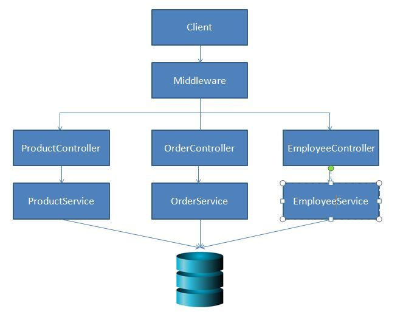

---
{
title: "Getting Started With NestJS",
published: "2020-01-02T11:18:44Z",
edited: "2021-04-06T11:07:29Z",
tags: ["javascript", "typescript", "node"],
description: "This is the first part of the series of articles on the Node.js framework known as NestJS, in this ar...",
originalLink: "https://medium.com/@santosh.yadav198613/getting-started-with-nestjs-a4e8b0b09db4",
coverImage: "cover-image.png",
socialImage: "social-image.png",
collection: "20daysofNestJS",
order: 1
}
---

This is the first part of the series of articles on the Node.js framework known as [NestJS](https://nestjs.com), in this article we will see why and how to use NestJS.

# My Node.js Story

I have been using Express.js from 2017 and I love ExpressJS, it is well designed and we can plugin any JavaScript library and use it. I was a .Net developer for a long time and working with Angular now, and I do miss a few things while working with ExpressJS.

## Angular ecosystem vs Node.js/Express.js ecosystem

- CLI: Angular offers us CLI to easily get started with a new project, even in .Net I can create an App using CLI. Though there are many Generators which are available, a CLI with ExpressJS would have been a great addition.
  Clean Architecture: ExpressJS doesn't come with any clean architecture defined, and of course it's not the purpose of ExpressJS as you are free to define your own architecture, But for an enterprise Application I will prefer something which has a clean and a well-defined Architecture.
- Code Sharing: For a big enterprise application we may need to share the code across multiple apps or even APIs. In other programming languages, it can be achieved using Libraries, In ExpressJS we can to create an npm module and make it available via artifactory.

## NestJS to the Rescue

[NestJS](https://nestjs.com) is a framework that is written on top of ExpressJS and it is written in Typescript. Let's see some advantages

- Typescript Support: NestJS supports Typescript which makes me really comfortable as I have been using Typescript for a long time while working with Angular. You have the option to choose Javascript as well.
- Code Sharing: NestJS supports creating Libraries and Applications using CLI, it becomes really easy to share the code and becomes a great choice for enterprise applications.
- monorepo Support: Angular Supports monorepo starting version 6, NestJS comes with [monorepo](https://trilon.io/blog/announcing-nestjs-monorepos-and-new-commands) support.
- Learning Path: Another thing which I liked about NestJS is if you are coming from .Net or Java background and have an idea about creating APIs, NestJS is easy to learn. Also if you are an Angular developer you will feel home, as it follows the same modular pattern.
- Fastify Support: NestJS uses ExpressJS as the default framework, but it also has support for Fastify and can be easily configured.

## Architecture

If I have to define the architecture of API created using NestJS this is how it looks like, We have a root module available which will be used to configure Database Providers, defining controller, adding middleware, adding pipe and guards and providing services.


We can also have a Module for each controller, we will see how to achieve that in upcoming blog posts. Once our module receives a request, it will be redirected to the respective controller which will handle the request, the service is optional, but we should try to use service to follow the Single Responsibility.

# Installation

Now we have an idea about why we should use NestJS let's see how to use it.
Before we can start using NestJS we need to install NestJS CLI, run the below command to install CLI globally.

```shell
npm install -g @nestjs/cli
```

You can also download the Starter Project from GitHub and use it.

## Creating our First API

- Once CLI is installed run the below command to create a new Application named shoppingAPI, we will use the same API for our upcoming articles.

```shell
nest new shoppingAPI
```

- CLI creates an App using Typescript as the default language if you like Javascript as the language you can run the below command.

```shell
nest new shoppingAPI -l JS
```

## Running and Testing API

Once a new project is created, we can use the below command to run the application.

```shell
cd shopping-API
npm start
```

The App is configured to run on the port 3000 by default. and one controller is already defined visit http://localhost:3000/ and you will get Hello World! as a response.
We have created our first App using NestJS with minimum configuration, in the next article we will go through the App structure and will configure our own controller to handle the Http Requests.

# Conclusion

[NestJS](https://nestjs.com) is really easy to start with and if you have already used .Net, Java or even ExpressJS most of the concepts are similar. It offers CLI by using which we can easily scaffold our App and focus more on code. For an enterprise application, it becomes really easy to split the code across multiple modules, using NestJS modules.
